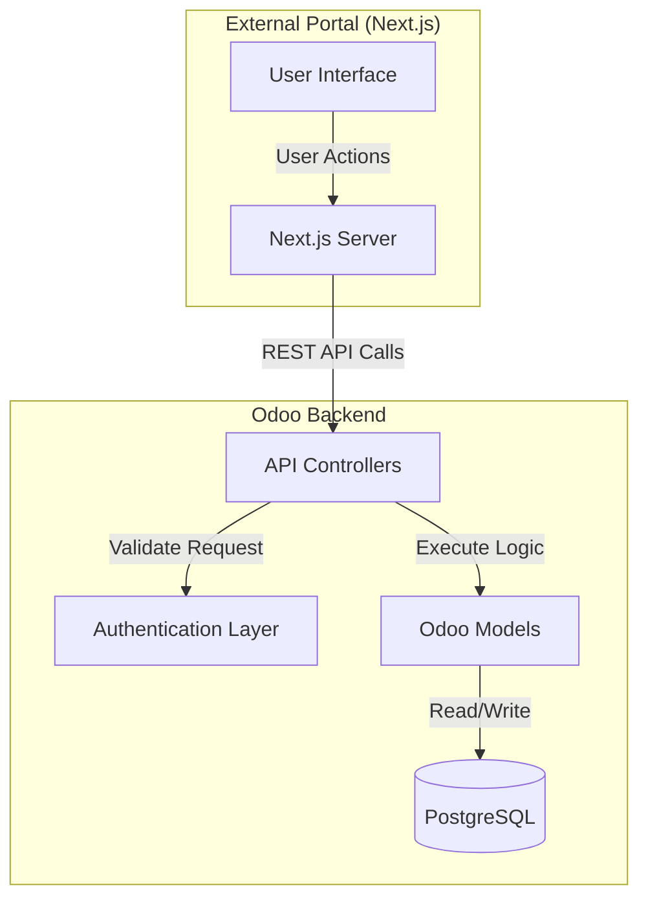
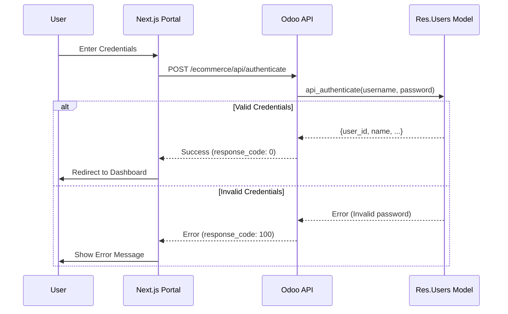
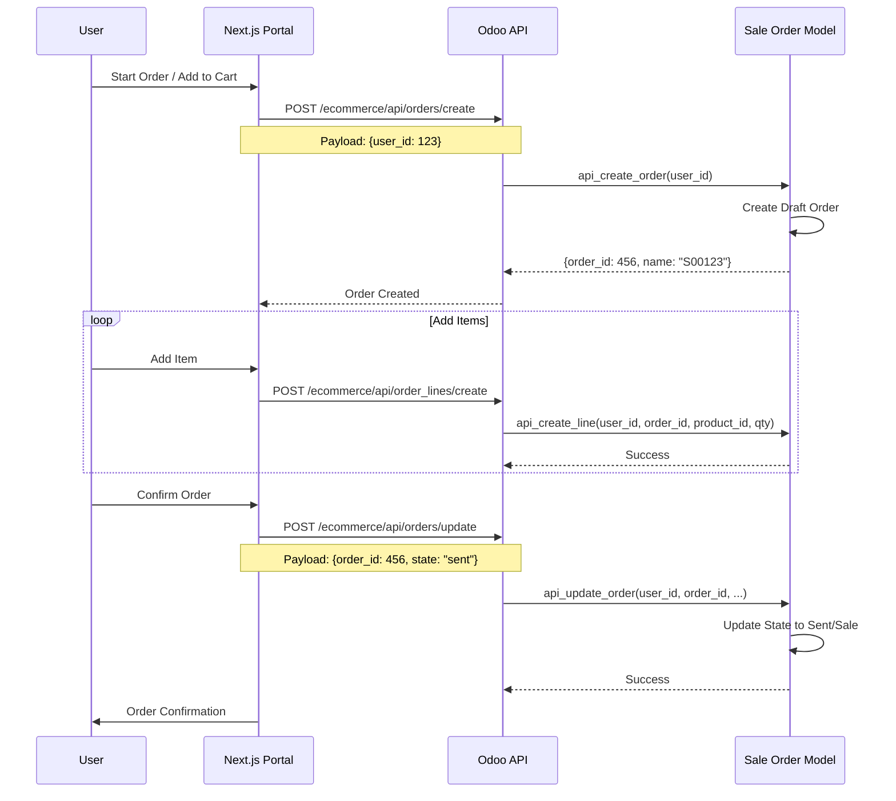

# Odoo 19 Ecommerce Module Architecture & API Overview

## 1. Module Overview
The `addons_lp_ecommerce` module serves as the backend engine for a Headless Ecommerce solution, designed to connect seamlessly with an external Next.js Portal. It provides a robust RESTful API layer, exposing core Odoo functionalities such as Product Management, Order Processing, User Authentication, and Chatter/Messaging.

### Key Features
- **Headless Architecture**: Decoupled frontend (Next.js) and backend (Odoo).
- **RESTful API**: Standardized JSON-based API endpoints.
- **Fat Models, Thin Controllers**: Business logic is encapsulated within Odoo models, while controllers handle routing and response formatting.
- **Custom Authentication**: Supports custom user authentication flows including OTP.
- **Real-time Integration**: Direct interaction with Odoo's ORM for real-time data consistency.

---

## 2. Architecture Components

### 2.1. System Architecture Diagram



### 2.2. Directory Structure
```
addons_lp_ecommerce/ecommerce/
├── controllers/          # API Endpoints & Routing
│   ├── base_controller.py      # Core controller with helpers & error handling
│   ├── ecommerce_api.py        # Public data (Products, Brands, Categories)
│   ├── user_api.py             # Auth, Profile, OTP
│   ├── sale_order_api.py       # Order management
│   ├── chatter_api.py          # Messaging & Attachments
│   └── ...
├── models/               # Business Logic & Data Models
├── views/                # Backend Views (Odoo UI)
└── security/             # Access Rights & Rules
```

### 2.3. Design Patterns
- **Base Controller Pattern**: All API controllers inherit from `BaseController`, which provides centralized:
    - **`api_response()`**: Standardized JSON response format.
    - **`handle_api_error()`**: Global error handling and logging.
    - **Model Accessors**: Helper properties (`self.user_model`, `self.sale_order_model`) for cleaner code.
- **Service Layer in Models**: Controllers delegate complex logic to model methods prefixed with `api_` (e.g., `res.users.api_authenticate`).

### 2.4. Response Format
**Success Response:**
```json
{
    "response_code": "0",
    "response_message": "Success",
    "data": { ... } or [...],
    ...extra_keys
}
```

**Error Response:**
```json
{
    "response_code": "100",  # or specific error code
    "response_message": "Error description"
}
```

---

## 3. API Reference

### 3.1. Authentication & User Management (`UserApiController`)
| Method | Endpoint | Description |
| :--- | :--- | :--- |
| `POST` | `/ecommerce/api/authenticate` | User login (username/password). |
| `POST` | `/ecommerce/api/logout` | User logout. |
| `POST` | `/ecommerce/api/reset-password` | Initiate password reset. |
| `POST` | `/ecommerce/api/change-password` | Change password with token. |
| `POST` | `/ecommerce/api/otp/send` | Send OTP for verification. |
| `POST` | `/ecommerce/api/otp/verify` | Verify received OTP. |

### 3.2. Product Catalog (`EcommerceApiController`)
| Method | Endpoint | Description |
| :--- | :--- | :--- |
| `POST` | `/ecommerce/api/products` | List products with filtering. |
| `GET` | `/ecommerce/api/product` | Get specific product details. |
| `GET` | `/ecommerce/api/brands` | List available brands. |
| `GET` | `/ecommerce/api/public_categories` | List product categories. |

### 3.3. Order Management (`SaleOrderApiController`)
| Method | Endpoint | Description |
| :--- | :--- | :--- |
| `POST` | `/ecommerce/api/orders` | List user orders with pagination. |
| `POST` | `/ecommerce/api/orders/drafts` | List draft orders/carts. |
| `POST` | `/ecommerce/api/orders/create` | Create a new order. |
| `POST` | `/ecommerce/api/orders/update` | Update order details (state, dates). |
| `POST` | `/ecommerce/api/orders/delete` | Delete/Cancel an order. |
| `POST` | `/ecommerce/api/order_lines/create` | Add items to an order. |

### 3.4. Communication & Chatter (`ChatterApiController`)
| Method | Endpoint | Description |
| :--- | :--- | :--- |
| `POST` | `/ecommerce/api/chatter/messages` | Retrieve message history for a document. |
| `POST` | `/ecommerce/api/chatter/message/post` | Post a new message. |
| `POST` | `/ecommerce/api/chatter/message/update` | Update an existing message. |
| `POST` | `/ecommerce/api/chatter/attachment/upload` | Upload files to chatter. |

### 3.5. Product Requests (`ProductRequestLineApiController`)
| Method | Endpoint | Description |
| :--- | :--- | :--- |
| `POST` | `/ecommerce/api/product_requests` | List special product requests. |
| `POST` | `/ecommerce/api/product_requests/create` | Create a new product request. |
| `POST` | `/ecommerce/api/product_requests/update` | Update request details. |
| `POST` | `/ecommerce/api/product_requests/delete` | Remove a request. |
| `POST` | `/ecommerce/api/product_requests/details` | Get full request details. |

### 3.6. Content Management (`BannerApiController`)
| Method | Endpoint | Description |
| :--- | :--- | :--- |
| `GET` | `/ecommerce/api/banners` | Retrieve active banners for the portal. |

---

## 4. Integration Guide (Next.js)

### 4.1. Authentication Flow
1.  **Login**: Next.js sends credentials to `/ecommerce/api/authenticate`.
2.  **Token/Identity**: Odoo returns a `user_id` or identity token.
3.  **Session**: Next.js stores this identity and includes it in the payload of subsequent protected requests (e.g., `{"user_id": 123, ...}`).

#### Authentication Sequence Diagram


### 4.2. Error Handling
- Check `response_code` in every response.
- If `response_code != "0"`, display `response_message` to the user.

### 4.3. CORS & Security
- All endpoints support CORS (`cors="*"`).
- CSRF protection is disabled (`csrf=False`) for API endpoints to allow external calls.
- `auth='public'` is used, relying on the payload-based identity verification implemented in the models.

### 4.4. Order Processing Workflow
The order creation process involves creating a draft order (cart), adding lines, and then confirming it.

#### Order Creation Sequence Diagram

