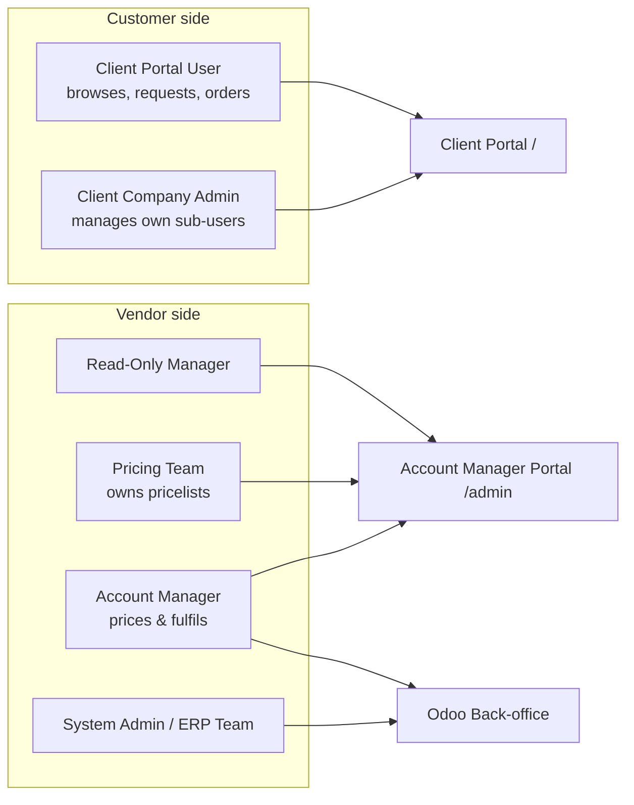
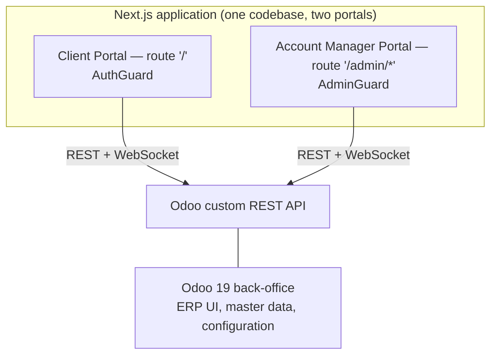
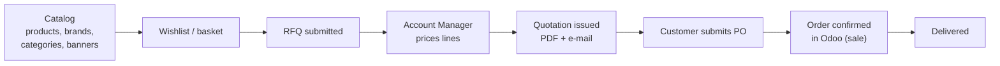

# 001 — Project Overview

## What the Platform Is

SAMTIA B2B E-Commerce is a **B2B trade platform built on top of Odoo 19**. Odoo is not used
as a storefront; it is used as the ERP system of record. All customer- and account-manager-
facing screens are delivered by a separate Next.js application that talks to Odoo exclusively
over a custom REST API.

The commercial model is **quote-driven, not cart-driven**. A customer does not check out at a
published price. They build a basket, submit it as a Request for Quotation, an Account Manager
prices it, and the customer converts the resulting quotation into a purchase order.

---

## Actors

| Actor | Primary surface | Responsibility |
|-------|-----------------|----------------|
| Client Portal User | Client Portal | Browse catalog, build wishlists, submit RFQs, track orders, chat |
| Client Company Admin | Client Portal | Everything above **plus** create/activate/deactivate their company's portal users and manage user tags |
| Account Manager | AMP + Back-office | Own assigned Clients; price RFQs, issue quotations, confirm orders, chat, manage products and banners |
| Pricing Team | AMP + Back-office | Maintain pricelists and price rules |
| Read-Only Manager | AMP | Observe without mutating |
| System Admin / ERP Team | Back-office | Configuration, master data, deployments |

---

## The Three Surfaces

A single Next.js deployment serves both portals. Which portal a user gets is decided **at
runtime from one flag on the authenticated user** (`is_ecommerce_portal`) — there is no
second build, no second host.

---

## Core Value Chain

Everything else in the platform exists to support this chain: pricing per client tier,
multi-tenant isolation, real-time chat with the Account Manager, requests for products that
are not yet in the catalog, and notifications on every state change.

---

## Defining Characteristics

| Characteristic | Consequence for the architecture |
|----------------|----------------------------------|
| **Quote-driven** | A parallel `portal_state` machine sits alongside Odoo's native `sale.order.state`; see [008](008-Order-Lifecycle.md) |
| **Multi-tenant by client company** | Every read and write is scoped server-side to the user's company partner; see [007](007-Authentication-and-Authorization.md#multi-tenant-isolation) |
| **Headless Odoo** | ~110 custom REST routes; no Odoo website/QWeb pages in the customer path; see [006](006-API-and-Controller-Architecture.md) |
| **Session-cookie auth, no tokens** | Browser holds the Odoo session cookie; CORS with credentials everywhere |
| **English only** | The portals ship a single language (`en_US`). No localisation layer, no per-locale content variants |
| **Real-time** | Odoo's bus/WebSocket carries chat, presence and notifications into the portals; see [012](012-Realtime-and-Messaging.md) |
| **Odoo.sh hosted** | The B2B module is a Git submodule of an ERP repo; promotion is one-way across five branches; see [014](014-Deployment-Architecture.md) |

---

## Current Versions

| Component | Version |
|-----------|---------|
| Odoo | 19.0 |
| `ecommerce` module | 19.0.1.0.4 |
| `access_management` module | 19.0.1.0.0 |
| `lp_base` module | 19.0.1.0.0 |
| Next.js portal application | 1.2.0 (2026-08-02) |
| Next.js / React | 15 / 19 |
