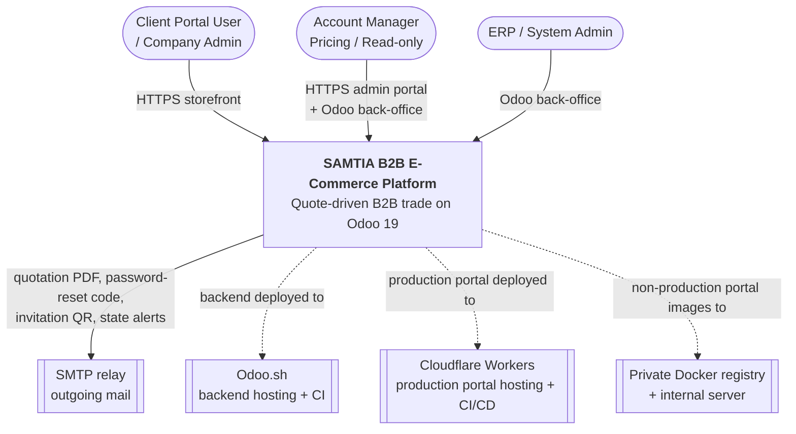
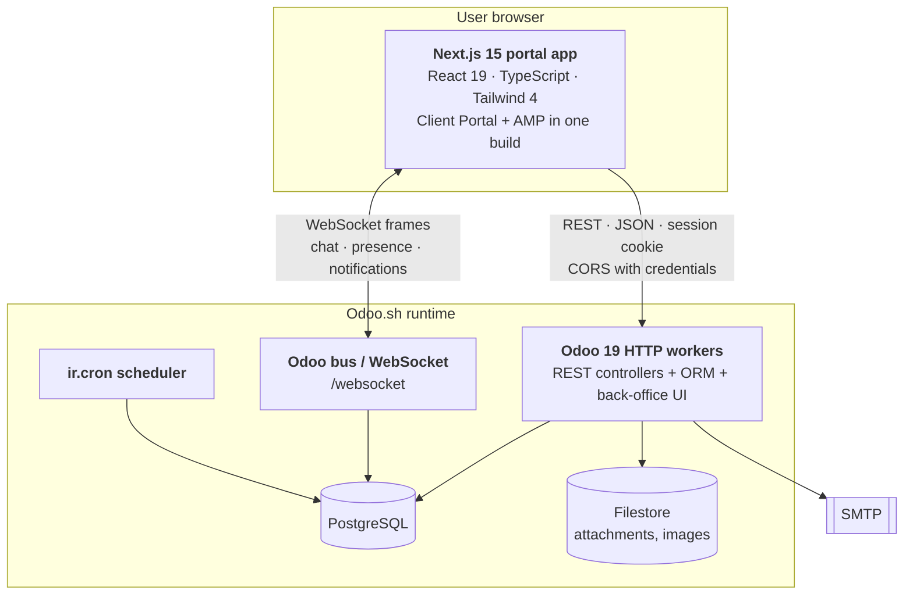
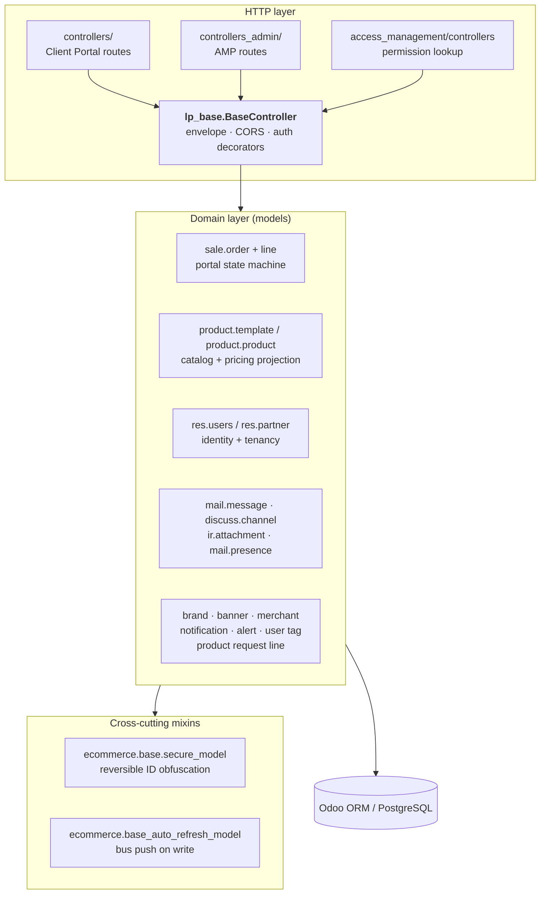
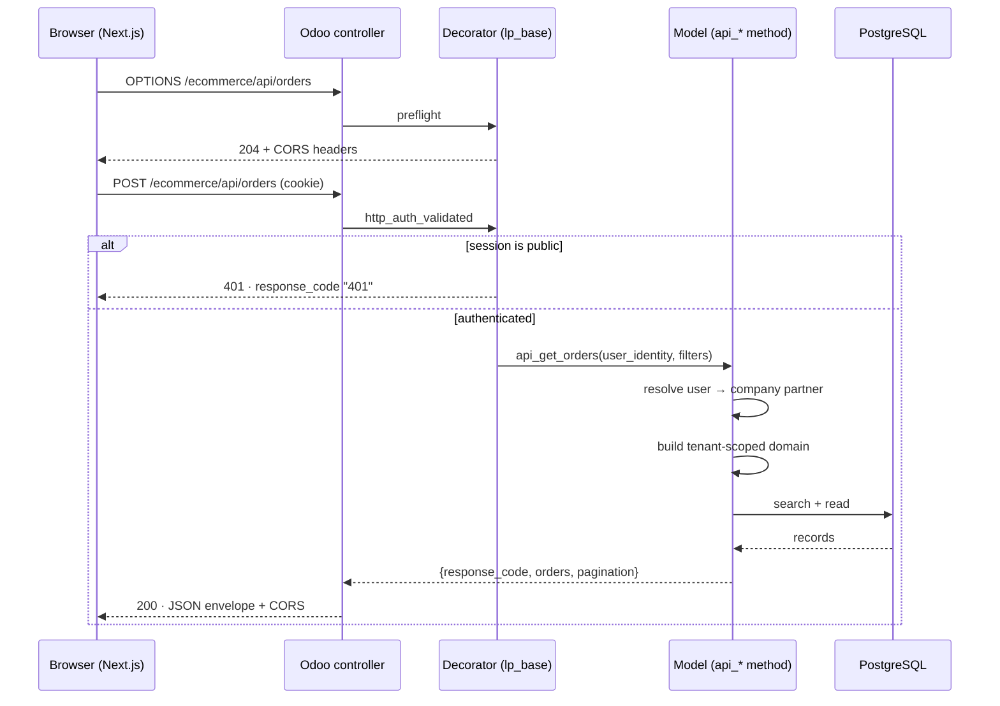
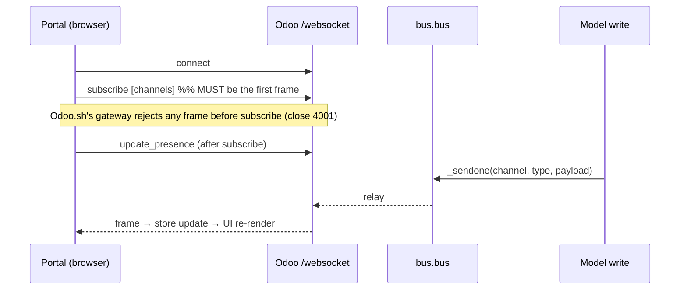

# 002 — System Architecture

## C4 Level 1 — System Context

The platform has **no inbound third-party integrations**. The only outbound dependency in the
runtime path is SMTP.

---

## C4 Level 2 — Containers

| Container         | Technology                               | Responsibility                                                             |
| ----------------- | ---------------------------------------- | -------------------------------------------------------------------------- |
| Portal app        | Next.js 15 App Router — Cloudflare Worker (OpenNext) in production, standalone container elsewhere | All customer and account-manager screens; no business rules                |
| Odoo HTTP workers | Python / Odoo 19                         | REST API, business logic, ORM, back-office UI, PDF rendering               |
| Odoo bus          | Odoo`bus.bus` + `/websocket`         | Push channel for chat messages, presence, notifications, grid auto-refresh |
| Scheduler         | `ir.cron`                              | Presence hygiene (stale sessions → offline)                               |
| PostgreSQL        | —                                       | Single database; all tenants share it, isolated by data scoping            |
| Filestore         | Odoo filestore                           | Product media, chatter attachments, generated PDFs                         |

---

## C4 Level 3 — Components inside Odoo

### Layering rule

Controllers are **thin**. They parse the request, call a single `api_*` / `*_payload` method on
a model, and wrap the returned dictionary in the response envelope. All business logic,
validation, tenancy scoping and serialisation live in the models. This is the single most
important convention in the backend — see [006](006-API-and-Controller-Architecture.md).

---

## Request Lifecycle — a typical authenticated call

Notes:

- Every route is declared `auth='public'` at the Odoo level and gated by the decorator
  instead. This exists so the controller can return the JSON envelope with a business code
  rather than Odoo's HTML login redirect.
- Business failures return **HTTP 200** with a non-zero `response_code`. Only session expiry
  returns HTTP 401.

---

## Real-Time Path

Presence is additionally maintained over plain HTTP (`/ecommerce/api/presence/ping` and
`/offline`) because the Odoo.sh gateway does not reliably deliver socket-close events. A
one-minute cron sweeps presences whose heartbeat went stale. See
[012](012-Realtime-and-Messaging.md).

---

## Integration Contract Between the Two Applications

| Concern     | Contract                                                                                                                                      |
| ----------- | --------------------------------------------------------------------------------------------------------------------------------------------- |
| Transport   | HTTPS,`Content-Type: application/json` (multipart for uploads)                                                                              |
| Base paths  | `/ecommerce/api/*` (client), `/ecommerce/api/admin/*` + `/api/admin/*` + `/ecommerce/admin/api/*` (AMP), `/amm/api/*` (permissions) |
| Auth        | Odoo session cookie, sent with`withCredentials: true`                                                                                       |
| Envelope    | `{ "response_code": "0", "response_message": "...", ...payload }`                                                                           |
| Success     | `response_code === "0"`                                                                                                                     |
| Errors      | 5xxx–6xxx business codes, HTTP 200;`"401"` with HTTP 401 = session expired                                                                 |
| Pagination  | `page` (default 1), `limit` (default 20); response carries a pagination block                                                             |
| Language    | `en_US` only — the portals send and render a single language                                                                                |
| Identifiers | Optionally obfuscated — see[016](016-Architecture-Decisions-and-Customization-Points.md#id-obfuscation)                                       |
| Real-time   | `wss://<api-host>/websocket`, derived automatically from the API base URL                                                                   |

The frontend enforces one global rule: a `response_code` of `"401"` clears local storage and
redirects to `/login`.
