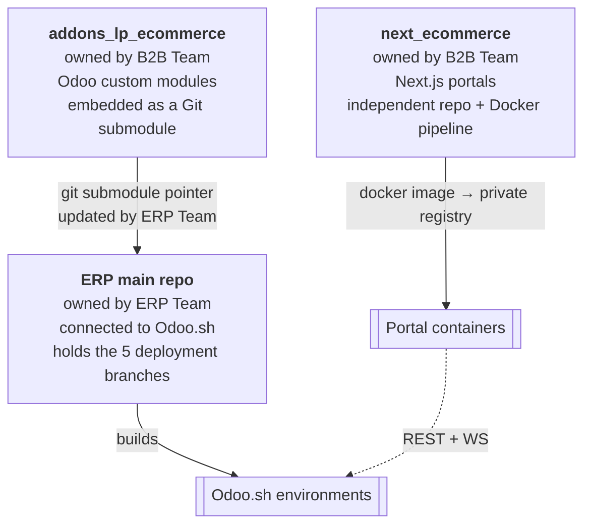
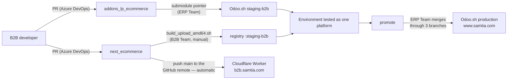

# 003 — Repositories and Structure

## Repository Map



Two repositories are actively developed; a third (the ERP main repo) is the deployment vehicle
and is owned by the ERP team. The B2B team never pushes to Odoo.sh directly.

| Repo | Path in the working tree | Contents | Deployed as |
|------|--------------------------|----------|-------------|
| Odoo addons | `addons_lp_ecommerce/` | 4 Odoo modules + developer docs | Git submodule of the ERP repo → Odoo.sh |
| Portal app | `next_ecommerce/` | Next.js 15 application, Docker envs, Cloudflare config, release notes | **Production:** Cloudflare Worker, auto-deployed from GitHub `main`. **Non-production:** `linux/amd64` image → private registry → containers |

---

## `addons_lp_ecommerce/` — Odoo Side

```
addons_lp_ecommerce/
├── lp_base/                  Technical foundation (no business logic)
├── access_management/        Role & permission engine (AMM)
├── ecommerce_access_data/    Pre-loaded AMM catalogue for this platform
├── ecommerce/                The B2B business module  ← ~90 % of the code
└── _docs/                    Developer documentation, case studies, Postman collection
```

### Inside `ecommerce/`

| Folder | Responsibility |
|--------|----------------|
| `controllers/` | Client Portal REST routes (`/ecommerce/api/*`) — 14 files, thin |
| `controllers_admin/` | Account Manager Portal REST routes — 15 files, thin |
| `models/` | All business logic, validation, tenancy scoping, API serialisation |
| `views/` | Odoo back-office forms, lists, searches, actions, menus |
| `security/` | Groups (`groups.xml`) and model access rules (`ir.model.access.csv`) |
| `data/` | Sequences, mail templates, scheduled job |
| `report/` | User invitation QR-code PDF report |
| `wizard/` | JSON product import wizard |
| `static/` | Back-office assets: B2B dashboard OWL component, chat widget, SCSS |
| `tests/` | Module tests |
| `_docs/` | Module-level developer notes |

**Scale reference:** ~14 200 lines of Python. The three largest models carry most of the
domain: `product_template.py` (~2 140 lines, catalog + admin product management + import),
`sale_order.py` (~1 315, the order state machine), `res_users.py` (~1 100, identity,
password reset, invitations, portal user management).

---

## `next_ecommerce/` — Portal Side

```
next_ecommerce/
├── src/
│   ├── app/                 App Router pages — the routing surface
│   ├── components/          UI: guards, layout, feature components, primitives
│   ├── infrastructure/      API services, HTTP client, WebSocket, storage, logging
│   ├── stores/              Zustand state, one store per domain
│   ├── shared/              Config, hooks, access codes, libraries
│   ├── services/            Cross-cutting service objects
│   └── types/               Global TypeScript types
├── docker/                  Four deployable environments + build/upload scripts
├── scripts/                 Build-time generators (release history)
├── public/                  Static assets
└── _docs/                   Release notes, rules, component and feature docs
```

### Layer responsibilities

| Layer | Contains | Must not contain |
|-------|----------|------------------|
| `app/` | Route definition, guards, page composition | Data fetching logic, business rules |
| `components/features/*` | Feature UI, forms, tables, modals | Direct HTTP calls |
| `stores/*` | State, actions, orchestration of service calls | JSX, axios |
| `infrastructure/api/*` | One folder per domain: `*.endpoints.ts`, `*.service.ts`, `*.types.ts` | UI concerns |
| `shared/config` | Runtime configuration read from `NEXT_PUBLIC_*` env vars | Secrets |

The consistent per-domain triple (`endpoints` / `service` / `types`) is the frontend's main
structural convention — adding a backend endpoint means adding it in exactly these three
places plus a store action.

---

## Ownership and Change Flow



The two halves deploy through **different pipelines** and are versioned independently. A
platform release is therefore a *pair*: an Odoo.sh build plus a portal build. The portal's
release-note files record both (`headCommit` for the frontend, `headCommitBackend` for the
module) so a pair can be reconstructed later. See [014](014-Deployment-Architecture.md).

Note the asymmetry in the diagram: the production **backend** is reached only after three
gated promotions, while the production **portal** is one push away from live. That gap is the
main thing to hold in mind when planning a change that spans both.

`next_ecommerce` has two git remotes: `origin` (Azure DevOps) for code review, and `github`
(`LaplaceSoftware/next_ecommerce`) which is what Cloudflare watches. Merging a PR does not
deploy; pushing to GitHub `main` does.
