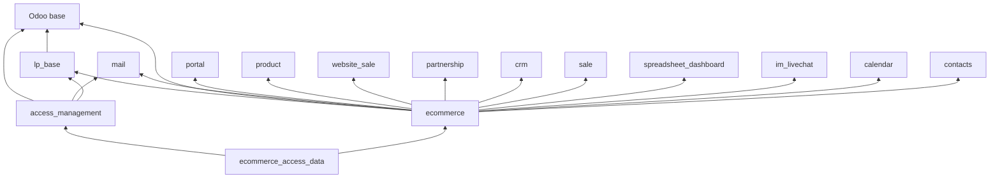

# 004 — Odoo Modules

## Module Catalog

| Module                    | Version    | Type        | Purpose                                                                                                                     |
| ------------------------- | ---------- | ----------- | --------------------------------------------------------------------------------------------------------------------------- |
| `lp_base`               | 19.0.1.0.0 | Technical   | Shared HTTP plumbing: response envelope, CORS, auth decorators, base error codes. No models with tables, no business logic. |
| `access_management`     | 19.0.1.0.0 | Application | Role-based access engine (AMM): portals, screens, permissions, roles, assignments, permission lookup API.                   |
| `ecommerce_access_data` | 1.0        | Data        | Pre-loads the AMM catalogue for this platform: 2 applications, the screen tree, 106 permissions, 6 roles.                   |
| `ecommerce`             | 19.0.1.0.4 | Application | The B2B business module — catalog, orders, clients, pricing, chat, notifications, and the whole REST API.                  |

## Dependency Graph

**External Python dependency:** `qrcode` (user-invitation QR codes).

### Why each Odoo dependency is present

| Dependency                                       | Used for                                                                              |
| ------------------------------------------------ | ------------------------------------------------------------------------------------- |
| `sale`, `product`, `website_sale`          | Sale orders and lines, product templates/variants, public categories, product ribbons |
| `mail`                                         | Chatter, mail templates, activity mixin,`mail.presence`, the bus                    |
| `im_livechat`, `contacts`                    | Discuss channels backing portal ↔ account-manager chat                               |
| `partnership`                                  | `res.partner.grade`, reused as **Client Categories**                          |
| `portal`                                       | Portal user plumbing                                                                  |
| `crm`, `calendar`, `spreadsheet_dashboard` | Back-office context around the B2B menus                                              |

---

## `lp_base` — Technical Foundation

The smallest module and the most load-bearing convention in the codebase.

| Provides                | Detail                                                                                                                          |
| ----------------------- | ------------------------------------------------------------------------------------------------------------------------------- |
| `BaseController`      | `api_response()`, `handle_api_error()`, CORS header injection, OPTIONS handling                                             |
| `http_auth_validated` | Decorator: answers preflight, rejects public sessions with`401`, guarantees CORS on the response                              |
| `http_public_cors`    | Decorator: answers preflight and adds CORS, but allows anonymous access                                                         |
| `BaseApiErrorCodes`   | `SUCCESS = "0"`, `SESSION_EXPIRED = "401"`, `GENERIC_FAILURE = "100"`                                                     |
| Health routes           | `/test` and `/test_json`, hosted here specifically to avoid a duplicate-route collision when two modules each declared them |

Every other module's controller inherits from this. Response shaping, CORS and authentication
are therefore defined exactly once.

---

## `access_management` (AMM) — Permission Engine

A generic, application-agnostic authorization catalogue. It answers one question:
*"what is this person allowed to see and do in this portal?"*

| Model                      | Role                                                                                                     |
| -------------------------- | -------------------------------------------------------------------------------------------------------- |
| `access.application`     | A portal (unique`code`, e.g. `amp`, `client`)                                                      |
| `access.screen.category` | Grouping of screens within an application                                                                |
| `access.screen`          | A frontend screen: unique`reference`, route `path`, `icon`, `sequence`, optional parent (tree)   |
| `access.permission`      | An action on a screen:`view` / `create` / `edit` / `delete` / `custom`, with a unique `code` |
| `access.role`            | A named bundle of permissions, scoped to one application                                                 |
| `access.role.assignment` | User ↔ role link                                                                                        |

Back-office menu: **Access Management → Configuration** (Applications, Screen Categories,
Screens, Roles) plus a **User Access Right** effective-permission report wizard.

Key rules enforced by the model layer:

- A role may only hold permissions belonging to its own application.
- Only one standard permission of each action type per screen (`custom` is unlimited).
- Screens cannot form a recursive hierarchy.
- Changing a role's permissions, deactivating it, or removing an assignment **revokes all
  device sessions** of the affected users — permission changes take effect immediately.

Single public endpoint: `GET /amm/api/permissions?app=<code>&user=<login|email>` returns the
user's roles, flat permission codes, and the visible screen tree (reference, name, path, icon,
category, parent, order).

---

## `ecommerce_access_data` — Pre-loaded Catalogue

Ships the concrete access catalogue so AMM is usable on install:

| Data             | Contents                                                                                                                                                                                                                                                                                        |
| ---------------- | ----------------------------------------------------------------------------------------------------------------------------------------------------------------------------------------------------------------------------------------------------------------------------------------------- |
| Applications     | `amp` (Account Manager Portal), `client` (Client Portal)                                                                                                                                                                                                                                    |
| Screen catalogue | AMP: dashboard, shared wishlist, RFQ quotations, quotations, orders, archived orders, product categories, products, brands, pricelists, pricelist items, client categories, clients, client users, user tags, messages. Client: home, products, orders, company profile, users, user tags, help |
| Permissions      | 106 records across those screens                                                                                                                                                                                                                                                                |
| Roles            | Super Admin · Account Manager · Read Only Manager · Pricing Manager · Client Company Admin · Client Standard User                                                                                                                                                                          |

The screen `reference` values (`amp.dashboard`, `client.home`, …) are the join key between this
data and the frontend navigation definition.

---

## `ecommerce` — The Business Module

### Functional areas

| Area               | Models involved                                                                                                                                                                  |
| ------------------ | -------------------------------------------------------------------------------------------------------------------------------------------------------------------------------- |
| Catalog            | `product.template`, `product.product`, `product.public.category`, `ecommerce.brand`, `ecommerce.merchant`, `ecommerce.product_merchant`, `ecommerce.alert_message` |
| Pricing            | `product.pricelist`, `product.pricelist.item`, `res.partner.grade`                                                                                                         |
| Orders             | `sale.order`, `sale.order.line`, `ecommerce.product.request.line`                                                                                                          |
| Identity & tenancy | `res.users`, `res.partner`, `ecommerce.portal.user.tag`                                                                                                                    |
| Marketing          | `ecommerce.banner`                                                                                                                                                             |
| Collaboration      | `mail.message`, `ir.attachment`, `discuss.channel`, `mail.presence`, `ecommerce.notification`                                                                          |
| Configuration      | `res.config.settings`, `res.country`, `res.country.state`                                                                                                                  |

### Security groups

| Group                               | Grants                                                           |
| ----------------------------------- | ---------------------------------------------------------------- |
| `ecommerce_group_account_manager` | The B2B Ecommerce root menu and Clients (attachment-scoped view) |
| `ecommerce_group_read_only`       | Observation only                                                 |
| `ecommerce_group_pricing_team`    | Pricelists menu (together with system admins)                    |

Model-level rights are declared in `ir.model.access.csv` (≈49 rules). The module defines **no
`ir.rule` record rules** — multi-tenant isolation is enforced in the API layer instead, since
all portal traffic runs through `sudo()` model methods. See
[007](007-Authentication-and-Authorization.md#4-multi-tenant-isolation).

### Assets registered into the back-office

- B2B Dashboard — an OWL client action rendering counters that drill into filtered order lists.
- User chat widget — lets an internal user chat with portal users from the back-office.
- SCSS for the chat, client chatter and call-icon indicators.

### Scheduled job

| Job                                              | Frequency      | Purpose                                                                                                                                                                         |
| ------------------------------------------------ | -------------- | ------------------------------------------------------------------------------------------------------------------------------------------------------------------------------- |
| *Ecommerce: mark stale chat presences offline* | every 1 minute | Flips presences whose heartbeat is older than the disconnection timer to`offline`. Safety net for browser crashes and for the Odoo.sh gateway swallowing socket-close events. |

---

## Cross-Cutting Abstract Models

| Abstract model                        | Effect on inheritors                                                                                                      |
| ------------------------------------- | ------------------------------------------------------------------------------------------------------------------------- |
|                                       |                                                                                                                           |
| `ecommerce.base_auto_refresh_model` | Pushes a bus message on every create / write / unlink so open back-office lists refresh live. Inherited by`sale.order`. |
