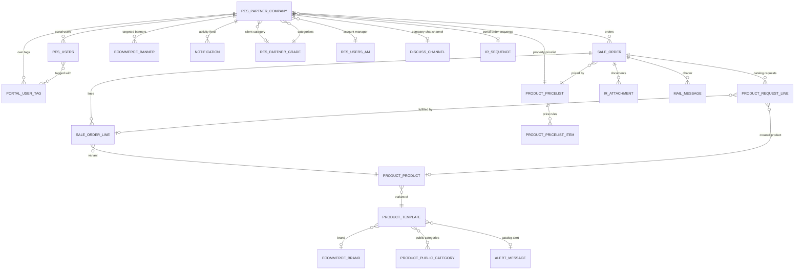
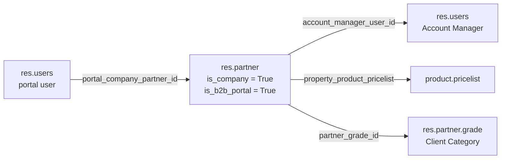
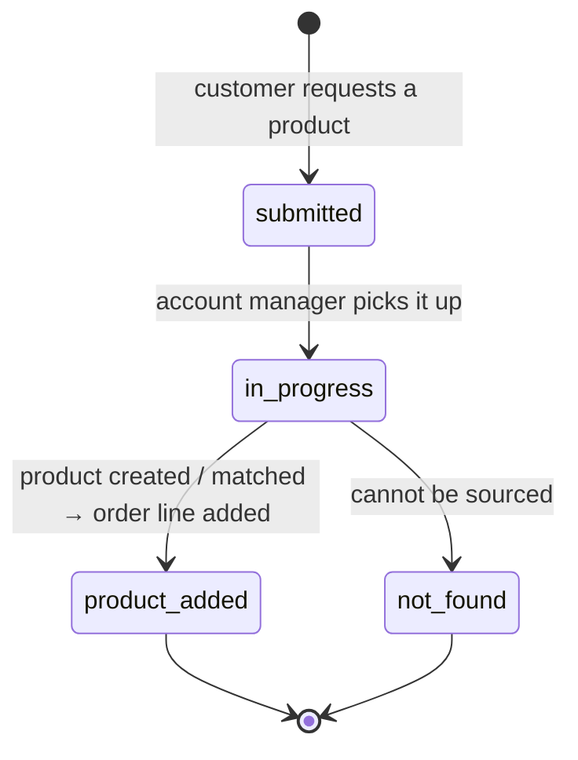

# 005 — Domain Model

High-level only: the models that matter, how they relate, and what was customised on Odoo's
standard models.

---

## Entity Relationship Overview

---

## The Tenancy Spine

Everything in the platform hangs off one relationship:

A portal user's company partner determines: which orders they see, which prices they get,
which banners are shown, which chat channel they join, which notifications reach them, and
which Account Manager is alerted on state changes.

---

## Custom Models

| Model                              | Purpose                                           | Notable traits                                                                                                                                 |
| ---------------------------------- | ------------------------------------------------- | ---------------------------------------------------------------------------------------------------------------------------------------------- |
| `ecommerce.brand`                | Product brands                                    | Name & description, manual sequence, active flag, chatter                                                                         |
| `ecommerce.banner`               | Marketing banners                                 | Scheduled`active_datetime` / `deactivate_datetime`, optional client targeting, promotion URL, linked products & categories, obfuscated IDs |
| `ecommerce.alert_message`        | Short catalog alert text attached to products     | Simple label model                                                                                                                             |
| `ecommerce.portal.user.tag`      | Tags for portal users                             | Scoped per client company                                                                                                                      |
| `ecommerce.product.request.line` | Customer request for a product not in the catalog | Own state machine; can auto-create a sale order line                                                                                           |
| `ecommerce.notification`         | In-app activity notification                      | Typed, company-scoped,`owner_user_id` excludes the actor from their own notifications, obfuscated IDs                                        |

### Product request line state machine

Each transition stamps its own date field. When a request reaches `product_added` with a linked
order line, that line is created automatically on the customer's order; reverting the link
removes it again.

---

## Extended Odoo Models

### `res.users`

| Added capability      | Fields / behaviour                                                                                                                                                        |
| --------------------- | ------------------------------------------------------------------------------------------------------------------------------------------------------------------------- |
| Tenancy               | `portal_company_partner_id`, computed `is_b2b_portal`, `is_admin_portal_user`                                                                                 |
| Dual activation       | `activate` (controlled by the vendor's account manager) **and** `portal_activate` (controlled by the client's own company admin) — both must be true to log in |
| Identity              | `identification_no` as an alternative login, `portal_user_code`                                                                                                       |
| Password reset        | `otp`, `otp_expiry_datetime` — a one-time code e-mailed and verified during a forgotten-password reset. It never establishes a session |
| Invitation            | Computed`invitation_url` and `qr_code_image`, printable QR report, invitation e-mail                                                                                  |
| Roles                 | `is_account_manager`, `portal_user_tags`                                                                                                                              |
| Presence              | Overridden`im_status` computed from `mail.presence` with a staleness window, plus a searchable variant                                                                |
| API surface           | The full portal-user CRUD, authentication and password flows live here as `api_*` methods |

### `res.partner`

| Added capability     | Detail                                                                                     |
| -------------------- | ------------------------------------------------------------------------------------------ |
| Portal client flag   | `is_b2b_portal` marks a company as a B2B client                                    |
| Account managers     | `account_manager_user_id` (primary) and `account_manager_ids` (many-to-many)           |
| Per-client numbering | `portal_order_sequence_id` — each client gets its own order sequence                    |
| Portal URL           | `shop_portal_url`, falling back to a global system parameter                             |
| Chat                 | `company_channel_id` — the discuss channel for company-wide conversation                |
| Pricing              | `property_product_pricelist` with conflict resolution against the client's grade default |
| Owned collections    | Banners, portal users, portal user tags                                                    |

The **client category** (`res.partner.grade`, reused from the `partnership` module) carries a
default pricelist. Assigning a category and a conflicting pricelist to the same client triggers
an explicit resolution that logs the outcome in the chatter.

### `sale.order` / `sale.order.line`

| Added capability | Detail                                                                                                                         |
| ---------------- | ------------------------------------------------------------------------------------------------------------------------------ |
| Parallel status  | `portal_state` — 9 states in use, tracked; mapped onto Odoo's native `state` on every transition                                |
| Portal identity  | `portal_order_no`, `portal_label` (customer's own name for the basket), per-client sequence                                |
| Planning         | `portal_planned_order_date` and a computed `portal_order_planning_state` (late / on time / upcoming)                       |
| Attention flags  | `portal_visible` ("needs attention"), `portal_reviewed` + date, `portal_pending_submit`, `portal_print_quotation_date` |
| Collaboration    | `portal_messages_count`, attachment count, account-manager notes (internal) and comment (client-visible)                     |
| Catalog requests | `request_product_ids` with a count of new requests                                                                           |
| Line additions   | `portal_target_price` (the price the customer is asking for), `manual` flag, `need_call` related from the product        |
| Live refresh     | Inherits the auto-refresh mixin — back-office lists update without a reload                                                   |

### `product.template` / `product.product`

| Added capability   | Detail                                                                                                                                  |
| ------------------ | --------------------------------------------------------------------------------------------------------------------------------------- |
| Merchandising      | `brand_id`, `public_categ_ids`, `is_featured_product`, `alert_message_id`, `terms` (HTML)                                     |
|                    |                                                                                                                                         |
| Sales behaviour    | `need_call` — a product that must be quoted by phone                                                                                 |
| Pricing projection | Computed`product_pricelist_ids`; the catalog API resolves the effective price, list price and discount per pricelist                  |
| Admin management   | Full product CRUD, media sync, attribute linking, variant generation and the JSON import pipeline are implemented as model methods here |

### Collaboration models

| Model               | Customisation                                                                                                                                                               |
| ------------------- | --------------------------------------------------------------------------------------------------------------------------------------------------------------------------- |
| `mail.message`    | Portal chatter API: read, post, update; attachment upload/delete; access check against the related sale order                                                               |
| `ir.attachment`   | Portal provenance (`upload_from_portal`, `portal_create_uid`, `portal_company_partner_id`, `auto_created`) and an `attachment_view` visibility selector           |
| `discuss.channel` | Portal-aware unread counting and read pointers; mirrors new messages onto a string bus channel because Odoo.sh does not relay record channels to non-Odoo WebSocket clients |
| `mail.presence`   | Stale-presence cron, transition-only bus broadcasts (so the heartbeat does not spam), and suppression of spurious "user is online" alerts caused by page refreshes          |

---

## Abstract Models (Mixins)

| Mixin                                 | Applied to                                       | Effect                                                                                                                                                                                     |
| ------------------------------------- | ------------------------------------------------ | ------------------------------------------------------------------------------------------------------------------------------------------------------------------------------------------ |
| `ecommerce.base.secure_model`       | `ecommerce.banner`, `ecommerce.notification` | Reversible XOR + Base64 ID obfuscation for externally exposed identifiers; controllers resolve incoming external IDs back to database IDs. Toggled by a system parameter, defaults to off. |
| `ecommerce.base_auto_refresh_model` | `sale.order`                                   | Broadcasts a bus event on create/write/unlink so open back-office views refresh live.                                                                                                      |

---

## Removed Models

`ecommerce.tier` and `ecommerce.product_merchant` (product ↔ merchant price link) were fully
removed from the codebase — model, views, security rules and manifest entries all deleted — in
commit `c26ef8b` (2026-08-06). They are not present in any form; do not build on either name.
Client segmentation is done with `res.partner.grade` (Client Categories) instead.
`ecommerce.merchant` (supplier master data, singular) is still present in code today but is
slated for removal too — see `_docs/todos/ecommerce-models-dead-code.md` — so it is no longer
documented here.
