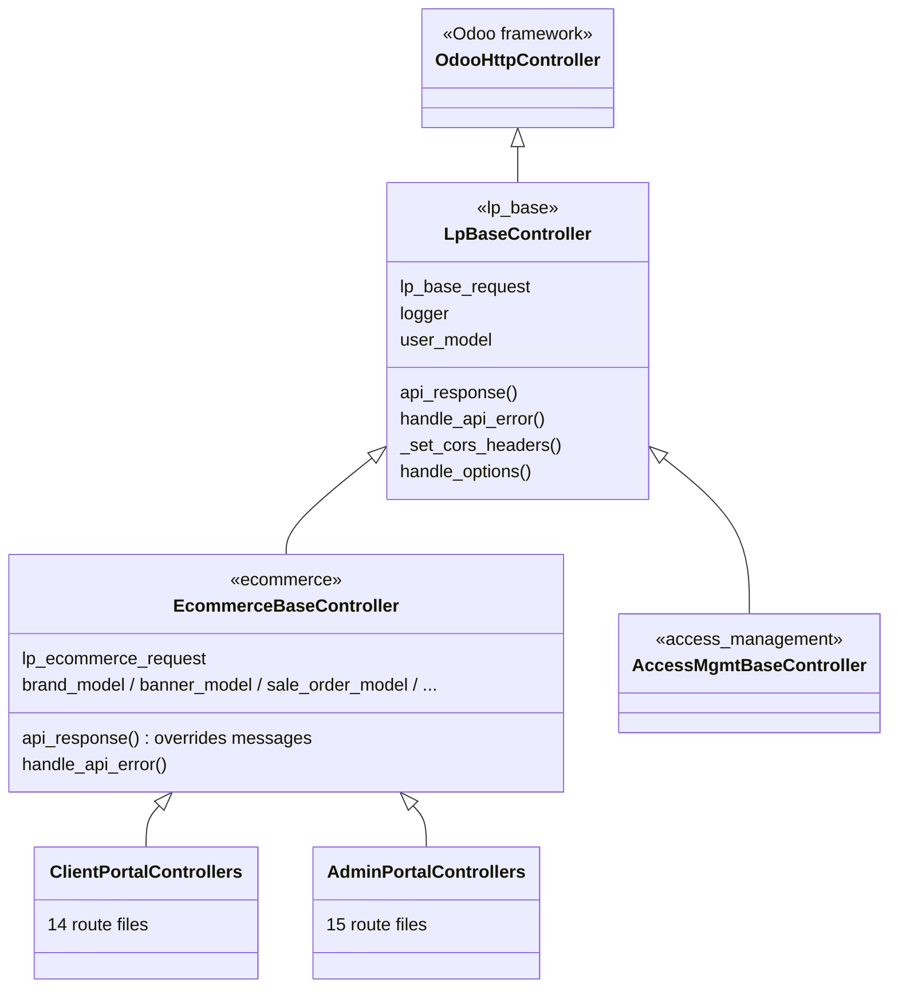
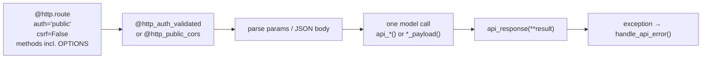

# 006 — API and Controller Architecture

## Controller Inheritance



`lp_base` owns the envelope, CORS and authentication. The `ecommerce` base controller adds
only two things: its own error-message dictionary and lazy `sudo()` model accessors so route
methods never touch `request.env` directly.

> **Naming caution.** Odoo registers routes by *method name* across the whole controller
> inheritance chain. Two sibling controllers defining the same method name silently drop one
> route — the symptom looks like a CORS failure but is really a 404. Client and admin
> counterparts are therefore named distinctly (`list_banners` vs `list_banners_admin`).

---

## Request Handling Contract

Every route follows the same shape:



| Element | Why |
|---------|-----|
| `auth='public'` | The decorator, not Odoo, decides authentication — so failures return the JSON envelope instead of an HTML login redirect |
| `csrf=False` | Cross-origin JSON API; protection is the session cookie plus CORS |
| `OPTIONS` in `methods` | Browser preflight is answered by the decorator with `204` + CORS headers |

### Response envelope

```json
{ "response_code": "0", "response_message": "…", "<payload keys>": … }
```

| Field | Meaning |
|-------|---------|
| `response_code` | `"0"` = success. `"100"` = generic failure. `"401"` = session expired (the only case that also returns HTTP 401). `5xxx`/`6xxx` = business errors. |
| `response_message` | English message, resolved from a central message dictionary or overridden per call |

Business failures deliberately return **HTTP 200**. Clients must branch on `response_code`,
never on the HTTP status.

> A few legacy endpoints still emit an extra localised message key alongside
> `response_message`. The portals ignore it — English is the only rendered language, and new
> endpoints should not add it.

### Error code families

| Range | Family |
|-------|--------|
| 5101–5134 | User / authentication |
| 5201–5212 | Orders and order lines |
| 5401–5407 | Products, attributes, variants |
| 5501–5509 | Attachments and chatter |
| 5601–5612 | Product requests |
| 5701–5703 | Portal user tags |
| 6xxx | Additional admin-side families (banners, brands, clients, pricelists, chat) |

All codes and their messages are centralised in one module-level file, so a code never has two
meanings.

---

## Endpoint Catalog

Route prefixes in use:

| Prefix | Consumer |
|--------|----------|
| `/ecommerce/api/*` | Client Portal |
| `/ecommerce/api/admin/*` | AMP — most admin resources |
| `/api/admin/*` | AMP — clients, pricelists, pricelist items, currencies |
| `/ecommerce/admin/api/chat/*` | AMP — chat |
| `/amm/api/*` | Both portals — permission lookup |

> Three admin prefixes coexist for historical reasons. New admin endpoints should use
> `/ecommerce/api/admin/*`.

### Client Portal API

| Area | Endpoints | Purpose |
|------|-----------|---------|
| Authentication | `authenticate`, `logout` | Session login by login **or** identification number; blocks users who are not activated on both flags. Password is the only sign-in method |
| Password reset | `otp/send`, `otp/verify`, `change-password` | Three-step forgotten-password flow: e-mail a one-time code, verify it for a secret token, set the new password. Verification does **not** create a session |
| Password change | `reset-password` | Lets an already authenticated user change their own password |
| Catalog | `brands`, `products`, `product`, `public_categories` | Paginated, filterable catalog with pricelist-resolved prices, variants and attribute exclusions |
| Marketing | `banners` | Active, schedule-aware banners for the user's company |
| Orders | `orders`, `orders/create`, `orders/drafts`, `orders/details`, `orders/update`, `orders/delete` | Basket/RFQ/quotation/order lifecycle; create supports copying an existing order |
| Order lines | `order_lines/create`, `update`, `delete` | Line editing including customer target price |
| Product requests | `product_requests` (+ `create`, `update`, `delete`, `details`) | Requests for items not in the catalog |
| Chatter | `chatter/messages`, `message/post`, `message/update`, `attachment/upload`, `attachment/delete` | Per-order comment thread with attachments |
| Chat | `chat/init`, `chat/send`, `chat/mark-read` | Live conversation with the account manager |
| Presence | `presence/ping`, `presence/offline` | HTTP heartbeat backing online status |
| Notifications | `notifications`, `mark-seen`, `seen-all` | In-app activity feed |
| Portal users | `portal/users`, `portal/user`, `activate`, `deactivate`, `delete` | Company admin manages their own users |
| User tags | `portal/user/tags` (+ `create`, `update`, `delete`) | Per-company tagging |
| Media | `/web/content`, image proxy route | Serves product and attachment media with CORS |
| Diagnostics | `build-info` | Deployed build identification |

### Account Manager Portal API

| Area | Endpoints | Purpose |
|------|-----------|---------|
| Products | `products` (GET/POST/PUT/DELETE), `product`, `products/import` | Full product CRUD with media, plus JSON bulk import |
| Attributes & variants | `attributes`, `attribute/values`, `product/variants` (GET/POST/DELETE), `product/variant` (PUT), `link-attribute`, `unlink-attribute`, `remove-attribute-value`, `generate-product-variants` | Variant matrix management |
| Product metadata | `ribbons`, `alert-messages` | Lookup lists for the product form |
| Product categories | `product-categories` (list / create / update / delete) | Public category tree |
| Brands | `brands`, `details`, `create`, `update`, `delete` | Brand CRUD with duplicate-name protection |
| Banners | `banners`, `details`, `create`, `update`, `delete` | Banner CRUD with scheduling and targeting |
| Orders | `orders`, `orders/details`, `orders/update` | Server-side filtered order queues; state transitions |
| Order lines | `order_lines/create`, `update`, `delete` | Account manager pricing of lines |
| Clients | `/api/admin/clients` (+ `get`, `create`, `update`, `delete`, `restore`) | Client company CRUD with archive/restore |
| Client categories | `client-categories` (+ `details`, `create`, `update`, `delete`) | Category (grade) CRUD |
| Pricelists | `/api/admin/pricelists` (+ `details`, `create`, `update`, `delete`), `currencies` | Pricelist CRUD |
| Pricelist items | `/api/admin/pricelists/items` (+ `details`, `create`, `update`, `delete`) | Price rule CRUD |
| Product requests | `product_requests`, `product_requests/update` | Triage of catalog requests |
| Chat | `chat/threads`, `chat/init`, `chat/send`, `chat/mark_read` | Multi-client inbox |
| Users | `users/send-invitation` | Sends the QR invitation e-mail |
| Address lookups | `countries`, `states` | Form dropdowns |
| Attachments | `attachments/list` | Documents on a record |

### Access Management API

| Endpoint | Purpose |
|----------|---------|
| `GET /amm/api/permissions?app=&user=` | Returns roles, permission codes and the visible screen tree for one user in one portal |

---

## Conventions Worth Knowing Before Adding an Endpoint

1. **Thin controller.** The route body parses input, makes one model call, returns
   `api_response(**result)`. Business logic in a controller is a code-review failure.
2. **Model methods return plain dicts** containing `response_code` plus payload keys — never
   HTTP responses.
3. **Model access is `sudo()`**; the tenancy filter is applied explicitly in the domain, not by
   record rules.
4. **Serialization lives in `_prepare_*_dict()` helpers** on the model, so the same shape is
   reused by list, detail and update responses.
5. **New error codes go in the central error file**, never inline as literals.
6. **Method names must be unique across the whole controller inheritance chain.**
7. **Pagination is `page` + `limit`**, and the response returns a pagination block.
