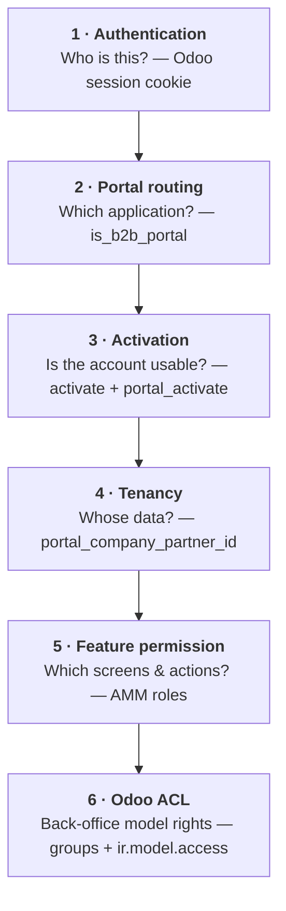
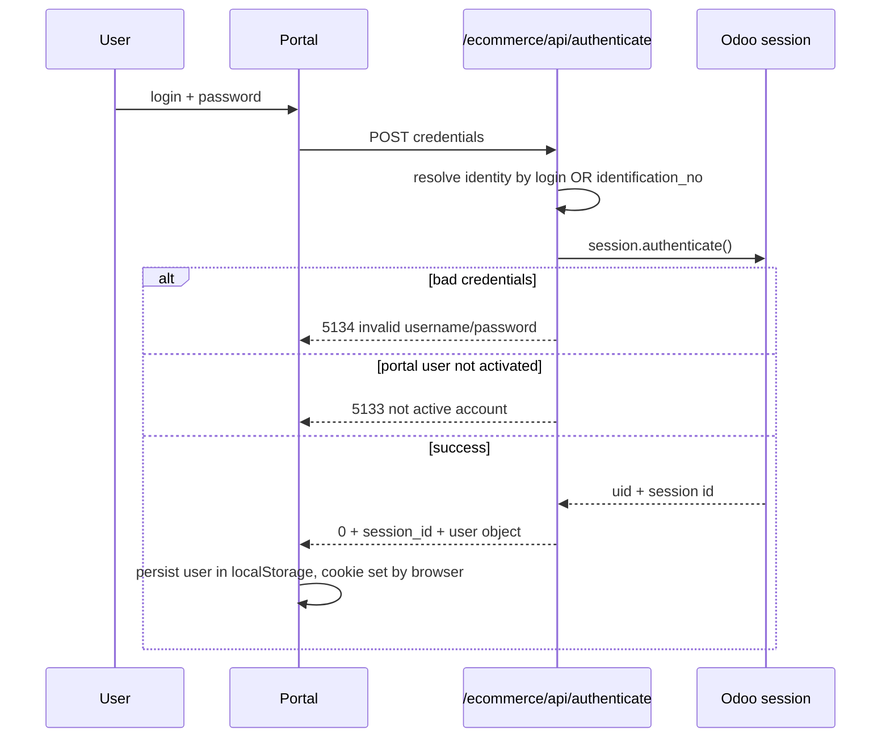
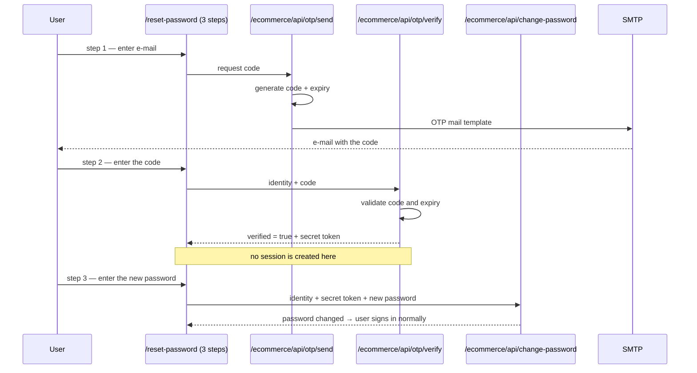
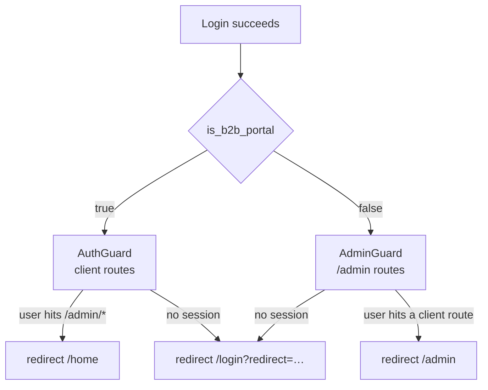
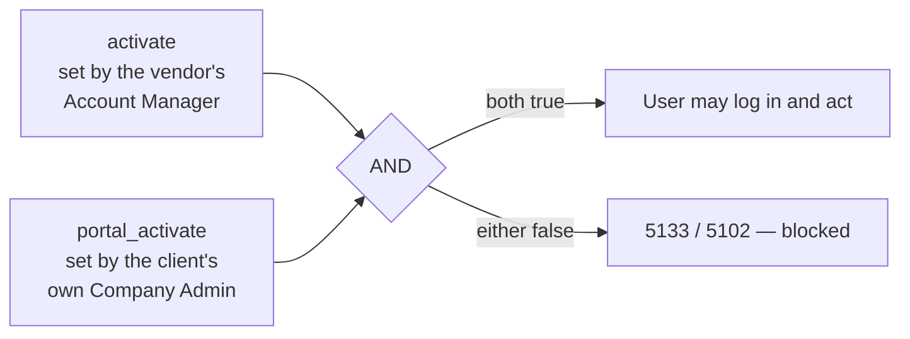
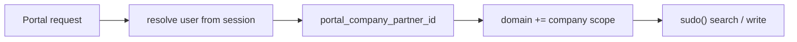
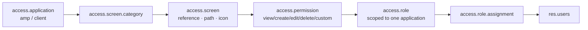
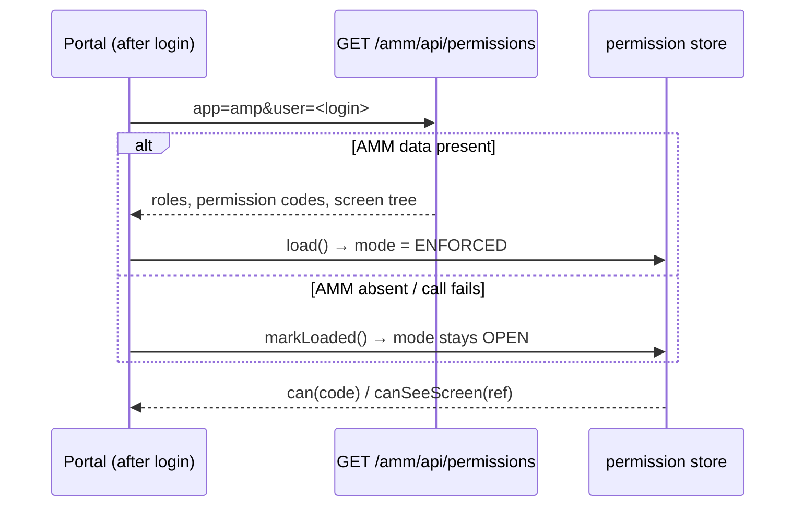

# 007 — Authentication and Authorization

## Layers

Each layer is independent. Layers 1–4 are always enforced; layer 5 degrades gracefully to
"allow everything" when AMM data is absent; layer 6 applies only inside the Odoo back-office.

---

## 1 · Authentication

**One way in: login and password.** There is no passwordless sign-in. Authentication always
ends in a standard Odoo session cookie.

### Password login

Identity lookup accepts **login or `identification_no`**, so customers can sign in with a
business identifier rather than an e-mail address. The API also resolves users by ID or e-mail
in other flows.

### Password reset — the only use of OTP

The one-time code exists **solely to prove ownership of an e-mail address during a password
reset**. It never establishes a session and it is not offered on the login screen.

A separate `reset-password` endpoint lets an **already authenticated** user change their own
password without the code exchange.

### Session handling on the client

- Axios client runs with `withCredentials: true`; the cookie travels automatically.
- A response interceptor treats `response_code === "401"` as terminal: clear local storage,
  redirect to `/login`.
- Logout marks the user's presence offline *before* destroying the session, because the
  Odoo.sh gateway never delivers the socket-close event that would otherwise do it.

---

## 2 · Portal Routing

A single boolean decides which application the user gets.

| `is_b2b_portal` | Meaning                    | Landing route |
| ----------------------- | -------------------------- | ------------- |
| `true`                | External B2B customer user | `/home`     |
| `false`               | Internal vendor employee   | `/admin`    |

Both guards render a blocking state while redirecting, so a portal user never sees admin UI
flash on screen. `AdminGuard` additionally renders an explicit *Access Denied* panel for a
portal user who reaches an admin route.

The field itself is **computed and stored** on the user record — it is not a client-side
assertion.

---

## 3 · Activation — the two-key model

This lets the vendor suspend an entire client's user without the client being able to
re-enable it, while still letting the client's own admin manage their team day to day. The
check is re-applied on write operations, not only at login.

**Immediate revocation.** Flipping `activate` or `portal_activate` to `False` — or changing
`is_admin_portal_user` in either direction — revokes every one of that user's active device
sessions on the spot (`res.users.write()` → `_action_revoke_all_devices()`). Deactivation is not
just a login-time check: a user already signed in loses access immediately, without waiting for
their session to expire or for a next login attempt.

---

## 4 · Multi-Tenant Isolation

The platform is **single-database, multi-tenant**. Isolation is enforced in the API layer.

| Rule                   | Detail                                                                                                                                                               |
| ---------------------- | -------------------------------------------------------------------------------------------------------------------------------------------------------------------- |
| Reads                  | Every list and detail endpoint appends the company scope to the search domain                                                                                        |
| Writes                 | Ownership is re-verified against the resolved user before mutating                                                                                                   |
| Account managers       | Scoped by`res.partner.account_manager_user_id` — an AM sees only the clients assigned to them (chat threads, for example, are built from the managed-company set) |
| Attachments & messages | Access is validated against the*related record's* company, not the attachment itself                                                                               |
| Enforcement location   | API layer, because all portal traffic runs through`sudo()` model methods; the module defines **no `ir.rule` record rules**                                 |

**Consequence for developers:** a new endpoint that forgets the company scope has no second
line of defence. Scoping is not optional and cannot be added later by configuration.

The product, pricelist and order APIs now route through a shared helper module,
`ecommerce/api_access.py` (`as_user()`, `resolve_for_user()`, `resolve_id_for_user()`,
`search_as_user()`): a record is resolved/authorized under the calling user first — so Odoo's
own record rules still apply at that step — then the actual read or write executes under
`sudo()`. This formalizes the pattern above into one place instead of each controller
re-implementing its own scoping.

Deleting a client company that is still referenced by other records (orders, users, …) no
longer surfaces a raw database FK error — the delete is wrapped in a savepoint and reported back
as a plain `CLIENT_IN_USE` business error instead.

Identifiers exposed to clients can additionally be obfuscated (reversible XOR + Base64) to
mitigate enumeration — a defence-in-depth measure, not a substitute for the scoping above.

---

## 5 · Feature Permissions (AMM)

### Runtime flow

| Mode               | `can()` returns               | When                                                                                        |
| ------------------ | ------------------------------- | ------------------------------------------------------------------------------------------- |
| **OPEN**     | always`true`                  | AMM not installed, no data, or the lookup failed — the portal renders its full static menu |
| **ENFORCED** | `true` only for granted codes | The lookup returned data                                                                    |

This fallback is deliberate: the portal must run standalone. The static navigation tree in the
frontend is the source of truth for *what exists*; AMM only *filters* it. The join key between
the two is the screen `reference` (`amp.dashboard`, `client.home`, …).

### Immediate revocation

Editing a role's permissions, deactivating a role, or deleting an assignment revokes all
device sessions of every affected user. Permission changes never wait for a session to expire.

### Roles shipped

Super Admin · Account Manager · Read Only Manager · Pricing Manager · Client Company Admin ·
Client Standard User.

> AMM is **advisory in the current build**: it drives menu visibility and route guards in the
> portals. Backend endpoints are not yet gated by permission codes — the enforcement hook
> exists but is a no-op. Treat AMM as UI-level authorization on top of the mandatory tenancy
> scoping, not as a replacement for it.

---

## 6 · Back-Office Access Control

Standard Odoo mechanics, used only for internal users in the Odoo web client.

| Group                               | Effect                                                                    |
| ----------------------------------- | ------------------------------------------------------------------------- |
| `ecommerce_group_account_manager` | Grants the B2B Ecommerce root menu and the attachment-scoped Clients view |
| `ecommerce_group_pricing_team`    | Grants the Pricelists menu (alongside system administrators)              |
| `ecommerce_group_read_only`       | Observation-only access                                                   |
| `base.group_system`               | Configuration submenu, full Clients view with chatter, settings           |

Model-level create/read/write/unlink rights are declared in `ir.model.access.csv`.
