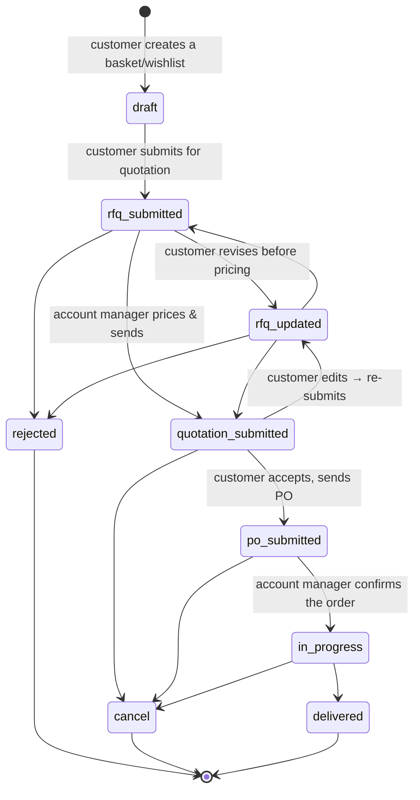
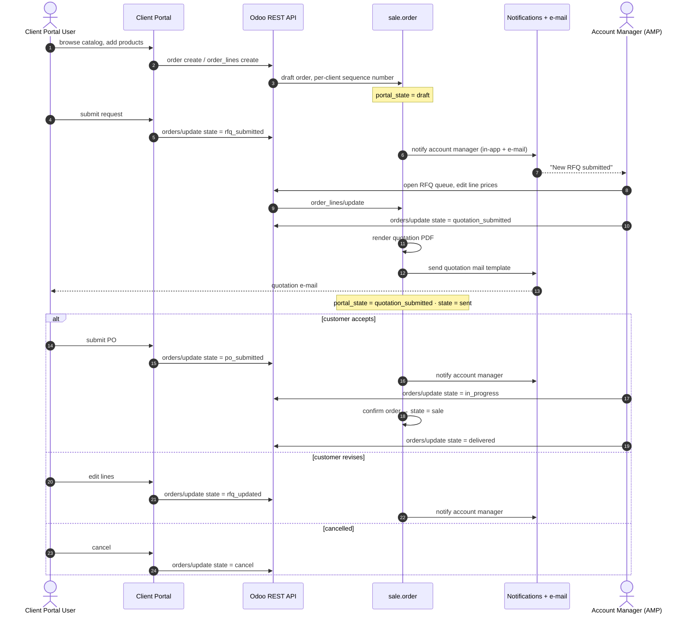
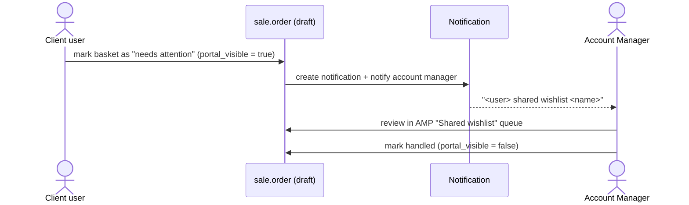
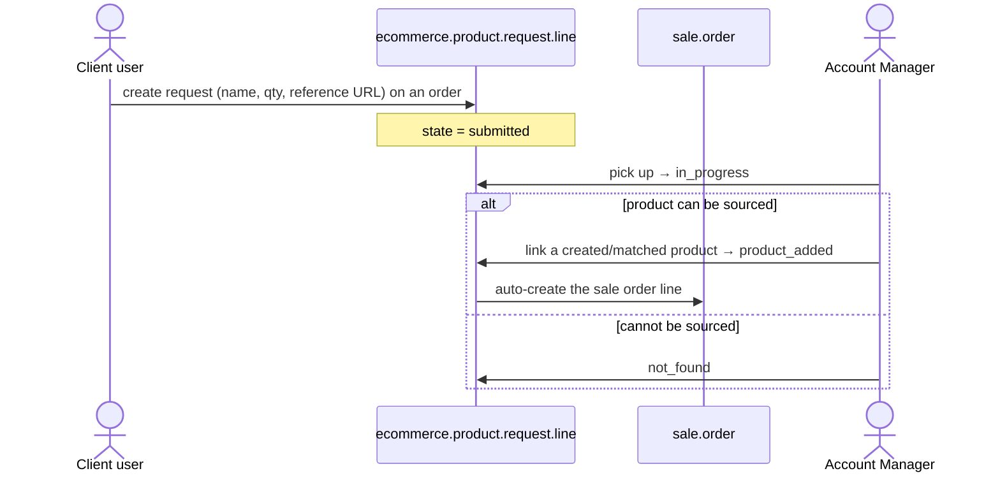

# 008 — Order Lifecycle

The order lifecycle is the heart of the platform. A single `sale.order` record carries **two
status fields**: Odoo's native `state` (the ERP truth) and `portal_state` (the B2B business
truth shown in both portals).

---

## Portal State Machine

### State reference

| `portal_state`        | Business meaning                             | Mapped Odoo`state` | Owner of the next move  |
| ----------------------- | -------------------------------------------- | -------------------- | ----------------------- |
| `draft`               | Basket / wishlist being built                | `draft`            | Customer                |
| `rfq_submitted`       | Request for quotation lodged                 | `draft`            | Account Manager         |
| `rfq_updated`         | Customer revised the request                 | `draft`            | Account Manager         |
| `rejected`            | Request refused                              | `cancel`           | —                      |
| `quotation_submitted` | Priced quotation issued (PDF e-mailed)       | `sent`             | Customer                |
| `po_submitted`        | Customer sent their purchase order           | `sent`             | Account Manager         |
| `in_progress`         | Order confirmed and being fulfilled          | `sale`             | Account Manager         |
| `delivered`           | Fulfilment complete                          | `sale`             | —                      |
| `cancel`              | Cancelled                                    | `cancel`           | —                      |

State changes arrive through a single update endpoint. Two transitions are **not** plain field
writes — they delegate to real Odoo actions:

| Transition                | Delegates to              | Side effects                                                                                             |
| ------------------------- | ------------------------- | -------------------------------------------------------------------------------------------------------- |
| →`quotation_submitted` | the quotation-send action | Renders the quotation PDF, sends the*Ecommerce: Portal Quotation* mail template, sets `state = sent` |
| →`in_progress`         | the order-confirm action  | Runs Odoo's standard confirmation, sets`state = sale`                                                  |

### Guard rails

- A transition to any state other than `draft`, `rejected` or `cancel` is refused if the order
  has no real (non-display) lines.
- An unknown `portal_state` value is rejected outright.
- Only the creator may delete a basket.
- Editing an already-quoted order sets `portal_pending_submit`, marking it as changed but not
  yet re-submitted.
- A B2B portal order stays out of the standard Odoo Sales module views
  (Quotations / Orders) until it reaches `state='sale'` — i.e. until it hits `in_progress`. This
  keeps in-flight RFQs and quotations from cluttering the internal sales pipeline; the order is
  always visible in the AMP/back-office portal-state queues regardless.

---

## End-to-End Business Workflow

**Notification trigger points.** The account manager is notified on exactly three customer-side
transitions: `rfq_submitted`, `rfq_updated`, `po_submitted` — plus when a wishlist is shared, and
whenever the client opens or downloads the quotation PDF. Notifications are only sent when the
actor is a portal user, so account-manager-side edits do not notify the account manager. E-mail
delivery is globally switchable via a system setting; the in-app notification is always created.

---

## The Shared-Wishlist Flow

A parallel, lighter-weight flow that does not enter the RFQ pipeline.

`portal_visible` is the "needs attention" flag; it also drives the **Needs Attention** filter
and dashboard counter in the Odoo back-office.

---

## Requesting a Product That Is Not in the Catalog

The request line and the order line stay linked: unlinking or re-pointing the request removes
or replaces the generated order line. The order carries a live count of unresolved requests,
surfaced as a button on the back-office order form.

---

## Order Numbering and Labelling

| Field               | Origin                                                                                         | Shown to     |
| ------------------- | ---------------------------------------------------------------------------------------------- | ------------ |
| `name`            | Odoo's standard sale-order sequence                                                            | Back-office  |
| `portal_order_no` | The**client company's own sequence** (`portal_order_sequence_id`), generated on create | Both portals |
| `portal_label`    | Free text chosen by the customer ("Q3 lab restock")                                            | Both portals |

Per-client sequences mean each customer sees a continuous, private numbering series.

---

## Planning and Attention Signals

| Signal                                                  | Meaning                                                     |
| ------------------------------------------------------- | ----------------------------------------------------------- |
| `portal_planned_order_date` + computed planning state | Late / On Time / Upcoming — drives urgency indicators      |
| `portal_visible`                                      | Needs attention (unread portal activity or shared wishlist) |
| `portal_reviewed` + `portal_reviewed_date`          | The customer has reviewed the quotation — stamped only when the actor is a portal user |
| `portal_print_quotation_date`                         | The customer printed/downloaded the quotation — same portal-user-only stamping |
| `account_manager_print_po_date`                       | The account manager downloaded the purchase order — the internal-side mirror of the two rows above |
| `portal_pending_submit`                               | The customer edited a quoted order without re-submitting    |
| `portal_messages_count`                               | Volume of portal-originated chatter                         |
| `account_manager_notes` / `account_manager_comment` | Internal note vs. client-visible comment                    |

The planning state is not purely computed-on-read: a daily scheduled job
(*Ecommerce: Update Order Planning States*) recomputes it from `portal_planned_order_date` for
every order, so a Late/Upcoming indicator does not go stale between reads.

---

## Where Each State Appears

| Surface                                        | Queues                                                                                                                                                        |
| ---------------------------------------------- | ------------------------------------------------------------------------------------------------------------------------------------------------------------- |
| **AMP** (`/admin`)                     | Shared Wishlist · RFQ Quotations · Quotations · Orders · Archived Orders                                                                                  |
| **Client Portal** (`/company-profile`) | Wishlists · RFQs · Orders · Archived                                                                                                                       |
| **Odoo back-office**                     | Orders Management → RFQ Quotations · Quotations · Orders; dashboard drill-downs for Needs Attention, New RFQs, Total RFQs; search filters per portal state |
