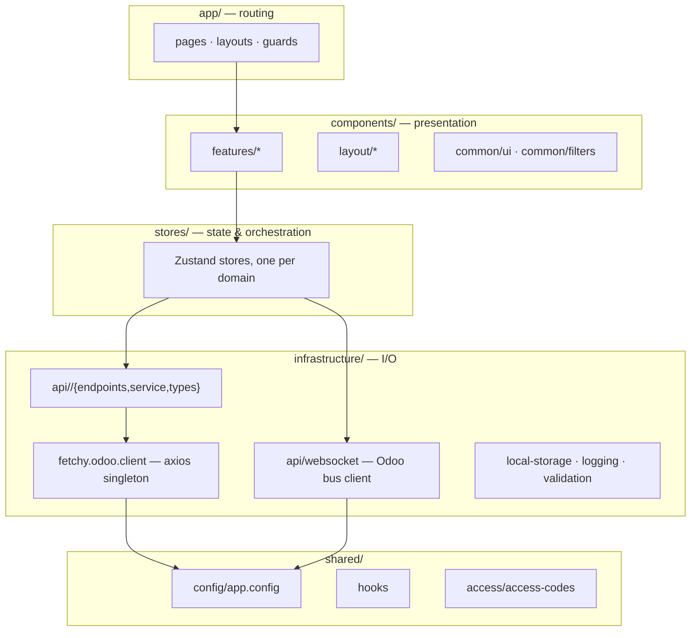
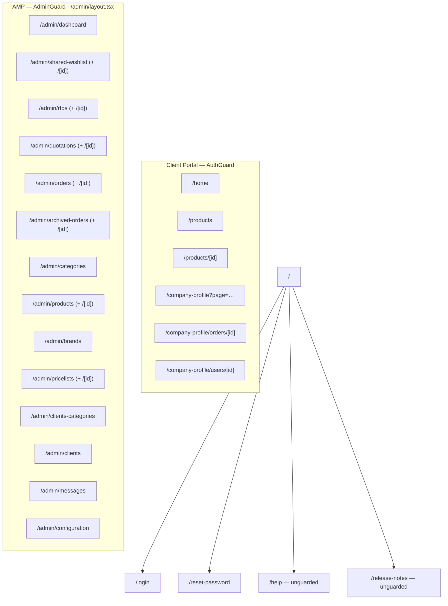
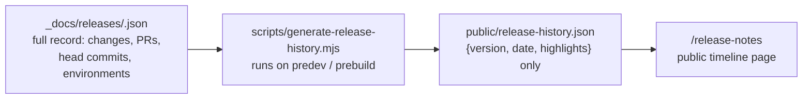

# 010 — Next.js Application Architecture

## Stack

| Concern | Choice |
|---------|--------|
| Framework | Next.js 15, App Router, `--turbopack` for dev and build |
| UI runtime | React 19, TypeScript 5 |
| Styling | Tailwind CSS 4 with CSS custom properties for theming |
| Component libraries | PrimeReact (data tables, menus), Radix UI primitives, lucide / react-icons |
| State | Zustand 5 (`devtools` + `subscribeWithSelector`) |
| HTTP | Axios singleton |
| Validation | Zod |
| Motion / canvas | Framer Motion, Konva (image editing) |
| Editors / data | Quill (rich text), XLSX (spreadsheet export) |
| Quality | ESLint 9, Prettier, Husky + lint-staged, commitlint |
| Testing | Vitest 3 + Testing Library + Playwright browser mode; Storybook 9 for components |

The app has **two build targets** from one codebase: `build:cloudflare` (OpenNext → Cloudflare
Worker) produces the live production portal, and `build:docker` (Next.js standalone) produces
the containers used by the staging and training environments. See
[014](014-Deployment-Architecture.md).

> The `package.json` exposes `dev`, `build`, `build:docker`, `build:cloudflare`, `start`,
> `lint`, `format`, `storybook` and `generate:release-history`. There is no `test` script —
> Vitest and Storybook are configured and invoked directly.

---

## Layered Architecture

**The rule that keeps this clean:** components never call `axios`, and services never touch
React. Stores are the only layer that knows about both.

---

## Routing Surface

Route groups `(orders-management)` and `(product-management)` organise files without adding URL
segments. The admin layout exports `dynamic = 'force-dynamic'` to prevent static generation
during Docker builds — the admin tree depends on runtime session state.

Two admin routes exist as pages but are **not linked from the sidebar** (their nav entries are
commented out): `/admin/client-users` and `/admin/users-tags`. Client-user and tag management
currently happens from the Client Portal's company profile.

---

## Guards

| Guard | Applied to | Behaviour |
|-------|-----------|-----------|
| `AuthGuard` | Client Portal pages | No session → `/login?redirect=…`. Portal user on an `/admin` path → `/home`. Internal user on a client path → `/admin`. Renders a blocking state while redirecting. |
| `AdminGuard` | `/admin/*` | Same redirects, plus an explicit *Access Denied* panel when a portal user reaches an admin route. |

Both wait for `isInitialized` from the shared auth hook before deciding, so a page refresh does
not bounce the user during rehydration.

---

## State Management

One Zustand store per domain, all using `devtools` and `subscribeWithSelector`.

| Store | Owns |
|-------|------|
| `user.store` | Current user, login/logout, portal user CRUD |
| `permission.store` | AMM codes, screens, OPEN/ENFORCED mode, `can()` primitives |
| `product.store` · `admin/product.store` · `admin/product-variants.store` | Catalog browsing; admin product and variant CRUD |
| `admin/category.store` · `client-category.store` | Public categories; client categories |
| `brand.store` | Brand catalog |
| `order.store` | Order lists, creation, line management |
| `product-request.store` | Catalog requests |
| `pricelist.store` · `pricelist-item.store` | Pricing |
| `client.store` | Client companies (admin) |
| `banner.store` · `admin_banner.store` | Storefront banners; admin banner CRUD |
| `chat.store` · `chatter.store` | Live chat; order comment threads |
| `notifications.store` | In-app feed and unread badge |
| `user-tags.store` | Portal user tags |
| `address.store` | Countries and states |
| `theme.store` · `admin-layout.store` | Dark/light mode; sidebar collapse |

---

## API Access Layer

Each backend domain gets the same three files under `infrastructure/api/<domain>/`:

| File | Contains |
|------|----------|
| `*.endpoints.ts` | URL constants and URL-builder functions |
| `*.service.ts` | Typed functions that call the shared axios client |
| `*.types.ts` | Request and response types |

### The HTTP client

`fetchy.odoo.client.ts` — a single axios instance:

- `baseURL` from `NEXT_PUBLIC_APP_API_BASE_URL`
- `withCredentials: true` so the Odoo session cookie is always sent
- A response interceptor that treats `response_code === '401'` as session expiry: clear local
  storage and redirect to `/login`

All responses are typed as `ServerResponse<T>` — the `{ response_code, response_message }`
envelope intersected with the payload shape.

### WebSocket client

`infrastructure/api/websocket/` provides a shared, reference-counted Odoo bus client:

- One socket for the whole tab; channels are subscribed with ref-counting so chat and
  notifications can share it.
- **`subscribe` must be the first frame on every new connection** — the Odoo.sh gateway
  initialises the session on that frame and rejects anything earlier with close code 4001,
  producing an endless reconnect loop.
- Late subscribers receive the current connection state immediately, so a widget opening after
  the socket is already up does not display a stale "Offline" indicator.

---

## Configuration

`shared/config/app.config.ts` is a singleton that reads every `NEXT_PUBLIC_*` variable once and
exposes a typed config object (api, remoteApi, chat, features, auth, app). Nothing else in
the codebase reads `process.env` directly. The WebSocket URL is derived from the API base URL
(`http` → `ws`, plus `/websocket`) rather than configured separately.

See [013](013-Master-Data-and-Configuration.md#frontend-environment-variables) for the variable
list.

---

## Release Notes Pipeline

Two audiences, two fields: `changes` is technical and stays internal; `highlights` is
plain-language and is the only thing projected into the public artefact. Each highlight is
tagged `general` / `client` / `amp` so the page groups them per portal. Head commits, PR links
and environment lists are never published.

---

## Conventions

1. One store per domain; no cross-store imports — compose in components.
2. Services return `ServerResponse<T>`; stores translate that into UI state and error strings.
3. Endpoint strings live only in `*.endpoints.ts`.
4. Env access only through `app.config`.
5. Theming through CSS custom properties (`var(--bg-card)`, `var(--text-primary)`, …) so light
   and dark are a single implementation.
6. Navigation is a static typed tree; AMM only filters it (see
   [007](007-Authentication-and-Authorization.md#5--feature-permissions-amm)).
