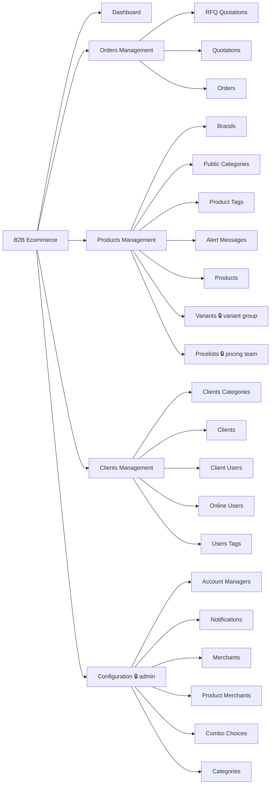
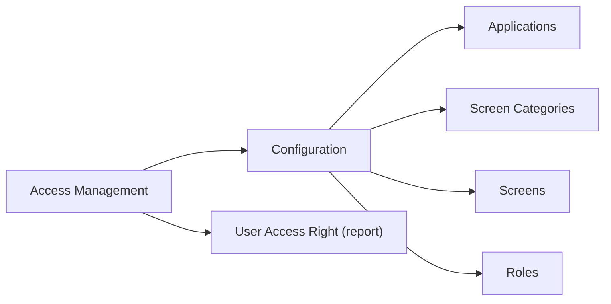
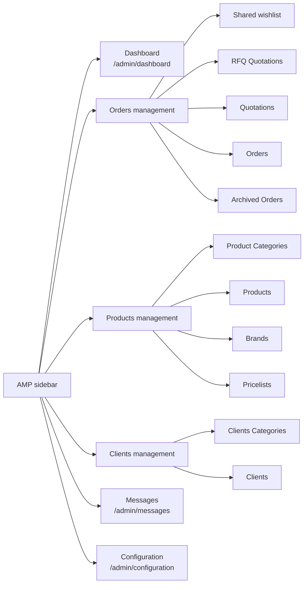
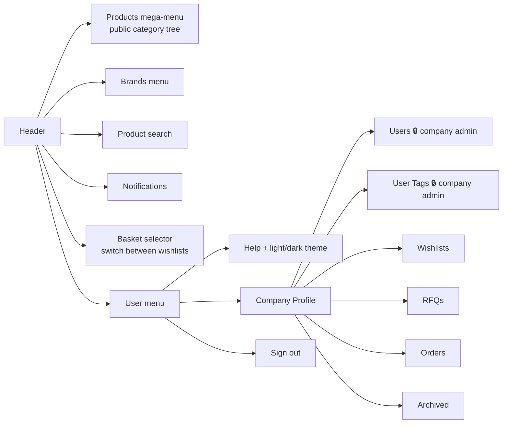
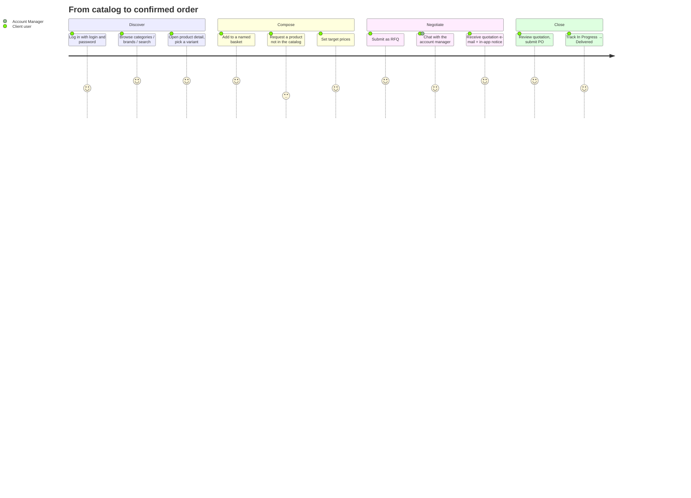
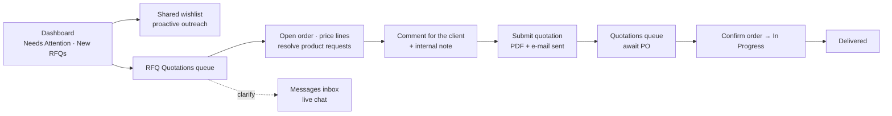
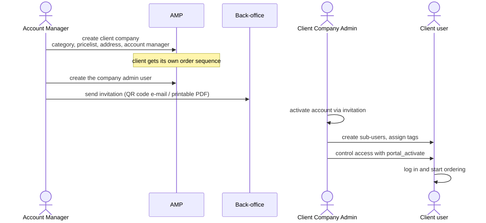
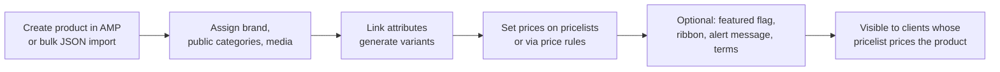

# 011 — Navigation and User Journeys

Navigation is the fastest way to read a system's business shape. This document reconstructs the
business flow from the menus that are actually rendered.

---

## Odoo Back-Office — "B2B Ecommerce" Application

Root menu visibility: system administrators and the Ecommerce Account Manager group.

| Menu | Group restriction | What it does |
|------|-------------------|--------------|
| Dashboard | — | OWL client action with counters that drill into filtered order lists (Needs Attention, New RFQs, Total RFQs) |
| Orders Management → RFQ Quotations | — | Orders in the RFQ portal states |
| Orders Management → Quotations | — | Orders in the quotation / PO states |
| Orders Management → Orders | — | Confirmed orders (`state = sale`) |
| Products Management → Pricelists | Pricing Team or admin | Pricelist maintenance |
| Products Management → Variants | Product-variant group | Variant list |
| Clients Management → Clients | Account Manager / admin | Two variants of the same menu: an attachment-scoped view for Account Managers, a full-chatter view for admins |
| Configuration | System admin only | Master data and reference lists |
| Import Products | Technical group only | JSON import wizard, deliberately hidden from normal users |

## Odoo Back-Office — "Access Management" Application

Permissions and role assignments are managed **inside** the Screen and Role forms rather than
through their own top-level menus. The *User Access Right* wizard produces an effective-permission
report for a chosen user.

---

## Account Manager Portal (`/admin/*`)

The sidebar is a **static, typed tree** in the frontend. Each leaf carries an AMM screen
reference (`amp.dashboard`, `amp.rfq_quotations`, …). When AMM returns data the tree is filtered
to the permitted screens; a group node disappears when all its children do. When AMM is absent
the full tree renders.

The orders section is ordered to mirror the workflow: unqualified interest (Shared wishlist) →
incoming requests (RFQ Quotations) → issued quotations → confirmed orders → archive.

---

## Client Portal (`/`)

Company Profile is a single route with a `?page=` parameter driving a left navigation. The
**Users** and **User Tags** tabs are visible only to company admins; a standard user landing on
them is redirected to Orders. Unguarded auxiliary pages: `/help` and `/release-notes`.

The header basket selector is the key storefront affordance — a customer keeps several named
baskets in parallel and switches the active one without leaving the catalog.

---

## Screen ↔ Navigation Mapping

| AMM application | Screens in the catalogue | Rendered by |
|-----------------|--------------------------|-------------|
| `amp` | dashboard, shared_wishlist, rfq_quotations, quotations, orders, archived_orders, product_categories, products, brands, pricelists, pricelist_items, client_categories, clients, client_users, user_tags, messages | AMP sidebar tree |
| `client` | home, products, orders, company_profile, company_users, user_tags, help | Client header + company-profile tabs |

`pricelist_items`, `client_users` and `user_tags` (amp) exist in the catalogue for permission
purposes but have no dedicated sidebar entry — they are reached from within their parent screen
or from the Client Portal.

---

## User Journeys

### Journey 1 — Client user places an order

### Journey 2 — Account Manager works the queue

### Journey 3 — Onboarding a new client company

### Journey 4 — Product goes live in the catalog

Product visibility is a **pricing consequence**, not a separate publish switch: the catalog is
filtered by what the requesting company's pricelist can price.
