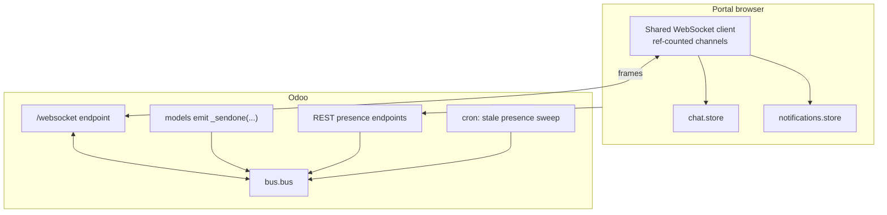
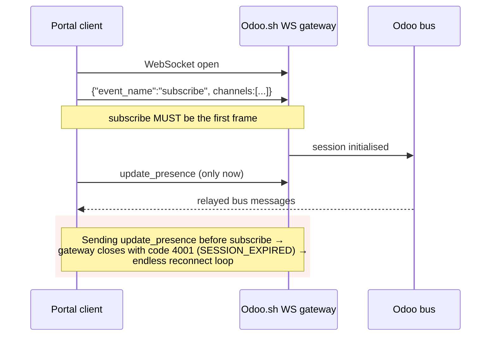
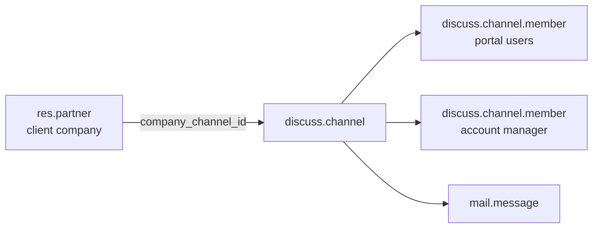
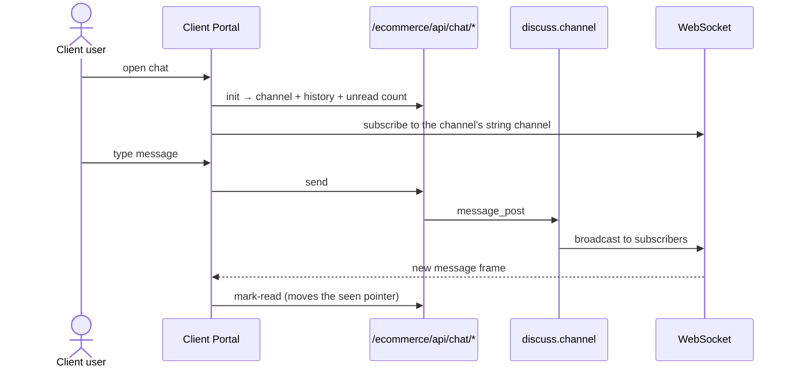
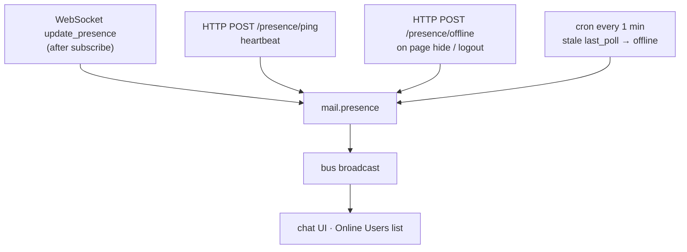
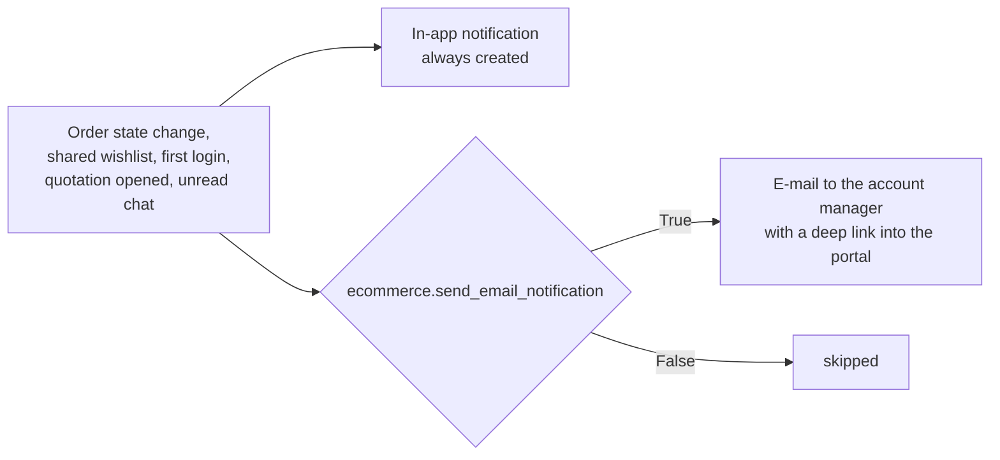
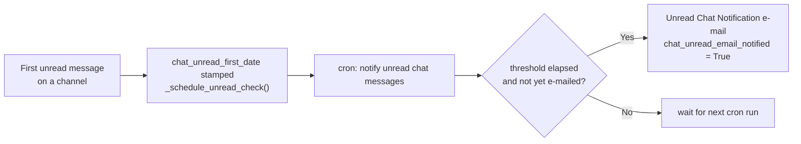

# 012 — Real-Time and Messaging

Four related capabilities share one transport: **live chat**, **presence**, **in-app
notifications**, and **back-office list auto-refresh**.

---

## Transport Overview

One socket per browser tab. Channels are subscribed with reference counting so chat and
notifications coexist without duplicate connections.

### Connection protocol — the non-obvious constraint

The client enforces this by running `syncSubscription()` on connect *before* any other
handler fires.

---

## Live Chat

### Structure

Each client company owns one channel, created on demand. Portal users of that company and the
company's account manager are members.

### Client-side flow

### Account-manager inbox

The AMP inbox lists one thread per **managed** client company — derived from
`account_manager_user_id`, so an account manager only ever sees their own clients. Each row
carries the last message, an unread count and the counterpart's presence. Threads support init,
send and mark-read.

### Why messages are mirrored

Odoo normally broadcasts new channel messages on a *record* channel. The Odoo.sh WebSocket
gateway only relays **literal string** channels to non-Odoo-web-client sockets, so record
channels never reach the Next.js portals there. The channel model therefore mirrors every new
message onto a string channel keyed by the channel UUID, which both portals subscribe to.

> Consequence: on-premises deployments receive each message twice (record channel plus mirror).
> Clients deduplicate by message id. Do not "fix" the duplicate by removing the mirror.

### Unread counting

Unread is computed from the member's *seen pointer*: messages newer than the last seen message,
excluding the member's own messages and system notifications. A member who has never opened the
channel only counts messages posted after they joined — so a new joiner does not see the entire
history reported as unread.

---

## Presence

Presence has **three** inputs because no single one is reliable on Odoo.sh:

| Problem | Handling |
|---------|----------|
| Gateway swallows socket-close events | Explicit HTTP `offline` call on page hide and at logout |
| Browser crash — no close, no offline call | 1-minute cron flips presences whose heartbeat went stale |
| Heartbeat writes would spam the bus | Broadcast only on an actual status *transition*, not on every ping |
| Page refresh produces a false "user came online" alert | Online alerts are suppressed when the offline gap is shorter than a short threshold; a genuine return from away always exceeds the disconnection timer |

Statuses: `online` / `away` / `offline`. Surfaced in both chat UIs and in the back-office
**Clients Management → Online Users** list.

---

## In-App Notifications

| Aspect | Detail |
|--------|--------|
| Model | `ecommerce.notification` |
| Types | `user_login`, `order_update`, `message`, `user_activation` |
| Scope | `portal_company_partner_id` — a notification belongs to one client company |
| Self-exclusion | `owner_user_id` records the actor, who is excluded from receiving their own notification |
| Delivery | Created server-side, pushed over the bus, rendered in the portal header dropdown |
| Read tracking | `is_seen`, with mark-one-seen and mark-all-seen endpoints |
| Administration | Back-office list under Configuration → Notifications |

No new type was added for the newer triggers below — they reuse `user_login` and `order_update`.

**`user_login` also fires for:**
- A portal user's first-ever successful sign-in, notifying their account manager.
- Any internal (non-portal) user signing in — a general "who's active" signal for account
  managers, not tied to a specific client company.

**`order_update` also fires for:** an account manager opening or downloading the client-facing
quotation PDF for an order — surfaced as an in-app notification and, if enabled, an e-mail to
the account manager responsible for that order.

### Notification vs. e-mail

E-mail fires on `rfq_submitted`, `rfq_updated`, `po_submitted`, shared wishlists, a client's
first portal login, a client opening/downloading their quotation, and a chat thread going
unread past a threshold — and, for the order-lifecycle triggers, only when the actor is a portal
user. Account managers are also copied on portal-invitation e-mails, and can separately e-mail a
quotation to internal staff for review (one e-mail, all recipients cc'd, product requests
listed inline). The deep link is built from `ecommerce.shop_portal_url`, falling back to the
client's own `shop_portal_url`, with a state-specific route (`rfqs` / `quotations`).

### Unread-Chat E-mail

A chat thread left unread too long escalates to e-mail, independently of the order-lifecycle
notifications above:

Reading the channel, or the e-mail already having fired, resets the streak so the same run of
unread messages never triggers a second e-mail.

---

## Order Chatter

Distinct from live chat: a persistent, per-order comment thread built on `mail.message`.

| Capability | Detail |
|------------|--------|
| Read / post / update | Portal users and account managers on the same order thread |
| Attachments | Upload and delete; only the uploader may delete their own file |
| Access control | Validated against the *order's* company, not against the message |
| Provenance | Attachments record `upload_from_portal`, the creating portal user and the company |
| Visibility | `attachment_view` selector controls where an attachment surfaces |
| Counters | The order carries `portal_messages_count` and an attachment count, both shown in the back-office |
| Live refresh | `_broadcast_chatter_event()` pushes `chatter/new_message`, `chatter/update_message`, `chatter/attachment_upload` and `chatter/attachment_delete` over the bus on a `chatter_{model}_{id}` channel, so an open thread updates without a manual reload |

An attachment uploaded through chat (e.g. a purchase order) is now fully created and linked onto
its message *before* the post completes, so it appears attached to that message immediately
instead of showing up as a separate message until the next refresh.

---

## Back-Office Auto-Refresh

Orders inherit an abstract model that publishes a bus message on every create, write and
unlink. Open back-office list views refresh live without a manual reload.

> This depends on a separate `lp_auto_refresh` module being installed for the client-side
> listener. Without it the broadcasts are emitted and simply ignored — nothing breaks, lists
> just do not refresh by themselves.

---

## Operational Notes

| Symptom | Likely cause |
|---------|--------------|
| Endless WebSocket reconnect, close code 4001 | A frame was sent before `subscribe` |
| Chat works on-prem but not on Odoo.sh | Relying on a record channel instead of the string-channel mirror |
| A user shows online forever | Presence heartbeat stopped and the stale-presence cron is disabled |
| Duplicate chat messages on-prem | Expected — deduplicate by message id |
| Account manager receives no e-mail | `ecommerce.send_email_notification` is off, the account manager has no e-mail, or the mail template is missing |
