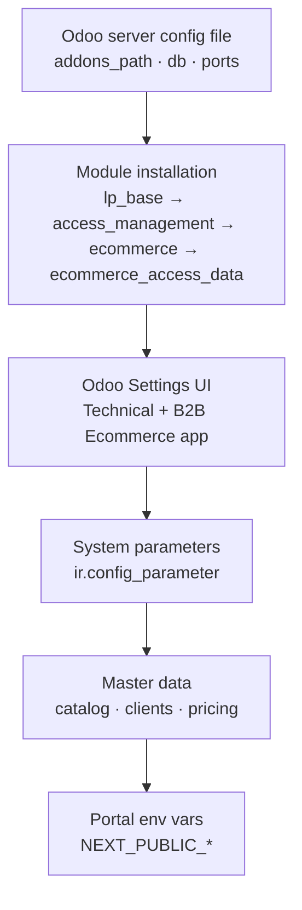
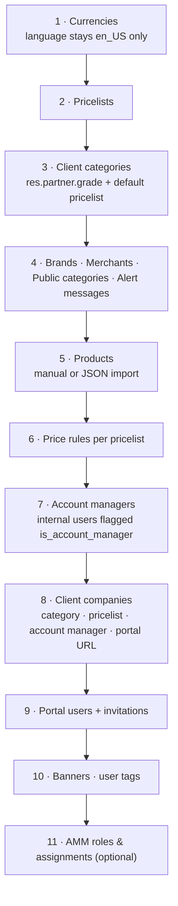

# 013 — Master Data and Configuration

What has to exist and be set before the platform is usable, and where each setting lives.

---

## Configuration Surfaces

---

## 1 · Odoo Server Configuration

Standard Odoo `.conf` file. The only platform-specific requirement is that the addons path
includes the `addons_lp_ecommerce` checkout alongside the Odoo core and enterprise paths.
Database, ports, admin password, `wkhtmltopdf` and `pg_path` are conventional.

On Odoo.sh these values are managed by the platform; the local `config/ecommerce19.conf` in the
working tree is a developer convenience only.

## 2 · Module Installation Order

| Order | Module | Note |
|-------|--------|------|
| 1 | `lp_base` | No dependencies beyond `base` |
| 2 | `access_management` | Requires `lp_base` |
| 3 | `ecommerce` | Requires `lp_base` plus the standard Odoo apps listed in [004](004-Odoo-Modules.md) |
| 4 | `ecommerce_access_data` | Optional; loads the AMM catalogue. Without it the portals run in OPEN permission mode |

**External Python package:** `qrcode` must be available to the Odoo process, otherwise user
invitation QR generation fails.

## 3 · SMTP / Outgoing Mail

The module ships **no SMTP configuration of its own** — it relies entirely on Odoo's standard
outgoing mail server. Configure it in **Settings → Technical → Email → Outgoing Mail Servers**.

| Requirement | Why |
|-------------|-----|
| A working outgoing mail server | Password-reset codes, user invitations, quotation delivery and account-manager alerts all depend on it |
| A correct `web.base.url` | Odoo builds absolute links (images, report URLs) from it |
| Account managers must have an e-mail address | State-change alerts are skipped silently when the account manager has no e-mail |
| Portal users must have an e-mail address | Password reset and invitation flows require it (error `5129` otherwise) |

### Mail templates shipped

| Template | Trigger |
|----------|---------|
| *User Login OTP* | The password-reset code endpoint (name is historical — it is not a login mail) |
| *User Invitation QR Code Email* | Sending an invitation to a portal user |
| *Ecommerce: Portal Quotation* | Transition to `quotation_submitted` |
| *Ecommerce: Account Manager Order State Change* | RFQ submitted / RFQ updated / PO submitted / wishlist shared |

## 4 · Module Settings (Settings → B2B Ecommerce)

| Setting | System parameter | Purpose |
|---------|------------------|---------|
| Shop Portal URL | `ecommerce.shop_portal_url` | Default portal base URL used to build deep links in e-mails; falls back per client to `res.partner.shop_portal_url` |
| Send Email Notification | `ecommerce.send_email_notification` | Master switch for account-manager e-mail alerts. In-app notifications are unaffected. Default `True` |

## 5 · System Parameters (Settings → Technical → System Parameters)

| Key | Default | Effect |
|-----|---------|--------|
| `ecommerce.shop_portal_url` | — | See above |
| `ecommerce.send_email_notification` | `True` | See above |
| `ecommerce.use_encrypted_id` | `false` | Turns external ID obfuscation on. **Changing it invalidates every identifier already held by a client** — coordinate with a portal deploy |
| `base64_id.secret` | built-in numeric default | Salt for the obfuscation. Set a per-environment value; changing it also invalidates existing external IDs |
| `web.base.url` | — | Standard Odoo; used for absolute URLs in mail and reports |

## 6 · Scheduled Jobs

| Job | Interval | Purpose | If disabled |
|-----|----------|---------|-------------|
| *Ecommerce: mark stale chat presences offline* | 1 minute | Flips presences whose heartbeat went stale | Users appear online indefinitely after a crash or a dropped connection |

## 7 · Sequences

| Sequence | Scope |
|----------|-------|
| *Portal Order Basket Sequence* | Template for portal order numbering |
| Per-client sequence (`res.partner.portal_order_sequence_id`) | Each client company gets its own series, assigned at order creation so every customer sees continuous private numbering |

---

## Master Data Setup Order

### Minimum viable data set

| Entity | Minimum | Consequence if missing |
|--------|---------|------------------------|
| Pricelist | ≥ 1 | Catalog returns nothing — visibility is driven by what the company's pricelist can price |
| Client category | ≥ 1 | Clients have no default pricing |
| Public category | ≥ 1 | Storefront mega-menu is empty |
| Product with a price rule | ≥ 1 | Nothing to order |
| Account manager | ≥ 1 | No chat counterpart, no state-change alerts |
| Client company | ≥ 1 | No tenant to log into |
| Portal user | ≥ 1 | No one can use the storefront |

---

## Frontend Environment Variables

Read once by the config singleton; nothing else reads `process.env`.

| Variable | Typical value | Purpose |
|----------|---------------|---------|
| `NEXT_PUBLIC_APP_API_BASE_URL` | `https://staging-b2b-odoo.adv-photonx.com` | Odoo backend base URL. **Also the source of the WebSocket URL** (`http`→`ws` + `/websocket`) |
| `NEXT_PUBLIC_APP_API_TIMEOUT` | `30000` | Axios timeout (ms) |
| `NEXT_PUBLIC_APP_API_RETRY_ATTEMPTS` | `3` | Retry budget |
| `NEXT_PUBLIC_APP_API_RETRY_DELAY` | `1000` | Retry backoff (ms) |
| `NEXT_PUBLIC_APP_AUTO_REFRESH` | `2000` | Polling interval (ms) for views that poll |
| `NEXT_PUBLIC_CHAT_ENABLED` | `true` | Chat feature flag |
| `NEXT_PUBLIC_CHAT_KEEP_ALIVE_INTERVAL` | `25000` | Chat keep-alive ping (ms) |
| `NEXT_PUBLIC_CHAT_MAX_RECONNECT_ATTEMPTS` | `10` | WebSocket reconnect budget |
| `NEXT_PUBLIC_CHAT_RECONNECT_DELAY` | `1000` | Reconnect backoff (ms) |
| `NEXT_PUBLIC_ENABLE_LOGGING` | env-dependent | Client-side logging |
| `NEXT_PUBLIC_ENABLE_MOCK_DATA` | `false` | Mock mode; must be `false` in every deployed environment |
| `NEXT_PUBLIC_APP_NAME` | `B2B SAMTIA` | Display name |
| `NEXT_PUBLIC_APP_VERSION` | `1.2.0` | Release version. **Also the source of the versioned Docker image tag** |
| `NEXT_PUBLIC_DEFAULT_TIMEZONE` | `Africa/Cairo` | Date rendering |

Where these values live depends on the environment:

| Environment | Source of the variables | Applied by |
|-------------|-------------------------|------------|
| **production** | `.env.production` at the repo root | The Cloudflare build, on every push to GitHub `main` |
| staging / pre-prod / training | `docker/<env>/docker-compose.yml` and `.env.<env>` | The manual `build_upload_amd64.sh` run |
| local development | `.env` | `npm run dev` |

All are **build-time** variables baked into the bundle — changing one requires a rebuild, not a
restart. Production values today: API base URL `https://www.samtia.com`, timezone
`Asia/Riyadh`, logging on, mock data off.

> **Timezone note.** The backend assigns `Asia/Riyadh` to any authenticated user whose timezone
> is unset, while the portal default is `Africa/Cairo`. Set both deliberately per environment
> rather than relying on the defaults.

### Next.js image whitelist

`next.config` whitelists the hosts allowed to serve `next/image` sources. **Every new Odoo host
must be added there** or product and banner images silently fail to render.

---

## Configuration Checklist for a New Environment

- [ ] Modules installed in dependency order; `qrcode` available
- [ ] Outgoing mail server configured and test-sent
- [ ] `web.base.url` set to the environment's Odoo URL
- [ ] `ecommerce.shop_portal_url` set to the environment's **portal** URL
- [ ] `ecommerce.send_email_notification` set intentionally (usually off outside production)
- [ ] `ecommerce.use_encrypted_id` and `base64_id.secret` decided per environment
- [ ] Stale-presence cron active
- [ ] Master data loaded (see the setup order above)
- [ ] Portal env file — `docker/<env>/` for staging/training, `.env.production` for the Cloudflare build: API base URL, version, mock data off
- [ ] Odoo host added to the Next.js image whitelist
- [ ] CORS verified end to end (a preflight to a portal endpoint returns 204 with the origin echoed)
