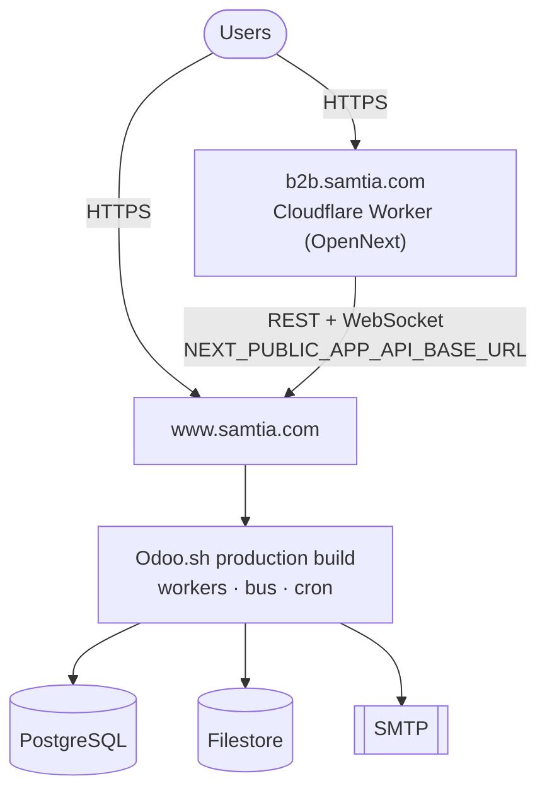
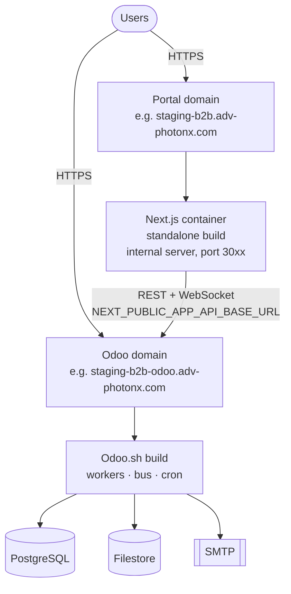
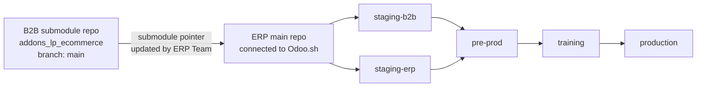
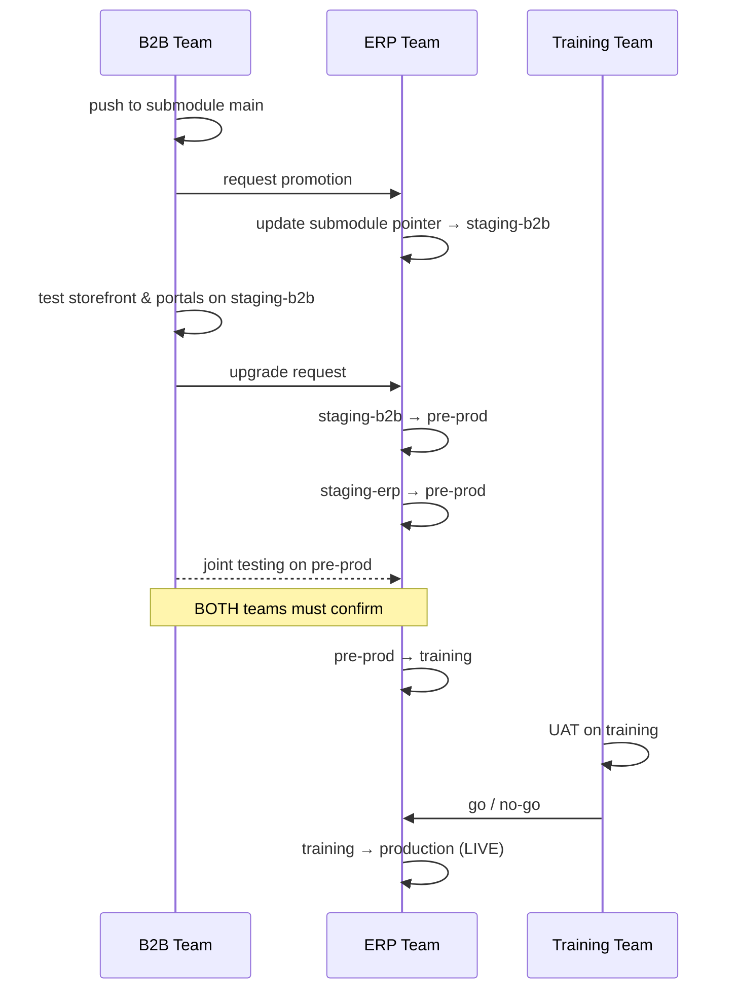
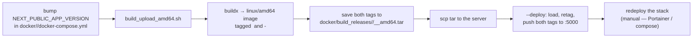
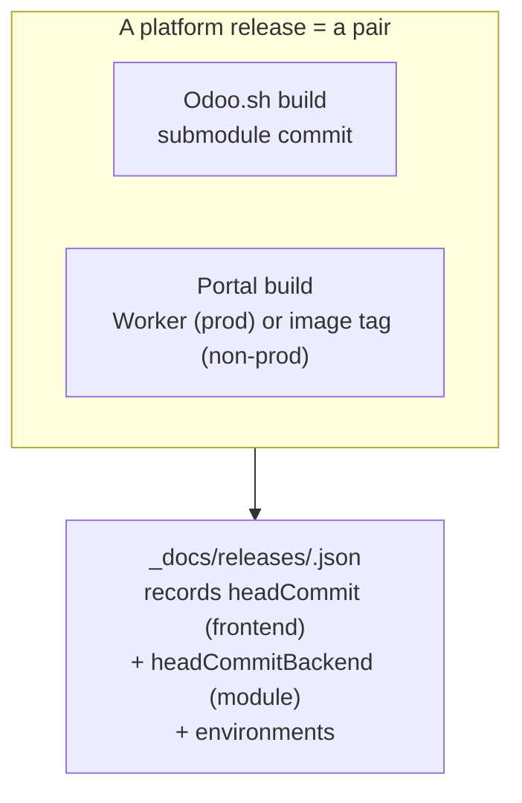
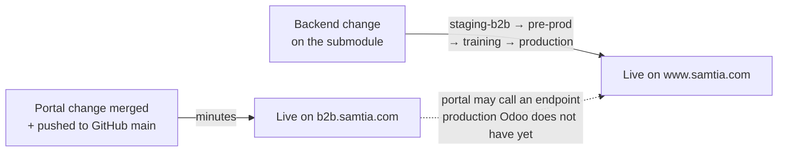

# 014 — Deployment Architecture

The platform deploys through **three pipelines**:

| # | Pipeline                             | Delivers                                                              | Trigger                                     |
| - | ------------------------------------ | --------------------------------------------------------------------- | ------------------------------------------- |
| 1 | **Odoo.sh**                    | The Odoo backend, all five environments                               | ERP Team merges between branches            |
| 2 | **Cloudflare Workers**         | The **production** portal at `b2b.samtia.com`                | Automatic — a push to`main` on GitHub    |
| 3 | **Docker → private registry** | The four internal portal environments (staging / pre-prod / training) | Manual — a developer runs the build script |

Only pipeline 2 is continuous. Pipelines 1 and 3 are deliberately gated by a human.

---

## Runtime Topology

### Production

### Non-production (staging / pre-prod / training)

The portal is stateless in both shapes — session state lives in the Odoo cookie and in the
browser — so the runtime can be a Worker or a container with no other change. Everything
environment-specific arrives through `NEXT_PUBLIC_*` build-time variables.

---

## Backend Pipeline — Odoo.sh

### Repository relationship

**Golden rule:** code flows one way only —
`staging-b2b / staging-erp → pre-prod → training → production`.
**All merges on Odoo.sh are performed exclusively by the ERP Team.** The B2B team never pushes
to an Odoo.sh branch.

### Environments

| Branch          | Purpose                               | Storefront portal                | Odoo back-office                           |
| --------------- | ------------------------------------- | -------------------------------- | ------------------------------------------ |
| `staging-b2b` | Validate B2B submodule changes        | `staging-b2b.adv-photonx.com`  | `staging-b2b-odoo.adv-photonx.com`       |
| `staging-erp` | Validate ERP / back-office changes    | — (back-office only)            | `<staging-erp-build>.dev.odoo.com` |
| `pre-prod`    | Integrate both streams; joint testing | `pre-prod.adv-photonx.com`     | `pre-prod-odoo.adv-photonx.com`          |
| `training`    | UAT and end-user training             | `training-b2b.adv-photonx.com` | `training-b2b-odoo.adv-photonx.com`      |
| `production`  | Live                                  | `b2b.samtia.com`               | `www.samtia.com`                         |

Production runs on its own `samtia.com` domain pair; every non-production environment uses an
`adv-photonx.com` sub-domain. `staging-erp` has no portal and is still reached at its raw
Odoo.sh build URL.

### Release sequence

### Guardrails

| Rule                         | Meaning                                                                                      |
| ---------------------------- | -------------------------------------------------------------------------------------------- |
| One-way syncing              | Never merge backwards. A fix restarts from the source repo.                                  |
| Single merge authority       | Only the ERP Team merges or moves submodule pointers.                                        |
| Test-then-promote            | A branch is promoted only after the responsible team confirms and raises an upgrade request. |
| Isolation before integration | The B2B and ERP streams meet for the first time in`pre-prod` — never earlier.             |
| Protected production         | Production receives code only from`training`.                                              |

### Team responsibilities

| Team           | Owns                                                                      | Environments                                                |
| -------------- | ------------------------------------------------------------------------- | ----------------------------------------------------------- |
| B2B E-commerce | Submodule development, storefront & portal testing, upgrade requests      | `staging-b2b`, `pre-prod`                               |
| ERP            | ERP repo, Odoo.sh,**all** merges and submodule updates, deployments | `staging-erp`, `pre-prod`, `training`, `production` |
| Training       | UAT, business-scenario validation, final go/no-go                         | `training`                                                |

---

## Production Portal Pipeline — Cloudflare Workers (CI/CD)

The live portal is continuously deployed. There is no manual build step and no image artefact.

```mermaid
flowchart LR
    DEV["Developer merges<br/>to main"] --> GH["GitHub<br/>LaplaceSoftware/next_ecommerce"]
    GH -->|"push webhook"| CFB["Cloudflare Workers Build"]
    CFB --> P1["prebuild → release-history.json"]
    P1 --> P2["opennextjs-cloudflare build<br/>Next.js → .open-next/"]
    P2 --> P3["upload worker + static assets"]
    P3 --> LIVE["b2b.samtia.com<br/>Worker 'next-ecommerce'"]
    LIVE -->|"REST + WebSocket"| ODOO["www.samtia.com"]
```

| Aspect          | Detail                                                                                                                               |
| --------------- | ------------------------------------------------------------------------------------------------------------------------------------ |
| Trigger         | A push to**`main`** on the GitHub remote — every merge redeploys production                                                 |
| Builder         | Cloudflare Workers Builds (Cloudflare's own git integration; the repo contains**no** GitHub Actions workflow)                  |
| Adapter         | `@opennextjs/cloudflare` — `npm run build:cloudflare` runs `opennextjs-cloudflare build`                                      |
| Worker          | Named`next-ecommerce`, entry `.open-next/worker.js`, static assets bound as `ASSETS` from `.open-next/assets`                |
| Runtime flags   | `nodejs_compat`, plus a `WORKER_SELF_REFERENCE` service binding back to itself                                                   |
| Configuration   | `wrangler.jsonc` and `open-next.config.ts` at the repo root                                                                      |
| Build variables | `.env.production` — API base URL `https://www.samtia.com`, `NEXT_PUBLIC_APP_VERSION`, timezone `Asia/Riyadh`, mock data off |
| Local rehearsal | `npm run preview:cloudflare` builds and serves the Worker locally before merging                                                   |

### Two remotes, two roles

| Remote     | Address                                                       | Role                                                            |
| ---------- | ------------------------------------------------------------- | --------------------------------------------------------------- |
| `github` | `LaplaceSoftware/next_ecommerce`                            | **Deployment trigger.** Cloudflare watches `main` here  |
| `origin` | Azure DevOps`laplace-software/B2B_Ecommerce/next_ecommerce` | **Code review.** Pull requests are raised and merged here |

**The consequence is the single most important operational fact about the portal:** merging a
PR on Azure DevOps does not deploy anything. Production goes live only when `main` is pushed to
the GitHub remote, and it does so immediately, without review or approval gate. Push to GitHub
`main` deliberately, and only after the change has passed the staging environments below.

---

## Non-Production Portal Pipeline — Docker

The four internal environments still build and publish images by hand. They are not connected
to Cloudflare.

### Environments

| Env          | Folder                   | Internal URL          | Public sub-domain                | Odoo API                              | Image tag        |
| ------------ | ------------------------ | --------------------- | -------------------------------- | ------------------------------------- | ---------------- |
| training     | `docker/training/`     | `<build-server>:3080` | —                               | `b2b-training-odoo.adv-photonx.com` | `training`     |
| pre-prod     | `docker/pre-prod/`     | `<build-server>:3081` | `pre-prod.adv-photonx.com`     | `pre-prod-odoo.adv-photonx.com`     | `pre-prod`     |
| staging-b2b  | `docker/staging-b2b/`  | `<build-server>:3082` | `staging-b2b.adv-photonx.com`  | `staging-b2b-odoo.adv-photonx.com`  | `staging-b2b`  |
| training-b2b | `docker/training-b2b/` | `<build-server>:3083` | `training-b2b.adv-photonx.com` | `training-b2b-odoo.adv-photonx.com` | `training-b2b` |

Each environment folder is self-contained: its own `.env.<env>`, `Dockerfile`,
`docker-compose.yml`, `build_upload_amd64.sh` and gitignored SSH defaults. All four push to the
same private registry on the server (`<registry-host>:5000/next-ecommerce-portal:<tag>`).

> The repo-root `Dockerfile`, `Dockerfile.dev` and `docker-compose.yml` are for local
> development and manual production runs — they are **not** part of this pipeline.

### Build and publish

Two tags per build:

| Tag                                       | Role                                                                             |
| ----------------------------------------- | -------------------------------------------------------------------------------- |
| `next-ecommerce-portal:<env>`           | Floating tag the running stack pulls; unchanged by version bumps                 |
| `next-ecommerce-portal:<env>-<version>` | Permanent versioned tag, read automatically from that environment's compose file |

Local tars are kept per version under `docker/build_releases/<env>/`, so earlier release
artefacts are never overwritten and a previous build can be re-deployed with `--no-build`.

**The script does not restart the running container.** Redeploying the stack is a separate,
deliberate step.

### Build-time behaviour

- `prebuild` / `prebuild:docker` regenerate `public/release-history.json` from the per-release
  JSON files, projecting only `{version, date, highlights}`. This runs in **both** pipelines,
  so `/release-notes` is correct on Cloudflare and in the containers alike.
- The Dockerfile produces a Next.js **standalone** output; the Cloudflare path produces an
  OpenNext Worker bundle instead.
- The admin layout forces dynamic rendering so neither build attempts to statically generate
  session-dependent admin pages.

---

## Coordinating the Pipelines

Because the halves version independently, the portal's release file is the record that ties
them together. When a change spans both, deploy the **backend first** — the portal tolerates
unknown backend fields far better than the reverse.

### The ordering risk introduced by CI/CD

Production is now the *fastest* path in the platform while its backend counterpart is the
*slowest* — Odoo.sh production is reached only after staging, integration and UAT, and every
merge is performed by the ERP Team.

**Rule:** never push a portal change to GitHub `main` while it depends on a backend change that
has not yet reached Odoo.sh `production`. The Cloudflare pipeline has no gate that will catch
this for you.

### Environment name mapping (a known trap)

| Odoo.sh branch  | Portal env folder                                           | Note                                                                                                                                   |
| --------------- | ----------------------------------------------------------- | -------------------------------------------------------------------------------------------------------------------------------------- |
| `staging-b2b` | `docker/staging-b2b/`                                     | aligned                                                                                                                                |
| `pre-prod`    | `docker/pre-prod/`                                        | aligned                                                                                                                                |
| `training`    | `docker/training-b2b/` **and** `docker/training/` | two portal environments point at different Odoo hosts; check`NEXT_PUBLIC_APP_API_BASE_URL` before deploying                          |
| `production`  | none — no`docker/production/` folder exists              | The live portal at`b2b.samtia.com` is a Cloudflare Worker, deployed by CI/CD from GitHub `main`, configured by `.env.production` |
| `staging-erp` | —                                                          | back-office only, no portal                                                                                                            |

---

## Deployment Checklist

**Backend**

- [ ] Change merged to the submodule `main`
- [ ] ERP Team updated the pointer on `staging-b2b`
- [ ] Module upgrade completed on the build (new models/fields applied)
- [ ] Post-deploy configuration verified (see [013](013-Master-Data-and-Configuration.md#configuration-checklist-for-a-new-environment))

**Frontend — non-production (Docker, manual)**

- [ ] `NEXT_PUBLIC_APP_VERSION` bumped in the target `docker/<env>/docker-compose.yml`
- [ ] `_docs/releases/<version>.json` written, with both head commits and business-facing highlights
- [ ] `build_upload_amd64.sh --deploy` run for each target environment
- [ ] Stack redeployed and the running version confirmed
- [ ] `/release-notes` shows the new entry

**Frontend — production (Cloudflare, automatic)**

- [ ] The change has been validated on `staging-b2b` and `pre-prod`
- [ ] Any backend change it depends on has already reached Odoo.sh `production`
- [ ] `NEXT_PUBLIC_APP_VERSION` bumped in `.env.production`
- [ ] `npm run preview:cloudflare` run locally — the Worker build differs from the container build
- [ ] Push `main` to the **GitHub** remote — this is the deploy action
- [ ] Cloudflare build succeeded; `b2b.samtia.com` serves the new version and `/release-notes` shows it

---

## A Note on Redacted Values

This is the public copy of the documentation. Internal host addresses appear as placeholders:

| Placeholder | What it stands for |
|-------------|--------------------|
| `<build-server>` | The internal build/host server address |
| `<registry-host>` | The private Docker registry address |
| `<staging-erp-build>` | The `staging-erp` Odoo.sh build identifier |

The real values are held in the internal copy of these documents and in each environment's
configuration. Ask the ERP team if you need them.
