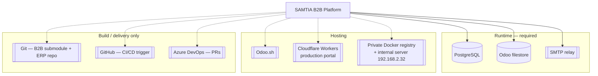

# 015 — External Integrations and System Dependencies

## Integration Landscape

**There are no inbound third-party integrations.** No payment gateway, no ERP-to-ERP feed, no
shipping carrier, no analytics SDK, no external identity provider. The platform is
self-contained: Odoo is the system of record, and the portal is its only client.

The single outbound runtime dependency is **SMTP**.

---

## Runtime Dependencies

| Dependency | Criticality | Used for | Failure impact |
|------------|-------------|----------|----------------|
| PostgreSQL | Fatal | All persistence | Platform down |
| Cloudflare Workers | Fatal (production only) | Serves the live portal at `b2b.samtia.com` | The production storefront and AMP are unreachable; the Odoo back-office and the non-production portals are unaffected |
| Odoo filestore | Fatal | Product media, attachments, generated PDFs | Images and documents fail; orders still work |
| SMTP relay | High | Password-reset codes, invitations, quotation delivery, account-manager alerts | Self-service password reset and invitations stop working; quotations are still created but not delivered by e-mail |
| Odoo bus / WebSocket endpoint | Medium | Chat, presence, live notifications | Real-time features degrade; REST paths are unaffected |

---

## Platform Dependencies

| Dependency | Version / detail | Notes |
|------------|------------------|-------|
| Odoo | 19.0 | Community modules only in the dependency list |
| Python package `qrcode` | — | Declared as an external dependency; required for invitation QR generation |
| `wkhtmltopdf` | — | Standard Odoo requirement for the quotation and invitation PDFs |
| Node.js | Next.js 15 / React 19 toolchain | Build-time |
| Docker + buildx | `linux/amd64` target | Portal builds run from Apple Silicon via buildx |

### Odoo modules depended on

`base` · `mail` · `portal` · `product` · `website_sale` · `sale` · `crm` · `contacts` ·
`calendar` · `im_livechat` · `spreadsheet_dashboard` · `partnership`

`partnership` is the least obvious: its `res.partner.grade` model is reused as **Client
Categories**, the platform's client segmentation and default-pricing dimension.

### Optional companion module

`lp_auto_refresh` — not a declared dependency. Without it the back-office auto-refresh bus
messages are emitted and ignored; lists simply do not refresh on their own.

---

## Frontend Third-Party Libraries (production bundle)

| Library | Purpose |
|---------|---------|
| Next.js 15 / React 19 | Application framework |
| Zustand | State management |
| Axios | HTTP client |
| PrimeReact + PrimeIcons | Data tables, menus, icons |
| Radix UI | Accessible primitives (dialog, select, dropdown, checkbox, radio, tooltip, label) |
| Tailwind CSS 4 | Styling |
| TanStack React Query | Async data utilities |
| Framer Motion | Animation |
| Konva / react-konva / use-image | Canvas-based image handling |
| Quill | Rich-text editing |
| XLSX | Spreadsheet export |
| Zod | Schema validation |
| date-fns | Date handling |
| react-i18next | Present as a dependency; the portals ship English only and no translation catalogue is loaded |
| lucide-react / react-icons | Icon sets |

Dev-time only: ESLint, Prettier, Husky, lint-staged, commitlint, Vitest, Playwright,
Storybook, Wrangler, OpenNext.

---

## Delivery-Time Dependencies

| Dependency | Role |
|------------|------|
| Git submodule relationship | The B2B module reaches Odoo.sh only through the ERP main repo |
| Odoo.sh | Builds, hosts and runs all five backend environments |
| **Cloudflare Workers** (OpenNext + Wrangler) | **Hosts and continuously deploys the production portal** at `b2b.samtia.com`. A runtime dependency, not just a build tool |
| **GitHub** (`LaplaceSoftware/next_ecommerce`) | The CI/CD trigger — a push to `main` rebuilds and redeploys production |
| Azure DevOps | Pull requests for both repos (no CLI integration — PR links are shared manually) |
| Private Docker registry on `192.168.2.32` | Serves portal images to the four non-production stacks |

---

## Dependency Risk Register

| Risk | Exposure | Mitigation in place |
|------|----------|---------------------|
| Odoo.sh WebSocket gateway behaviour | Chat, presence and notifications break in ways that do not reproduce on-premises | Subscribe-first protocol, string-channel message mirroring, HTTP presence heartbeat, stale-presence cron |
| SMTP outage | Self-service password reset and invitations blocked | Login itself is unaffected; an administrator can reset a password from the back-office |
| Odoo major-version upgrade | Deep inheritance of `sale.order`, `mail.message`, `discuss.channel`, `mail.presence` | Customisations are concentrated in a small number of models; the API envelope insulates the portal from ORM changes |
| `partnership` module changes | Client categories and default pricing depend on it | Isolated to `res.partner.grade` usage |
| Two independently versioned halves | A portal build can outrun its backend | Release files record both head commits; deploy backend first |
| Ungated production CI/CD | A push to GitHub `main` reaches live customers within minutes, with no approval step, while the matching backend change still has three Odoo.sh promotions to clear | Process only — validate on `staging-b2b` / `pre-prod` and confirm the backend has reached Odoo.sh `production` **before** pushing. Nothing in the pipeline enforces this |
| Two git remotes with different roles | Merging on Azure DevOps does not deploy; pushing to GitHub does | Documented in [014](014-Deployment-Architecture.md#two-remotes-two-roles); no technical safeguard |
| Single shared database | A tenancy bug is a cross-customer data exposure | Mandatory company scoping in every API method (see [007](007-Authentication-and-Authorization.md#4--multi-tenant-isolation)) |
