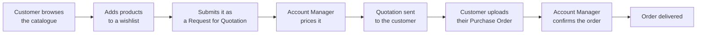

# SAMTIA B2B Platform — User Guide

Welcome. This guide explains how to use the SAMTIA B2B platform day to day. It is written for
business users — no technical knowledge is needed.

**Who this guide is for:** Account Managers · Sales Representatives · Customer Service ·
Client Users · Business Administrators · New Employees.

---

## Which portal do I use?

The platform has two websites that look and behave differently. Your account decides which one
you see when you sign in — you cannot switch between them.

| You are… | You use | You land on |
|----------|---------|-------------|
| A customer buying from SAMTIA | **Client Portal** | The Home page |
| A SAMTIA employee serving customers | **Account Manager Portal (AMP)** | The Dashboard |

---

## Index

| # | Document | Read it if you want to… |
|---|----------|------------------------|
| 001 | [Getting Started](001-Getting-Started.md) | Sign in, reset your password, find your way around |
| 002 | [User Roles and Permissions](002-User-Roles-and-Permissions.md) | Understand who can do what |
| 003 | [Client Portal — Navigation](003-Client-Portal-Navigation.md) | Learn the customer website layout |
| 004 | [Client Portal — Browsing and Wishlists](004-Client-Portal-Browsing-and-Wishlists.md) | Find products and build a wishlist |
| 005 | [Client Portal — Orders](005-Client-Portal-Orders.md) | Submit RFQs, accept quotations, track orders |
| 006 | [Client Portal — Company Management](006-Client-Portal-Company-Management.md) | Manage your colleagues' access and tags |
| 007 | [Account Manager Portal — Navigation](007-Account-Manager-Portal-Navigation.md) | Learn the internal portal layout |
| 008 | [Account Manager Portal — Order Queues](008-Account-Manager-Portal-Order-Queues.md) | Work the wishlist, RFQ, quotation and order lists |
| 009 | [Account Manager Portal — Working an Order](009-Account-Manager-Portal-Working-an-Order.md) | Price a request and issue a quotation |
| 010 | [Account Manager Portal — Product Management](010-Account-Manager-Portal-Product-Management.md) | Maintain the catalogue |
| 011 | [Account Manager Portal — Client Management](011-Account-Manager-Portal-Client-Management.md) | Set up and maintain customer companies |
| 012 | [Account Manager Portal — Pricing](012-Account-Manager-Portal-Pricing.md) | Manage price lists and price rules |
| 013 | [Messages and Notifications](013-Messages-and-Notifications.md) | Chat with the other side and follow alerts |
| 014 | [The Order Lifecycle](014-The-Order-Lifecycle.md) | Understand every status and who acts next |
| 015 | [Common Business Scenarios](015-Common-Business-Scenarios.md) | Follow step-by-step recipes for daily tasks |
| 016 | [Glossary](016-Glossary.md) | Look up a term |

---

## Suggested reading order

**New Client Portal user** → 001 → 003 → 004 → 005 → 013

**New Account Manager** → 001 → 002 → 007 → 014 → 008 → 009 → 013 → 015

**New Business Administrator** → 001 → 002 → 011 → 012 → 010 → 015

---

## How the business works, in one picture

The key thing to understand: **customers do not check out and pay at a published price.** They
ask for a price, an Account Manager quotes it, and only then does the order become real. Every
screen in the platform supports one step of that conversation.

---

## About screenshots

Screenshot placeholders appear throughout this guide in the form:

> 📷 **Screenshot Placeholder**
> File: `images/example.png`
> Description: what the screenshot should show.

Save captured screenshots into the `images/` folder next to this guide, using the file names
given in the placeholders.

---

## A note on what is documented

This guide covers only what you can actually see and use in the live application. Features that
are hidden, incomplete, or not reachable from any menu are not described. Where a menu item
exists but has no content yet, this is stated plainly so you are not left searching for it.
