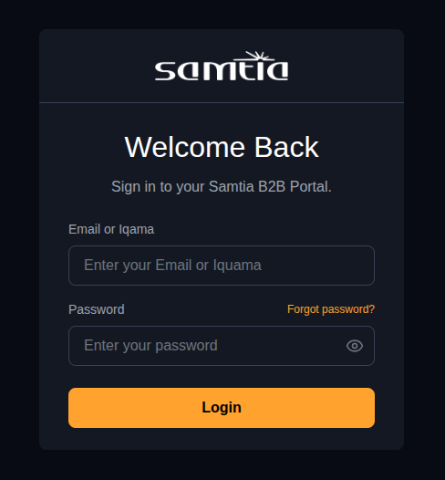
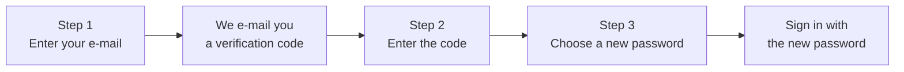
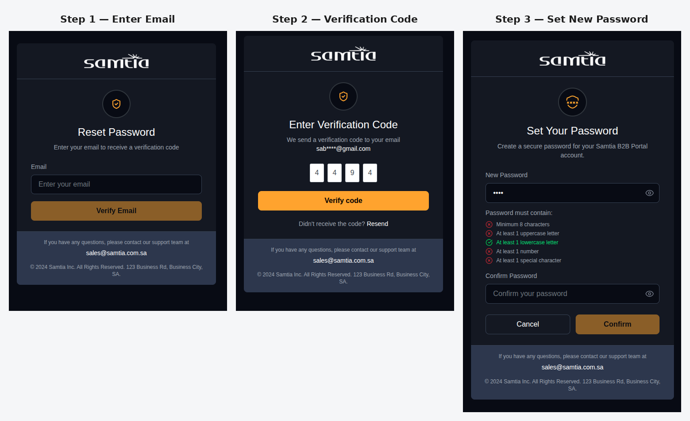
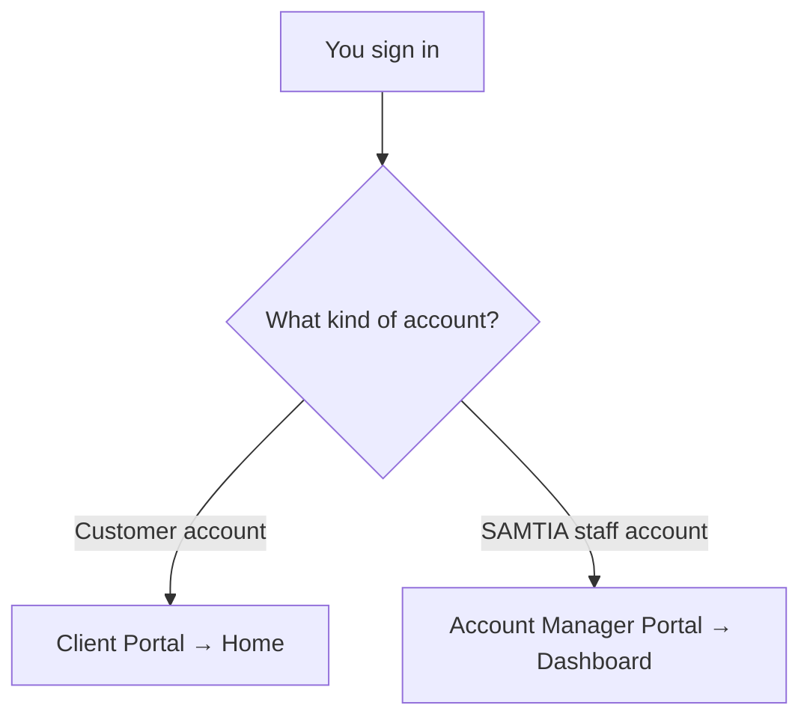

# 001 — Getting Started

## Signing In

**Screen name:** Sign In
**Business purpose:** Verify who you are and open the correct portal for your account.
**Who uses it:** Everyone.
**Navigation path:** Open the portal address in your browser. If you are not signed in, you are
sent here automatically.

### What you enter

| Field | What to type |
|-------|--------------|
| Email or Iqama | Your work e-mail address, **or** the identification number your Account Manager registered for you |
| Password | Your password |

You can sign in with either your e-mail or your identification number — whichever you remember.
Both work.

### Available actions

| Action | What happens |
|--------|--------------|
| **Sign In** | Opens your portal — Home for customers, Dashboard for SAMTIA staff |
| **Forgot password** | Starts the password reset described below |

### Business rules

- Your account must be switched on **by two people** before you can sign in: your Account
  Manager at SAMTIA, and your own company administrator. If either has switched you off, you
  will be told your account is not active.
- If you mistype your e-mail or password, you are told the credentials are invalid. Repeated
  failures are not locked out automatically — contact your Account Manager if you are stuck.
- Password is the only way in. There is no code-based or passwordless sign-in.

---

## Resetting a Forgotten Password

**Screen name:** Reset Password
**Business purpose:** Let you set a new password yourself, without waiting for an administrator.
**Who uses it:** Anyone who has forgotten their password.
**Navigation path:** Sign In → *Forgot password*.

This is a three-step screen. You move forward one step at a time.

| Step | What you do | Notes |
|------|-------------|-------|
| 1 — Email | Type the e-mail address on your account | You can resend the code if it does not arrive |
| 2 — Enter Verification Code | Type the code from the e-mail | Codes expire; request a new one if it has been a while |
| 3 — New Password | Type the new password twice | The screen shows a live checklist and confirms *All password requirements met* |

### Business rules

- The verification code proves you own the e-mail address. **It does not sign you in** — you
  still sign in normally afterwards with your new password.
- If the two password fields do not match, the screen tells you *Passwords do not match* and
  will not let you continue.
- Your account must have an e-mail address on file. If it does not, ask your Account Manager to
  add one.

### Already signed in and want to change your password?

You do not need this screen. Ask your Account Manager, or use your profile options — no code is
required when you are already signed in.

---

## Where You Land After Signing In

You cannot move between the two portals. If you try to open an address belonging to the other
portal, you are returned to your own home page. If a customer reaches an internal page, an
**Access Denied** message is shown.

---

## Signing Out

| Portal | Where to find it |
|--------|------------------|
| Client Portal | Top-right user menu (your name) → **Sign Out** |
| Account Manager Portal | Bottom-left of the sidebar, next to your name → **⋮** → **Sign Out** |

Signing out also marks you offline in chat, so colleagues and customers know you have left.

---

## Light and Dark Mode

Both portals can be shown light or dark. Your choice is remembered on your device.

| Portal | Where to switch |
|--------|-----------------|
| Client Portal | User menu → **Light mode / Dark mode** |
| Account Manager Portal | Sidebar → **⋮** next to your name → **Light mode / Dark mode** |

---

## Getting Help

| Page | What it offers | Who can open it |
|------|----------------|-----------------|
| **Help** | Guidance and support information | Anyone, including before signing in |
| **Release Notes** | A dated list of recent improvements, written in plain language | Anyone, including before signing in |

The Client Portal links to Help from the user menu. Release Notes are grouped into **General**,
**Client Portal** and **Account Manager Portal** so you only need to read the entries that
affect you.

---

## Tips

- **Bookmark your portal address.** Customers and staff use different addresses depending on
  whether you are on the live system or a training environment. If a colleague sends you a link
  that behaves oddly, check you are on the right environment.
- **Your session stays open** as you work, but if it expires you are returned to Sign In with
  your place remembered — sign in again and you will be taken back where you were.
