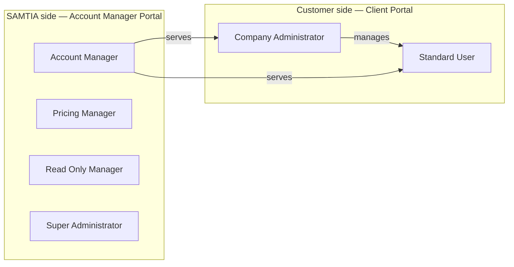
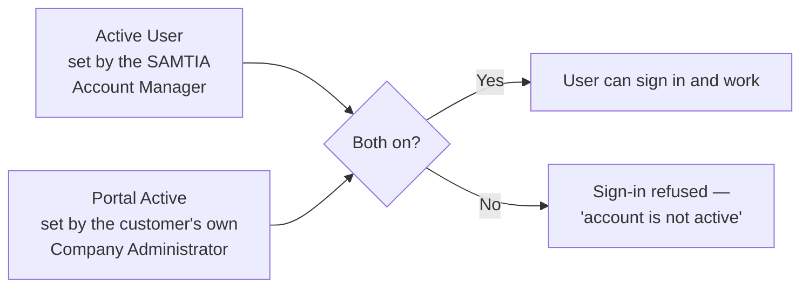

# 002 — User Roles and Permissions

## The Two Sides of the Platform

---

## Customer-Side Roles

### Standard User

The everyday buyer.

| Can do | Cannot do |
|--------|-----------|
| Browse the catalogue and search products | See or manage colleagues' accounts |
| Build and name wishlists | Create or deactivate users |
| Request products that are not in the catalogue | Manage user tags |
| Submit a wishlist as a Request for Quotation | See other companies' orders or prices |
| Review quotations and upload a Purchase Order | |
| Track orders through to delivery | |
| Chat with the Account Manager | |
| Comment and attach files on an order | |

If a Standard User opens the Users or User Tags area, they are redirected to Orders.

### Company Administrator

Everything a Standard User can do, **plus** managing their own company's people.

| Additional ability | Where |
|--------------------|-------|
| Create new portal users for the company | Company Profile → Users |
| Edit user details | Company Profile → Users |
| Activate and deactivate colleagues | Company Profile → Users |
| Delete a user account | Company Profile → Users |
| Create and manage user tags | Company Profile → User Tags |

---

## SAMTIA-Side Roles

| Role | Focus |
|------|-------|
| **Account Manager** | Owns a set of customer companies. Prices requests, issues quotations, confirms orders, chats with customers, maintains the catalogue. |
| **Pricing Manager** | Owns price lists and price rules. |
| **Read Only Manager** | Views everything relevant without changing anything. |
| **Super Administrator** | Full access, including system configuration. |

### Account Managers only see their own clients

This is the single most important rule for internal staff. Every list in the Account Manager
Portal — orders, quotations, chat conversations — shows **only** the customer companies assigned
to you. You will not see another Account Manager's clients, and they will not see yours.

If a customer tells you they submitted a request and you cannot find it, the most likely reason
is that their company is assigned to a different Account Manager.

---

## The Two Switches That Control Customer Access

A customer user can only sign in when **both** switches are on.

| Switch | Controlled by | Business purpose |
|--------|---------------|------------------|
| **Active User** (shown as *Account Manager Approved*) | SAMTIA Account Manager | Lets SAMTIA suspend a customer's access — for example during a commercial dispute. The customer cannot undo this. |
| **Portal Active** (shown as *Active / Inactive*) | The customer's own Company Administrator | Lets the customer manage their own team — a leaver is switched off without involving SAMTIA. |

**In practice:** if a customer says "I switched my colleague back on but they still cannot sign
in", check whether SAMTIA has switched off the *Active User* flag.

---

## Menu Visibility

Some organisations restrict which screens each person sees. When restrictions are in force, a
menu item you are not permitted to use simply does not appear — you will not see a greyed-out
option or an error message.

If a colleague describes a screen you cannot find, ask your administrator whether your role
includes it. Menu differences between two people in the same role are normal and intentional.

---

## What Nobody Can Do

These limits apply to every role and are enforced by the system, not by convention:

- **See another company's data.** All customer information is separated by company. There is no
  view that mixes two customers' orders, prices or users.
- **Delete an order that has left Draft.** Once a wishlist becomes a Request for Quotation it can
  be cancelled or archived, but not deleted.
- **Delete someone else's wishlist.** Only the person who created a wishlist can delete it.
- **Delete a file someone else uploaded.** Only the person who attached a file can remove it.
- **Deactivate or delete your own account.** You cannot lock yourself out.
