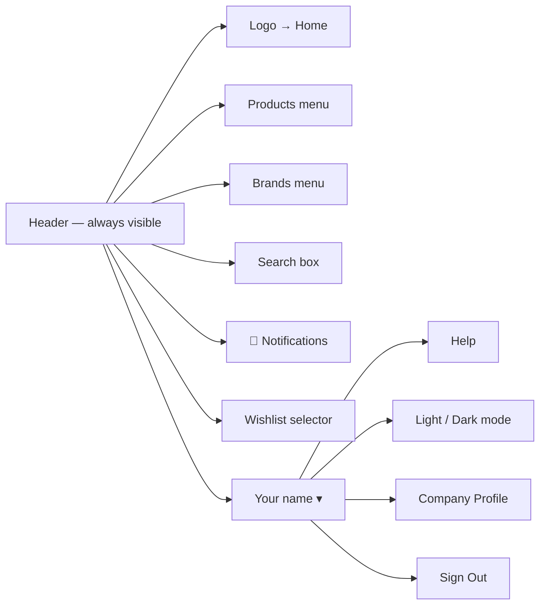
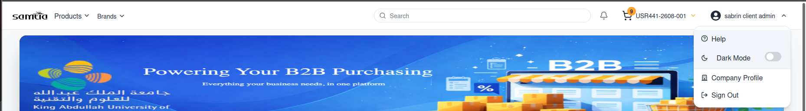
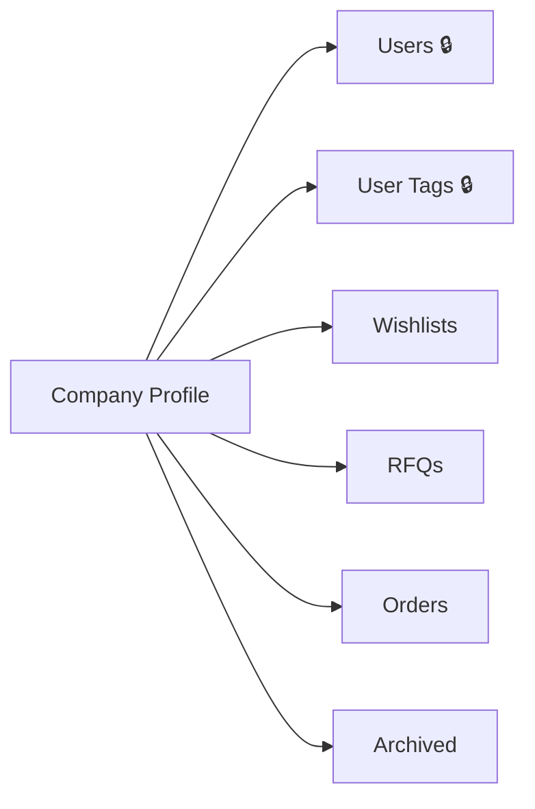

# 003 — Client Portal: Navigation

## The Layout

Every page in the Client Portal has the same header. Learning it once means you can reach
anything from anywhere.

---

## Header Items

| Item | Business purpose | What happens when you use it |
|------|------------------|------------------------------|
| **Logo** | Return to the start | Opens the Home page |
| **Products** | Browse by category | Opens a large menu of product categories; choosing one shows its products |
| **Brands** | Browse by manufacturer | Opens the brand list; choosing one shows that brand's products |
| **Search** | Find a specific product fast | Suggests matching products as you type |
| **🔔 Notifications** | See what changed | Shows recent activity on your company's orders. When there is nothing new it reads *All caught up* |
| **Wishlist selector** | Switch between your baskets | Lists your wishlists so you can pick which one you are adding to. Also offers **New** and **View All** |
| **Your name ▾** | Account and company options | Opens the menu shown above |

---

## The Wishlist Selector — the key habit to learn

You can keep **several wishlists open at the same time** — for example one for a routine restock
and one for a special project. The selector in the header decides which one receives the products
you add.

> **Always check the selector before adding products.** Items go into the wishlist currently
> shown there, not into a single universal basket.

| Option in the selector | What it does |
|------------------------|--------------|
| A wishlist name | Makes that wishlist the active one |
| **New** | Creates a fresh wishlist and makes it active |
| **View All** | Opens Company Profile → Wishlists, showing every wishlist |

If you have not created any yet, the selector reads *No wishlists found*.

---

## Company Profile — your working area

Everything about your own company lives behind one menu item. Choosing **Company Profile** opens
a page with its own side navigation.

🔒 = visible to Company Administrators only.

| Section | What it shows |
|---------|---------------|
| **Users** | Your colleagues' portal accounts |
| **User Tags** | Labels you use to organise those colleagues |
| **Wishlists** | Baskets you are still building — not yet sent to SAMTIA |
| **RFQs** | Requests you have sent, and quotations you have received back |
| **Orders** | Business that is confirmed and in progress |
| **Archived** | Cancelled requests, kept for reference |

The four order sections follow the natural life of a purchase: build it (Wishlists), negotiate it
(RFQs), receive it (Orders), file it away (Archived).

---

## Screen Directory

| Screen | How to reach it | Covered in |
|--------|-----------------|------------|
| Home | Logo, or after sign-in | [004](004-Client-Portal-Browsing-and-Wishlists.md) |
| Products list | Products menu, Brands menu, or search | [004](004-Client-Portal-Browsing-and-Wishlists.md) |
| Product details | Click any product | [004](004-Client-Portal-Browsing-and-Wishlists.md) |
| Wishlists | Company Profile → Wishlists | [005](005-Client-Portal-Orders.md) |
| RFQs | Company Profile → RFQs | [005](005-Client-Portal-Orders.md) |
| Orders | Company Profile → Orders | [005](005-Client-Portal-Orders.md) |
| Archived | Company Profile → Archived | [005](005-Client-Portal-Orders.md) |
| Order details | Click any wishlist, RFQ or order | [005](005-Client-Portal-Orders.md) |
| Users | Company Profile → Users | [006](006-Client-Portal-Company-Management.md) |
| User Tags | Company Profile → User Tags | [006](006-Client-Portal-Company-Management.md) |
| Chat | *Open Chat* on an order | [013](013-Messages-and-Notifications.md) |
| Help | User menu → Help | — |
| Release Notes | `/release-notes` | — |

---

## Tips

- **Notifications tell you when a quotation arrives.** The bell is the fastest way to know an
  Account Manager has replied.
- **The Home page is a summary, not a dead end.** It shows your counts, your items needing
  attention, and featured products — start your day there.
- **Nothing you see is shared with other customers.** Prices, products and orders are specific to
  your company.
