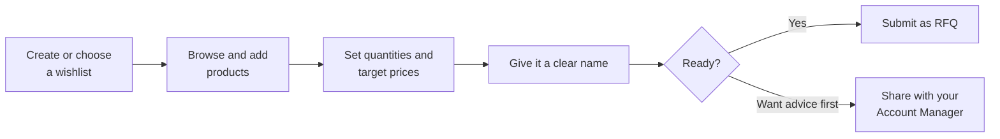

# 004 — Client Portal: Browsing and Wishlists

## Home

**Screen name:** Home
**Business purpose:** Give you a snapshot of your company's activity and a starting point for
shopping.
**Who uses it:** All Client Portal users.
**Navigation path:** Sign in, or click the logo at any time.

> 📷 **Screenshot Placeholder**
> File: `images/client-home.png`
> Description: Home page showing the banner carousel at the top, the four summary tiles, the
> Work Items list, and the product grid below.

### What the screen shows

| Area | What it tells you |
|------|-------------------|
| **Banner carousel** | Promotions and announcements from SAMTIA. Some banners are aimed at your company specifically; clicking one may open a promotion page |
| **Summary tiles** | Four counts: **Total Wishlists**, **Total RFQs**, **Total Orders**, **Total Users** |
| **Work Items** | The things needing your attention right now — wishlists you are still building, and quotations waiting for your decision |
| **Product grid** | Products from the catalogue, so you can start shopping without leaving the page |

### Available actions

| Action | Result |
|--------|--------|
| Click a summary tile | Opens the matching section of Company Profile |
| Click a Work Item | Opens that order's detail screen |
| Click a product | Opens the product details |

### Business rules

- **Work Items shows only what needs you.** Requests already with your Account Manager are not
  listed here — they are waiting on SAMTIA, not on you.
- All counts and items are for **your company**, including work created by colleagues.

---

## Products List

**Screen name:** Products
**Business purpose:** Find the products you want to buy.
**Who uses it:** All Client Portal users.
**Navigation path:** Header → **Products** or **Brands**, or type in the search box.

> 📷 **Screenshot Placeholder**
> File: `images/client-products.png`
> Description: Products list with the Filters panel open on the left showing Category, Brands and
> Tags sections, the search box above, and product cards in a grid.

### What the screen shows

Products appear as cards. Each card shows the product image, name, and **your company's price** —
prices are specific to your company's agreement with SAMTIA, so they will not match another
customer's.

### Search and filters

| Tool | How to use it |
|------|---------------|
| **Search** | Type any part of a product name |
| **Category** | Narrow to a product category |
| **Brands** | Narrow to one or more manufacturers |
| **Tags** | Narrow by product labels |
| **Attributes** | Narrow by characteristics such as size or colour, where the products have them |

Active filters are shown as removable chips, so you can always see why the list is short. Results
are paged — use the pager at the bottom to move through them.

If nothing matches, the screen reads **No available products**.

### Business rules

- **You only see products SAMTIA has priced for your company.** If a colleague at another company
  mentions a product you cannot find, it may simply not be on your agreement — ask your Account
  Manager.
- If you cannot find something at all, you can still request it. See *Requesting a product we do
  not stock* in [005](005-Client-Portal-Orders.md).

---

## Product Details

**Screen name:** Product Details
**Business purpose:** Give you everything you need to decide, then add the item to a wishlist.
**Who uses it:** All Client Portal users.
**Navigation path:** Click any product card.

> 📷 **Screenshot Placeholder**
> File: `images/client-product-detail.png`
> Description: Product details page with the image gallery on the left, product name, price,
> variant selector, quantity and Add button on the right, description below, and the Related
> Items section at the bottom.

### Main information displayed

| Element | Meaning |
|---------|---------|
| **Image gallery** | Product photographs; click to enlarge |
| **Price** | Your company's price for this product |
| **Variant selector** | Where a product comes in several versions (size, colour and similar), choose the one you want. Combinations that are not available cannot be selected |
| **Description** | Short and long descriptions from SAMTIA |
| **Terms & Conditions** | Product-specific conditions, where SAMTIA has published them |
| **Alert message** | An important notice about this product, when one applies |
| **Call Required** | Shown on products that must be discussed by phone rather than ordered directly |
| **Related Items / Alternative Products / Accessories** | Suggestions worth considering alongside the product |

### Available actions

| Action | Result |
|--------|--------|
| Choose a variant | Updates the price and availability shown |
| Set quantity | Sets how many you want |
| **Add** | Adds the product to the wishlist currently selected in the header |
| Click a related product | Opens that product |

### Business rules

- The product is added to the wishlist **shown in the header selector**. Check it first.
- Products marked **Call Required** need a conversation. You can still add them to a wishlist and
  raise a request — your Account Manager will contact you.

---

## Building a Wishlist

A wishlist is your working basket. It is private to your company, you can have several at once,
and nothing is committed until you submit it.

### Creating one

| Where | How |
|-------|-----|
| Header wishlist selector | Choose **New** |
| Company Profile → Wishlists | Use the **New** button |

### Naming it

Every wishlist has a **Label** — a name you choose. Use something you will recognise in three
weeks: *"Q3 lab restock"* beats *"list 2"*. The label is what your Account Manager sees too, so
a clear name speeds up their reply.

### Target prices

On each line you can enter a **Target Price** — the price you are hoping to pay. This is not a
demand and does not change what you are charged. It tells your Account Manager where you need to
land commercially, which usually produces a faster and more realistic quotation.

### Two ways to involve your Account Manager

| You want | Use | What happens |
|----------|-----|--------------|
| A formal price | **Submit RFQ** | The wishlist becomes a Request for Quotation and enters the pricing process |
| Advice, a sense-check, or help completing the list | **Share wishlist** | Your Account Manager is notified and can look at it while it stays a draft in your hands |

Sharing is the lighter option — nothing is committed, and you can keep editing.

### Business rules

- **An empty wishlist cannot be submitted.** Add at least one product first; the screen will tell
  you *Cannot submit empty order. Please add products first.*
- **Only the person who created a wishlist can delete it.** Colleagues can see and work on it,
  but not remove it.
- Once submitted, a wishlist becomes an RFQ and moves out of the Wishlists section.

---

## Tips

- **Copy an old order to save time.** On any past order, use **Copy** to start a new wishlist with
  the same products, then adjust. Ideal for regular repeat purchases.
- **Use separate wishlists per project or budget.** It keeps quotations clean and makes
  approvals easier on your side.
- **Add target prices before submitting, not after.** Giving your Account Manager the full
  picture up front avoids a second round of pricing.
