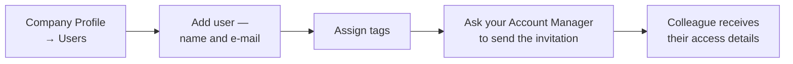

# 006 — Client Portal: Company Management

> These screens are for **Company Administrators** only. A Standard User who opens them is
> redirected to Orders.

---

## Portal Users

**Screen name:** Portal Users
**Business purpose:** Manage which of your colleagues can use the portal, and what state their
account is in.
**Who uses it:** Company Administrators.
**Navigation path:** User menu → Company Profile → **Users**.

> 📷 **Screenshot Placeholder**
> File: `images/client-users.png`
> Description: Portal Users screen with the heading "Portal Users — Manage your company portal
> users", the search box, and the user table showing Name, Email, Phone, Status, Account Manager
> Approved and Actions.

### Main information displayed

| Column | Meaning |
|--------|---------|
| **Name** | The colleague's full name |
| **Email** | Their sign-in address |
| **Phone** | Contact number, or *Not provided* |
| **Status** | **Active** or **Inactive** — the switch **you** control |
| **Account Manager Approved** | A tick box showing whether SAMTIA has approved the account. **You cannot change this** |

### Search

Type in **Search users by name or email...** to narrow the list.

### Available actions

| Button | What it does |
|--------|--------------|
| 👁 **View** | Opens the colleague's full details |
| ✏️ **Edit** | Changes their name, e-mail, phone and tags |
| **Activate** | Switches the account on |
| **Deactivate** | Switches the account off — they can no longer sign in |
| 🗑 **Delete** | Removes the account permanently |
| **Add user** | Creates a new portal account |

### Creating a user

| Field | Required | Notes |
|-------|----------|-------|
| **Full Name** | Yes | |
| **Email** | Yes | Becomes their sign-in address and must be unique |
| **Phone** | No | |
| **Tags** | No | See User Tags below |

After creating the account, ask your Account Manager to send the invitation so your colleague
receives their access details.

### Business rules

- **Both switches must be on.** Your colleague can only sign in when *Status* is Active **and**
  *Account Manager Approved* is ticked. If you have activated someone and they still cannot sign
  in, SAMTIA has not approved them — contact your Account Manager.
- **You cannot deactivate or delete your own account.** This prevents you locking your company
  out of its own administration.
- An e-mail address already in use will be refused.
- Deleting is permanent. **Deactivate instead** when someone might return, or when you want to
  keep their history clearly attributed.

---

## User Tags

**Screen name:** User Tags
**Business purpose:** Group colleagues in a way that matches how your business actually works.
**Who uses it:** Company Administrators.
**Navigation path:** User menu → Company Profile → **User Tags**.

> 📷 **Screenshot Placeholder**
> File: `images/client-user-tags.png`
> Description: User Tags screen showing the existing tags and the controls to add, rename and
> delete a tag.

### What tags are for

Tags are free-form labels you define — by department, site, budget holder, seniority, or anything
else. Common examples: *Procurement*, *Lab Team*, *Riyadh Branch*, *Approver*.

### Available actions

| Action | Result |
|--------|--------|
| **Create tag** | Adds a new label |
| **Edit tag** | Renames it everywhere it is used |
| **Delete tag** | Removes it from all users |
| Assign a tag | Done on the user record, via View or Edit |

### Business rules

- **Tags belong to your company only.** Other customers cannot see them, and you cannot see
  theirs.
- A tag name must be unique within your company.
- Deleting a tag removes it from users but does not affect the users themselves.

---

## User Details

**Screen name:** User Details
**Business purpose:** See and update everything about one colleague.
**Who uses it:** Company Administrators.
**Navigation path:** Company Profile → Users → 👁 **View** on a row.

### What the screen shows

- Full name, e-mail, phone
- Current status and whether SAMTIA has approved the account
- Assigned tags
- The invitation QR code, where one has been generated

### Available actions

| Action | Result |
|--------|--------|
| **Edit** | Update name, e-mail, phone and tags |
| **Activate / Deactivate** | Switch portal access on or off |
| **Back** | Return to the user list |

---

## Everyday Administration Tasks

### A new colleague joins

### A colleague leaves

**Deactivate rather than delete.** Their past orders and comments stay clearly attributed, and
you can reverse it if they return.

1. Company Profile → Users
2. Find the person
3. **Deactivate**

Delete only when you are certain the account should be erased entirely.

### A colleague changes department

Edit the user and change their tags. Nothing else needs to change.

---

## Tips

- **Review your user list quarterly.** Leavers who were never deactivated are the most common
  access problem in B2B portals.
- **Agree your tag scheme before creating tags.** A handful of meaningful tags is far more useful
  than thirty overlapping ones.
- **Remember the two-switch rule** when troubleshooting sign-in problems — it explains almost
  every case.
