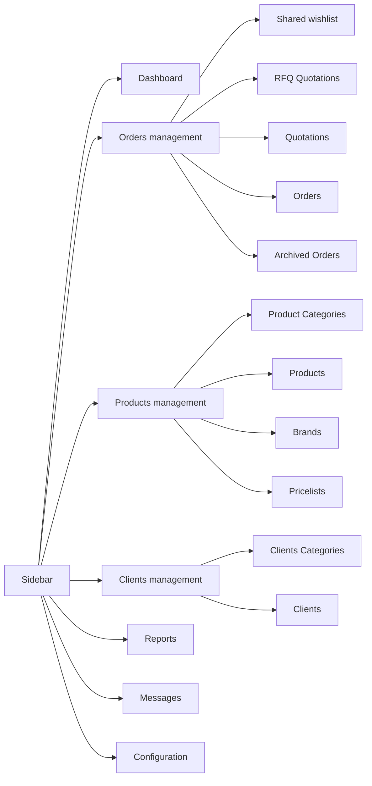
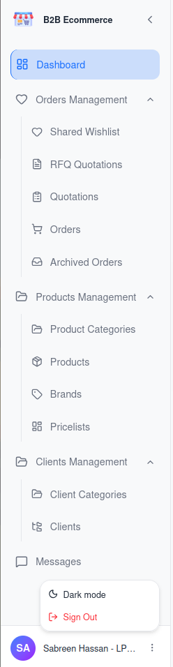
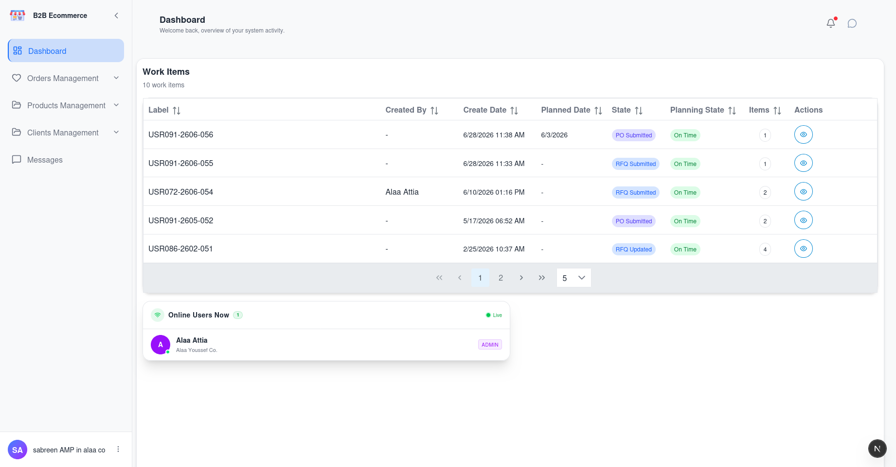

# 007 — Account Manager Portal: Navigation

## The Layout

The Account Manager Portal uses a permanent sidebar on the left. It can be collapsed to icons
using the arrow at its top, giving you more room for wide tables.

⚠️ **Needs update**

At the bottom of the sidebar is your name. The **⋮** button beside it offers **Light mode / Dark
mode** and **Sign Out**.

---

## Menu Guide

| Menu | Business purpose | Covered in |
|------|------------------|------------|
| **Dashboard** | Your work queue and who is online | Below |
| **Orders management** | Everything to do with customer demand | [008](008-Account-Manager-Portal-Order-Queues.md), [009](009-Account-Manager-Portal-Working-an-Order.md) |
| ├ Shared wishlist | Draft baskets customers have flagged for your attention | [008](008-Account-Manager-Portal-Order-Queues.md) |
| ├ RFQ Quotations | Requests waiting for you to price | [008](008-Account-Manager-Portal-Order-Queues.md) |
| ├ Quotations | Quotations you have sent, and POs received | [008](008-Account-Manager-Portal-Order-Queues.md) |
| ├ Orders | Confirmed business being fulfilled | [008](008-Account-Manager-Portal-Order-Queues.md) |
| └ Archived Orders | Cancelled business | [008](008-Account-Manager-Portal-Order-Queues.md) |
| **Products management** | The catalogue customers browse | [010](010-Account-Manager-Portal-Product-Management.md) |
| ├ Product Categories | The browsing structure | [010](010-Account-Manager-Portal-Product-Management.md) |
| ├ Products | The products themselves | [010](010-Account-Manager-Portal-Product-Management.md) |
| ├ Brands | Manufacturers | [010](010-Account-Manager-Portal-Product-Management.md) |
| └ Pricelists | Prices and price rules | [012](012-Account-Manager-Portal-Pricing.md) |
| **Clients management** | Customer companies | [011](011-Account-Manager-Portal-Client-Management.md) |
| ├ Clients Categories | Customer segments and their default pricing | [011](011-Account-Manager-Portal-Client-Management.md) |
| └ Clients | The customer companies themselves | [011](011-Account-Manager-Portal-Client-Management.md) |
| **Reports** | Login/activity history | [016](016-Account-Manager-Portal-Reports.md) |
| **Messages** | Live conversations with customers | [013](013-Messages-and-Notifications.md) |
| **Configuration** | Reserved for future settings | — |

> **Note on Configuration.** This menu item is present but has no content yet. There is nothing to
> do there.

---

## Dashboard

**Screen name:** Dashboard
**Business purpose:** Show you what needs your attention today and who is currently online.
**Who uses it:** All Account Manager Portal users.
**Navigation path:** Sidebar → **Dashboard**. This is also where you land after signing in.

### Main information displayed

| Area | What it shows |
|------|---------------|
| **Work Items** | Orders needing action from you — new requests, revised requests, and quotations the customer has accepted with a Purchase Order. The count is shown beside the title |
| **Online Users** | Customer users currently signed in, updating live. When nobody is signed in it reads *No one online* |

### Available actions

| Action | Result |
|--------|--------|
| Click a Work Item | Opens that order. Accepted quotations open in the Quotations area; new and revised requests open in the RFQ area |
| Adjust rows shown | Change how many Work Items are listed at once |

### Business rules

- **Work Items is a to-do list, not a report.** It deliberately excludes orders waiting on the
  customer — those are not your action.
- Everything shown is limited to **your own assigned clients**.
- The Online Users panel is genuinely live. It is useful before starting a chat: if the person is
  online, expect a quick reply.

---

## What Every Order Screen Has in Common

All five order queues use the same screen. Once you know it, you know all of them.

| Feature | Purpose |
|---------|---------|
| **Search** | Find by order reference, label or customer |
| **Filters** | Narrow by Created Date and Planned Date ranges |
| **Column chooser** | Show or hide columns to suit your work |
| **Sorting** | Click a column heading |
| **Paging** | Move through long lists |
| **Client filter** | Focus on one customer company |
| **User filter** | Focus on one person at a customer company |

The column chooser is worth setting up once: hide what you never use, and reveal **Reviewed Date**
and **Print Quotation Date** when you want to see how customers are engaging with your
quotations.

---

## Tips

- **Start every day on the Dashboard.** It answers "what is mine to do?" in one screen.
- **Collapse the sidebar** when working with wide order tables.
- **You only ever see your own clients.** If a customer's record is missing, they are almost
  certainly assigned to a different Account Manager.
