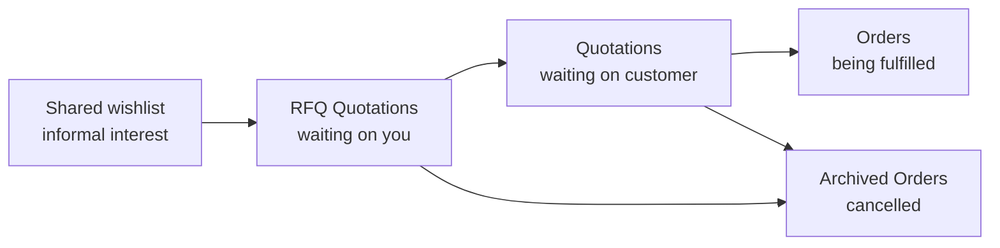
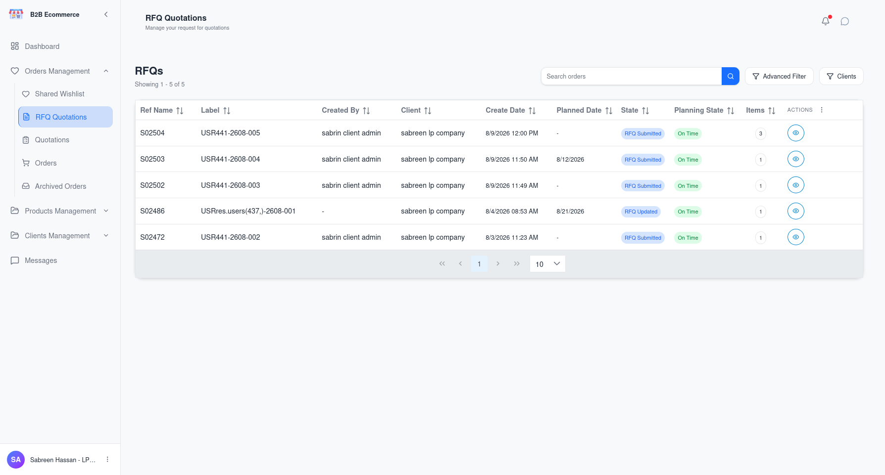
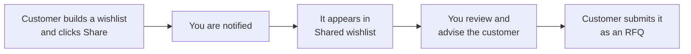
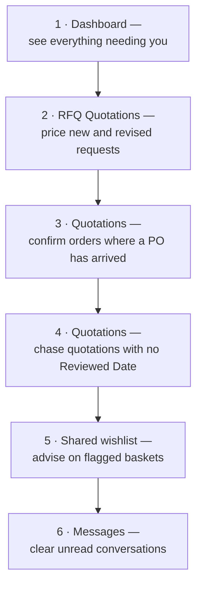

# 008 — Account Manager Portal: Order Queues

The five order screens are the same screen showing different slices of your customers' business.
They are ordered in the sidebar to follow the natural life of a deal.

---

## What Each Queue Contains

| Queue | Shows | Who acts next |
|-------|-------|---------------|
| **Shared wishlist** | Draft baskets a customer has flagged for your attention | You — proactively |
| **RFQ Quotations** | Requests submitted and revised requests | **You — price them** |
| **Quotations** | Quotations you have sent, and Purchase Orders received back | Customer, then you |
| **Orders** | Confirmed business in progress and delivered | You — fulfil |
| **Archived Orders** | Cancelled business | Nobody |

### The two that need daily attention

- **RFQ Quotations** is your inbox. Every record here is waiting on you.
- **Quotations** contains two different things: quotations still awaiting a customer decision
  (waiting on them), and quotations where the customer has uploaded a Purchase Order (waiting on
  you to confirm). Use the **State** column to tell them apart.

---

## The Queue Screen

**Screen name:** Shared wishlist / RFQ Quotations / Quotations / Orders / Archived Orders
**Business purpose:** Find the piece of business you need to work on.
**Who uses it:** Account Managers, Sales Representatives, Customer Service, Read Only Managers.
**Navigation path:** Sidebar → Orders management → choose the queue.

### Main information displayed

| Column | What it tells you | Shown by default |
|--------|-------------------|------------------|
| **Ref Name** | The order reference | Yes |
| **Label** | The name the customer gave it | Yes |
| **Created By** | Which person at the customer raised it | Yes |
| **Client** | The customer company | Yes |
| **Create Date** | When it was raised | Yes |
| **Planned Date** | When the customer needs the goods | Yes |
| **State** | Where it has reached | Yes (hidden on Archived Orders, where everything is cancelled) |
| **Planning State** | Late / On Time / Upcoming | Yes |
| **Items** | Number of product lines | Yes |
| **Reviewed Date** | When the customer opened the quotation | No — turn on when needed |
| **Print Quotation Date** | When the customer printed or downloaded it | No — turn on when needed |

### The two hidden columns are worth knowing about

**Reviewed Date** and **Print Quotation Date** tell you whether a customer has actually engaged
with a quotation. A quotation sent five days ago with no Reviewed Date usually means it has not
been seen — a very different conversation from one that has been printed twice.

Turn them on from the column chooser when chasing quotations.

### Search and filters

| Tool | What it does |
|------|--------------|
| **Search** | Finds by reference, label or customer |
| **Filters** | Narrows by Created Date range and Planned Date range (From / To) |
| **Client filter** | Restricts to one customer company |
| **User filter** | Restricts to one person at a customer company |
| **Column chooser** | Shows or hides columns; you can reveal or hide all at once |
| **Sorting** | Click any column heading |
| **Paging** | Move through the list |

### Available actions

| Button | What it does |
|--------|--------------|
| 👁 **View Details** | Opens the order for pricing and action — see [009](009-Account-Manager-Portal-Working-an-Order.md) |

All real work happens inside the order, not from the list.

### Business rules

- **You see only your own clients.** Every queue is already filtered to the customer companies
  assigned to you.
- The list is filtered by business stage, so an order will move between queues as it progresses.
  If you cannot find something, check the queue matching its current stage.

---

## Shared Wishlist — the proactive queue

This queue is different in character from the other four. Nothing here has been formally
requested — a customer has simply flagged a draft basket and asked you to look.

**Why it matters commercially:** these are deals before they become requests. A customer sharing
a wishlist is usually asking for help — availability, alternatives, or a sense of pricing. Acting
here shapes the request before it is formalised.

Open the record, use **Open Chat** to talk to the customer, and when the conversation is done use
**Reply Done** to clear the attention flag.

---

## Daily Routine

---

## Tips

- **Sort by Planning State** to bring Late items to the top. The customer's planned date is the
  best guide to urgency.
- **Set up your columns once.** Hide what you never read; the tables become far easier to scan.
- **Archived Orders is a reference, not a bin.** Cancelled requests often come back — copying an
  archived order is a quick way to restart a conversation.
