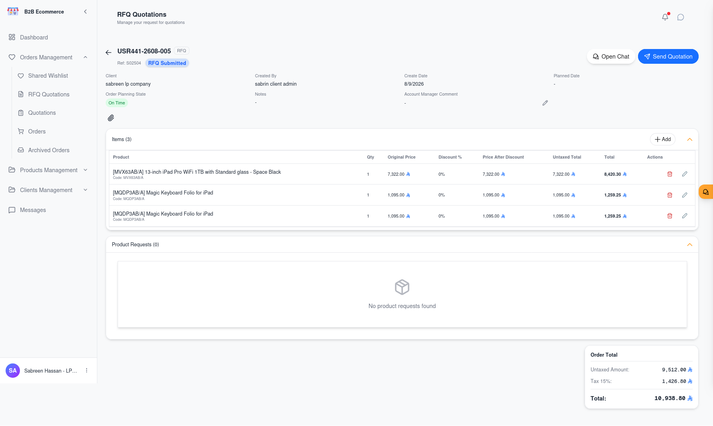
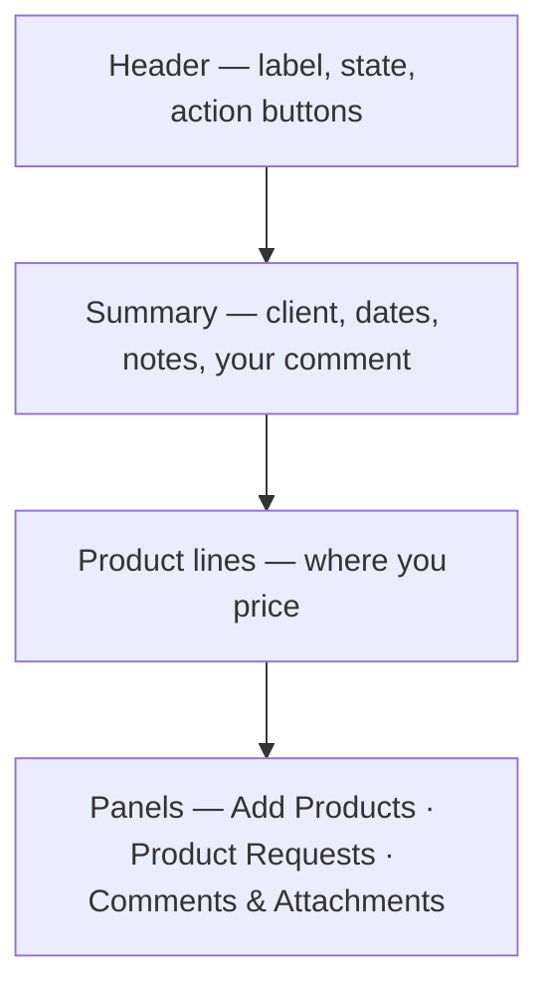
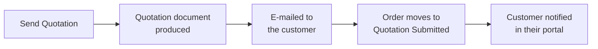
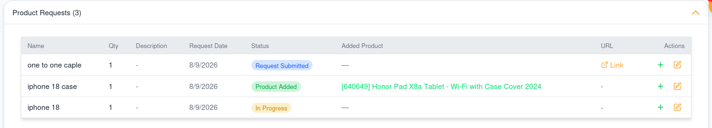
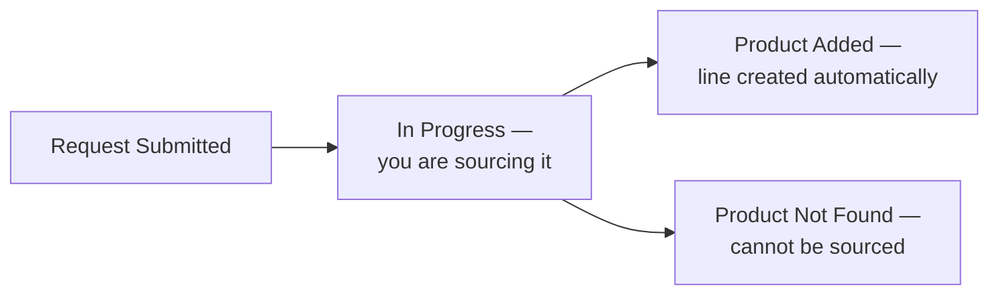

# 009 — Account Manager Portal: Working an Order

This is the screen where you earn the business. Everything you do to a customer request happens
here.

**Screen name:** Order Details
**Business purpose:** Price a request, answer the customer, and move the order to its next stage.
**Who uses it:** Account Managers, Sales Representatives, Customer Service.
**Navigation path:** Any order queue → 👁 **View Details**.

---

## Screen Layout

---

## Summary Panel

| Field | Meaning | Can you edit it? |
|-------|---------|------------------|
| **Client** | The customer company | No |
| **Created By** | Which person raised it | No |
| **Create Date** | When it was raised | No |
| **Planned Date** | When the customer needs the goods | No |
| **Order Planning State** | Late / On Time / Upcoming | No — calculated |
| **Notes** | The customer's stated purpose | No |
| **Account Manager Comment** | Your message to the customer about this order | **Yes** |
| **Return Reason** | Why the order was returned, when it has been | No |

### The Account Manager Comment

This is your channel for anything that must stay attached to the order — a condition, a lead
time, an explanation of the pricing. **The customer sees it on their own order screen.**

Click the edit icon beside the field, type your comment, and save. Use the cancel icon to discard.

Prefer this over chat for anything the customer will need to refer back to later.

---

## Pricing the Order

The product lines table is where the commercial work happens.

| Column | Meaning | Can you edit it? |
|--------|---------|------------------|
| **Product** | What the customer wants | Remove the line only |
| **Qty** | How many | **Yes** |
| **Target Price** | The price the customer is hoping for | No — this is the customer's input |
| **Original Price** | List price before discount | No |
| **Discount %** | The discount you are giving | **Yes** |
| **Price After Discount** | Resulting unit price | Calculated |
| **Untaxed Total** | Line total before tax | Calculated |
| **Total** | Line total including tax | Calculated |

### How to price

1. Read the **Target Price** column — it tells you where the customer needs to land.
2. Adjust **Discount %** on each line until the totals work commercially.
3. Adjust **Qty** if you are proposing a different pack size or minimum order.
4. Remove any line that cannot be supplied, and explain why in the Account Manager Comment.
5. Add anything missing using **Add Products**.

Changes save as you make them, and the order total updates immediately.

### Adding products

Use the **Add Products** panel to search the catalogue and add lines the customer did not find —
alternatives, accessories, or items resolving a product request.

---

## Action Buttons

Which buttons appear depends on where the order has reached.

| Button | Appears when | What it does |
|--------|--------------|--------------|
| **Open Chat** | Always | Opens a live conversation with the customer |
| **Reply Done** | The customer has flagged the order for attention | Clears the attention flag once you have responded |
| **Send Quotation** | The order is a submitted or revised request | Produces the quotation, e-mails it to the customer, and moves the order to *Quotation Submitted* |
| **Confirm** | The customer has uploaded a Purchase Order | Confirms the order — it becomes real business and moves to *In Progress* |
| **Return** | The customer has uploaded a Purchase Order | Sends the order back to the customer with a reason |

### Send Quotation

This single button does several things at once:

**Check your prices before clicking.** The quotation goes out immediately.

### Return

Use **Return** when a submitted Purchase Order cannot be accepted as it stands — wrong reference,
wrong quantity, expired pricing, a missing approval.

1. Click **Return**
2. The screen prompts *Please enter the reason for returning this order...*
3. Type a clear, specific reason
4. Confirm

The customer sees your reason in the **Return Reason** field on their order and can correct and
resubmit. **Always be specific** — a vague reason produces another round trip.

### Reply Done

When a customer shares a wishlist or posts a message, the order is flagged as needing attention.
After you have responded, click **Reply Done** to clear the flag. This keeps the Shared wishlist
queue meaningful for you and your colleagues.

---

## Product Requests

When a customer asks for something not in the catalogue, it appears in the **Product Requests**
panel.

| Status | Meaning |
|--------|---------|
| **Request Submitted** | New; nobody has picked it up |
| **In Progress** | You are sourcing it |
| **Product Added** | Sourced — the product is now a line on the order |
| **Product Not Found** | Cannot be supplied |

**When you link a product to a request, the order line is created automatically.** You do not add
it manually. Removing the link removes the line again.

The customer can see the status, so moving a request to **In Progress** is itself a useful signal
that you are working on it.

---

## Comments and Attachments

Each order carries a discussion thread shared with the customer.

| Action | Notes |
|--------|-------|
| Post a comment | Visible to the customer and your colleagues |
| Edit your comment | You can revise what you wrote |
| Upload a file | Datasheets, revised quotations, certificates |
| Delete a file | **Only files you uploaded yourself** |

### Comment, chat, or Account Manager Comment?

| Use | When |
|-----|------|
| **Account Manager Comment** | A standing statement about the order — conditions, lead time. The customer sees it prominently on their summary |
| **Comments** | Discussion that should stay permanently attached to the record |
| **Chat** | Quick back-and-forth that does not need to be part of the record |

---

## Uploading a Purchase Order on the Customer's Behalf

If a customer sends you their Purchase Order by e-mail instead of uploading it, you can upload it
from the order screen yourself. **The file must be a PDF** — other formats are refused.

---

## Business Rules

- **Send Quotation and Confirm cannot be undone.** The quotation is e-mailed and the order is
  confirmed in the business system immediately.
- **An order with no lines cannot move forward.** Add at least one product first.
- **You can only work on your own clients' orders.**
- The customer can revise a request after you have quoted it. When they do, the order is flagged
  as changed and returns to your queue.

---

## Tips

- **Read the Target Price column first.** It is the customer telling you what they need, and it is
  the fastest route to a quotation they will accept.
- **Turn on Reviewed Date in the queue** to see whether a customer has actually opened your
  quotation before you chase them.
- **Resolve product requests before quoting.** A quotation missing a requested item usually comes
  straight back.
- **Write returns as instructions, not complaints.** "PO references quotation Q-1042; this order
  is Q-1051 — please reissue against the correct number" gets a corrected PO the same day.
