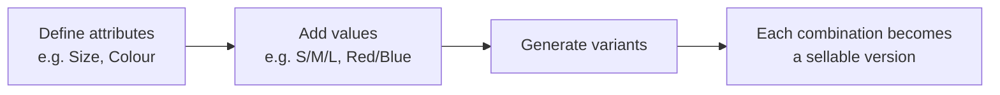
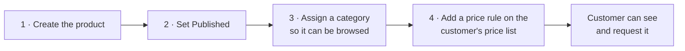

# 010 — Account Manager Portal: Product Management

Three screens control what customers see when they browse: **Product Categories** (the
structure), **Products** (the items), and **Brands** (the manufacturers).

> **Important:** adding a product does not automatically make it visible to a customer. A customer
> only sees products their price list can price. See [012](012-Account-Manager-Portal-Pricing.md).

---

## Product Categories

**Screen name:** Product Categories
**Business purpose:** Define the browsing structure customers navigate.
**Who uses it:** Account Managers, Business Administrators.
**Navigation path:** Sidebar → Products management → **Product Categories**.

> 📷 **Screenshot Placeholder**
> File: `images/amp-categories.png`
> Description: Product Categories screen showing the expandable category tree with images, the
> search box, and the add/edit/delete controls.

### What the screen shows

Categories in a tree. Parent categories expand to reveal their children, matching the menu
customers see in the Client Portal header.

| Element | Meaning |
|---------|---------|
| Expand arrow | Opens a category to show its sub-categories |
| Category image | The picture shown to customers |
| Category name | The label customers see |

### Available actions

| Action | Result |
|--------|--------|
| **Add category** | Creates a new category, optionally under a parent |
| **Edit** | Changes name, description, image and parent |
| **Delete** | Removes the category after confirmation |
| **Search** | Finds a category by name |

### Business rules

- **The tree is the customer's menu.** Changes appear in the Client Portal immediately, so plan
  restructuring rather than experimenting live.
- A category can hold products and sub-categories at the same time.
- Deleting a category does not delete its products, but those products lose that browsing route —
  reassign them first.

---

## Brands

**Screen name:** Brands
**Business purpose:** Maintain the manufacturer list customers browse by.
**Who uses it:** Account Managers, Business Administrators.
**Navigation path:** Sidebar → Products management → **Brands**.

> 📷 **Screenshot Placeholder**
> File: `images/amp-brands.png`
> Description: Brands table showing Name, Active and Actions columns with the add and edit
> controls.

### Main information displayed

| Column | Meaning |
|--------|---------|
| **Name** | The brand as customers see it |
| **Active** | Whether it appears in the customer's Brands menu |

### Available actions

| Action | Result |
|--------|--------|
| **Add brand** | Creates a brand |
| **Edit** | Changes the name, description or active state |
| **Delete** | Removes the brand |
| **Search** | Finds a brand by name |

### Business rules

- **Brand names must be unique.** A duplicate name is refused.
- **Switch a brand off rather than deleting it** when it is temporarily out of range. Deactivating
  removes it from the customer menu but keeps the history intact.
- A brand in use by products cannot simply disappear — reassign the products first.

---

## Products

**Screen name:** Products
**Business purpose:** Maintain the items customers can buy.
**Who uses it:** Account Managers, Business Administrators.
**Navigation path:** Sidebar → Products management → **Products**.

> 📷 **Screenshot Placeholder**
> File: `images/amp-products.png`
> Description: Products table showing the image thumbnail, Product, Brand, Categories, Tags,
> Flags and Status columns, with the search box and New Product button above.

### Main information displayed

| Column | Meaning |
|--------|---------|
| **IMG** | Product thumbnail |
| **Product** | Product name |
| **Brand** | Manufacturer |
| **Categories** | Where it appears in the customer's browsing menu |
| **Tags** | Labels customers can filter by |
| **Flags** | Special markers such as *Featured* or *Requires Call* |
| **Status** | Whether it is published to customers |

### Available actions

| Action | Result |
|--------|--------|
| **New Product** | Opens the product form |
| **Edit** | Opens an existing product |
| **Delete** | Removes the product |
| **Import** | Loads many products at once |
| **Search** | Finds by product name |

---

## The Product Form

Opening a product gives you five tabs.

| Tab | What you maintain there |
|-----|-------------------------|
| **General** | Name, brand, categories, ribbon, alert message, and the flags |
| **Attributes & Values** | The characteristics the product varies by — size, colour and similar |
| **Variants** | The individual sellable versions produced from those attributes |
| **Sales & Descriptions** | Short description, long description, terms and conditions |
| **Media** | Images |

> 📷 **Screenshot Placeholder**
> File: `images/amp-product-form.png`
> Description: Product form on the General tab showing Product Name, Brand, Categories, Ribbon,
> Alert Message and the Published, Featured Product and Requires Call switches.

### General tab

| Field | Business meaning |
|-------|------------------|
| **Product Name** | Required. What customers see |
| **Brand** | The manufacturer |
| **Categories** | Where it appears in the browsing menu. A product can sit in several |
| **Ribbon / Badge** | A small marker on the product card, such as *New* or *Sale* |
| **Alert Message** | An important notice shown on the product page |
| **Published** | Whether customers can see it at all |
| **Featured Product** | Promotes it onto the customer Home page |
| **Requires Call** | Marks it as needing a conversation before ordering. Customers see *Call Required* |

### Attributes and Variants

Use these when one product comes in several versions.

Customers choose between variants on the product page. Combinations you have not created are
shown as unavailable, so they cannot request something that does not exist.

### Sales & Descriptions

| Field | Where the customer sees it |
|-------|----------------------------|
| **Short Description** | On the product card and near the top of the product page |
| **Long Description** | The main body of the product page |
| **Terms & Conditions** | A dedicated section on the product page |

### Media

Upload the images shown in the product gallery. The first image is used as the thumbnail in
lists.

### Business rules

- **Product Name is required**; nothing else is.
- Changes to the General, Sales and Media tabs are saved as you move between tabs.
- **Published controls visibility, but pricing controls availability.** An unpublished product is
  hidden from everyone; a published product is only visible to customers whose price list covers
  it.

---

## Importing Products in Bulk

**Screen name:** Import Products
**Business purpose:** Load a large batch of products without entering them one at a time.
**Who uses it:** Business Administrators.
**Navigation path:** Products screen → **Import**.

> 📷 **Screenshot Placeholder**
> File: `images/amp-product-import.png`
> Description: The Import dialog with the data area and, after running, the Import Result panel.

### What the import does

- Creates products that do not exist and updates those that do
- Creates missing brands and categories automatically
- Creates missing attributes and values, and builds the variants
- Sets prices on the price lists included in the data
- Downloads product images where image links are supplied

When it finishes you see an **Import Result** panel. A clean run reports *All items were imported
successfully.*

### Business rules

- **Always test with a small batch first.** The import creates supporting records — brands,
  categories, attributes — as a side effect, and a badly formed file can leave clutter behind.
- Products are matched to decide create-versus-update. Re-running the same file updates rather
  than duplicates.
- Review the result panel every time. Partial success is possible.

---

## Making a Product Available to a Customer

This is the question new staff ask most often. Adding a product is only half the job.

If a customer reports that they cannot see a product, work down that list. **Step 4 is the usual
culprit.**

---

## Tips

- **Use Featured Product deliberately.** It is prime space on every customer's Home page.
- **Alert Messages are for things that affect the purchase decision** — supply constraints,
  regulatory notes — not marketing copy.
- **Set Requires Call on anything genuinely needing a conversation.** It sets expectations before
  the customer submits a request.
