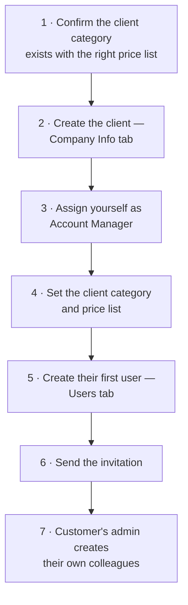

# 011 — Account Manager Portal: Client Management

Two screens control who your customers are and how they are treated commercially.

---

## Clients Categories

**Screen name:** Clients Categories
**Business purpose:** Group customers into commercial segments, each with its own default
pricing.
**Who uses it:** Account Managers, Business Administrators.
**Navigation path:** Sidebar → Clients management → **Clients Categories**.

> 📷 **Screenshot Placeholder**
> File: `images/amp-client-categories.png`
> Description: Clients Categories table showing Name, Company, Price List, Clients count, Status
> and Actions columns.

### Main information displayed

| Column | Meaning |
|--------|---------|
| **Name** | The segment name, for example *Gold*, *Distributor*, *Government* |
| **Company** | Which of your business entities it belongs to |
| **Price List** | The pricing applied by default to customers in this segment |
| **Clients** | How many customer companies are currently in it |
| **Status** | Whether the category is in use |

### Available actions

| Action | Result |
|--------|--------|
| **Add category** | Creates a new segment |
| **Edit** | Changes the name or default price list |
| **Delete** | Removes the segment |
| **Search** | Finds a category by name |

### Why this screen matters

The category is the link between **who a customer is** and **what they pay**. Assigning a customer
to a category applies that category's price list, so pricing policy is set once for a whole
segment rather than customer by customer.

### Business rules

- Changing a category's price list affects customers assigned to it — review the **Clients** count
  before making a change.
- A customer can be given a price list that differs from their category's default. The system
  resolves the difference and records what it did in the customer's history, so the outcome is
  always traceable.

---

## Clients

**Screen name:** Clients
**Business purpose:** Maintain the customer companies you serve.
**Who uses it:** Account Managers, Business Administrators.
**Navigation path:** Sidebar → Clients management → **Clients**.

> 📷 **Screenshot Placeholder**
> File: `images/amp-clients.png`
> Description: Clients list showing Name, Tax ID, Email, Phone, Client category and Price list
> columns, with the search box and New Client button.

### Main information displayed

| Column | Meaning | Shown by default |
|--------|---------|------------------|
| **Name** | The customer company | Yes |
| **Tax ID** | Their tax registration number | Yes |
| **Email** | Main contact address | Yes |
| **Phone** | Main contact number | Yes |
| **Client category** | Their commercial segment | Yes |
| **Price list** | The pricing they receive | Yes |
| **City** | Location | No — turn on when needed |

### Available actions

| Action | Result |
|--------|--------|
| **New Client** | Opens the client form |
| **Edit** | Opens an existing client |
| **Delete** | Archives the client |
| **Restore** | Brings an archived client back |
| **Search** | Finds by company name |

### Business rules

- **You see only your own clients.**
- Deleting archives rather than erases — history is preserved and the client can be restored.

---

## The Client Form

Opening a client gives you four tabs.

| Tab | What you maintain |
|-----|-------------------|
| **Company Info** | Identity, contact details, address, commercial settings |
| **Users** | The people at that company who can use the portal |
| **Banners** | Promotional banners aimed at this customer specifically |
| **Attachments** | Documents relating to the customer |

> 📷 **Screenshot Placeholder**
> File: `images/amp-client-form.png`
> Description: Client form on the Company Info tab showing company name, tax ID, e-mail, phone,
> address fields, account manager and client category selectors, and the logo preview.

### Company Info

| Field | Business purpose | Example |
|-------|------------------|---------|
| **Company name** | The customer's registered name | *My company* |
| **Tax ID** | Tax registration | *DE-123456789* |
| **Email** | Main contact address | *Email@company.com* |
| **Phone** | Main contact number | *+1 30 123 4567* |
| **Website** | Their website | *https://example.com* |
| **Street / Street 2** | Address | *123 Main St* / *Apt 4B* |
| **City** | City | *Riyadh* |
| **Postal code** | Postcode | *11564* |
| **Country / State** | Location, chosen from a list | |
| **Account manager** | **Who at SAMTIA owns this customer** | |
| **Client category** | Their commercial segment | |
| **Logo** | Their logo, with a preview | |

### The Account Manager field is the most important one

It determines:

- Which SAMTIA employee sees this customer's orders
- Who receives e-mail alerts when the customer submits a request
- Who appears as the customer's contact in chat

**If it is wrong or empty, the customer's requests may go unnoticed.** Check it whenever a
customer reports being ignored.

### Users tab

Create and manage the customer's portal accounts without leaving the client record.

| Action | Result |
|--------|--------|
| **Add user** | Creates a portal account for that company |
| **Edit** | Updates name, e-mail, phone |
| **Activate / Deactivate** | Controls the SAMTIA-side switch |
| **Send invitation** | E-mails the user their access details, including a QR code |

Remember the two switches described in [002](002-User-Roles-and-Permissions.md): you control
*Active User*; the customer's own administrator controls *Portal Active*. **Both must be on.**

### Banners tab

Banners created here appear on **this customer's Home page only**. Use them for
customer-specific announcements — a negotiated promotion, a delivery notice, a contract renewal
reminder.

| Setting | Purpose |
|---------|---------|
| Image and description | What the customer sees |
| Active period | When it starts and stops showing, so campaigns run automatically |
| Promotion link | Where clicking it takes them |
| Linked products or categories | Ties the banner to specific catalogue content |

### Attachments tab

Documents relating to the customer as a whole — contracts, credit approvals, certificates. This is
separate from files attached to individual orders.

---

## Setting Up a New Customer

**Step 5 matters:** make the customer's first user their **Company Administrator**, so they can
create the rest of their team themselves rather than coming back to you for each person.

---

## Common Situations

### "Our people cannot sign in"

1. Open the client → Users tab
2. Check *Active User* is on for that person — that is your switch
3. If it is on, the customer's own administrator has switched off *Portal Active*

### "We are seeing the wrong prices"

1. Open the client → Company Info
2. Check the **Client category** and **Price list**
3. If the price list has been set individually and differs from the category default, that
   individual setting is what applies

### "We never got the invitation"

1. Open the client → Users tab
2. Confirm the e-mail address is correct
3. Use **Send invitation** again

---

## Tips

- **Fill in the Tax ID at setup.** It is needed for invoicing and is awkward to chase later.
- **Use client-specific banners sparingly** — one clear message lands better than several.
- **Archive rather than delete** a customer who has gone quiet. Restoring is instant if they
  return.
