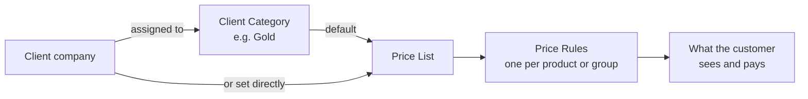
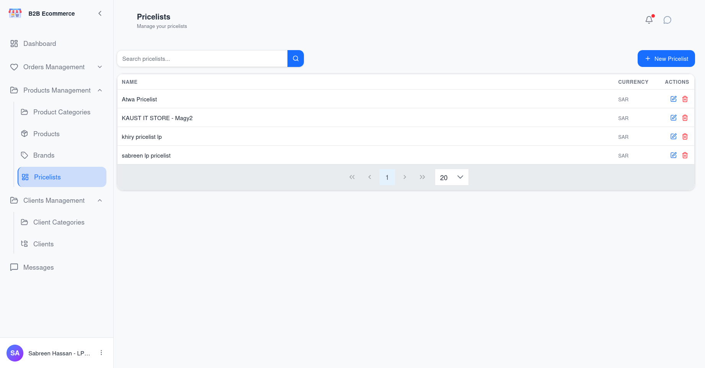
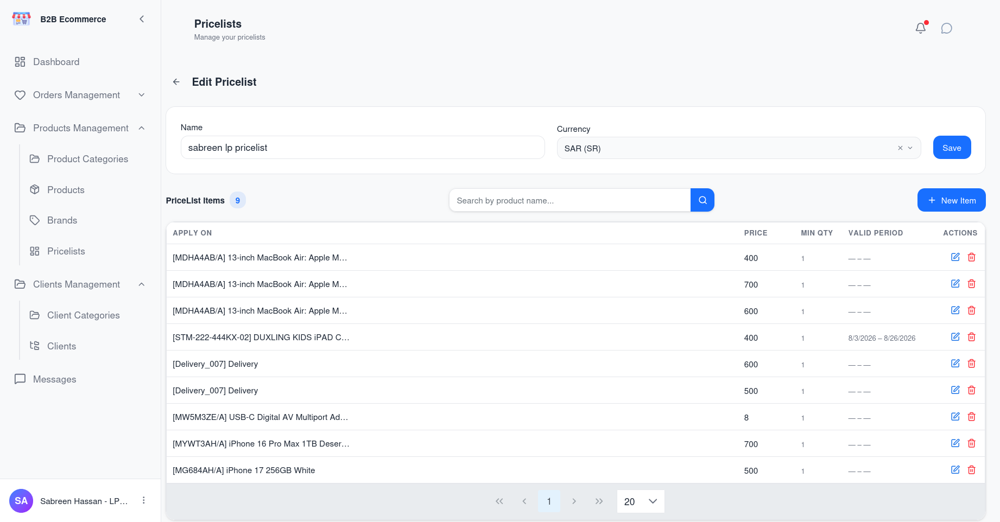
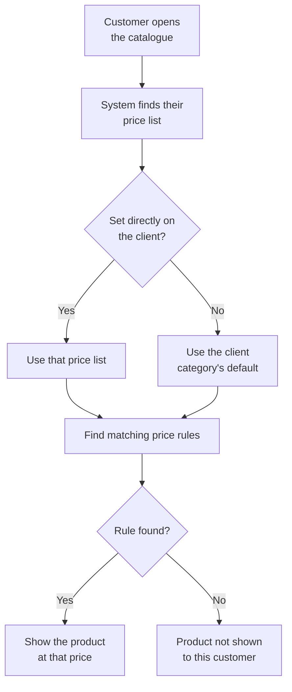

# 012 — Account Manager Portal: Pricing

Pricing determines two things at once: **what a customer pays**, and **what a customer can see**.
A product with no price rule on a customer's price list is invisible to them.

---

## Pricelists

**Screen name:** Pricelists
**Business purpose:** Maintain the sets of prices offered to different customer segments.
**Who uses it:** Pricing Managers, Account Managers, Business Administrators.
**Navigation path:** Sidebar → Products management → **Pricelists**.

### Main information displayed

| Column | Meaning |
|--------|---------|
| **Name** | How the price list is identified, for example *Gold Tier 2026* |
| **Currency** | The currency its prices are expressed in |

### Available actions

| Action | Result |
|--------|--------|
| **New Pricelist** | Creates a price list |
| **Edit** | Renames it or changes its currency |
| **Delete** | Removes it |
| **View details** | Opens it to manage its price rules |
| **Search** | Finds by name |

### Business rules

- **A price list assigned to a client or used as a client category's default cannot be deleted.**
  The screen tells you it is in use — reassign the client(s) or category first.
- Changing the currency affects how every price on the list is interpreted. Treat it as a
  structural change, not an edit.

---

## Price Rules

**Screen name:** Pricelist Details
**Business purpose:** Set the actual prices within a price list.
**Who uses it:** Pricing Managers, Business Administrators.
**Navigation path:** Pricelists → **View details** on a price list.

⚠️ **Needs update**

### Main information displayed

| Column | Meaning |
|--------|---------|
| **Apply On** | What the rule covers — a single product, a specific variant, or a broader group |
| **Min Qty** | The minimum quantity before the rule applies, allowing volume pricing |
| **Price** | The price the customer pays |
| **Valid Period** | The dates between which the rule applies, for time-limited pricing |

### Available actions

| Action | Result |
|--------|--------|
| **Add rule** | Creates a single price rule |
| **Add Multiple Items** | Opens a dialog to pick several products at once and create a price rule for each in one go, starting from their catalogue prices |
| **Edit** | Changes an existing rule |
| **Delete** | Removes a rule |
| **Search** | Finds a rule by product name or code |
| **Paging** | Moves through long lists |

### Adding several rules at once

Use **Add Multiple Items** when you are setting up a new price list for a segment and need to
price many products at the same time rather than one by one:

1. Click **Add Multiple Items**
2. Select the products to add
3. Confirm — a rule is created for each, seeded from that product's own catalogue price

Review and adjust the resulting rules individually afterwards if any product needs a different
price than its catalogue default.

### How rules combine

| Feature | Business use |
|---------|--------------|
| **Min Qty** | Volume pricing — one rule at qty 1, a better price at qty 100 |
| **Valid Period** | Seasonal or promotional pricing that starts and stops on its own |
| **Apply On** | Price a whole group in one rule, then override individual products |

### Business rules

- **A product with no rule on a customer's price list does not appear in their catalogue.** This
  is the single most common reason a customer cannot find a product.
- Rules with a validity period stop applying automatically once the end date passes.
- Changes take effect on what customers see immediately. Existing quotations already sent are not
  repriced.

---

## How a Customer's Price Is Decided

---

## Common Pricing Tasks

### Give a whole segment new prices

1. Sidebar → Products management → **Pricelists**
2. Open the price list used by that client category
3. Add or edit the rules

Every customer in the segment is updated at once.

### Give one customer a special price

Two options, with different consequences:

| Option | Effect | When to use |
|--------|--------|-------------|
| Create a dedicated price list and assign it to that client | Isolated — affects nobody else | Genuinely bespoke agreements |
| Add a rule to their existing shared price list | **Affects every customer on that list** | Never, for a single-customer discount |

The second is the classic mistake. Check who else uses a price list before editing it.

### Run a time-limited promotion

Add rules with a **Valid Period** covering the campaign dates. The prices apply and expire on
their own — no need to remember to remove them.

### Make a new product visible

Add a price rule for it on each price list whose customers should see it. Until you do, the
product exists but no customer can find it.

---

## Tips

- **Name price lists so their purpose is obvious**, including the year or contract where it
  helps: *Gold Tier 2026* is better than *List 3*.
- **Check the Clients count on the client category** before editing a price list — it tells you
  how many customers a change will reach.
- **When a customer says a product is missing, check pricing first.** It is more often a missing
  price rule than a missing product.
