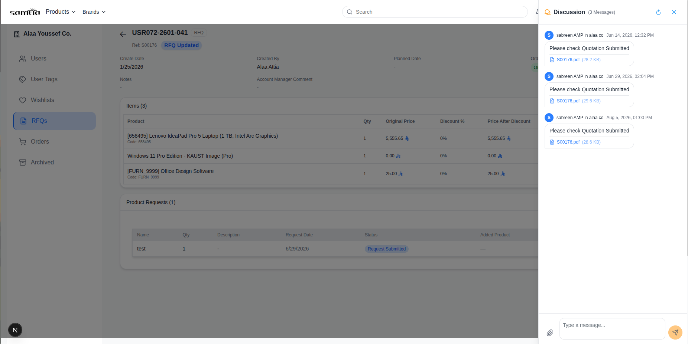
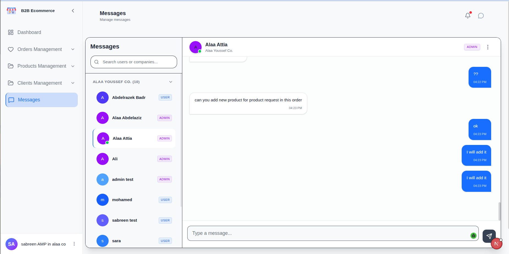
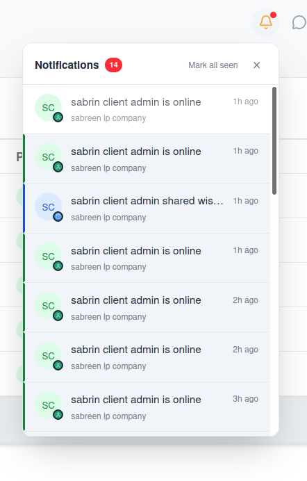
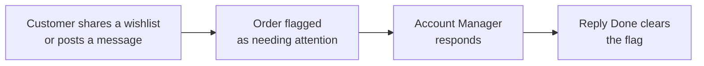
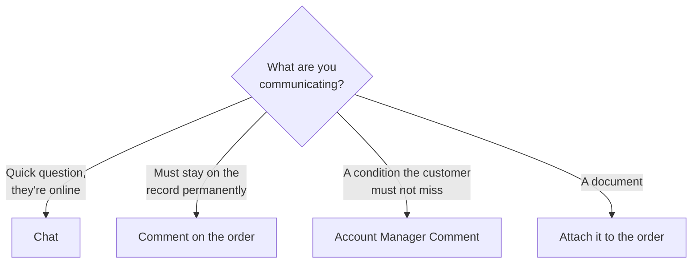

# 013 — Messages and Notifications

The platform gives you three separate ways to communicate. Choosing the right one saves time and
keeps records clean.

| Channel | Best for | Where it lives |
|---------|----------|----------------|
| **Chat** | Quick back-and-forth while both people are available | The Messages screen, or *Open Chat* on an order |
| **Comments** | Discussion that must stay attached to an order permanently | The order's Comments panel |
| **Account Manager Comment** | A standing statement about an order the customer must see | The order summary (Account Managers only) |

---

## Live Chat

### For customers

**Screen name:** Chat
**Business purpose:** Talk to your Account Manager directly.
**Who uses it:** All Client Portal users.
**Navigation path:** Any order → **Open Chat**.

Your company has **one shared conversation** with your Account Manager. Colleagues at your
company see the same history — chat is a company channel, not a private one.

### For Account Managers

**Screen name:** Messages
**Business purpose:** Handle conversations with all your customers in one place.
**Who uses it:** Account Managers, Sales Representatives, Customer Service.
**Navigation path:** Sidebar → **Messages**.

| Area | What it shows |
|------|---------------|
| **Conversation list** | One entry per customer company, with the last message and an unread count |
| **Conversation** | The full history with the selected customer |
| **Message box** | Where you reply |

You can also open a conversation in context from any order using **Open Chat** — useful when the
question is about that specific order.

### Business rules

- **Messages are delivered live.** Both sides see new messages without refreshing.
- **You only see your own clients' conversations.**
- Opening a conversation marks it as read and clears the unread count.

---

## Online Status

People appear as **online**, **away** or **offline**.

| Where you see it | Use |
|------------------|-----|
| Chat window | Whether the person you are writing to is available |
| Dashboard → Online Users | Which customers are working in the portal right now |

Status updates automatically. Signing out marks you offline immediately.

**Practical use:** if a customer is online, a chat message usually gets a fast answer. If they
are offline, a comment on the order or an e-mail is more likely to be seen.

---

## Notifications

**Where:** The 🔔 bell in the Client Portal header; the notification area in the Account Manager
Portal.

⚠️ **Needs update**

### What triggers a notification

| Event | Who is told |
|-------|-------------|
| A request is submitted or revised | The Account Manager |
| A Purchase Order is submitted | The Account Manager |
| A wishlist is shared | The Account Manager |
| An order changes stage | The customer's company |
| A new message arrives | The other side |
| A user signs in or is activated | The company |
| One of your company's users signs in for the very first time | The Account Manager |
| The customer opens or downloads their quotation | The Account Manager |

### Reading them

| Action | Result |
|--------|--------|
| Click a notification | Opens the record it refers to |
| **Mark all as seen** | Clears the unread indicator |

When there is nothing new, the panel reads **All caught up**.

### Business rules

- **You never receive a notification for your own action.** If you submit a request, you are not
  told about it — your colleagues and your Account Manager are.
- Notifications are shared across your company. A colleague may have already acted on one.

---

## E-mail Alerts

Some events also send an e-mail, so nothing is missed when nobody is signed in.

| Event | Who receives an e-mail |
|-------|------------------------|
| A request is submitted | The Account Manager |
| A request is revised | The Account Manager |
| A Purchase Order is submitted | The Account Manager |
| A wishlist is shared | The Account Manager |
| A quotation is sent | The customer |
| A user invitation | The invited user, cc'ing their Account Manager |
| A password reset code | The requesting user |
| One of your company's users signs in for the very first time | The Account Manager |
| The customer opens or downloads their quotation | The Account Manager |
| A chat thread stays unread too long | The Account Manager |
| An Account Manager requests an internal review of a quotation | The chosen internal reviewers |

Account Manager alert e-mails include a direct link into the portal, so you can go straight to
the record.

> **Note:** e-mail alerts to Account Managers can be switched off centrally by an administrator.
> In-portal notifications are always created regardless — if you are not receiving e-mails but
> the bell is working, this setting is the reason.

---

## Attention Flags on Orders

When a customer shares a wishlist or posts a message, the order is flagged as **needing
attention**. The flag appears on the order and drives the Shared wishlist queue.

**Clearing the flag matters.** If nobody clicks **Reply Done**, the Shared wishlist queue fills
with items that have already been handled and stops being useful to the team.

---

## Choosing the Right Channel

| Situation | Best channel |
|-----------|--------------|
| "Is this in stock?" | Chat |
| "Lead time is six weeks on line 3" | Account Manager Comment |
| "Approved by our finance team on 4 March" | Comment |
| Revised specification document | Attachment |
| "Why has the price changed since last quarter?" | Chat, then record the outcome as a Comment |

---

## Tips

- **Check Online Users before chasing by chat.** Offline customers will not reply, however urgent
  the message.
- **Anything a customer will need to refer back to belongs in a Comment**, not chat. Chat is for
  the conversation; comments are the record.
- **Clear attention flags as you go.** It takes one click and keeps the shared queues honest.
