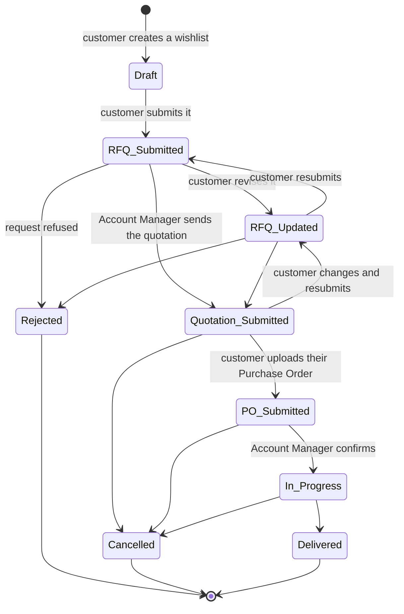
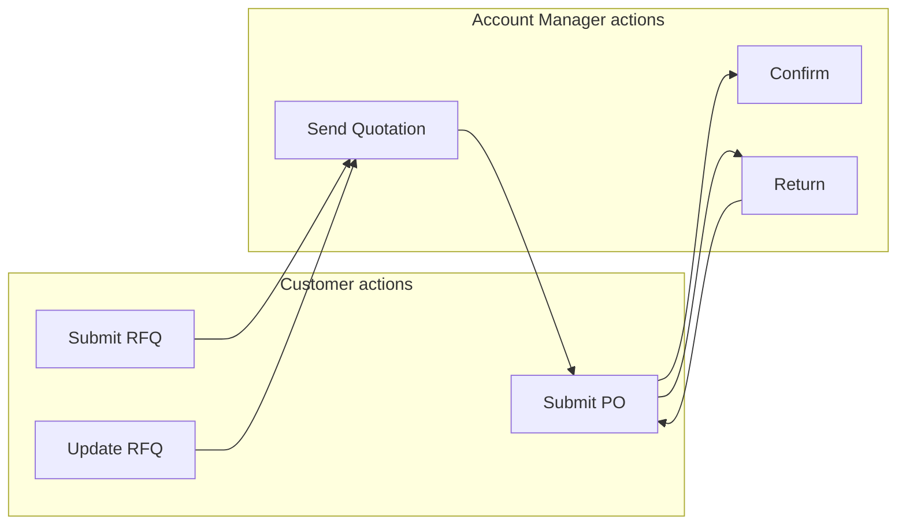
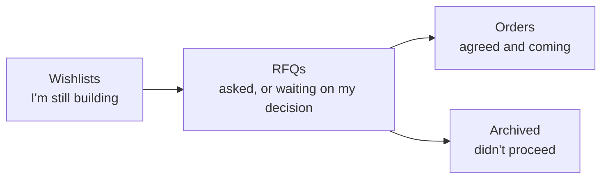
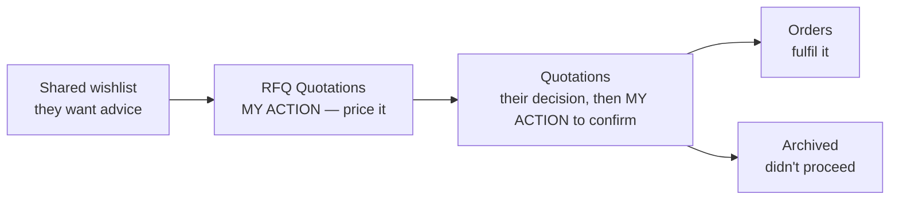

# 014 — The Order Lifecycle

Every piece of business moves through the same set of stages. Knowing which stage a record is in
tells you two things immediately: **who has to act next**, and **what can still be changed**.

---

## The Full Journey

---

## Stage Reference

| Stage | What it means in business terms | Who acts next | Where the customer finds it | Where the Account Manager finds it |
|-------|--------------------------------|---------------|----------------------------|-----------------------------------|
| **Draft** | A wishlist being built. Nothing has been asked of SAMTIA | Customer | Wishlists | Shared wishlist (only if flagged) |
| **RFQ Submitted** | A formal request for a price | **Account Manager** | RFQs | RFQ Quotations |
| **RFQ Updated** | The customer has changed their request | **Account Manager** | RFQs | RFQ Quotations |
| **Quotation Submitted** | A price has been offered | **Customer** | RFQs | Quotations |
| **PO Submitted** | The customer has accepted and sent their Purchase Order | **Account Manager** | RFQs | Quotations |
| **In Progress** | Confirmed business being fulfilled | Account Manager | Orders | Orders |
| **Delivered** | Complete | Nobody | Orders | Orders |
| **Rejected** | The request was refused | Nobody | Archived | Archived Orders |
| **Cancelled** | The business was stopped | Nobody | Archived | Archived Orders |

---

## Who Moves It Forward

Each side has exactly three moves. Nothing advances on its own — the platform waits for a person
to act.

---

## What Can Be Changed at Each Stage

| Stage | Customer can edit the lines? | Account Manager can edit the lines? |
|-------|----------------------------|------------------------------------|
| Draft | Yes | Not applicable |
| RFQ Submitted | No — reopen with **Update RFQ** first | **Yes — this is where pricing happens** |
| RFQ Updated | No — same | Yes |
| Quotation Submitted | Yes, then resubmit | Yes |
| PO Submitted | No | No |
| In Progress | No | No |
| Delivered | No | No |

**The rule of thumb:** an order is editable while the commercial conversation is still open, and
locked once it has been agreed.

---

## What Happens Automatically

Some transitions do more than change a label.

| Transition | Also happens |
|------------|--------------|
| → **Quotation Submitted** | The quotation document is produced and e-mailed to the customer, and the customer is notified in the portal |
| → **In Progress** | The order is confirmed as real business in SAMTIA's system |
| → **RFQ Submitted** / **RFQ Updated** / **PO Submitted** | The Account Manager receives a portal notification and an e-mail |
| Wishlist shared | The Account Manager is notified and the order is flagged for attention |

---

## The Two Signals That Track Customer Engagement

Once a quotation has been sent, two dates record what the customer did with it. Account Managers
can show them as columns in any order queue.

| Signal | Meaning |
|--------|---------|
| **Reviewed Date** | When the customer opened the quotation |
| **Print Quotation Date** | When the customer printed or downloaded it |

| What you see | What it usually means |
|--------------|----------------------|
| No Reviewed Date after several days | It has not been seen. Chase by chat or phone |
| Reviewed but not printed | Seen, under consideration |
| Printed | Being circulated internally — often for approval. A good moment to follow up |

---

## Planning State

Alongside the stage, every order carries a timing signal calculated from the customer's **Planned
Date**.

| Planning State | Meaning |
|----------------|---------|
| **Late** | The planned date has passed and the order is not complete |
| **On Time** | Progressing within the expected window |
| **Upcoming** | The planned date is still ahead |

Sort or filter on this to prioritise. **Late** items are where customer relationships are won or
lost.

---

## Pending Submit — an easy one to miss

If a customer edits an order **after** receiving a quotation but does not resubmit it, the order
is marked as changed but not resubmitted.

**For customers:** your changes are saved but your Account Manager has not been asked to look at
them. Submit the updated request to restart pricing.

**For Account Managers:** this is why an order may look different from the quotation you sent.
Check with the customer before requoting.

---

## Reading the Lifecycle From Either Side

### Customer's view

### Account Manager's view

The same journey, described from each side of the conversation.
