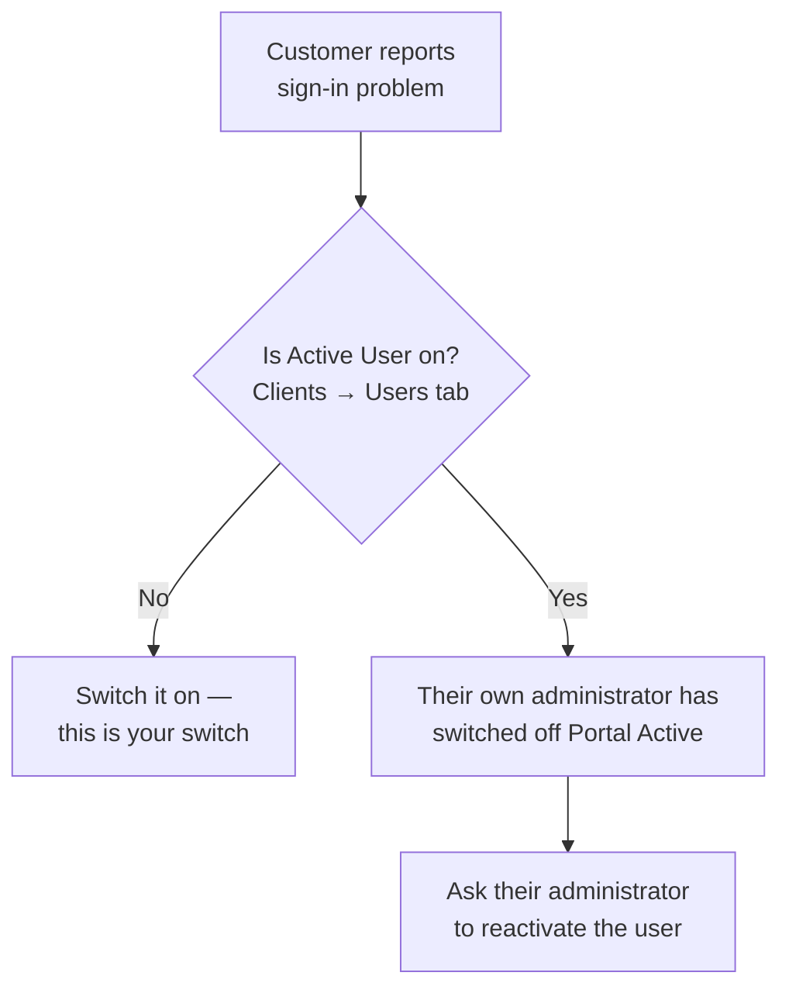

# 015 — Common Business Scenarios

Step-by-step recipes for the tasks you will do most often.

---

## For Client Portal Users

### Scenario 1 — Place your first request

**Goal:** get a price for a set of products.

1. Sign in. You land on **Home**.
2. In the header, open the wishlist selector and choose **New**.
3. Give it a clear name — *"Q3 lab restock"*, not *"list 1"*.
4. Browse using **Products** or **Brands**, or type in the search box.
5. Open a product, choose a variant if it has options, set the quantity, and **Add**.
6. Repeat for everything you need.
7. Open **Company Profile → Wishlists** and open your wishlist.
8. Set the **Planned Date** — when you need the goods.
9. Enter a **Target Price** on each line if you have a budget in mind.
10. Click **Submit RFQ**.

**What happens next:** your Account Manager is notified. The request moves out of Wishlists and
into **RFQs**. You will be notified when the quotation arrives.

---

### Scenario 2 — Accept a quotation and place the order

1. You receive a notification and an e-mail that a quotation is ready.
2. Open **Company Profile → RFQs** and open the record.
3. Review the lines — check quantities, prices, discounts and the total.
4. Read the **Account Manager Comment**; conditions and lead times are recorded there.
5. If you are happy, click **Submit PO**.
6. Upload your Purchase Order. **It must be a PDF.**
7. Confirm.

**What happens next:** your Account Manager confirms the order, and it moves to **Orders**.

**If you are not happy:** use **Open Chat** to discuss it, or **Update RFQ** to change the request
and submit it again.

---

### Scenario 3 — Reorder something you buy regularly

The fastest route is to copy.

1. Open **Company Profile → Orders**.
2. Find the previous order.
3. Click 📋 **Copy**.
4. A new wishlist is created with the same products.
5. Adjust quantities and the planned date.
6. **Submit RFQ**.

This works on any record at any stage — including archived ones.

---

### Scenario 4 — Ask for something not in the catalogue

1. Open the wishlist or RFQ it belongs to.
2. Go to the **Product Requests** panel.
3. Enter the product name, a description, the quantity, and a reference link if you have one.
4. Submit.

**What happens next:** your Account Manager marks it *In Progress* while sourcing. If they find
it, the product appears as a normal line on your order automatically. If not, it is marked
*Product Not Found*.

**Tip:** include a reference URL. It removes all ambiguity about what you are asking for.

---

### Scenario 5 — Get advice before committing

Use **Share wishlist** instead of Submit RFQ.

1. Build your wishlist as normal.
2. Open it and click **Share wishlist**.
3. Use **Open Chat** to explain what you need help with.

Your Account Manager is notified and can see the list, but it stays a draft in your hands. Nothing
is formally requested until you submit it.

---

### Scenario 6 — Add a new colleague *(Company Administrators)*

1. User menu → **Company Profile → Users**.
2. **Add user**.
3. Enter their full name and e-mail (both required), plus phone if you have it.
4. Assign any tags.
5. Save.
6. Ask your Account Manager to send the invitation.

**If they cannot sign in:** check both switches — *Status* is yours, *Account Manager Approved* is
SAMTIA's.

---

## For Account Manager Portal Users

### Scenario 7 — Work through a new request

1. Sign in. The **Dashboard** shows your Work Items.
2. Open a request, or go to **Orders management → RFQ Quotations**.
3. Open it with 👁 **View Details**.
4. Read the **Target Price** column — this is what the customer needs.
5. Check the **Product Requests** panel and resolve anything outstanding.
6. Set the **Discount %** on each line until the commercials work.
7. Adjust quantities, remove unsupplied lines, add alternatives with **Add Products**.
8. Write an **Account Manager Comment** for anything the customer must know.
9. Click **Send Quotation**.

The quotation is produced, e-mailed and the customer notified — all in that one click. **Check
your prices before clicking.**

---

### Scenario 8 — Confirm an order

1. Go to **Orders management → Quotations**.
2. Find records showing *PO Submitted* in the State column.
3. Open one and review the customer's Purchase Order in the attachments.
4. If everything is correct, click **Confirm**.

The order becomes real business and moves to **Orders**.

---

### Scenario 9 — Return an incorrect Purchase Order

1. Open the order showing *PO Submitted*.
2. Click **Return**.
3. Enter a specific reason at the prompt.
4. Confirm.

The customer sees your reason as the **Return Reason** on their order and can correct and
resubmit.

**Write it as an instruction:** *"PO references quotation Q-1042; this order is Q-1051 — please
reissue against the correct number"* gets a corrected PO the same day. *"Incorrect PO"* does not.

---

### Scenario 10 — Chase a quiet quotation

1. Go to **Orders management → Quotations**.
2. Open the column chooser and switch on **Reviewed Date** and **Print Quotation Date**.
3. Read the pattern:

| What you see          | What to do                                                                             |
| --------------------- | -------------------------------------------------------------------------------------- |
| No Reviewed Date      | They have not opened it. Chat or call — do not assume they are considering it         |
| Reviewed, not printed | Seen and under consideration. A short chat message is appropriate                      |
| Printed               | Likely circulating for internal approval. Ask if anything is needed to help it through |

4. Check **Dashboard → Online Users** before sending a chat message.

---

### Scenario 11 — A shared wishlist arrives

1. Go to **Orders management → Shared wishlist**.
2. Open the record.
3. Click **Open Chat** and ask what the customer needs.
4. Advise — availability, alternatives, indicative pricing.
5. Click **Reply Done** to clear the attention flag.

Encourage the customer to submit it as an RFQ when they are ready. This queue is where deals are
shaped before they are formalised.

---

### Scenario 12 — Set up a new customer

1. Check **Clients management → Clients Categories** — does the right segment exist with the
   right price list?
2. **Clients management → Clients → New Client**.
3. Complete Company Info: name, Tax ID, e-mail, phone, address.
4. **Set the Account manager** — usually yourself. Requests may go unnoticed if this is wrong.
5. Set the **Client category** and confirm the resulting price list.
6. Go to the **Users** tab and create their first user — make this person their Company
   Administrator.
7. Click **Send invitation**.

The customer's administrator can then create the rest of their team without coming back to you.

---

### Scenario 13 — A customer cannot see a product

Work down this list in order. The last step is almost always the answer.

| Check                                                                 | Where                             |
| --------------------------------------------------------------------- | --------------------------------- |
| Does the product exist?                                               | Products management → Products   |
| Is it**Published**?                                             | Product form → General tab       |
| Does it have a**Category**?                                     | Product form → General tab       |
| **Is there a price rule for it on that customer's price list?** | Pricelists → the customer's list |

A product with no price rule on a customer's price list is invisible to that customer, however
correctly everything else is set up.

---

### Scenario 14 — A customer's people cannot sign in

Both switches must be on. Yours is *Active User*; theirs is *Portal Active*.

---

### Scenario 15 — Launch a promotion for one customer

1. **Clients management → Clients**, open the customer.
2. Go to the **Banners** tab.
3. Create a banner with an image and description.
4. Set the **active period** so it starts and stops automatically.
5. Add a promotion link and any related products or categories.

The banner appears on that customer's Home page only, for the dates you set.

For the pricing side, add rules with a **Valid Period** to the relevant price list — see
[012](012-Account-Manager-Portal-Pricing.md).

---

## Quick Troubleshooting

| Symptom                                        | Most likely cause                                                       |
| ---------------------------------------------- | ----------------------------------------------------------------------- |
| Customer cannot see a product                  | No price rule on their price list                                       |
| Customer cannot sign in                        | One of the two activation switches is off                               |
| Account Manager never saw a request            | The client is assigned to a different Account Manager                   |
| Quotation looks different from what was sent   | The customer edited it without resubmitting                             |
| Shared wishlist queue is full of handled items | Nobody clicked **Reply Done**                                    |
| Customer says they never received a quotation  | Check Reviewed Date; also confirm their e-mail address                  |
| Prices are wrong for one customer              | Check whether an individual price list overrides their category default |
| Purchase Order will not upload                 | It must be a PDF                                                        |
| Wishlist cannot be submitted                   | It has no products, or it has already been submitted                    |
| Wishlist cannot be deleted                     | Only its creator can delete it; after submission, archive instead       |
