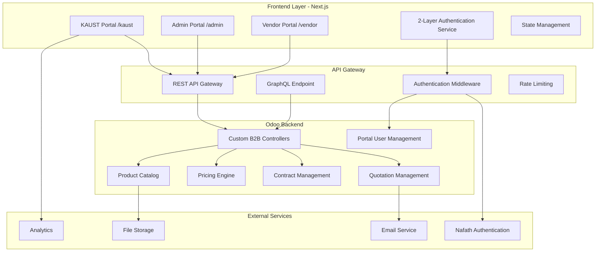
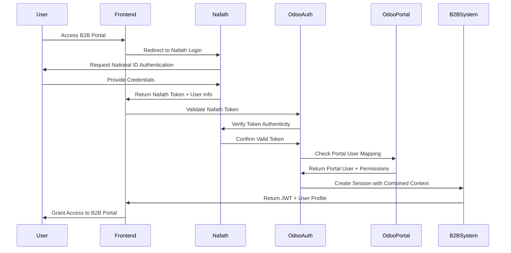

# Custom B2B E-Commerce Technical Solution

## Overview

Based on the analysis of Odoo's e-commerce architecture and the specific requirements for a B2B portal serving KAUST through Zenith Arabia, this document outlines a comprehensive technical solution using **Next.js as the frontend portal** integrated with **Odoo 18 as the backend ERP system**.

## Business Requirements Summary

### Key Stakeholders
- **Zenith Arabia**: Vendor/Supplier managing catalogs, pricing, and fulfillment
- **KAUST**: Customer with multiple departments and purchasing workflows
- **Merchandiser**: Catalog and SKU management
- **Account Manager**: Contract and pricing management
- **KAUST Users**: Purchasing representatives and managers

### Core Features Required
1. **Multi-tenant B2B Portal** with customer-specific branding
2. **Frame Contract Management** with SLAs and compliance monitoring
3. **Customer-specific Pricing** with multiple price lists and dynamic discounts
4. **Quotation/Purchase Order Workflow** with negotiation capabilities
5. **Product Catalog Management** with variants and accessories
6. **2-Layer Secure Authentication** via Nafath + Odoo Portal integration
7. **Real-time Order Tracking** and history management

## Proposed Technical Architecture

### System Architecture Overview



### Technology Stack

#### Frontend (Next.js 15)
- **Framework**: Next.js 15 with App Router
- **UI Library**: React 18 with TypeScript
- **Styling**: Tailwind CSS with customer theming
- **State Management**: Zustand or Redux Toolkit
- **API Client**: TanStack Query (React Query) + Axios
- **Authentication**: NextAuth.js with custom 2-layer provider (Nafath + Odoo Portal)
- **Forms**: React Hook Form with Zod validation
- **Charts**: Recharts or Chart.js
- **Testing**: Jest + React Testing Library

#### Backend (Odoo 18)
- **Core**: Odoo Community/Enterprise 18
- **Database**: PostgreSQL 15+
- **Cache**: Redis for session and API caching
- **Queue**: Celery for background tasks
- **File Storage**: MinIO or AWS S3
- **Monitoring**: Prometheus + Grafana

#### Infrastructure
- **Containerization**: Docker + Docker Compose
- **Reverse Proxy**: Nginx with SSL termination
- **CI/CD**: GitHub Actions or GitLab CI
- **Hosting**: Cloud VPS or Kubernetes cluster

## 2-Layer Authentication Architecture

### Authentication Flow Overview

The system implements a sophisticated 2-layer authentication approach that combines:
1. **Layer 1**: Nafath Authentication (Saudi National Identity Verification)
2. **Layer 2**: Odoo Portal User Authentication (Business Context & Permissions)



### Authentication Models

#### 1. Nafath User Mapping Model

```python
class NafathUserMapping(models.Model):
    _name = 'nafath.user.mapping'
    _description = 'Nafath to Odoo User Mapping'

    nafath_id = fields.Char(string='Nafath ID', required=True, index=True)
    national_id = fields.Char(string='National ID', required=True, index=True)
    nafath_email = fields.Char(string='Nafath Email')
    nafath_name = fields.Char(string='Nafath Name')
    nafath_phone = fields.Char(string='Nafath Phone')

    # Odoo Portal User Link
    portal_user_id = fields.Many2one('res.users', string='Portal User', required=True)

    # B2B Context
    b2b_customer_id = fields.Many2one('b2b.customer', string='B2B Customer')

    # Verification Status
    verification_status = fields.Selection([
        ('pending', 'Pending Verification'),
        ('verified', 'Verified'),
        ('rejected', 'Rejected'),
        ('suspended', 'Suspended')
    ], default='pending')

    # Audit Fields
    first_login_date = fields.Datetime(string='First Login')
    last_login_date = fields.Datetime(string='Last Login')
    login_count = fields.Integer(string='Login Count', default=0)

    # Security
    is_active = fields.Boolean(string='Active', default=True)
    security_notes = fields.Text(string='Security Notes')

    _sql_constraints = [
        ('unique_nafath_id', 'unique(nafath_id)', 'Nafath ID must be unique'),
        ('unique_national_id', 'unique(national_id)', 'National ID must be unique'),
        ('unique_portal_user', 'unique(portal_user_id)', 'Portal user can only be linked to one Nafath account')
    ]
```

#### 2. Enhanced Portal User Model

```python
class ResUsers(models.Model):
    _inherit = 'res.users'

    # Nafath Integration
    nafath_mapping_id = fields.One2many('nafath.user.mapping', 'portal_user_id', string='Nafath Mapping')
    is_nafath_verified = fields.Boolean(string='Nafath Verified', compute='_compute_nafath_verified')

    # B2B Portal Specific
    b2b_profile_ids = fields.One2many('b2b.user.profile', 'user_id', string='B2B Profiles')
    primary_b2b_customer_id = fields.Many2one('b2b.customer', string='Primary B2B Customer')

    # Portal Access Control
    portal_access_level = fields.Selection([
        ('basic', 'Basic Access'),
        ('advanced', 'Advanced Access'),
        ('admin', 'Customer Admin')
    ], default='basic')

    # Department & Role Context
    department = fields.Char(string='Department')
    job_title = fields.Char(string='Job Title')
    approval_limit = fields.Monetary(string='Approval Limit')

    @api.depends('nafath_mapping_id.verification_status')
    def _compute_nafath_verified(self):
        for user in self:
            user.is_nafath_verified = any(
                mapping.verification_status == 'verified'
                for mapping in user.nafath_mapping_id
            )

    def check_b2b_access(self, customer_code):
        """Check if user has access to specific B2B customer"""
        return any(
            profile.customer_id.code == customer_code
            for profile in self.b2b_profile_ids
        )
```

#### 3. B2B User Profile Model

```python
class B2BUserProfile(models.Model):
    _name = 'b2b.user.profile'
    _description = 'B2B User Profile with Customer Context'

    user_id = fields.Many2one('res.users', required=True, ondelete='cascade')
    customer_id = fields.Many2one('b2b.customer', required=True)

    # Role & Permissions
    role = fields.Selection([
        ('buyer', 'Buyer'),
        ('approver', 'Approver'),
        ('admin', 'Customer Administrator'),
        ('viewer', 'View Only')
    ], required=True, default='buyer')

    # Department Context
    department = fields.Char(string='Department')
    cost_center = fields.Char(string='Cost Center')

    # Approval Workflow
    approval_limit = fields.Monetary(string='Approval Limit')
    requires_approval_above = fields.Monetary(string='Requires Approval Above')
    approver_user_ids = fields.Many2many('res.users', string='Approvers')

    # Access Control
    can_create_quotations = fields.Boolean(string='Can Create Quotations', default=True)
    can_approve_quotations = fields.Boolean(string='Can Approve Quotations')
    can_view_contracts = fields.Boolean(string='Can View Contracts', default=True)
    can_manage_users = fields.Boolean(string='Can Manage Users')

    # Product Access
    allowed_category_ids = fields.Many2many('product.category', string='Allowed Categories')
    restricted_product_ids = fields.Many2many('product.product', string='Restricted Products')

    # Status
    is_active = fields.Boolean(string='Active', default=True)
    activation_date = fields.Date(string='Activation Date', default=fields.Date.today)
    deactivation_date = fields.Date(string='Deactivation Date')

    _sql_constraints = [
        ('unique_user_customer', 'unique(user_id, customer_id)',
         'User can only have one profile per customer')
    ]

## Authentication Controllers

### 1. Nafath Authentication Controller

```python
# controllers/nafath_auth.py
import requests
import logging
from datetime import datetime, timedelta

from odoo import http, fields, exceptions
from odoo.http import request
from odoo.tools import config

_logger = logging.getLogger(__name__)

class NafathAuthController(http.Controller):

    @http.route('/api/v1/auth/nafath/initiate', type='json', auth='none', methods=['POST'])
    def initiate_nafath_login(self, **kwargs):
        """Initiate Nafath authentication process"""
        try:
            # Get Nafath configuration
            nafath_config = self._get_nafath_config()

            # Generate state parameter for security
            state = self._generate_state_token()

            # Store state in session for validation
            request.session['nafath_state'] = state
            request.session['nafath_initiated_at'] = datetime.now().isoformat()

            # Build Nafath authorization URL
            auth_url = self._build_nafath_auth_url(nafath_config, state)

            return {
                'success': True,
                'auth_url': auth_url,
                'state': state
            }

        except Exception as e:
            _logger.error(f"Failed to initiate Nafath login: {str(e)}")
            return {
                'success': False,
                'error': 'Failed to initiate authentication'
            }

    @http.route('/api/v1/auth/nafath/callback', type='json', auth='none', methods=['POST'])
    def nafath_callback(self, **kwargs):
        """Handle Nafath authentication callback"""
        try:
            # Validate state parameter
            received_state = kwargs.get('state')
            stored_state = request.session.get('nafath_state')

            if not received_state or received_state != stored_state:
                raise exceptions.AccessDenied('Invalid state parameter')

            # Check session timeout (5 minutes)
            initiated_at = request.session.get('nafath_initiated_at')
            if initiated_at:
                initiated_time = datetime.fromisoformat(initiated_at)
                if datetime.now() - initiated_time > timedelta(minutes=5):
                    raise exceptions.AccessDenied('Authentication session expired')

            # Exchange authorization code for access token
            auth_code = kwargs.get('code')
            if not auth_code:
                raise exceptions.AccessDenied('Missing authorization code')

            nafath_token_data = self._exchange_code_for_token(auth_code)

            # Get user info from Nafath
            nafath_user_info = self._get_nafath_user_info(nafath_token_data['access_token'])

            # Process the 2-layer authentication
            auth_result = self._process_two_layer_auth(nafath_user_info, nafath_token_data)

            # Clean up session
            request.session.pop('nafath_state', None)
            request.session.pop('nafath_initiated_at', None)

            return auth_result

        except Exception as e:
            _logger.error(f"Nafath callback error: {str(e)}")
            return {
                'success': False,
                'error': str(e) if isinstance(e, exceptions.AccessDenied) else 'Authentication failed'
            }

    def _process_two_layer_auth(self, nafath_user_info, nafath_token_data):
        """Process 2-layer authentication: Nafath + Odoo Portal"""

        # Layer 1: Validate Nafath user
        nafath_id = nafath_user_info.get('sub')
        national_id = nafath_user_info.get('national_id')

        if not nafath_id or not national_id:
            raise exceptions.AccessDenied('Invalid Nafath user information')

        # Layer 2: Find or create Nafath mapping
        nafath_mapping = self._get_or_create_nafath_mapping(nafath_user_info)

        # Validate portal user status
        portal_user = nafath_mapping.portal_user_id
        if not portal_user or not portal_user.active:
            raise exceptions.AccessDenied('Portal user not found or inactive')

        # Check B2B customer access
        if not portal_user.b2b_profile_ids:
            raise exceptions.AccessDenied('No B2B customer access configured')

        # Update login tracking
        self._update_login_tracking(nafath_mapping)

        # Generate JWT token with combined context
        jwt_token = self._generate_jwt_token(portal_user, nafath_mapping)

        # Prepare user profile data
        user_profile = self._build_user_profile(portal_user, nafath_mapping)

        return {
            'success': True,
            'token': jwt_token,
            'user': user_profile,
            'expires_in': 86400  # 24 hours
        }

    def _get_or_create_nafath_mapping(self, nafath_user_info):
        """Get existing or create new Nafath user mapping"""
        NafathMapping = request.env['nafath.user.mapping'].sudo()

        nafath_id = nafath_user_info.get('sub')
        national_id = nafath_user_info.get('national_id')

        # Try to find existing mapping
        mapping = NafathMapping.search([
            ('nafath_id', '=', nafath_id)
        ], limit=1)

        if mapping:
            # Update user info if changed
            mapping.write({
                'nafath_email': nafath_user_info.get('email'),
                'nafath_name': nafath_user_info.get('name'),
                'nafath_phone': nafath_user_info.get('phone'),
            })
            return mapping

        # Check if portal user exists by national ID or email
        portal_user = self._find_portal_user_by_nafath_info(nafath_user_info)

        if not portal_user:
            # Create new portal user if auto-registration is enabled
            if self._is_auto_registration_enabled():
                portal_user = self._create_portal_user_from_nafath(nafath_user_info)
            else:
                raise exceptions.AccessDenied(
                    'Portal user not found. Please contact administrator for account setup.'
                )

        # Create new mapping
        mapping = NafathMapping.create({
            'nafath_id': nafath_id,
            'national_id': national_id,
            'nafath_email': nafath_user_info.get('email'),
            'nafath_name': nafath_user_info.get('name'),
            'nafath_phone': nafath_user_info.get('phone'),
            'portal_user_id': portal_user.id,
            'verification_status': 'verified',
            'first_login_date': fields.Datetime.now()
        })

        return mapping

    def _find_portal_user_by_nafath_info(self, nafath_user_info):
        """Find existing portal user by Nafath information"""
        Users = request.env['res.users'].sudo()

        # Try to find by email first
        email = nafath_user_info.get('email')
        if email:
            user = Users.search([
                ('email', '=', email),
                ('share', '=', True)  # Portal users only
            ], limit=1)
            if user:
                return user

        # Try to find by national ID in partner
        national_id = nafath_user_info.get('national_id')
        if national_id:
            partner = request.env['res.partner'].sudo().search([
                ('vat', '=', national_id)  # Assuming national ID stored in VAT field
            ], limit=1)
            if partner:
                user = Users.search([
                    ('partner_id', '=', partner.id),
                    ('share', '=', True)
                ], limit=1)
                if user:
                    return user

        return None

    def _create_portal_user_from_nafath(self, nafath_user_info):
        """Create new portal user from Nafath information"""
        # This should only be used if auto-registration is enabled
        # and proper validation/approval workflow is in place

        partner_vals = {
            'name': nafath_user_info.get('name'),
            'email': nafath_user_info.get('email'),
            'phone': nafath_user_info.get('phone'),
            'vat': nafath_user_info.get('national_id'),
            'is_company': False,
            'customer_rank': 1
        }

        partner = request.env['res.partner'].sudo().create(partner_vals)

        user_vals = {
            'name': nafath_user_info.get('name'),
            'login': nafath_user_info.get('email'),
            'email': nafath_user_info.get('email'),
            'partner_id': partner.id,
            'share': True,  # Portal user
            'groups_id': [(6, 0, [request.env.ref('base.group_portal').id])]
        }

        user = request.env['res.users'].sudo().create(user_vals)

        # Send welcome email
        self._send_welcome_email(user)

        return user

### 2. Portal Authentication Controller

```python
# controllers/portal_auth.py
class PortalAuthController(http.Controller):

    @http.route('/api/v1/auth/portal/validate', type='json', auth='user', methods=['POST'])
    def validate_portal_access(self, **kwargs):
        """Validate portal user access and return B2B context"""
        try:
            user = request.env.user

            # Check if user is portal user
            if not user.share:
                raise exceptions.AccessDenied('Not a portal user')

            # Get B2B profiles
            b2b_profiles = user.b2b_profile_ids.filtered('is_active')
            if not b2b_profiles:
                raise exceptions.AccessDenied('No active B2B profiles found')

            # Build customer access list
            customer_access = []
            for profile in b2b_profiles:
                customer_access.append({
                    'customer_code': profile.customer_id.code,
                    'customer_name': profile.customer_id.name,
                    'role': profile.role,
                    'permissions': {
                        'can_create_quotations': profile.can_create_quotations,
                        'can_approve_quotations': profile.can_approve_quotations,
                        'can_view_contracts': profile.can_view_contracts,
                        'can_manage_users': profile.can_manage_users,
                        'approval_limit': profile.approval_limit
                    },
                    'department': profile.department,
                    'cost_center': profile.cost_center
                })

            return {
                'success': True,
                'user_id': user.id,
                'customer_access': customer_access,
                'primary_customer': user.primary_b2b_customer_id.code if user.primary_b2b_customer_id else None
            }

        except Exception as e:
            return {
                'success': False,
                'error': str(e)
            }

    @http.route('/api/v1/auth/portal/switch-customer', type='json', auth='user', methods=['POST'])
    def switch_customer_context(self, **kwargs):
        """Switch user's active customer context"""
        try:
            customer_code = kwargs.get('customer_code')
            if not customer_code:
                raise exceptions.ValidationError('Customer code is required')

            user = request.env.user

            # Find the B2B profile for the requested customer
            profile = user.b2b_profile_ids.filtered(
                lambda p: p.customer_id.code == customer_code and p.is_active
            )

            if not profile:
                raise exceptions.AccessDenied(f'No access to customer: {customer_code}')

            # Update user's primary customer
            user.write({'primary_b2b_customer_id': profile.customer_id.id})

            # Generate new JWT token with updated context
            jwt_token = self._generate_jwt_token_with_customer_context(user, profile)

            return {
                'success': True,
                'token': jwt_token,
                'customer_context': {
                    'customer_code': profile.customer_id.code,
                    'customer_name': profile.customer_id.name,
                    'role': profile.role,
                    'permissions': {
                        'can_create_quotations': profile.can_create_quotations,
                        'can_approve_quotations': profile.can_approve_quotations,
                        'can_view_contracts': profile.can_view_contracts,
                        'can_manage_users': profile.can_manage_users,
                        'approval_limit': profile.approval_limit
                    }
                }
            }

        except Exception as e:
            return {
                'success': False,
                'error': str(e)
            }

    @http.route('/api/v1/auth/portal/profile', type='json', auth='user', methods=['GET'])
    def get_user_profile(self):
        """Get current user's complete profile"""
        try:
            user = request.env.user

            # Get Nafath mapping if exists
            nafath_mapping = user.nafath_mapping_id.filtered('is_active')

            profile_data = {
                'user_id': user.id,
                'name': user.name,
                'email': user.email,
                'phone': user.phone,
                'is_nafath_verified': user.is_nafath_verified,
                'portal_access_level': user.portal_access_level,
                'department': user.department,
                'job_title': user.job_title,
                'approval_limit': user.approval_limit,
                'primary_customer': user.primary_b2b_customer_id.code if user.primary_b2b_customer_id else None,
                'last_login': user.login_date.isoformat() if user.login_date else None
            }

            # Add Nafath information if available
            if nafath_mapping:
                mapping = nafath_mapping[0]
                profile_data['nafath_info'] = {
                    'nafath_id': mapping.nafath_id,
                    'national_id': mapping.national_id,
                    'verification_status': mapping.verification_status,
                    'last_login': mapping.last_login_date.isoformat() if mapping.last_login_date else None,
                    'login_count': mapping.login_count
                }

            # Add B2B profiles
            b2b_profiles = []
            for profile in user.b2b_profile_ids.filtered('is_active'):
                b2b_profiles.append({
                    'customer_code': profile.customer_id.code,
                    'customer_name': profile.customer_id.name,
                    'role': profile.role,
                    'department': profile.department,
                    'cost_center': profile.cost_center,
                    'approval_limit': profile.approval_limit,
                    'permissions': {
                        'can_create_quotations': profile.can_create_quotations,
                        'can_approve_quotations': profile.can_approve_quotations,
                        'can_view_contracts': profile.can_view_contracts,
                        'can_manage_users': profile.can_manage_users
                    }
                })

            profile_data['b2b_profiles'] = b2b_profiles

            return {
                'success': True,
                'profile': profile_data
            }

        except Exception as e:
            return {
                'success': False,
                'error': str(e)
            }

### 3. JWT Token Management

```python
# security/jwt_manager.py
import jwt
from datetime import datetime, timedelta
from odoo import http, exceptions
from odoo.http import request

class JWTManager:

    @staticmethod
    def generate_token(user, nafath_mapping=None, customer_context=None):
        """Generate JWT token with 2-layer authentication context"""

        # Base payload
        payload = {
            'user_id': user.id,
            'email': user.email,
            'name': user.name,
            'is_portal_user': user.share,
            'portal_access_level': user.portal_access_level,
            'iat': datetime.utcnow(),
            'exp': datetime.utcnow() + timedelta(hours=24)
        }

        # Add Nafath context if available
        if nafath_mapping:
            payload['nafath'] = {
                'nafath_id': nafath_mapping.nafath_id,
                'national_id': nafath_mapping.national_id,
                'verification_status': nafath_mapping.verification_status,
                'verified': nafath_mapping.verification_status == 'verified'
            }

        # Add B2B customer context
        if customer_context:
            payload['customer'] = {
                'customer_code': customer_context.customer_id.code,
                'customer_name': customer_context.customer_id.name,
                'role': customer_context.role,
                'department': customer_context.department,
                'approval_limit': customer_context.approval_limit,
                'permissions': {
                    'can_create_quotations': customer_context.can_create_quotations,
                    'can_approve_quotations': customer_context.can_approve_quotations,
                    'can_view_contracts': customer_context.can_view_contracts,
                    'can_manage_users': customer_context.can_manage_users
                }
            }
        elif user.primary_b2b_customer_id:
            # Use primary customer if no specific context provided
            primary_profile = user.b2b_profile_ids.filtered(
                lambda p: p.customer_id.id == user.primary_b2b_customer_id.id
            )
            if primary_profile:
                payload['customer'] = {
                    'customer_code': primary_profile.customer_id.code,
                    'customer_name': primary_profile.customer_id.name,
                    'role': primary_profile.role,
                    'department': primary_profile.department,
                    'approval_limit': primary_profile.approval_limit,
                    'permissions': {
                        'can_create_quotations': primary_profile.can_create_quotations,
                        'can_approve_quotations': primary_profile.can_approve_quotations,
                        'can_view_contracts': primary_profile.can_view_contracts,
                        'can_manage_users': primary_profile.can_manage_users
                    }
                }

        # Get JWT secret
        secret_key = request.env['ir.config_parameter'].sudo().get_param('b2b.jwt_secret_key')
        if not secret_key:
            raise exceptions.ValidationError('JWT secret key not configured')

        return jwt.encode(payload, secret_key, algorithm='HS256')

    @staticmethod
    def verify_token(token):
        """Verify and decode JWT token"""
        try:
            secret_key = request.env['ir.config_parameter'].sudo().get_param('b2b.jwt_secret_key')
            payload = jwt.decode(token, secret_key, algorithms=['HS256'])

            # Validate user still exists and is active
            user = request.env['res.users'].sudo().browse(payload['user_id'])
            if not user.exists() or not user.active:
                raise exceptions.AccessDenied('User not found or inactive')

            # Validate Nafath verification if present
            if 'nafath' in payload:
                nafath_mapping = user.nafath_mapping_id.filtered(
                    lambda m: m.nafath_id == payload['nafath']['nafath_id']
                )
                if not nafath_mapping or nafath_mapping.verification_status != 'verified':
                    raise exceptions.AccessDenied('Nafath verification invalid')

            return payload

        except jwt.ExpiredSignatureError:
            raise exceptions.AccessDenied('Token has expired')
        except jwt.InvalidTokenError:
            raise exceptions.AccessDenied('Invalid token')

    @staticmethod
    def refresh_token(current_token):
        """Refresh JWT token if valid and not expired soon"""
        try:
            payload = JWTManager.verify_token(current_token)

            # Check if token expires within next hour
            exp_time = datetime.fromtimestamp(payload['exp'])
            if exp_time - datetime.utcnow() > timedelta(hours=1):
                return current_token  # Token still valid for more than 1 hour

            # Generate new token
            user = request.env['res.users'].sudo().browse(payload['user_id'])
            nafath_mapping = None
            customer_context = None

            if 'nafath' in payload:
                nafath_mapping = user.nafath_mapping_id.filtered(
                    lambda m: m.nafath_id == payload['nafath']['nafath_id']
                )[0]

            if 'customer' in payload:
                customer_context = user.b2b_profile_ids.filtered(
                    lambda p: p.customer_id.code == payload['customer']['customer_code']
                )[0]

            return JWTManager.generate_token(user, nafath_mapping, customer_context)

        except Exception as e:
            raise exceptions.AccessDenied(f'Token refresh failed: {str(e)}')

## Frontend Authentication Implementation

### 1. NextAuth.js Configuration with 2-Layer Provider

```typescript
// lib/auth/auth-config.ts
import { NextAuthOptions } from 'next-auth'
import { JWT } from 'next-auth/jwt'

interface NafathProfile {
  sub: string
  name: string
  email: string
  national_id: string
  phone?: string
}

interface OdooAuthResponse {
  success: boolean
  token: string
  user: {
    id: number
    name: string
    email: string
    customer_access: Array<{
      customer_code: string
      customer_name: string
      role: string
      permissions: Record<string, any>
    }>
    primary_customer?: string
  }
  expires_in: number
}

export const authOptions: NextAuthOptions = {
  providers: [
    {
      id: 'nafath-odoo',
      name: 'Nafath + Odoo Portal',
      type: 'oauth',
      authorization: {
        url: process.env.NAFATH_AUTHORIZATION_URL!,
        params: {
          scope: 'openid profile email national_id',
          response_type: 'code',
          client_id: process.env.NAFATH_CLIENT_ID!,
        },
      },
      token: process.env.NAFATH_TOKEN_URL!,
      userinfo: process.env.NAFATH_USERINFO_URL!,
      clientId: process.env.NAFATH_CLIENT_ID!,
      clientSecret: process.env.NAFATH_CLIENT_SECRET!,

      profile: async (profile: NafathProfile, tokens) => {
        // Step 1: Nafath authentication completed
        // Step 2: Process through Odoo 2-layer authentication

        try {
          const response = await fetch(`${process.env.ODOO_API_URL}/api/v1/auth/nafath/callback`, {
            method: 'POST',
            headers: {
              'Content-Type': 'application/json',
            },
            body: JSON.stringify({
              code: tokens.access_token,
              state: tokens.state,
              nafath_user_info: profile,
            }),
          })

          const authResult: OdooAuthResponse = await response.json()

          if (!authResult.success) {
            throw new Error(authResult.error || 'Authentication failed')
          }

          return {
            id: profile.sub,
            name: profile.name,
            email: profile.email,
            nafathId: profile.sub,
            nationalId: profile.national_id,
            odooToken: authResult.token,
            odooUser: authResult.user,
          }
        } catch (error) {
          console.error('2-layer authentication failed:', error)
          throw error
        }
      },
    },
  ],

  callbacks: {
    async jwt({ token, account, profile, user }) {
      // Store Odoo authentication data in JWT
      if (account && user) {
        token.nafathId = user.nafathId
        token.nationalId = user.nationalId
        token.odooToken = user.odooToken
        token.odooUser = user.odooUser
        token.tokenExpiry = Date.now() + (24 * 60 * 60 * 1000) // 24 hours
      }

      // Check if token needs refresh
      if (token.tokenExpiry && Date.now() > token.tokenExpiry - (60 * 60 * 1000)) {
        try {
          const refreshedToken = await refreshOdooToken(token.odooToken as string)
          token.odooToken = refreshedToken
          token.tokenExpiry = Date.now() + (24 * 60 * 60 * 1000)
        } catch (error) {
          console.error('Token refresh failed:', error)
          // Force re-authentication
          token.error = 'RefreshTokenError'
        }
      }

      return token
    },

    async session({ session, token }) {
      if (token.error) {
        session.error = token.error
        return session
      }

      session.nafathId = token.nafathId as string
      session.nationalId = token.nationalId as string
      session.odooToken = token.odooToken as string
      session.odooUser = token.odooUser as any

      return session
    },
  },

  pages: {
    signIn: '/auth/signin',
    error: '/auth/error',
  },

  session: {
    strategy: 'jwt',
    maxAge: 24 * 60 * 60, // 24 hours
  },
}

async function refreshOdooToken(currentToken: string): Promise<string> {
  const response = await fetch(`${process.env.ODOO_API_URL}/api/v1/auth/refresh`, {
    method: 'POST',
    headers: {
      'Authorization': `Bearer ${currentToken}`,
      'Content-Type': 'application/json',
    },
  })

  const result = await response.json()

  if (!result.success) {
    throw new Error('Token refresh failed')
  }

  return result.token
}
```

### 2. Authentication Context Provider

```typescript
// contexts/AuthContext.tsx
'use client'

import { createContext, useContext, useEffect, useState } from 'react'
import { useSession } from 'next-auth/react'
import { useRouter } from 'next/navigation'

interface CustomerAccess {
  customer_code: string
  customer_name: string
  role: string
  permissions: {
    can_create_quotations: boolean
    can_approve_quotations: boolean
    can_view_contracts: boolean
    can_manage_users: boolean
    approval_limit: number
  }
  department?: string
  cost_center?: string
}

interface AuthContextType {
  isAuthenticated: boolean
  isLoading: boolean
  user: any
  customerAccess: CustomerAccess[]
  currentCustomer: CustomerAccess | null
  switchCustomer: (customerCode: string) => Promise<void>
  hasPermission: (permission: string) => boolean
  canApproveAmount: (amount: number) => boolean
}

const AuthContext = createContext<AuthContextType | undefined>(undefined)

export function AuthProvider({ children }: { children: React.ReactNode }) {
  const { data: session, status } = useSession()
  const router = useRouter()
  const [customerAccess, setCustomerAccess] = useState<CustomerAccess[]>([])
  const [currentCustomer, setCurrentCustomer] = useState<CustomerAccess | null>(null)
  const [isLoading, setIsLoading] = useState(true)

  useEffect(() => {
    if (status === 'loading') return

    if (status === 'unauthenticated') {
      setIsLoading(false)
      return
    }

    if (session?.error === 'RefreshTokenError') {
      // Force re-authentication
      router.push('/auth/signin')
      return
    }

    if (session?.odooUser) {
      const access = session.odooUser.customer_access || []
      setCustomerAccess(access)

      // Set current customer (primary or first available)
      const primaryCustomer = access.find(
        (c: CustomerAccess) => c.customer_code === session.odooUser.primary_customer
      )
      setCurrentCustomer(primaryCustomer || access[0] || null)
    }

    setIsLoading(false)
  }, [session, status, router])

  const switchCustomer = async (customerCode: string) => {
    try {
      const response = await fetch('/api/auth/switch-customer', {
        method: 'POST',
        headers: {
          'Content-Type': 'application/json',
          'Authorization': `Bearer ${session?.odooToken}`,
        },
        body: JSON.stringify({ customer_code: customerCode }),
      })

      const result = await response.json()

      if (result.success) {
        // Update session with new token and customer context
        const newCustomer = customerAccess.find(c => c.customer_code === customerCode)
        setCurrentCustomer(newCustomer || null)

        // Trigger session update
        window.location.reload()
      } else {
        throw new Error(result.error)
      }
    } catch (error) {
      console.error('Failed to switch customer:', error)
      throw error
    }
  }

  const hasPermission = (permission: string): boolean => {
    if (!currentCustomer) return false
    return currentCustomer.permissions[permission as keyof typeof currentCustomer.permissions] || false
  }

  const canApproveAmount = (amount: number): boolean => {
    if (!currentCustomer) return false
    return amount <= currentCustomer.permissions.approval_limit
  }

  const value: AuthContextType = {
    isAuthenticated: status === 'authenticated' && !!session?.odooUser,
    isLoading,
    user: session?.odooUser,
    customerAccess,
    currentCustomer,
    switchCustomer,
    hasPermission,
    canApproveAmount,
  }

  return <AuthContext.Provider value={value}>{children}</AuthContext.Provider>
}

export function useAuth() {
  const context = useContext(AuthContext)
  if (context === undefined) {
    throw new Error('useAuth must be used within an AuthProvider')
  }
  return context
}
```

### 3. Authentication Middleware

```typescript
// middleware.ts
import { withAuth } from 'next-auth/middleware'
import { NextResponse } from 'next/server'

export default withAuth(
  function middleware(req) {
    const token = req.nextauth.token
    const { pathname } = req.nextUrl

    // Check if accessing customer-specific routes
    const customerMatch = pathname.match(/^\/([^\/]+)\/(dashboard|catalog|quotations|orders|contracts)/)

    if (customerMatch) {
      const requestedCustomer = customerMatch[1]

      // Verify user has access to this customer
      const customerAccess = token?.odooUser?.customer_access || []
      const hasAccess = customerAccess.some(
        (access: any) => access.customer_code === requestedCustomer
      )

      if (!hasAccess) {
        return NextResponse.redirect(new URL('/unauthorized', req.url))
      }
    }

    // Check for admin routes
    if (pathname.startsWith('/admin')) {
      const isAdmin = token?.odooUser?.customer_access?.some(
        (access: any) => access.role === 'admin'
      )

      if (!isAdmin) {
        return NextResponse.redirect(new URL('/unauthorized', req.url))
      }
    }

    return NextResponse.next()
  },
  {
    callbacks: {
      authorized: ({ token, req }) => {
        // Allow access to auth pages without token
        if (req.nextUrl.pathname.startsWith('/auth/')) {
          return true
        }

        // Require valid token for protected routes
        return !!token?.odooToken
      },
    },
  }
)

export const config = {
  matcher: [
    /*
     * Match all request paths except for the ones starting with:
     * - api/auth (NextAuth.js routes)
     * - _next/static (static files)
     * - _next/image (image optimization files)
     * - favicon.ico (favicon file)
     * - public folder
     */
    '/((?!api/auth|_next/static|_next/image|favicon.ico|public).*)',
  ],
}
```

### 4. Customer Selector Component

```typescript
// components/auth/CustomerSelector.tsx
'use client'

import { useState } from 'react'
import { useAuth } from '@/contexts/AuthContext'
import { ChevronDownIcon, CheckIcon } from '@heroicons/react/24/outline'

export function CustomerSelector() {
  const { customerAccess, currentCustomer, switchCustomer } = useAuth()
  const [isOpen, setIsOpen] = useState(false)
  const [isLoading, setIsLoading] = useState(false)

  const handleCustomerSwitch = async (customerCode: string) => {
    if (customerCode === currentCustomer?.customer_code) {
      setIsOpen(false)
      return
    }

    setIsLoading(true)
    try {
      await switchCustomer(customerCode)
      setIsOpen(false)
    } catch (error) {
      console.error('Failed to switch customer:', error)
      // Show error message to user
    } finally {
      setIsLoading(false)
    }
  }

  if (customerAccess.length <= 1) {
    return (
      <div className="flex items-center space-x-2">
        <div className="w-8 h-8 bg-blue-100 rounded-full flex items-center justify-center">
          <span className="text-blue-600 font-medium text-sm">
            {currentCustomer?.customer_name?.charAt(0) || 'C'}
          </span>
        </div>
        <span className="font-medium text-gray-900">
          {currentCustomer?.customer_name || 'No Customer'}
        </span>
      </div>
    )
  }

  return (
    <div className="relative">
      <button
        onClick={() => setIsOpen(!isOpen)}
        disabled={isLoading}
        className="flex items-center space-x-2 px-3 py-2 rounded-lg border border-gray-300 bg-white hover:bg-gray-50 focus:outline-none focus:ring-2 focus:ring-blue-500 disabled:opacity-50"
      >
        <div className="w-8 h-8 bg-blue-100 rounded-full flex items-center justify-center">
          <span className="text-blue-600 font-medium text-sm">
            {currentCustomer?.customer_name?.charAt(0) || 'C'}
          </span>
        </div>
        <div className="text-left">
          <div className="font-medium text-gray-900">
            {currentCustomer?.customer_name || 'Select Customer'}
          </div>
          <div className="text-sm text-gray-500">
            {currentCustomer?.role || 'No Role'}
          </div>
        </div>
        <ChevronDownIcon className="w-4 h-4 text-gray-400" />
      </button>

      {isOpen && (
        <div className="absolute top-full left-0 mt-1 w-full min-w-64 bg-white border border-gray-200 rounded-lg shadow-lg z-50">
          <div className="py-1">
            {customerAccess.map((customer) => (
              <button
                key={customer.customer_code}
                onClick={() => handleCustomerSwitch(customer.customer_code)}
                disabled={isLoading}
                className="w-full flex items-center justify-between px-4 py-3 text-left hover:bg-gray-50 disabled:opacity-50"
              >
                <div className="flex items-center space-x-3">
                  <div className="w-8 h-8 bg-blue-100 rounded-full flex items-center justify-center">
                    <span className="text-blue-600 font-medium text-sm">
                      {customer.customer_name.charAt(0)}
                    </span>
                  </div>
                  <div>
                    <div className="font-medium text-gray-900">
                      {customer.customer_name}
                    </div>
                    <div className="text-sm text-gray-500">
                      {customer.role} • {customer.department || 'No Department'}
                    </div>
                  </div>
                </div>
                {customer.customer_code === currentCustomer?.customer_code && (
                  <CheckIcon className="w-4 h-4 text-blue-600" />
                )}
              </button>
            ))}
          </div>
        </div>
      )}
    </div>
  )
}
```

This 2-layer authentication system provides:

1. **Layer 1 - Nafath Authentication**: Verifies user identity through Saudi national ID system
2. **Layer 2 - Odoo Portal Authentication**: Validates business context, permissions, and customer access

The system ensures that users are both nationally verified and have proper business authorization to access specific customer portals and perform actions within their assigned roles and approval limits.
```
```
```