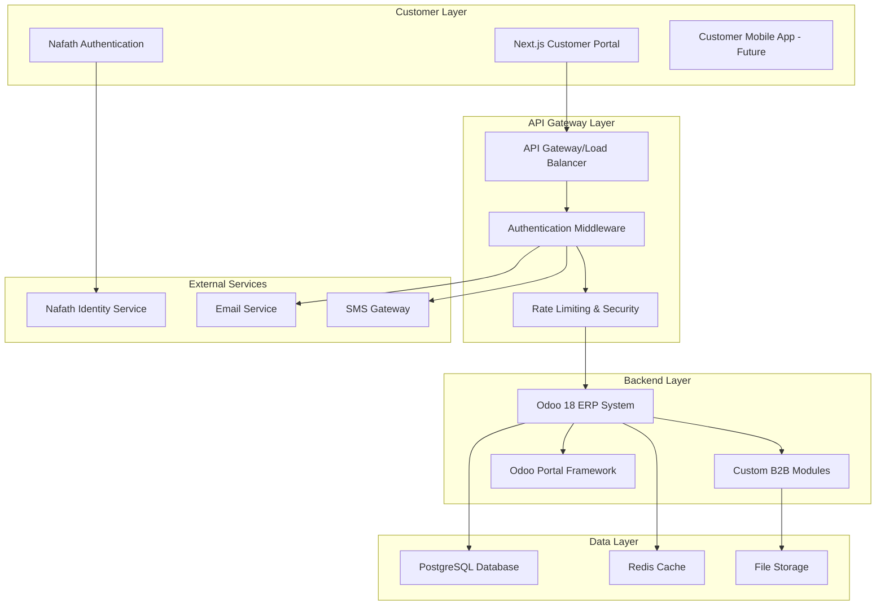
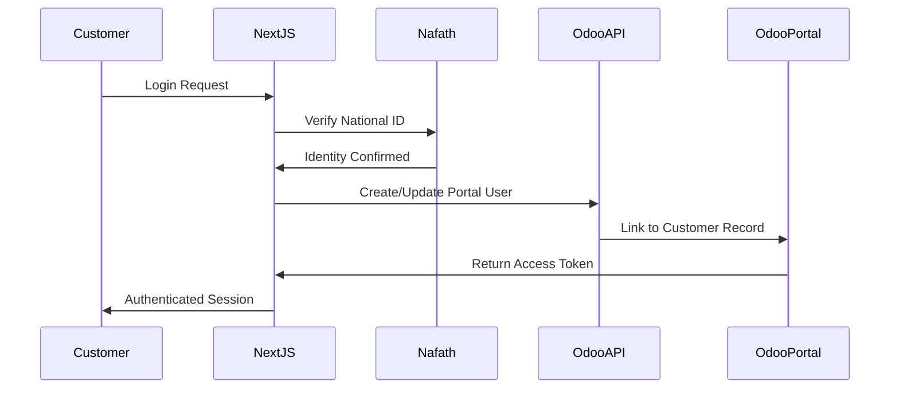
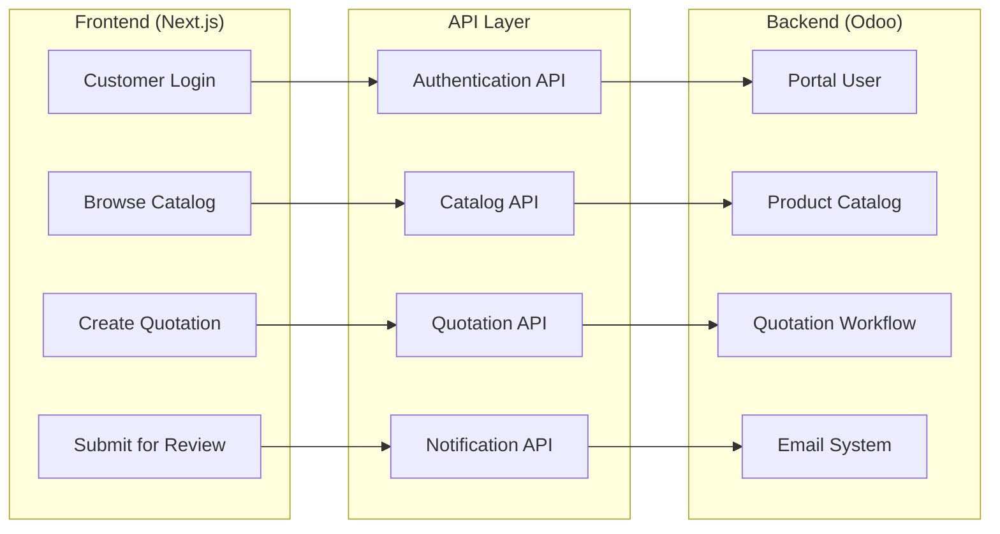
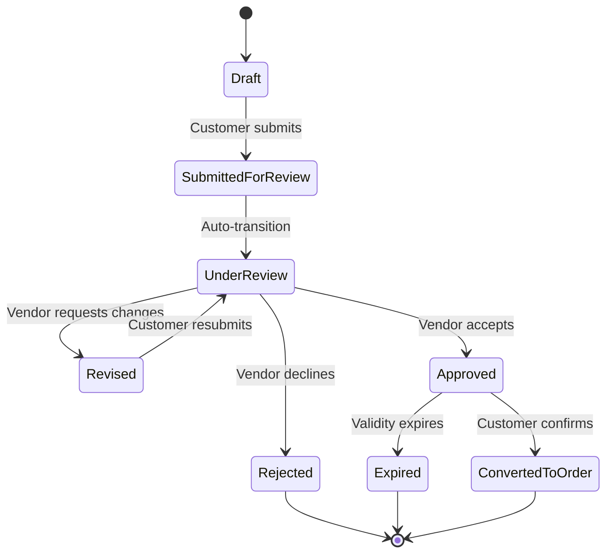

# B2B E-Commerce Technical Solution Architecture
## Custom Next.js Frontend with Odoo Backend Integration

---

## Executive Summary

This document outlines a comprehensive technical solution for a B2B e-commerce platform using **Next.js** as the frontend customer portal and **Odoo 18** as the backend ERP system. The solution is designed for Zenith Arabia to serve business customers like KAUST through a secure, scalable, and feature-rich procurement portal.

### Key Architecture Principles
- **Separation of Concerns**: Frontend handles customer experience, backend manages business logic
- **API-First Design**: RESTful APIs for seamless integration
- **Security-First**: Multi-layer authentication with Nafath integration
- **Scalability**: Microservices-ready architecture
- **Maintainability**: Clear separation between customer portal and vendor management

---

## Business Requirements Summary

### Key Stakeholders
- **Zenith Arabia**: Vendor/Supplier managing catalogs, pricing, and fulfillment
- **KAUST**: Customer with multiple departments and purchasing workflows
- **Merchandiser**: Catalog and SKU management
- **Account Manager**: Contract and pricing management
- **KAUST Users**: Purchasing representatives and managers

### Core Features Required
1. **Multi-tenant B2B Portal** with customer-specific branding
2. **Frame Contract Management** with SLAs and compliance monitoring
3. **Customer-specific Pricing** with multiple price lists and dynamic discounts
4. **Quotation/Purchase Order Workflow** with negotiation capabilities (Cart = Quotation in B2B)
5. **Product Catalog Management** with variants and accessories
6. **2-Layer Secure Authentication** via Nafath + Odoo Portal integration
7. **Real-time Order Tracking** and history management

---

## System Architecture Overview

### High-Level Architecture Diagram



---

## Frontend Architecture (Next.js)

### Technology Stack
- **Framework**: Next.js 15 with App Router
- **UI Library**: React 18 with TypeScript
- **Styling**: Tailwind CSS + Shadcn/ui components
- **State Management**: Zustand or Redux Toolkit
- **API Client**: Axios with interceptors
- **Authentication**: NextAuth.js with custom providers
- **Forms**: React Hook Form with Zod validation

### Frontend Structure
```
customer-portal/
├── app/                    # Next.js App Router
│   ├── (auth)/            # Authentication routes
│   ├── (dashboard)/       # Protected customer routes
│   ├── [customer]/        # Dynamic customer routes
│   │   ├── dashboard/     # Customer dashboard
│   │   ├── catalog/       # Product catalog
│   │   ├── quotations/    # Quotation management (Cart)
│   │   ├── orders/        # Order tracking
│   │   └── contracts/     # Contract viewing
│   ├── api/               # API routes for frontend
│   └── globals.css        # Global styles
├── components/            # Reusable UI components
│   ├── ui/               # Base UI components
│   ├── forms/            # Form components
│   ├── layout/           # Layout components
│   └── business/         # Business logic components
├── lib/                  # Utilities and configurations
│   ├── api/              # API client setup
│   ├── auth/             # Authentication logic
│   ├── utils/            # Helper functions
│   └── validations/      # Zod schemas
├── hooks/                # Custom React hooks
├── stores/               # State management
├── types/                # TypeScript definitions
└── public/               # Static assets
```

### Key Frontend Features

#### 1. Multi-Tenant Customer Portals
- **Dynamic Routing**: `/[customer-slug]` for branded experiences
- **Theme Configuration**: Customer-specific branding and colors
- **Content Management**: Customer-specific content and announcements

#### 2. Product Catalog & Search
- **Advanced Filtering**: Category, price range, availability
- **Search Functionality**: Full-text search with autocomplete
- **Product Variants**: Dynamic variant selection
- **Bulk Operations**: Add multiple products to cart

#### 3. Quotation Management (Cart System)
- **Multi-Cart Support**: Multiple active quotations
- **Draft Persistence**: Auto-save functionality
- **Quotation Workflow**: Submit, negotiate, approve, convert to order
- **Version History**: Track quotation changes and negotiations

#### 4. Customer Dashboard
- **Order History**: Past quotations and orders
- **Contract Management**: View active contracts and terms
- **Profile Management**: Company information and contacts
- **Analytics**: Spending reports and order statistics

---

## Backend Architecture (Odoo 18)

### Custom Module Structure
```
addons_b2b_ecommerce/
├── b2b_catalog/           # Product catalog management
├── b2b_contracts/         # Frame contract management
├── b2b_pricing/           # Customer-specific pricing
├── b2b_quotations/        # Quotation workflow
├── b2b_portal/            # Customer portal backend
├── b2b_auth/              # Authentication integration
└── b2b_api/               # REST API endpoints
```

### Core Backend Modules

#### 1. B2B Catalog Module (`b2b_catalog`)
**Models:**
- `b2b.product.template` - Extends product.template
- `b2b.product.category` - B2B specific categories
- `b2b.product.attribute` - Custom attributes

**Key Features:**
- Multi-SKU product management
- Dynamic attributes and variants
- Inventory integration
- Product visibility rules

#### 2. B2B Contracts Module (`b2b_contracts`)
**Models:**
- `b2b.frame.contract` - Frame contracts
- `b2b.contract.line` - Contract terms and conditions
- `b2b.sla.terms` - Service level agreements

**Key Features:**
- Contract validity management
- SLA monitoring
- Pricing rule integration
- Compliance tracking

#### 3. B2B Pricing Module (`b2b_pricing`)
**Models:**
- `b2b.customer.pricelist` - Customer-specific pricing
- `b2b.price.rule` - Dynamic pricing rules
- `b2b.discount.tier` - Volume-based discounts

**Key Features:**
- Contract-based pricing
- Dynamic discount calculation
- Price validity periods
- Manual override capabilities

#### 4. B2B Quotations Module (`b2b_quotations`)
**Models:**
- `b2b.quotation` - Extends sale.order
- `b2b.quotation.line` - Quotation line items
- `b2b.negotiation.history` - Negotiation tracking

**Key Features:**
- Quotation state management
- Negotiation workflow
- Version control
- Approval routing

---

## API Integration Layer

### Authentication Flow



### API Endpoints Structure

#### Authentication Endpoints
```
POST /api/auth/nafath/verify
POST /api/auth/odoo/login
POST /api/auth/refresh
POST /api/auth/logout
```

#### Customer Management
```
GET /api/customers/profile
PUT /api/customers/profile
GET /api/customers/contracts
GET /api/customers/pricing
```

#### Product Catalog
```
GET /api/products
GET /api/products/{id}
GET /api/products/search
GET /api/categories
GET /api/products/{id}/variants
```

#### Quotation Management
```
GET /api/quotations
POST /api/quotations
GET /api/quotations/{id}
PUT /api/quotations/{id}
POST /api/quotations/{id}/submit
POST /api/quotations/{id}/approve
POST /api/quotations/{id}/convert-to-order
```

#### Order Management
```
GET /api/orders
GET /api/orders/{id}
GET /api/orders/{id}/status
GET /api/orders/{id}/documents
```

---

## Security Architecture

### Multi-Layer Authentication

#### Layer 1: Nafath Identity Verification
- **National ID Verification**: Saudi Arabia Nafath integration
- **Identity Assurance**: Government-backed identity verification
- **Session Management**: Secure session handling

#### Layer 2: Odoo Portal Authentication
- **Portal User Creation**: Automatic user provisioning
- **Role-Based Access**: Customer-specific permissions
- **API Token Management**: JWT-based authentication

### Security Measures
- **HTTPS Everywhere**: End-to-end encryption
- **API Rate Limiting**: Prevent abuse and DDoS
- **Input Validation**: Comprehensive data validation
- **CORS Configuration**: Secure cross-origin requests
- **Audit Logging**: Complete activity tracking

---

## Data Flow Architecture

### Customer Journey Data Flow



### Quotation Workflow States



---

## Deployment Architecture

### Infrastructure Components

#### Frontend Deployment
- **Platform**: Vercel or AWS Amplify
- **CDN**: CloudFront for global distribution
- **Environment**: Staging and Production
- **Monitoring**: Vercel Analytics or AWS CloudWatch

#### Backend Deployment
- **Platform**: Docker containers on AWS ECS or DigitalOcean
- **Database**: PostgreSQL with automated backups
- **Cache**: Redis for session and data caching
- **Load Balancer**: Nginx Proxy Manager
- **Monitoring**: Odoo built-in monitoring + external tools

### Security Infrastructure
- **Firewall**: AWS Security Groups or DigitalOcean Firewall
- **SSL/TLS**: Let's Encrypt certificates
- **VPN**: Secure admin access
- **Backup**: Automated daily backups with retention

---

## Integration Points

### Nafath Integration
- **Identity Verification**: Real-time ID verification
- **Session Management**: Secure session handling
- **Error Handling**: Graceful fallback mechanisms

### Odoo Portal Integration
- **User Provisioning**: Automatic customer account creation
- **Permission Management**: Role-based access control
- **Data Synchronization**: Real-time data sync

### Email & Notifications
- **Transactional Emails**: Order confirmations, status updates
- **SMS Notifications**: Critical updates via SMS gateway
- **In-App Notifications**: Real-time portal notifications

---

## Suggested Backend API Controllers (Endpoint Descriptions)

### 1. Authentication Controller (`/api/v1/auth/`)

#### Nafath Authentication
- `POST /nafath/initiate` - Start Nafath authentication flow
- `POST /nafath/callback` - Handle Nafath authentication callback
- `POST /nafath/verify` - Verify Nafath token and create session

#### Portal Authentication
- `POST /portal/validate` - Validate portal user access and return B2B context
- `POST /portal/switch-customer` - Switch user's active customer context
- `GET /portal/profile` - Get current user's complete profile
- `POST /refresh` - Refresh JWT tokens with updated context

### 2. Customer Management Controller (`/api/v1/customers/`)

#### Profile Management
- `GET /profile` - Get customer company profile and settings
- `PUT /profile` - Update customer profile information
- `GET /users` - List customer users and their roles
- `POST /users` - Create new customer user (admin only)

#### Contract & Pricing Access
- `GET /contracts` - List active customer contracts
- `GET /contracts/{id}` - Get detailed contract information
- `GET /pricing` - Get customer-specific pricing rules
- `GET /sla-status` - Get current SLA compliance status

### 3. Product Catalog Controller (`/api/v1/products/`)

#### Catalog Browsing
- `GET /` - Get paginated product list with customer pricing
- `GET /{id}` - Get detailed product information with variants
- `GET /search` - Advanced product search with filters
- `GET /categories` - Get product category hierarchy
- `GET /featured` - Get featured products for customer

#### Product Details
- `GET /{id}/variants` - Get product variants and options
- `GET /{id}/pricing` - Get customer-specific pricing for product
- `GET /{id}/availability` - Get real-time stock and lead times
- `GET /{id}/accessories` - Get related and accessory products

### 4. Quotation Management Controller (`/api/v1/quotations/`)

#### Quotation Lifecycle
- `GET /` - List customer quotations with filtering
- `POST /` - Create new quotation (cart)
- `GET /{id}` - Get detailed quotation information
- `PUT /{id}` - Update quotation details and line items
- `DELETE /{id}` - Delete draft quotation

#### Quotation Workflow
- `POST /{id}/submit` - Submit quotation for vendor review
- `POST /{id}/approve` - Approve quotation (vendor action)
- `POST /{id}/revise` - Create revised quotation version
- `POST /{id}/convert` - Convert approved quotation to order
- `POST /{id}/duplicate` - Create copy of existing quotation

#### Quotation Operations
- `GET /{id}/lines` - Get quotation line items
- `POST /{id}/lines` - Add line item to quotation
- `PUT /{id}/lines/{line_id}` - Update quotation line item
- `DELETE /{id}/lines/{line_id}` - Remove line item
- `GET /{id}/revisions` - Get quotation revision history
- `GET /{id}/pdf` - Generate quotation PDF document

### 5. Order Management Controller (`/api/v1/orders/`)

#### Order Tracking
- `GET /` - List customer orders with status filtering
- `GET /{id}` - Get detailed order information
- `GET /{id}/status` - Get real-time order status and tracking
- `GET /{id}/timeline` - Get order processing timeline

#### Order Operations
- `POST /{id}/reorder` - Create new quotation from existing order
- `POST /{id}/cancel` - Cancel order (if allowed by status)
- `GET /{id}/documents` - Get order documents (invoices, delivery notes)
- `GET /{id}/delivery` - Get delivery tracking information

### 6. Contract Management Controller (`/api/v1/contracts/`)

#### Contract Information
- `GET /` - List active customer contracts
- `GET /{id}` - Get detailed contract information and terms
- `GET /{id}/sla` - Get SLA metrics and compliance status
- `GET /{id}/performance` - Get contract performance analytics

#### Contract Operations
- `GET /{id}/products` - Get products available under contract
- `GET /{id}/pricing` - Get contract-specific pricing rules
- `GET /{id}/documents` - Get contract documents and attachments
- `GET /{id}/history` - Get contract modification history

### 7. Analytics Controller (`/api/v1/analytics/`)

#### Dashboard Data
- `GET /dashboard` - Get customer dashboard metrics and KPIs
- `GET /spending` - Get spending analysis and trends
- `GET /orders` - Get order analytics and performance metrics
- `GET /quotations` - Get quotation conversion and success rates

#### Reporting
- `GET /reports/spending` - Generate spending reports by period
- `GET /reports/orders` - Generate order performance reports
- `GET /reports/contracts` - Generate contract compliance reports
- `GET /reports/products` - Generate product usage and preference reports

---

## Performance Optimization

### Frontend Optimization
- **Code Splitting**: Route-based code splitting
- **Image Optimization**: Next.js Image component
- **Caching**: Browser and CDN caching strategies
- **Bundle Analysis**: Regular bundle size monitoring

### Backend Optimization
- **Database Indexing**: Optimized database queries
- **Caching Strategy**: Redis for frequently accessed data
- **API Optimization**: Efficient API response design
- **Background Jobs**: Async processing for heavy operations

---

## Development Workflow

### Frontend Development
1. **Local Development**: Next.js dev server with hot reload
2. **API Mocking**: Mock API responses for development
3. **Testing**: Jest + React Testing Library
4. **Deployment**: Automatic deployment via Git integration

### Backend Development
1. **Local Development**: Odoo development environment
2. **Module Development**: Custom module development workflow
3. **Testing**: Odoo test framework
4. **Deployment**: Docker-based deployment pipeline

---

## Monitoring & Analytics

### Application Monitoring
- **Frontend**: Vercel Analytics, Sentry for error tracking
- **Backend**: Odoo logs, custom monitoring dashboards
- **API**: Request/response monitoring, performance metrics
- **Database**: Query performance monitoring

### Business Analytics
- **Customer Behavior**: Portal usage analytics
- **Sales Metrics**: Quotation conversion rates
- **Performance KPIs**: Order processing times
- **Contract Compliance**: SLA monitoring

---

## Future Enhancements

### Phase 2 Features
- **Mobile Application**: React Native customer app
- **Advanced Analytics**: Business intelligence dashboard
- **AI Integration**: Smart product recommendations
- **Multi-Language**: Internationalization support

### Scalability Considerations
- **Microservices**: Break down into smaller services
- **Event-Driven Architecture**: Implement event sourcing
- **Multi-Region**: Global deployment strategy
- **API Gateway**: Advanced API management

---

## Conclusion

This technical solution provides a robust, scalable, and secure foundation for a B2B e-commerce platform. The separation of concerns between the Next.js frontend and Odoo backend ensures maintainability while providing excellent user experience and powerful business functionality.

The architecture supports the specific requirements for Zenith Arabia's B2B customers like KAUST, with strong authentication, contract management, and quotation workflows that align with B2B procurement processes.

### Key Benefits:
1. **Customer Portal Only**: Next.js frontend focuses solely on customer experience
2. **Vendor Management**: Odoo backend handles all vendor operations natively
3. **2-Layer Security**: Nafath + Odoo portal authentication ensures compliance
4. **Scalable Architecture**: API-first design supports future growth
5. **B2B Workflow**: Quotation-based system aligns with B2B procurement needs