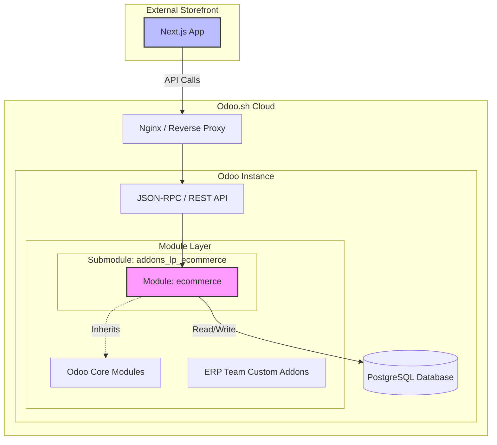

# Odoo.sh Installation & Integration Study

## 1. Executive Summary

This study outlines the strategy for integrating the custom `addons_lp_ecommerce` repository with an existing Odoo.sh environment managed by another ERP team. The goal is to ensure seamless operation of the external Next.js storefront (`next_ecommerce`) while maintaining strict separation from the core ERP logic to avoid conflicts.

## 2. Integration Architecture

### 2.1 Multi-Repo Strategy (Git Submodules)
To integrate the `addons_lp_ecommerce` repository without merging it directly into the ERP team's codebase, we will use **Git Submodules**. This is the standard best practice for multi-repository management on Odoo.sh.

**Workflow:**
1.  **ERP Root Repository**: The ERP team maintains the main repository connected to the Odoo.sh project.
2.  **Submodule Addition**: Our repository (`addons_lp_ecommerce`) is added as a submodule within the root repository.
3.  **Deployment**: Odoo.sh automatically pulls the submodule content during the build process.

**Commands for ERP Team:**
```bash
# Add the ecommerce addons as a submodule
git submodule add -b main https://github.com/YourOrg/addons_lp_ecommerce.git addons_lp_ecommerce

# Commit the submodule change
git add .gitmodules addons_lp_ecommerce
git commit -m "[ADD] ecommerce submodule"
git push
```

### 2.2 System Diagram



## 3. Conflict Avoidance & Isolation Strategy

To ensure our customization does not interfere with the ERP team's work, we employ the following isolation techniques:

1.  **Namespace Isolation**: All our custom logic is contained within the `ecommerce` module directory.
2.  **Flag-Based Logic**: We use a specific boolean flag `is_ecommerce_portal` in key shared models (`sale.order`, `res.partner`, etc.). This allows us to inject logic *only* when the record is related to the external portal, leaving standard ERP flows untouched.
3.  **Dependency Management**: Our module strictly depends on standard Odoo modules (`sale`, `website`, `mail`) and avoids modifying the ERP team's custom modules.

## 4. Odoo Model Customization Table

The following table details the Odoo models customized in our solution and how the `is_ecommerce_portal` flag is used to separate concerns.

| Model | Technical Name | `is_ecommerce_portal` Flag? | Description & Logic Separation |
|---|---|:---:|---|
| **Sales Order** | `sale.order` | ✅ | **Yes.** Used to identify orders originating from the external portal. Controls specific email templates, quotation workflows, and portal-specific state transitions (`portal_state`). |
| **Contact/Partner** | `res.partner` | ✅ | **Yes.** Identifies partners created via the portal registration. Triggers the creation of portal-specific sequence numbers (`portal_order_sequence_id`) and assigns portal user tags. |
| **Users** | `res.users` | ✅ | **Yes.** Distinguishes external portal users from internal employees. Used for permission handling, OTP verification, and linking to the specific `portal_company_partner_id`. |
| **Product Request** | `ecommerce.product.request.line` | ✅ | **Yes.** Explicitly marks product requests created via the API. Ensures requests are tracked separately from standard internal requests or notes. |
| **Attachment** | `ir.attachment` | ✅ | **Yes.** Marks attachments uploaded via the portal (e.g., payment receipts, documents). Context-aware creation logic (`ecommerce_portal_context`). |
| **Product Template** | `product.template` | ❌ | **No.** Customization adds fields for brand (`brand_id`), merchant (`product_merchant_ids`), and public categories. Visibility is managed via standard `is_published` and `website_published` fields, along with custom pricelist logic. |
| **Discussion Channel** | `discuss.channel` | ❌ | **No.** Extended to support portal chat functionality. Logic is separated by channel type or context rather than a specific boolean flag on the model itself. |
| **Mail Message** | `mail.message` | ❌ | **No.** Customization focuses on exposing message data to the API and handling attachment counts for the portal. |
| **Public Category** | `product.public.category` | ❌ | **No.** Standard model extension. Adds `is_active` field for frontend visibility control. |
| **Partner Grade** | `res.partner.grade` | ❌ | **No.** Standard model extension. Adds relation to portal clients. |
| **Mail Presence** | `mail.presence` | ❌ | **No.** Standard model extension. Overrides methods to trigger real-time auto-refresh notifications for portal users. |
| **Configuration** | `res.config.settings` | ❌ | **No.** Adds `ecommerce_shop_portal_url` setting. |
| **Banners** | `ecommerce.banner` | ❌ | **N/A (New).** Dedicated model for managing portal homepage banners. No flag needed as it is purely for the portal. |
| **Brands** | `ecommerce.brand` | ❌ | **N/A (New).** Dedicated model for managing product brands. |
| **Portal User Tag** | `ecommerce.portal.user.tag` | ❌ | **N/A (New).** Dedicated model for tagging and grouping portal users. |

## 5. Operational Challenges & Mitigation Strategies

When two distinct teams (ERP Team vs. eCommerce Team) work on the same Odoo.sh instance using separate repositories, several challenges can arise. Below is a breakdown of potential issues and the recommended solutions to ensure zero downtime and smooth operations.

| Challenge | Description | Mitigation Strategy |
|---|---|---|
| **Submodule Versioning Conflicts** | The ERP repo points to a specific commit of the eCommerce submodule. If the eCommerce team pushes breaking changes to `main` and the ERP team updates the submodule blindly, production could break. | **Solution**: Use **Tags** or **Release Branches**. The ERP team should only point the submodule to stable tagged releases (e.g., `v1.0.1`) rather than the bleeding-edge `main` branch. |
| **Shared Model Conflicts** | Both teams might try to modify the same view (e.g., `view_order_form`) or override the same method in `sale.order`, causing inheritance issues or "View Architecture" errors. | **Solution**: **Avoid XPath replacements on generic elements**. Use specific `name` or `id` attributes when inheriting. If modifying a method, always call `super()`. Regularly sync on `sale.order` and `res.partner` changes. |
| **Data Schema Migration** | If the eCommerce team renames a field or changes a column type in a shared model, it could lock the database table or cause data loss for the ERP team. | **Solution**: **Never rename fields** in shared models. Deprecate old fields and create new ones if necessary. Test all schema changes in a Staging branch before merging to Production. |
| **Build Failures** | A syntax error in the eCommerce module will prevent the entire Odoo.sh instance from starting, blocking the ERP team's work. | **Solution**: **Pre-Commit Hooks & CI/CD**. The eCommerce repo must have its own CI pipeline (GitHub Actions) to run linter (`pylint`, `eslint`) and unit tests *before* code is merged. The ERP team should not update the submodule unless the build passes. |
| **Deployment Timing** | Restarting the server for an ERP update might disrupt active eCommerce shoppers, and vice versa. | **Solution**: **Scheduled Maintenance Windows**. Coordinate deployments during low-traffic hours. Use Odoo.sh's "Staging" branches to verify the integration of both repos before pushing to Production. |

### 5.1 Recommended "Zero-Downtime" Update Workflow

To handle updates efficiently, we define clear responsibilities for both teams.

#### Roles & Responsibilities

#### Update Workflow Summary

| Phase | Owner | Action | Environment |
|------|-------|--------|-------------|
| Development | eCommerce Team | Implement feature and push to repository | Feature / Main |
| Release | eCommerce Team | Create versioned release tag (`vX.Y.Z`) | Git Tag |
| Integration | ERP Team | Update submodule pointer to tagged release | Staging |
| Validation | Both Teams | Functional, regression, and integration testing | Staging |
| Go-Live | ERP Team | Merge staging into production | Production |


#### Step-by-Step Update Process

**Step 1: eCommerce Team Pushes New Feature**
The eCommerce team finishes development, pushes code, and creates a version tag.

```bash
# In addons_lp_ecommerce repo
git commit -m "[ADD] New feature"
git push origin main

# Create a stable release tag
git tag v1.5.0
git push origin v1.5.0
```

**Step 2: ERP Team Pulls Submodule Changes**
The ERP team updates the pointer in their main repository to the new tag.

```bash
# In ERP Root Repository (Staging Branch)
git checkout staging
cd addons_lp_ecommerce

# Fetch tags and checkout the specific release
git fetch --tags
git checkout v1.5.0

# Go back to root and commit the pointer change
cd ..
git add addons_lp_ecommerce
git commit -m "[UPD] Update ecommerce submodule to v1.5.0"
git push origin staging
```

**Step 3: Validation & Go-Live**
1.  Odoo.sh builds the staging branch.
2.  Both teams verify the fix/feature.
3.  ERP Team merges `staging` into `production`.

## 6. Next Steps for Installation

1.  **Share Repository Access**: Ensure the Odoo.sh Github user has read access to the `addons_lp_ecommerce` repository.
2.  **Coordinate with ERP Team**: Schedule a window to add the submodule and update the `odoo.conf` (if custom paths are used, though standard Odoo.sh usually auto-detects modules in root subdirectories).
3.  **Install Module**:
    - Log in to Odoo.sh database.
    - Update App List.
    - Install `ecommerce` module.
4.  **Verify Isolation**: Create a test order via the standard backend and ensure no portal-specific logic (like incorrect emails or sequence numbers) is triggered unintentionally.
