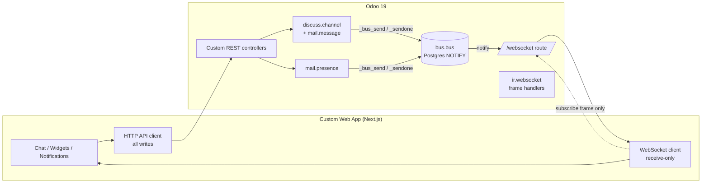
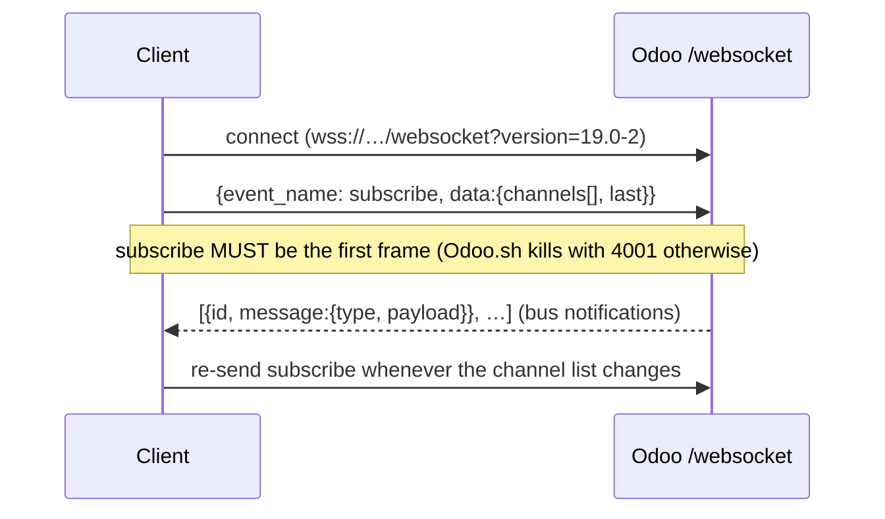
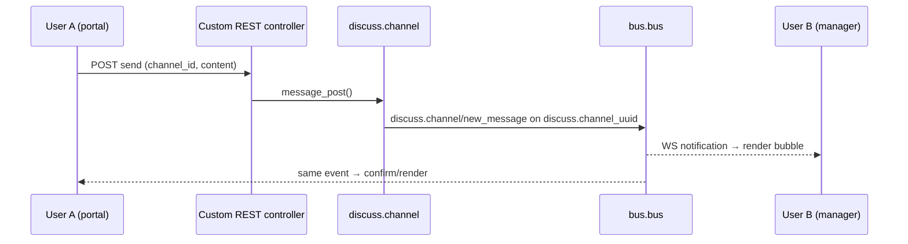
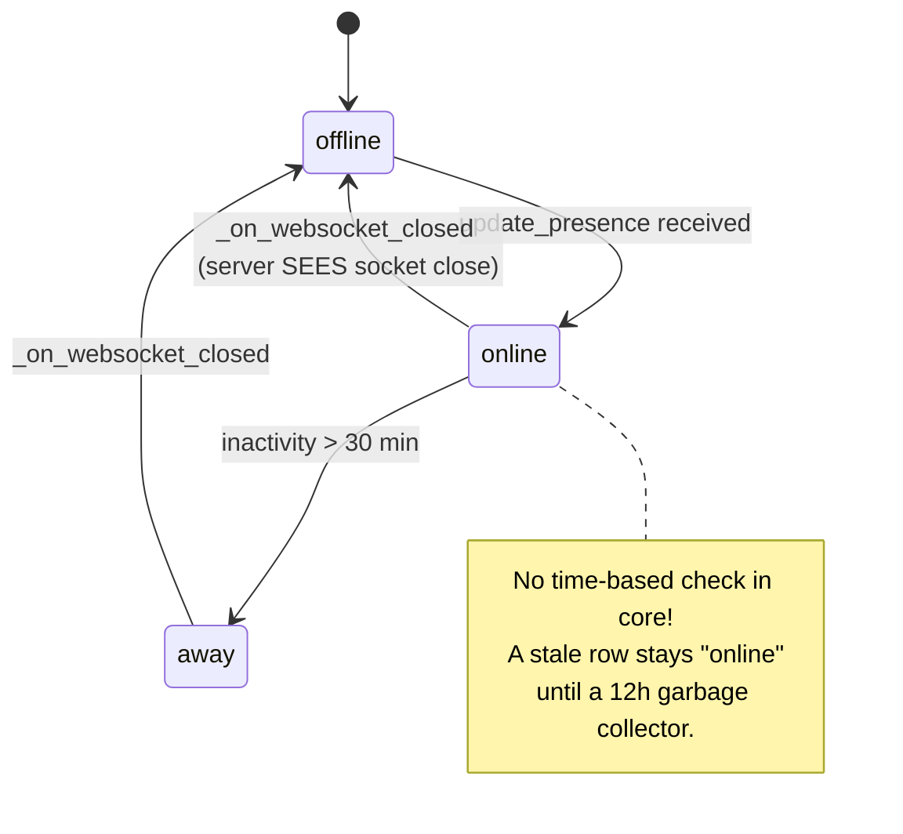
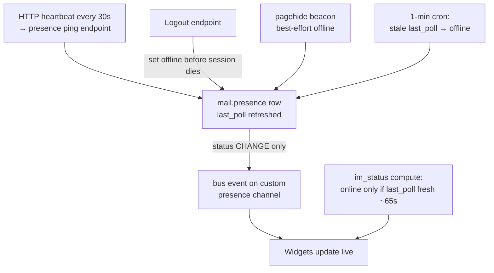

# Case Study — Integrating a Custom Web App with Odoo Real-Time (Chat, Presence, Notifications)

> How a custom frontend (Next.js) integrates with Odoo 19 real-time features,
> what the Odoo codebase provides, and the traps between a local server and Odoo.sh.
> Abstract only — no code. Verified against Odoo 19 source and our B2B portal (2026-07).

---

## 1. The Whole Picture

**Golden rule:** the websocket is a *delivery pipe* (server → client).
Every action (send message, heartbeat, mark read) goes over **HTTP to your own controllers**.

---

## 2. Odoo Real-Time Building Blocks

| Component | Path (Odoo 19) | Role |
|---|---|---|
| `bus.bus` | `addons/bus/models/bus.py` | Event log table + Postgres NOTIFY fan-out. `_sendone(channel, type, payload)` |
| `/websocket` route | `addons/bus/controllers/websocket.py` | Handshake; upgrades HTTP → WS |
| WS engine | `addons/bus/websocket.py` | Frame parsing, session checks, dispatch loop |
| `ir.websocket` | `addons/bus/models/ir_websocket.py` | Handles incoming frames (`subscribe`, …); extensible but **see §6** |
| `mail.presence` | `addons/mail/models/mail_presence.py` | One row per user: `status`, `last_poll`, `last_presence` |
| `im_status` | `res.users` / `res.partner` (mail) | Computed from `presence_ids.status` |
| `discuss.channel` | `addons/mail/models/discuss_channel.py` | Chat rooms (group / DM); `message_post` triggers bus events |

### Bus channels a client subscribes to

- `discuss.channel_<uuid>` — one per chat room (uuid acts as a capability token, no extra auth needed)
- Custom string channels — e.g. `ecommerce/notification`, `ecommerce/presence` (any name your backend `_sendone`s to)

---

## 3. WebSocket Protocol (client side)

- One shared socket per tab; ref-count channels across features.
- On reconnect: resubscribe first, then resume.
- Frames are JSON arrays of notifications; route by `message.type` to feature handlers.

---

## 4. Real-Time Chat

**Integration steps**
1. Backend: endpoint to *init* chat → find/create `discuss.channel` (group or DM), return `channel_id + uuid + history`.
2. Backend: endpoint to *send* → `message_post` (bus emission is automatic).
3. Frontend: subscribe to `discuss.channel_<uuid>`; handle `discuss.channel/new_message` and `mail.record/insert`.
4. Read state: server-side seen pointer endpoint (not localStorage) so unread counts survive devices.

---

## 5. Presence (the hard part)

### How core decides online/offline

Two facts that shape everything:
- Status flips to **offline only** when the Odoo worker observes the socket close.
- `im_status` trusts the stored status — **no freshness check**.

### Why this breaks off-premise

Anything between browser and worker (gateway, proxy, worker recycle, deploy, crash)
that swallows the close event ⇒ user stuck "online" for up to 12 hours.

### Hardened design (what we implemented)

Layers, in order of trust:
1. **Heartbeat over HTTP** (not WS frames — see §6) proves liveness.
2. **Freshness rule** in `im_status`: stale `last_poll` ⇒ offline, whatever the stored status says.
3. **Cron sweep** flips stale rows so *events* still fire for widgets (worst case ~90s).
4. Explicit offline on logout and tab close = instant UX for the common paths.

---

## 6. Local Server vs Odoo.sh — the critical differences

| Behavior | Local / self-hosted | Odoo.sh |
|---|---|---|
| Who owns the websocket | Odoo worker (gevent) | **Odoo.sh gateway infrastructure** |
| `subscribe` frame | processed | processed (must be **first** frame, else close 4001) |
| Custom / `update_presence` frames | processed via `ir.websocket._serve_ir_websocket` | **silently dropped — never reach Python** |
| Socket close → `_on_websocket_closed` | runs → offline works | **never runs for your app** |
| Bus notification delivery | works | works (this is why "chat works but presence doesn't" misleads debugging) |

Source of truth: docstring of `ir.websocket._serve_ir_websocket`
(`addons/bus/models/ir_websocket.py`) — *"Odoo.sh does not use this method.
Each new event should have a corresponding http route."*

Core ships HTTP fallbacks for exactly this (`/websocket/update_bus_presence`,
`/websocket/on_closed`) — but they answer CORS with a literal `*`, which browsers
reject for credentialed cross-origin calls. **Conclusion: wrap the same model calls
in your own controllers**, behind your own auth + CORS.

---

## 7. In-App Notifications

- Backend emits `_sendone('<app>/notification', type, payload)` from business events (order state change, user login, …).
- Optionally persist a notification record for the bell/history list (HTTP paginated endpoint).
- Frontend: one subscription on the shared socket; badge/count from HTTP, live increments from bus.

---

## 8. Design Checklist for Any Custom Client

- [ ] WS = receive-only; all writes via authenticated HTTP endpoints you own.
- [ ] `subscribe` is the first frame after every (re)connect.
- [ ] Presence = HTTP heartbeat + freshness rule + cron sweep + explicit offline on logout/pagehide.
- [ ] Never trust "it works locally" for anything that depends on socket lifecycle.
- [ ] Emit bus events only on **state changes**, not on every heartbeat (bus noise).
- [ ] Stop heartbeats when unauthenticated (guard, not just teardown — leaks happen).
- [ ] Unique method names across sibling controllers (duplicate names silently drop a route).
- [ ] Multi-tenant scoping enforced server-side on every channel/endpoint.

---

## 9. Incidents That Produced These Rules (this project)

| Symptom | Root cause | Rule it created |
|---|---|---|
| Endless reconnect, close 4001 on Odoo.sh | `update_presence` sent before `subscribe` | subscribe-first |
| Presence dead on staging, chat fine | Odoo.sh gateway drops non-subscribe frames | heartbeat over HTTP |
| User "always online" for hours | offline only via socket-close + 12h GC | freshness rule + cron |
| Pings continue on login page after signout | SPA kept socket/interval alive | auth guard inside heartbeat |
| 404 masquerading as CORS error | two controllers shared a method name | unique controller method names |

---

*Related internal docs: `_docs/poc/odoo_websocket_integration_tutorial.md`,
`_docs/poc/portal_online_detection.md`, `ecommerce/_docs/` (module docs).*
