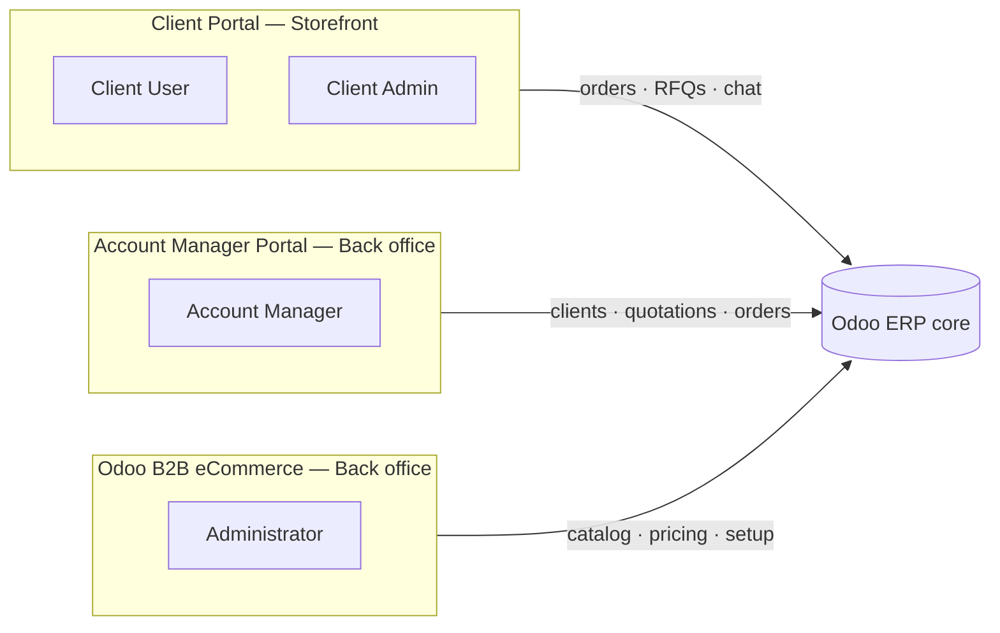
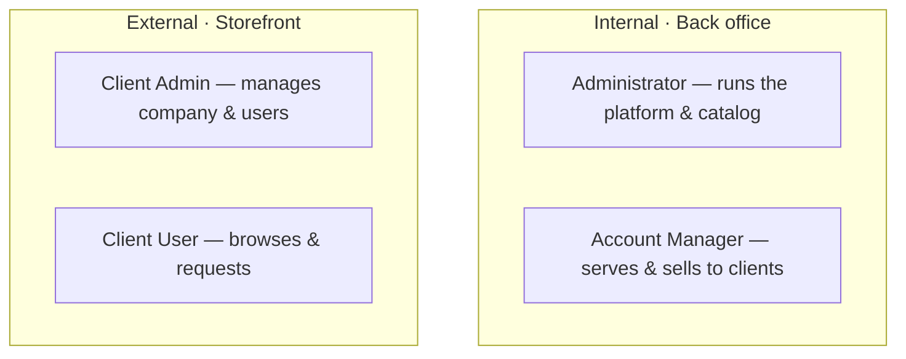
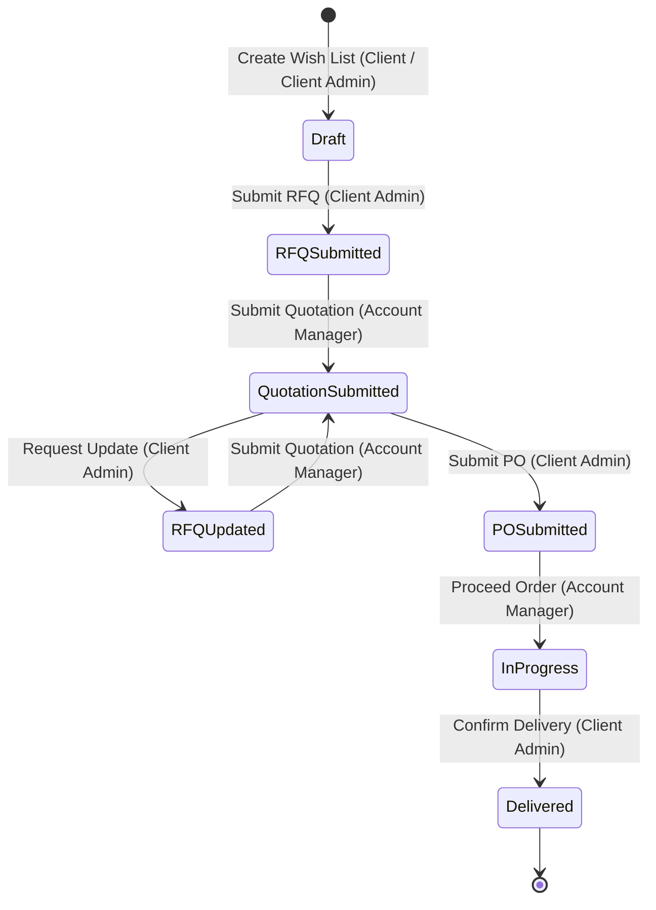

# B2B Enterprise eCommerce Platform — Executive Slide Deck

> **Brief for the slide-generation AI agent:**
>
> - Produce **one slide per `##` section** (6 slides total).
> - Keep text minimal and executive; use the bullets as-is.
> - Where a section contains a **🎨 Visual** block, **render that diagram on the slide** (a Mermaid
>   spec is provided — draw it as a clean graphic; do not show raw code).
> - Slides 2 and 5 are diagram-led (components + roles, and the order workflow).

---

## 1. Executive Overview

- One enterprise platform uniting **storefront self-service, sales management, and ERP**.
- Three coordinated systems on a single **Odoo ERP** backbone.
- Digitizes the full **quote-to-order-to-delivery** cycle for B2B trade.
- Multi-company, role-based, real-time, and **bilingual (Arabic / English)**.

> Browse → Request Quote → Approve → Order → Deliver

---

## 2. System Components & Roles

- **Odoo B2B eCommerce — Back office** → *Administrators* (catalog, pricing, system configuration).
- **Account Manager Portal — Back office** → *Account Managers* (clients, quotations, orders).
- **Client Portal — Storefront** → *Client Admin* & *Client User* (browse, request, order, track).

🎨 **Visual — System components & actors (draw this):**

🎨 **Visual — Roles at a glance (draw this):**

---

## 3. Client Portal — Storefront

- Self-service **catalog** browsing by brand and category.
- Build **wishlists**, submit **RFQs**, and track every order to delivery.
- **Upload purchase orders** and receive quotations online.
- **Real-time chat** with a dedicated account manager.
- **Client Admin** manages company users and their access; **Client User** browses and requests.

> Browse → Build wishlist → Submit RFQ → Receive quotation → Submit PO → Confirm delivery

---

## 4. Account Manager Portal — Back office

- Manage **clients, company users, and pricing tiers**.
- Review RFQs, **submit quotations**, and **proceed** orders to fulfillment.
- Full **product, brand, and category** management with **bulk import**.
- Onboard clients via **invitations**; activate or deactivate users.
- **Live messaging** and in-app notifications with customers.
- Activity **dashboard** for at-a-glance oversight.

> Receive RFQ → Submit quotation → Proceed order → Track to delivery

---

## 5. Order Lifecycle Workflow

- Guided, transparent flow shared across storefront and back office.
- Every step is **role-gated** and **auditable**, end to end.
- Built-in **revision loop**: clients can request updated quotations before ordering.

🎨 **Visual — Order state flow (draw this):**

**Transitions**

| Action           | Portal      | Actor           | From State          | To State            |
| ---------------- | ----------- | --------------- | ------------------- | ------------------- |
| Create Wish List | Storefront  | Client User     | —                  | Draft               |
| Create Wish List | Storefront  | Client Admin    | —                  | Draft               |
| Submit RFQ       | Storefront  | Client Admin    | Draft               | RFQ Submitted       |
| Submit Quotation | Back office | Account Manager | RFQ Submitted       | Quotation Submitted |
| Request Update   | Storefront  | Client Admin    | Quotation Submitted | RFQ Updated         |
| Submit PO        | Storefront  | Client Admin    | Quotation Submitted | PO Submitted        |
| Proceed Order    | Back office | Account Manager | PO Submitted        | In Progress         |
| Confirm Delivery | Storefront  | Client Admin    | Shipped             | Delivered           |

---

## 6. Security & Business Value

- Centralized **Access Management** with **role-based permissions**.
- Fine-grained control **per screen and action** (view / create / edit / delete + custom).
- **Multi-tenant isolation** — each company sees only its own data.
- Self-service access governance — **no engineering needed** to change roles.
- Secure by design: **OTP authentication** and protected identifiers.

> **Impact:** faster sales cycles · lower operating cost · enterprise-grade governance
