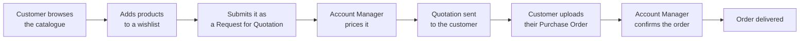

# B2B E-Commerce Platform

A quote-driven B2B trade platform built on Odoo 19, with two Next.js portals.

Customers do not check out at a published price. They ask for a price, an Account Manager quotes
it, and only then does the order become real.

---

## The two portals

| Portal | Who uses it | What it is for |
|--------|-------------|----------------|
| **Client Portal** | B2B customer companies | Browse the catalogue, build wishlists, submit requests, track orders, chat |
| **Account Manager Portal (AMP)** | Laplace / SAMTIA staff | Price requests, issue quotations, confirm orders, maintain the catalogue and clients |

---

## Documentation sets

### [User Guide](_user_guide/000-README.md)

Business-focused, screen by screen. For anyone who uses the platform.

Covers: signing in · roles and permissions · both portals in full · the order lifecycle ·
messages and notifications · 15 step-by-step business scenarios · a glossary.

### [Technical Documentation](_technical_docs/000-README.md)

Architecture-focused. For anyone who builds, extends or operates the platform.

Covers: C4 architecture diagrams · Odoo modules · the domain model · the API catalog ·
authentication and multi-tenancy · deployment and environments · architecture decisions.
