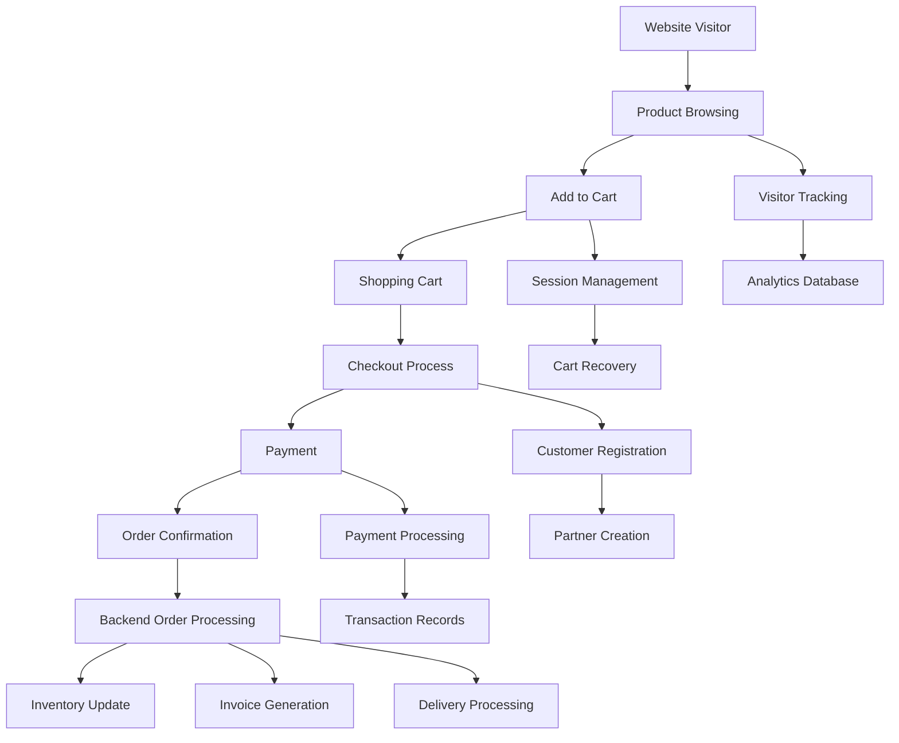
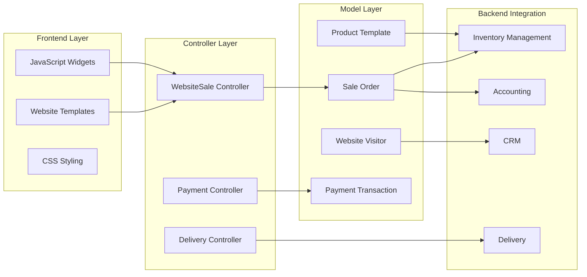

# Odoo E-Commerce Technical Architecture Documentation

## Overview

The Odoo e-commerce module (`website_sale`) provides a comprehensive e-commerce solution that seamlessly integrates the customer-facing online store with the backend ERP system. This document provides a detailed technical analysis of the architecture, focusing on how the e-commerce portal integrates with Odoo's backend systems.

## Module Structure and Dependencies

### Core Dependencies
- **website**: Base website functionality and CMS
- **sale**: Sales order management and core sales logic
- **website_payment**: Payment processing integration
- **website_mail**: Email communication features
- **portal_rating**: Customer rating and review system
- **digest**: Analytics and reporting
- **delivery**: Shipping and delivery management

### Module Architecture Overview

```
website_sale/
├── controllers/          # HTTP controllers for web requests
├── models/              # Data models extending core Odoo models
├── views/               # XML templates and views
├── static/src/          # Frontend assets (JS, CSS, images)
├── security/            # Access control and security rules
├── data/                # Default data and configuration
└── tests/               # Test suites
```

## Technical Architecture

### 1. Frontend-Backend Integration Layer

#### HTTP Controllers (`controllers/`)

The e-commerce system uses multiple specialized controllers to handle different aspects of the shopping experience:

**Main Controller (`main.py`)**
- **WebsiteSale Class**: Inherits from `payment_portal.PaymentPortal`
- **Key Routes**:
  - `/shop` - Product catalog and search
  - `/shop/cart` - Shopping cart management
  - `/shop/checkout` - Checkout process
  - `/shop/payment` - Payment processing
  - `/shop/confirmation` - Order confirmation

**Specialized Controllers**:
- `payment.py` - Payment transaction handling
- `delivery.py` - Shipping method selection
- `variant.py` - Product variant configuration
- `product_configurator.py` - Product customization

#### Session Management

The system maintains shopping cart state through HTTP sessions:
```python
# Cart quantity tracking
request.session['website_sale_cart_quantity'] = sale_order.cart_quantity

# Order tracking
request.session['sale_last_order_id'] = order_sudo.id

# Pricelist caching
request.session['website_sale_current_pl'] = pricelist.id
```

### 2. Data Model Integration

#### Core Model Extensions

**Sale Order (`models/sale_order.py`)**
```python
class SaleOrder(models.Model):
    _inherit = 'sale.order'

    website_id = fields.Many2one('website')  # Links order to website
    cart_recovery_email_sent = fields.Boolean()
    website_order_line = fields.One2many()  # Web-visible order lines
    cart_quantity = fields.Integer()
    is_abandoned_cart = fields.Boolean()
```

**Product Template (`models/product_template.py`)**
```python
class ProductTemplate(models.Model):
    _inherit = ['product.template', 'website.published.multi.mixin']

    website_description = fields.Html()
    public_categ_ids = fields.Many2many('product.public.category')
    website_sequence = fields.Integer()
    alternative_product_ids = fields.Many2many()  # Upselling
    accessory_product_ids = fields.Many2many()   # Cross-selling
```

**Website Configuration (`models/website.py`)**
```python
class Website(models.Model):
    _inherit = 'website'

    # E-commerce specific settings
    shop_ppg = fields.Integer()  # Products per page
    shop_ppr = fields.Integer()  # Products per row
    account_on_checkout = fields.Selection()  # Guest checkout policy
    cart_abandoned_delay = fields.Float()
    ecommerce_access = fields.Selection()  # Access control
```

### 3. Frontend Architecture

#### JavaScript Components (`static/src/js/`)

**Core Website Sale Widget (`website_sale.js`)**
```javascript
export const WebsiteSale = publicWidget.Widget.extend(VariantMixin, cartHandlerMixin, {
    selector: '.oe_website_sale',
    events: {
        'click #add_to_cart': '_onClickAdd',
        'change .js_quantity': '_onChangeCartQuantity',
        'submit .js_add_cart_json': '_onClickAddCartJSON'
    }
});
```

**Key Frontend Components**:
- `cart.js` - Shopping cart functionality
- `checkout.js` - Checkout process handling
- `payment_form.js` - Payment form integration
- `website_sale_configurators.js` - Product configuration
- `website_sale_tracking.js` - Analytics and visitor tracking

#### Template System (`views/templates.xml`)

The frontend uses QWeb templates for rendering:
- **Header Integration**: Cart icon with quantity badge
- **Product Catalog**: Grid/list view with filtering
- **Product Pages**: Detailed product information with variants
- **Cart Pages**: Shopping cart with quantity management
- **Checkout Flow**: Multi-step checkout process

### 4. Security and Access Control

#### Security Rules (`security/ir_rules.xml`)

**Public Product Access**:
```xml
<record id="product_template_public" model="ir.rule">
    <field name="domain_force">[('website_published', '=', True), ('sale_ok', '=', True)]</field>
    <field name="groups" eval="[ref('base.group_public'), ref('base.group_portal')]"/>
</record>
```

#### Access Control Features
- **Guest Checkout**: Configurable guest vs. mandatory login
- **Product Visibility**: Published products only for public users
- **Multi-website**: Company-specific product and pricelist rules
- **Portal Integration**: Customer account management

### 5. Integration Points

#### Backend ERP Integration

**Sales Management**:
- Shopping carts become draft sale orders
- Order confirmation triggers standard sales workflow
- Inventory management through stock moves
- Invoicing integration with accounting module

**Customer Management**:
- Website visitors tracked and converted to partners
- Portal users linked to customer records
- Address management for billing/shipping
- Customer communication through mail system

**Product Management**:
- Products published from backend to website
- Inventory levels reflected in real-time
- Pricing rules through pricelist system
- Product variants and configurators

#### Payment Integration

**Payment Flow**:
1. Cart validation and order creation
2. Payment provider selection
3. Transaction processing through payment module
4. Order confirmation and fulfillment trigger

**Supported Features**:
- Multiple payment providers
- Express checkout (Apple Pay, Google Pay)
- Saved payment methods
- Subscription billing integration

### 6. Performance and Scalability

#### Caching Strategy
- **Product Catalog**: Cached product searches with fuzzy matching
- **Pricelist Computation**: Session-based pricelist caching
- **Static Assets**: CDN-ready asset bundling
- **Database Optimization**: Indexed fields for search performance

#### Session Management
- **Cart Persistence**: Session-based cart storage
- **Visitor Tracking**: Anonymous visitor identification
- **Performance Monitoring**: Built-in analytics and tracking

## E-Commerce to Backend Integration Flow

### Customer Journey Integration



### Data Flow Architecture



## Key Technical Features

### 1. Product Catalog Management
- **Search and Filtering**: Advanced product search with faceted navigation
- **Category Management**: Hierarchical product categories
- **Product Variants**: Dynamic variant selection and pricing
- **Inventory Integration**: Real-time stock level display

### 2. Shopping Cart System
- **Session-based Storage**: Cart persistence across sessions
- **Dynamic Updates**: AJAX-based cart modifications
- **Abandoned Cart Recovery**: Automated email campaigns
- **Guest Checkout**: Optional anonymous purchasing

### 3. Checkout Process
- **Multi-step Flow**: Address → Delivery → Payment → Confirmation
- **Address Management**: Billing and shipping address handling
- **Delivery Integration**: Real-time shipping calculation
- **Payment Processing**: Secure payment gateway integration

### 4. Customer Portal Integration
- **Account Management**: Customer registration and login
- **Order History**: Past order tracking and reordering
- **Address Book**: Saved addresses for quick checkout
- **Wishlist**: Product favorites and comparison

### 5. Analytics and Tracking
- **Visitor Tracking**: Anonymous and authenticated user tracking
- **Product Analytics**: View counts and popular products
- **Conversion Tracking**: Sales funnel analysis
- **Abandoned Cart Tracking**: Recovery campaign triggers

## Configuration and Customization

### Website Settings
- **Shop Layout**: Grid/list view, products per page
- **Checkout Options**: Guest checkout, mandatory registration
- **Payment Methods**: Enabled payment providers
- **Delivery Options**: Available shipping methods
- **Tax Configuration**: Tax display preferences

### Product Configuration
- **Publishing**: Website publication status
- **Categories**: E-commerce category assignment
- **Variants**: Product option configuration
- **Pricing**: Pricelist and discount rules
- **Images**: Product media management

### Security Configuration
- **Access Control**: Public vs. logged-in user access
- **Data Protection**: GDPR compliance features
- **Payment Security**: PCI DSS compliance
- **Session Security**: Secure session management

## Development Guidelines

### Extending the E-commerce System

**Custom Controllers**:
```python
from odoo.addons.website_sale.controllers.main import WebsiteSale

class CustomWebsiteSale(WebsiteSale):
    @route(['/shop/custom'], type='http', auth="public", website=True)
    def custom_shop_page(self, **kwargs):
        # Custom implementation
        return request.render("custom_template", values)
```

**Model Extensions**:
```python
class ProductTemplate(models.Model):
    _inherit = 'product.template'

    custom_field = fields.Char("Custom Field")

    def _get_custom_data(self):
        # Custom business logic
        return self.custom_field
```

**Frontend Customization**:
```javascript
import { WebsiteSale } from '@website_sale/js/website_sale';

WebsiteSale.include({
    _onCustomEvent: function(ev) {
        // Custom frontend logic
    }
});
```
```