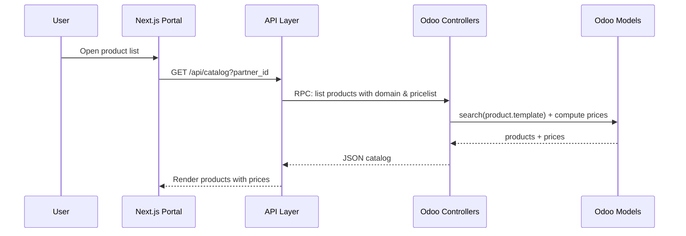
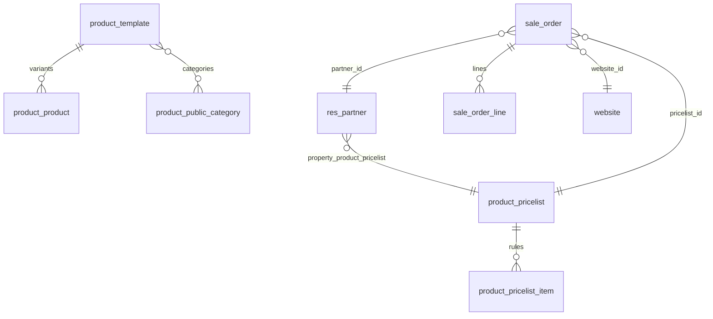
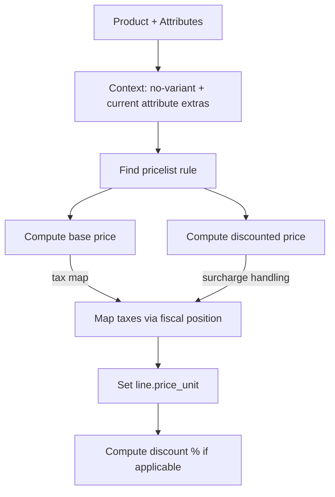

I am a **software engineer and solution architect** building a **custom Next.js B2B e-commerce portal** integrated with Odoo.
Each customer will have:

* Their **custom price list**
* Their **allowed product catalog**
* Their **quotation (RFQ → SO) workflow**

Before building my **custom API controllers**, I need a complete **technical analysis** 
of Odoo’s existing `website_sale` module  and `product` and related modules.

---

## 🎯 **Objectives**

I want a deep technical understanding of **how Odoo loads products, applies price lists, handles customers, and processes e-commerce operations** so I can design a correct Next.js integration.

---

## 📘 **1. Core Technical Models to Analyze**

Provide a **model-level analysis** with fields + relations for:

* `product.template`
* `product.product`
* `product.category`
* `product.public.category`
* `product.pricelist`
* `product.pricelist.item`
* `sale.order`
* `sale.order.line`
* `res.partner`
* Website models: `website`, `website.sale`

---

## 📦 **2. How Odoo Loads Products in the Website**

I need a breakdown of:

* Product filtering per website
* Category filtering + search domain logic
* Multi-website rules
* Stock availability rules
* Access rights rules (B2B user vs public user)
* How product variants are merged or displayed

---

## 💰 **3. Price List Technical Mechanism**

Explain:

* How Odoo chooses a pricelist for a logged-in user
* How `product.pricelist` rules are evaluated
* `compute_price_rule` logic
* How variant prices are calculated
* How discounts and formulas work

---

## 🛒 **4. Website Cart & Checkout Technical Flow**

Explain technically:

* How Odoo creates a cart (`sale.order`)
* How session → order_id is stored
* Controller logic for adding lines
* How customer information is injected during checkout
* How website applies pricelist to the order

---

## 🔌 **5. Controller Layer / API Layer**

I want:

* List of all controllers in `website_sale`
* Their routes + methods + parameters
* Which controllers handle:

  * product listing
  * product detail
  * cart
  * checkout
* Recommendation for designing **custom REST API** modules:

  * authentication best practice
  * record rules for B2B
  * performance considerations
  * caching strategies

---

## 🧩 **6. Study Plan Before Building My API**

Provide a **clear technical study checklist**:

* Models to read
* Methods to trace
* Controllers to understand
* Core computed fields
* Critical helper methods
* Odoo internals that should NOT be overridden

---

## 📐 **7. Request for Technical Diagrams (Very Important)**

If possible, include diagrams such as:

* **Architecture Diagram**
  Next.js → API Layer → Odoo models flow

* **Data Flow Diagram**
  User → Next.js portal → Odoo API → Get products + prices

* **Sequence Diagram**
  “Customer opens product list with custom pricelist”

* **Entity Relationship Diagram (ERD)**
  product, pricelist, category, sale.order, partner

* **Price Computation Flow Diagram**

These diagrams should be textual (ASCII or Mermaid.js) so they can render.

---

## 📝 **8. Output Format Required**

Provide the final document in sections:

1. Overview
2. Key Models
3. Key Methods
4. Key Controllers
5. Product Loading Logic
6. Price List Logic
7. Cart & Checkout Logic
8. Diagrams
9. Recommended Architecture for Next.js + Odoo
10. Suggested API Endpoints
11. Conclusion
save output in location /Users/abadr/Documents/Laplace/Projects/odoo19/addons_lp_ecommerce/_docs/odoo_commerce
---

# 1. Overview

This document provides a technical analysis of Odoo’s ecommerce stack (website_sale, product, sale) with a focus on how products are loaded and priced for a website session, and how carts and checkouts operate. It targets designing a Next.js B2B portal that uses Odoo as the system of record and computes catalog visibility and pricing per partner via their pricelist.

Key takeaways:
- Catalog visibility is enforced by website domain rules and publish flags, with additional B2B constraints.
- Pricing is determined by the session’s current pricelist, with contextual attribute extras and fiscal position tax mapping.
- Carts are `sale.order` in `draft` state; controllers and models expose safe methods to add/update lines and move through checkout.
- For a custom API, prefer server-side computation using Odoo models with explicit domains and cached session objects (`request.cart`, `request.pricelist`).

# 2. Key Models

- `product.template`
  - Core fields: `sale_ok`, `is_published`, `uom_id`, `currency_id`, `taxes_id`, `combo` type, attribute lines
  - Pricing helpers: `_get_contextual_price` `addons/product/models/product_template.py:1442`, `_get_contextual_pricelist` `addons/product/models/product_template.py:1450`
- `product.product`
  - Relation to template: `product_tmpl_id`, variant attribute values
  - Price context: `_get_product_price_context` adds no-variant attribute extras `addons/product/models/product_product.py:785`
  - Contextual price: `_get_contextual_price` delegates to template `addons/product/models/product_product.py:882`
- `product.category` (public category)
  - Website filtering and sitemap; used in `/shop` listing filtering `addons/website_sale/controllers/main.py:421`
- `product.pricelist`
  - Currency, selectable flag, promo `code`, availability per website (`is_pricelist_available`) `addons/website_sale/models/website.py:641`
  - Rule resolution per product via `product.pricelist.item` methods (consumed through `sale_order_line.pricelist_item_id`)
- `product.pricelist.item`
  - Encodes fixed/percentage/formula rules; surfaced through `_compute_price` and `_compute_price_before_discount` used by lines `addons/sale/models/sale_order_line.py:685`, `addons/sale/models/sale_order_line.py:727`
- `sale.order`
  - Cart/quotation entity; fields: `partner_id`, `website_id`, `pricelist_id`, `fiscal_position_id`, `order_line`, `state`
  - Cart operations: `_cart_add`, `_cart_update_line_quantity`, `_create_new_cart_line` `addons/website_sale/models/sale_order.py:319`, `addons/website_sale/models/sale_order.py:419`, `addons/website_sale/models/sale_order.py:531`
  - Website creation: `_prepare_sale_order_values` `addons/website_sale/models/website.py:685`
- `sale.order.line`
  - Fields: `product_id`, `product_uom_id`, `product_uom_qty`, `price_unit`, `technical_price_unit`, `discount`, `tax_ids`
  - Pricing compute: `_compute_price_unit`, `_reset_price_unit`, `_get_display_price` `addons/sale/models/sale_order_line.py:587`, `addons/sale/models/sale_order_line.py:619`, `addons/sale/models/sale_order_line.py:639`
  - Discount compute: `_compute_discount` `addons/sale/models/sale_order_line.py:784`
- `res.partner`
  - Pricelist relation: `property_product_pricelist` (used when no cart yet) `addons/website_sale/models/website.py:730`
- `website`
  - Per-website domain and ecommerce access; current session objects: `_get_and_cache_current_pricelist`, `_get_and_cache_current_fiscal_position`, `_create_cart` `addons/website_sale/models/website.py:699`, `addons/website_sale/models/website.py:739`, `addons/website_sale/models/website.py:666`
  - Product domain and sale catalog: `sale_product_domain`, `_product_domain` `addons/website_sale/models/website.py:652`

# 3. Key Methods

- Pricelist selection and caching
  - `_get_and_cache_current_pricelist` determines session pricelist from cart or partner and caches it in session `addons/website_sale/models/website.py:699`
  - Applying promo or selecting pricelist in frontend triggers `_apply_pricelist` and price recomputation `addons/website_sale/controllers/main.py:968`
- Line price computation
  - `_compute_price_unit` respects manual price edits and invoiced quantities; calls `_reset_price_unit` `addons/sale/models/sale_order_line.py:587`
  - `_reset_price_unit` uses `_get_display_price` and tax inclusion mapping via fiscal position to set `price_unit` and `technical_price_unit` `addons/sale/models/sale_order_line.py:619`
  - `_get_display_price_ignore_combo`, `_get_pricelist_price`, `_get_pricelist_price_before_discount` drive rule-based price and surcharge handling `addons/sale/models/sale_order_line.py:656`, `addons/sale/models/sale_order_line.py:676`, `addons/sale/models/sale_order_line.py:719`
- Discount computation
  - `_compute_discount` sets `discount` from pricelist delta when appropriate (not showing surcharges as discount) `addons/sale/models/sale_order_line.py:784`
- Cart operations
  - Add/update lines: `_cart_add`, `_cart_update_line_quantity`, `_cart_update_order_line`, `_verify_cart_after_update` `addons/website_sale/models/sale_order.py:319`, `addons/website_sale/models/sale_order.py:419`, `addons/website_sale/models/sale_order.py:476`, `addons/website_sale/models/sale_order.py:638`
  - Validity checks: `_check_validity` on lines prevents zero-price when configured `addons/website_sale/models/sale_order_line.py:102`
- Product add-to-cart eligibility
  - `_is_add_to_cart_allowed` enforces admin bypass, publish flags, domain, zero-price prevention, and ecommerce access `addons/website_sale/models/product_product.py:...`

# 4. Key Controllers

- Shop listing: `GET /shop` with pagination, category filtering, price filters `addons/website_sale/controllers/main.py:274`
- Pricelist change and promo: `GET /shop/pricelist`, `GET /shop/change_pricelist/<pricelist>` `addons/website_sale/controllers/main.py:930`, `addons/website_sale/controllers/main.py:882`
- Cart UI: `GET /shop/cart` `addons/website_sale/controllers/cart.py:20`
- Cart operations (JSON-RPC):
  - Add to cart: `POST /shop/cart/add` `addons/website_sale/controllers/cart.py:76`
  - Update line qty: `POST /shop/cart/update` `addons/website_sale/controllers/cart.py:281`
  - Get cart quantity: `POST /shop/cart/quantity` `addons/website_sale/controllers/cart.py:420`
  - Clear cart: `POST /shop/cart/clear` `addons/website_sale/controllers/cart.py:432`
- Checkout pages and address handling: `GET /shop/checkout`, `GET/POST /shop/address`, `POST /shop/address/submit` `addons/website_sale/controllers/main.py:1011`, `addons/website_sale/controllers/main.py:1077`, `addons/website_sale/controllers/main.py:1174`
- Payment transaction bootstrap: `POST /shop/payment/transaction/<order_id>` (JSON-RPC) `addons/website_sale/controllers/payment.py:25`

# 5. Product Loading Logic

- Website and user domain
  - Base saleable domain: `_product_domain` returns `[('sale_ok', '=', True)]` `addons/website_sale/models/website.py:663`
  - Website domain scoping: `website_domain()` applied for multi-website `addons/website_sale/controllers/main.py:314`
  - Public catalog constraint: published-only for non-internal users (`is_published`) `addons/website_sale/models/website.py:652`
- Category filtering and search
  - Category slug to model resolution; recomposes URL and filters categories and products based on `product.public.category` relations `addons/website_sale/controllers/main.py:274`, `addons/website_sale/controllers/main.py:421`
  - Attribute-based filtering via query params and grouped attribute lines `addons/website_sale/controllers/main.py:321`, `addons/website_sale/controllers/main.py:462`
- Price filter
  - Min/max price slider derived from list_price range and currency conversion `addons/website_sale/controllers/main.py:353`, `addons/website_sale/controllers/main.py:386`
- Variants and attribute extras
  - Variant resolution occurs in `_prepare_order_line_values` using closest possible combination and dynamic variant creation when needed `addons/website_sale/models/sale_order.py:545`
  - Price context includes no-variant attribute extras (product) and current attribute extras (template) `addons/sale/models/sale_order_line.py:698`, `addons/product/models/product_product.py:785`, `addons/product/models/product_template.py:648`
- Access rights
  - Ecommerce access gate: `has_ecommerce_access()` on website and per-product `_is_add_to_cart_allowed()` `addons/website_sale/controllers/main.py:290`, `addons/website_sale/models/product_product.py:...`
- Stock availability
  - Base website_sale does not hard-block by stock; custom modules (e.g., website_sale_stock) add availability checks. In our API, prefer querying available quantities and applying business rules at fetch time.

# 6. Price List Logic

- Pricelist selection
  - Session pricelist comes from cart if present, otherwise partner’s `property_product_pricelist`, normalized to website-available pricelists `addons/website_sale/models/website.py:724`
  - Promo code and manual selection apply via controllers, recomputing cart prices when changed `addons/website_sale/controllers/main.py:930`, `addons/website_sale/controllers/main.py:968`
- Rule evaluation
  - For a line, `pricelist_item_id` caches the matched rule; price is computed via `_compute_price` and base price via `_compute_price_before_discount` `addons/sale/models/sale_order_line.py:575`, `addons/sale/models/sale_order_line.py:685`, `addons/sale/models/sale_order_line.py:727`
  - Discounts shown only when rule indicates discount visibility; surcharges are included in display price but not shown as discounts `addons/sale/models/sale_order_line.py:667`, `addons/sale/models/sale_order_line.py:784`
- Tax inclusion and fiscal position
  - `price_unit` is set from display price adjusted for tax inclusion/exclusion via product taxes mapped by `fiscal_position` `addons/sale/models/sale_order_line.py:625`, `addons/sale/models/sale_order_line.py:628`

# 7. Cart & Checkout Logic

- Cart creation and session
  - Cart is a `sale.order` created via `_create_cart`; session keys cache cart id and quantity; `request.cart` is lazy-populated `addons/website_sale/models/website.py:666`, `addons/website_sale/models/ir_http.py:32`, `addons/website_sale/models/website.py:679`
- Add/update lines
  - JSON-RPC endpoints call `_cart_add` and `_cart_update_line_quantity`, returning updated totals and rendered fragments `addons/website_sale/controllers/cart.py:83`, `addons/website_sale/controllers/cart.py:288`
- Checkout address and flow
  - `shop_checkout` prepares delivery methods, validates cart, stores `sale_last_order_id` in session `addons/website_sale/controllers/main.py:1013`
  - Address forms and submit handlers update partner and order addresses, recomputing delivery rates as needed `addons/website_sale/controllers/main.py:1079`, `addons/website_sale/controllers/main.py:1177`
- Payment bootstrap
  - Payment values prepared via portal utilities; transactions initiated against `/shop/payment/transaction/<order_id>` `addons/website_sale/controllers/main.py:1552`, `addons/website_sale/controllers/payment.py:25`

# 8. Diagrams

```mermaid
flowchart LR
  A[User (Next.js)] --> B[Next.js API Layer]
  B --> C{Auth (JWT/OAuth)}
  C -->|OK| D[Odoo HTTP Controllers]
  D --> E[Odoo Models]
  E --> F[(DB)]
  D --> G[Session: request.cart / request.pricelist]
```







# 9. Recommended Architecture for Next.js + Odoo

- API Layer (Odoo custom module)
  - Implement REST controllers that wrap Odoo model logic, returning JSON tailored for Next.js.
  - Use `sudo` carefully; prefer explicit domain + record rules to restrict partner catalog.
- Authentication
  - JWT/OAuth2 at Next.js edge; map to Odoo users or portal accounts.
  - Use portal users per B2B partner; set `property_product_pricelist` on partner.
- Catalog loading based on partner pricelist
  - Determine pricelist: if a cart exists, use `order.pricelist_id`; else partner’s `property_product_pricelist` and ensure it’s website-available `addons/website_sale/models/website.py:724`.
  - Domain: `website.sale_product_domain()` plus partner-specific allowed products (via record rules or custom relation).
  - Price: for each `product.template`, fetch a representative variant or all variants and compute price with:
    - `product_template._get_contextual_price(product=variant)` using quantity/uom/date context.
    - Or emulate `sale_order_line` path to include tax display mapping for UI.
- Order submission as quotation (backend)
  - Create `sale.order` in `draft` with `partner_id`, `website_id`, `pricelist_id`, `fiscal_position_id` (reuse `_prepare_sale_order_values`) `addons/website_sale/models/website.py:685`.
  - Create `sale.order.line` rows via `_prepare_order_line_values` to resolve variants and attribute extras `addons/website_sale/models/sale_order.py:545`.
  - Keep state `draft` (quotation); optionally trigger `action_send` to mark as sent.
  - If required later, confirm to `sale` via `action_confirm`.
- Performance and caching
  - Use batched `search_read` on `product.template` with domains + `fetch()` semantics where appropriate.
  - Cache pricelist and fiscal position per session; align with `request.pricelist` and `request.fiscal_position`.
  - Precompute attribute extras where possible to avoid per-item recomputation.
- Record rules
  - Define a relation linking partners to allowed products/categories and enforce via record rules on product models.
  - Ensure controllers only expose permitted records.

# 10. Suggested API Endpoints

- `GET /api/catalog`
  - Params: `partner_id` (or infer from auth), `category_id`, `search`, `min_price`, `max_price`, `page`, `page_size`
  - Behavior: build domain = website sale domain + partner catalog; compute prices from partner’s pricelist; include variant availability.
- `GET /api/product/:id`
  - Returns product details, variants, contextual prices, tax display info.
- `POST /api/quotation`
  - Body: `partner_id`, `items` [{`product_id`, `quantity`, `uom_id`, attributes}], optional `website_id`.
  - Behavior: create `sale.order` (draft) and lines; return quotation id/state.
- `POST /api/cart/add`, `POST /api/cart/update`
  - Optional: reuse Odoo cart services semantics for live carts in web app.
- `POST /api/pricelist/select`
  - Apply pricelist for session/user and recompute cart prices.

# 11. Conclusion

For a B2B Next.js portal, leverage Odoo’s existing session and pricing mechanics by anchoring on the partner’s pricelist and the website’s product domain. Implement a thin REST layer that enforces catalog restrictions and delegates price/discount/tax logic to `sale.order.line` and `product` helpers. For order submission as quotation, create a `sale.order` in `draft` with validated lines using Odoo’s resolvers so variants and attribute extras remain consistent with the ERP.

Implementation suggestions (targeted):
- Catalog: compute domain via `website.sale_product_domain()` plus partner-specific filters; price via `_get_contextual_price` with partner’s pricelist.
- Quotation: replicate `_prepare_sale_order_values` and `_prepare_order_line_values` paths to build consistent `sale.order` and lines before confirmation.
