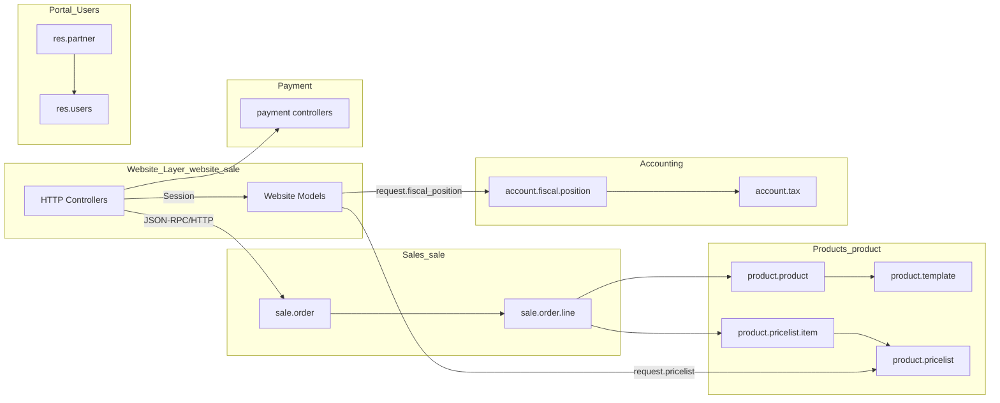
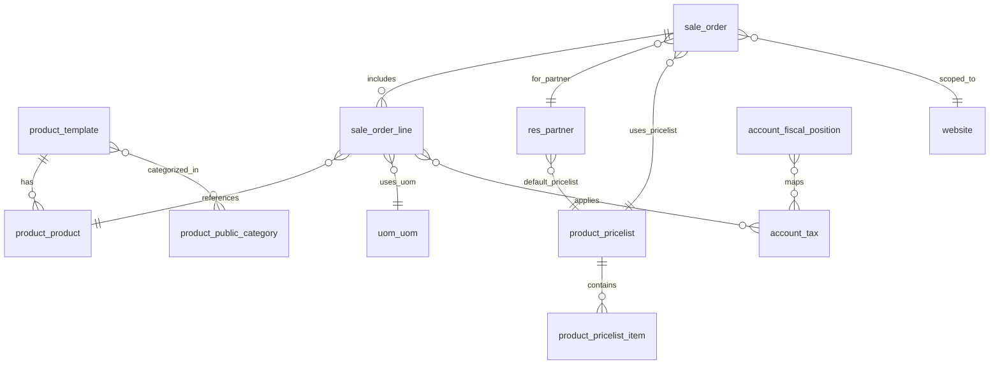
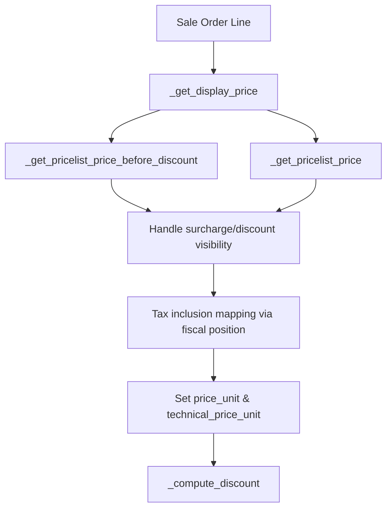
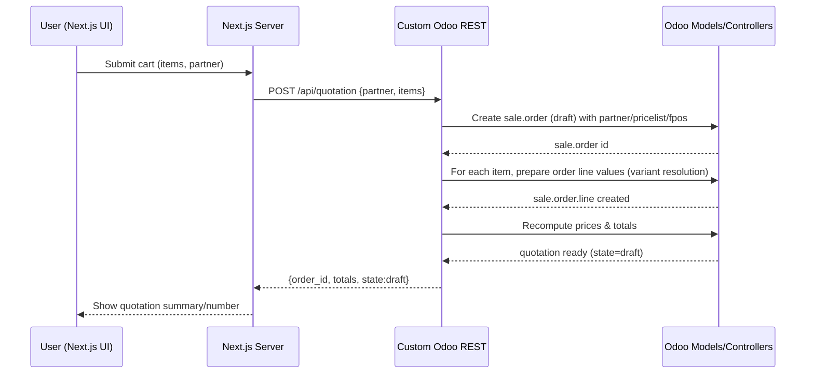
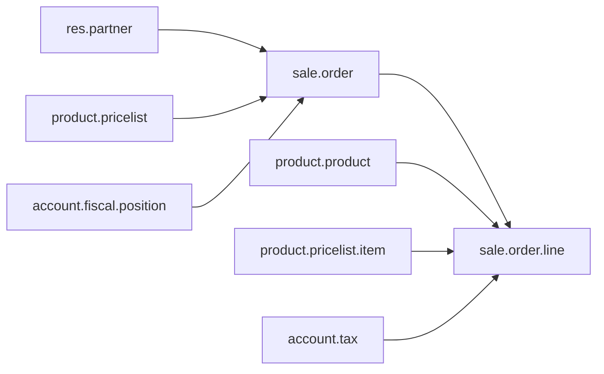
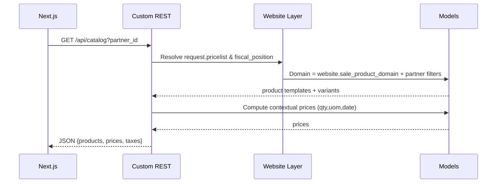

# Odoo Ecommerce Components & Workflows

## Scope & Audience
- Focuses on visual, professional diagrams for the ecommerce stack to support a Next.js B2B portal.
- Covers components, models, session objects, catalog loading by partner pricelist, and user workflow to submit an order as a backend quotation.

## Component Map (Modules)


## Model Relationships (ERD)


## Session & Context Objects
- `request.cart`: current `sale.order` in session; created with website defaults.
- `request.pricelist`: resolved and cached per session; drives pricing.
- `request.fiscal_position`: used to map taxes for display/calculation.
- Product price context includes attribute extras for variants.

## Catalog Loading by Partner Pricelist
```mermaid
flowchart TD
  Auth[User/Partner Auth] --> PLSel[Resolve Pricelist]
  PLSel --> Dom[Build Website Product Domain]
  Dom --> SRCH[Search product.template]
  SRCH --> VARS[Prefetch first variant / variants]
  VARS --> Ctx[Set price context (qty,uom,date,attributes)]
  Ctx --> Price[Compute contextual price]
  Price --> TaxMap[Optional UI tax mapping via fiscal position]
  TaxMap --> JSON[Return catalog JSON]

  subgraph Inputs
    Qty[quantity]
    Uom[uom]
    Date[date]
  end
  Inputs --> Ctx
```

Notes:
- Pricelist selection: cart’s `pricelist_id` or partner’s `property_product_pricelist` (website-available).
- Domain: website sale domain + partner catalog restrictions (record rules).
- Prices: `product.template._get_contextual_price(product=variant)`; optionally align display with tax-included UI using fiscal position tax mapping.

## Pricing Computation Flow (Line-Level)


## User Workflow: Submit Order as Quotation


Implementation notes:
- Order creation mirrors website `_prepare_sale_order_values` defaults.
- Variant correctness ensured via `_prepare_order_line_values` using closest possible combination.
- Keep `state='draft'` to represent quotation; use `action_send` optionally.

## Component Interactions for Quotation


## Data Flow: Catalog for Logged-In Partner


## Next.js Integration Blueprint
- Authentication: JWT/OAuth; map identity to Odoo portal user/partner.
- Pricing: always compute server-side via Odoo; cache per session.
- Catalog: filter on website domain + partner record rules; paginate on server.
- Quotation: create `sale.order` (draft), add lines, return id and totals.

## Visual Index
- Components: “Component Map (Modules)”
- Models: “Model Relationships (ERD)”
- Catalog: “Catalog Loading by Partner Pricelist” + “Data Flow”
- Pricing: “Pricing Computation Flow”
- Quotation: “User Workflow” + “Component Interactions for Quotation”