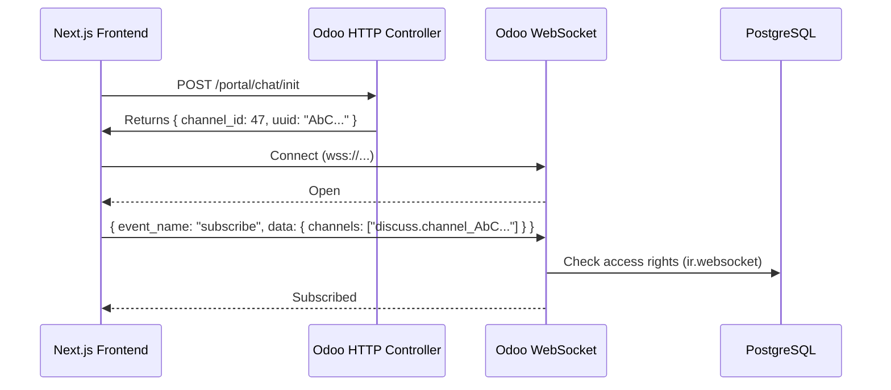
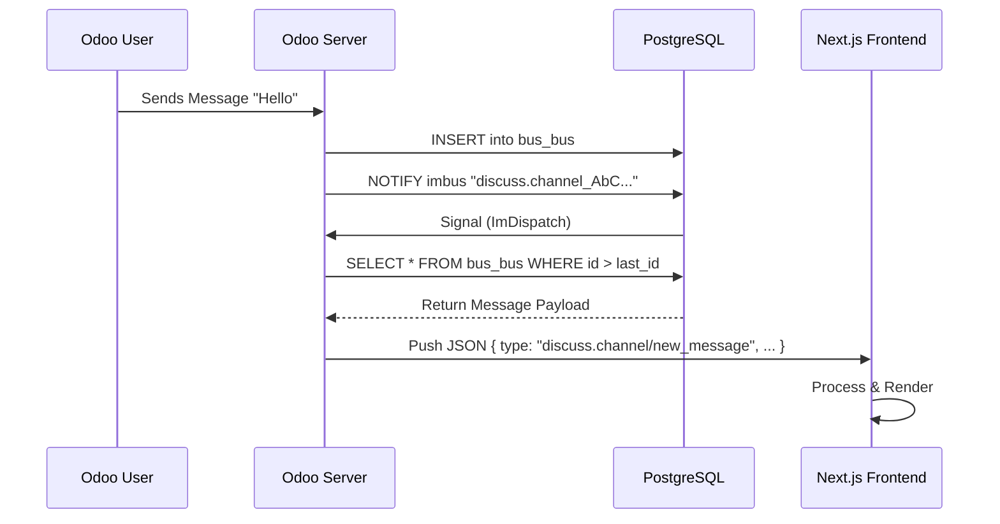

# Odoo WebSocket Integration Tutorial for Frontend Developers

## 1. Introduction to WebSockets

WebSockets provide a full-duplex communication channel over a single TCP connection. Unlike HTTP, where the client must request data (polling), WebSockets allow the server to push updates to the client in real-time.

**Why use WebSockets?**

- **Real-time**: Instant updates (chat messages, notifications, status changes).
- **Efficiency**: Reduces server load compared to frequent HTTP polling.
- **Stateful**: The server knows who is connected.

---

## 2. Odoo WebSocket Architecture

Odoo's implementation is unique. It combines a **database-backed persistence layer** with a **lightweight signaling mechanism**.

### 2.1 The "Wake Up and Poll" Mechanism

Odoo does not push the full message payload through the signaling channel (PostgreSQL `NOTIFY`). Instead, it uses a "Wake Up" signal.

1. **Event Occurs**: A user sends a message.
2. **Persist**: Odoo saves the message in the `bus.bus` table.
3. **Signal**: Odoo sends a lightweight `NOTIFY imbus` signal via PostgreSQL, containing only the **Channel Name**.
4. **Dispatch**: The `ImDispatch` thread (running on the Odoo server) hears this signal.
5. **Wake Up**: It finds all WebSocket connections subscribed to that channel and wakes them up.
6. **Poll**: The WebSocket worker queries the `bus.bus` table for new messages since the last known ID (`last_notification_id`).
7. **Push**: The messages are sent to the client as a JSON array.

### 2.2 Key Components

- **`bus.bus` (Model)**: Stores the actual notification messages.
- **`ir.websocket` (Model)**: Handles the WebSocket handshake and channel authentication.
- **`ImDispatch` (Thread)**: Listens to PostgreSQL notifications and routes them to active WebSocket connections.
- **`discuss.channel` (Model)**: Represents a chat thread. Notifications are often broadcast to these channels.

---

## 3. Integrating Next.js with Odoo WebSockets

To receive real-time messages in a headless frontend (like Next.js), you must replicate the protocol Odoo's web client uses.

### 3.1 The Protocol

1. **Handshake**: Connect to `wss://your-odoo-instance.com/websocket`.
2. **Subscription**: Send a JSON message to subscribe to specific channels.
3. **Keep-Alive**: The connection must remain open.
4. **Message Processing**: Handle incoming JSON payloads.

### 3.2 Step-by-Step Implementation

#### Step 1: Authentication & Channel Discovery

Before connecting, the frontend needs to know **which channel** to subscribe to.

- **Endpoint**: `GET /api/portal/chat/init` (Custom Controller)
- **Response**: `{ channel_id: 47, channel_uuid: "AbC123XyZ", ... }`

#### Step 2: Connection

Connect using the native `WebSocket` API.

```typescript
const ws = new WebSocket('wss://odoo.example.com/websocket');
```

#### Step 3: Subscription (The Tricky Part)

This is the most critical part of the integration. Odoo's internal bus system relies on **Record Tuples** (e.g., `('my_db', 'discuss.channel', 47)`), but external clients (especially public/portal users) must subscribe using **String Identifiers** that are secure and map correctly to these records.

##### 1. The Challenge: Access Rights & ID vs UUID

- **Internal Users**: When a logged-in employee subscribes to `discuss.channel_47` (ID-based), Odoo checks their internal access rights.
- **Portal/Public Users**: They often don't have direct read access to the channel record by ID.
- **The Solution**: Odoo allows subscription via a **Secret Token (UUID)**. If you know the UUID, you can join the channel.

##### 2. Odoo's Native Handling

Odoo's `ir.websocket` model has a built-in mechanism to handle these subscriptions. When you send `discuss.channel_AbC123...` (where `AbC...` is the 10-char UUID):

1. It detects the string format.
2. It searches for a `discuss.channel` with that `uuid`.
3. If found, it internally converts the subscription to the tuple `('db', 'discuss.channel', 47)`.
4. It adds the connection to the listener for that channel.

##### 3. Frontend Implementation (`OdooChatService`)

In our `OdooChatService`, we handle this logic in the constructor and `subscribe` method:

```typescript
// 1. Determine the Channel Name
// If we have a UUID (preferred for security/portal), use it.
// Otherwise, fall back to ID (internal users only).
this.channelName = channelUuid
    ? `discuss.channel_${channelUuid}`
    : `discuss.channel_${channelId}`;

// 2. Send the Subscription Payload
const payload = {
    event_name: 'subscribe',
    data: {
        channels: [this.channelName],
        last: this.lastNotificationId,
    },
};
this.ws.send(JSON.stringify(payload));
```

**Key Takeaway**: Always prefer passing the `channelUuid` from your backend `init` controller to the frontend. It ensures that even non-logged-in users (like a guest on a support chat) can successfully subscribe to the WebSocket channel.

#### Step 4: Handling Notifications

Odoo 19 sends notifications in a specific structure. You must handle two main types:

1. **`discuss.channel/new_message`**: A new chat message.
2. **`mail.record/insert`**: A generic record update (often used for channel state changes).

**Example Payload (`discuss.channel/new_message`):**

```json
{
  "type": "discuss.channel/new_message",
  "payload": {
    "id": 47,
    "data": {
      "mail.message": [
        {
          "id": 105,
          "body": ["markup", "<p>Hello World</p>"],
          "author": { "id": 3, "name": "Mitchell Admin" },
          "date": "2023-10-27 10:00:00"
        }
      ],
      "res.partner": [ ... ]
    }
  }
}
```

### 3.3 Critical Implementation Details

**1. Handling "Markup" Body**
Odoo 19 sends the body as `["markup", "<p>Content</p>"]`. You must extract the second element.

**2. Resolving Author Names**
The `mail.message` object might only contain `author_id: 3`. You must look up ID `3` in the `res.partner` array provided in the same payload to get the name and avatar.

**3. UUID vs ID**

- **Subscribe** using the **UUID**: `discuss.channel_AbC123XyZ`
- **Filter** messages using the **ID**: `if (payload.id === 47)`

---

## 4. Sequence Diagrams

### 4.1 Connection & Subscription Flow



### 4.2 Message Reception Flow



## 5. Frontend Usage Guide (Next.js)

### 5.1 Architecture: Service -> Store -> UI

We use a layered architecture to keep the WebSocket logic isolated from the React UI.

1. **Service Layer (`OdooChatService`)**: Handles raw WebSocket events, JSON parsing, and protocol specifics.
2. **State Management (`useChatStore`)**: A Zustand store that holds the list of messages, connection status, and exposes actions like `sendMessage`.
3. **UI Component (`ChatWindow.tsx`)**: Renders the chat interface and reacts to state changes.

### 5.2 Connecting the Pieces

#### The Store (`chat.store.ts`)

The store acts as the bridge. It initializes the service and updates its state based on callbacks.

```typescript
// simplified chat.store.ts
export const useChatStore = create<ChatState>((set, get) => ({
    messages: [],
    isConnected: false,
  
    initializeChat: async (mode) => {
        // 1. Fetch config (channel ID & UUID) from API
        const config = await fetchChatConfig(mode);
      
        // 2. Create Service Instance
        const chatService = new OdooChatService(
            process.env.NEXT_PUBLIC_ODOO_URL, 
            config.channel_id, 
            config.channel_uuid // <--- Crucial for Portal/Guest access
        );

        // 3. Connect & Bind Callbacks
        chatService.connect(
            (msg) => set((state) => ({ messages: [...state.messages, msg] })), // On Message
            (status) => set({ isConnected: status }) // On Connection Change
        );
      
        set({ chatService });
    }
}));
```

#### The UI Component (`ChatWindow.tsx`)

The UI simply consumes the store. It doesn't know about WebSockets or Odoo protocols.

```tsx
// components/chat/ChatWindow.tsx
export default function ChatWindow() {
    const { 
        messages, 
        sendMessage, 
        initializeChat, 
        currentUserPartnerId 
    } = useChatStore();

    // Initialize once on mount
    useEffect(() => {
        initializeChat('group');
    }, []);

    return (
        <div className="chat-container">
            {messages.map(msg => (
                <div key={msg.id} className={msg.author_id === currentUserPartnerId ? 'my-msg' : 'their-msg'}>
                    {/* Render HTML content safely */}
                    <div dangerouslySetInnerHTML={{ __html: msg.body }} />
                </div>
            ))}
          
            <input 
                onKeyPress={e => e.key === 'Enter' && sendMessage(e.currentTarget.value)} 
            />
        </div>
    );
}
```

### 5.3 Best Practices Implemented

1. **HTML Rendering**: Odoo messages are HTML. We use `dangerouslySetInnerHTML` but rely on Odoo's sanitization.
2. **Reconnection Logic**: The `OdooChatService` automatically attempts to reconnect (exponential backoff) if the connection drops.
3. **State Synchronization**: The Zustand store ensures that if multiple components need chat data (e.g., a notification badge and the chat window), they stay in sync.

---

## 6. Summary of Code Changes

### Backend (`ir_websocket.py`)

*No custom code required for standard UUID subscriptions.*
The native `_build_bus_channel_list` in Odoo's `ir.websocket` automatically handles `discuss.channel` UUIDs.

### Frontend (`odoo-chat.service.ts`)

We implemented a robust handler:

```typescript
private processObjectNotification(notification: any) {
    if (notification.type === 'discuss.channel/new_message') {
        const messages = notification.payload.data['mail.message'];
        messages.forEach(msg => {
             // Convert and display
        });
    }
}
```
