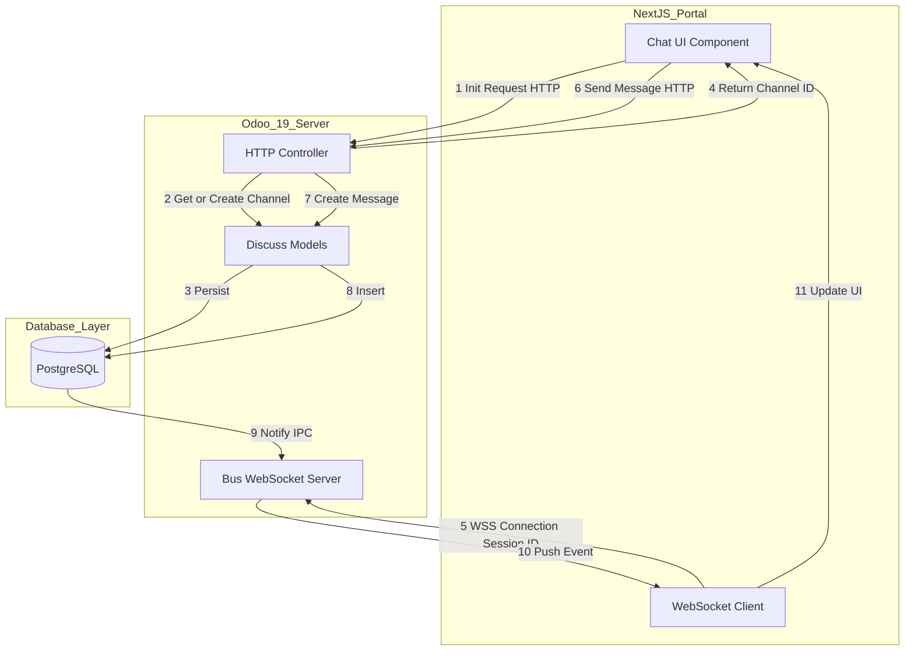
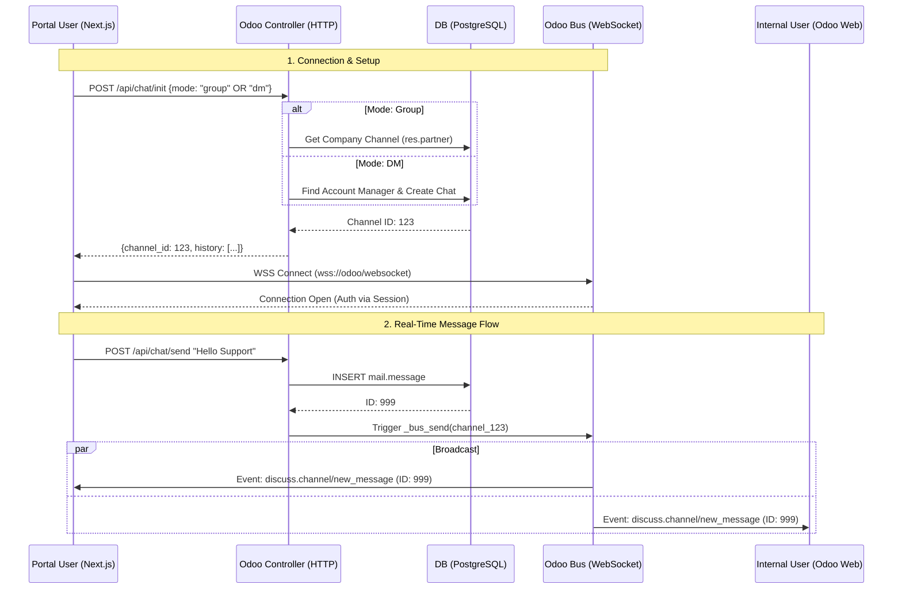

# Technical Proposal: Real-Time Portal Chat System (Unified)

## 1. Executive Summary

This proposal outlines the comprehensive technical architecture for a real-time chat feature embedded in an external Next.js portal. The solution leverages Odoo 19's native **WebSocket architecture** (`bus` module) to provide instant communication between Portal Users and the internal team.

This unified proposal covers two distinct communication modes supported by a single backend architecture:

1. **Group Chat**: A shared channel for all users of a specific Portal Company to communicate with the support team (Account Manager).
2. **Direct Message (DM)**: A private 1-on-1 channel between a specific Portal User and their assigned Account Manager.

Both modes utilize persistent WebSocket connections for sub-second latency, reduced server load, and native integration with Odoo's `discuss` ecosystem.

## 2. Technology Overview (Odoo Discuss)

Our solution leverages the **Odoo Discuss** module (technically `mail`), which serves as the robust communication backbone of our ERP system. It natively powers:

*   **Direct Messages (DMs)**: Private 1-on-1 chats for confidential discussions.
*   **Channels**: Public or private group chats (e.g., #Company-Support) for team collaboration.
*   **Chatter**: The activity feed on specific records (e.g., comments directly on a Sales Order or Invoice).
*   **Activities**: Integrated to-do lists and reminders linked to business records.

## 3. Architecture Overview

### 3.1. System Architecture

The architecture remains consistent across both modes. The Portal (Next.js) acts as a WebSocket client, while Odoo serves as the WebSocket host and message persistence layer.



### 3.2. Messaging Sequence Flow (Unified)



## 4. Backend Implementation (Odoo)

### 4.1. Data Models

For **Group Chat**, we need to persist the relationship between a Portal Company and its dedicated channel.

**File**: `addons_lp_ecommerce/ecommerce/models/res_partner.py`

```python
from odoo import models, fields, api

class ResPartner(models.Model):
    _inherit = 'res.partner'

    # Link to the dedicated discussion channel (Group Mode)
    company_channel_id = fields.Many2one('discuss.channel', string="Company Portal Channel", readonly=True)

    def _get_or_create_portal_channel(self):
        """ Idempotent method to get/create the company chat channel """
        self.ensure_one()
        # Ensure we are operating on the company partner
        company_partner = self if self.is_company else self.parent_id
        if not company_partner:
            company_partner = self

        if not company_partner.company_channel_id:
            # 1. Create Channel
            channel = self.env['discuss.channel'].create({
                'name': f"{company_partner.name} Support",
                'channel_type': 'group',  # 'group' implies private/invite-only
                'description': f"Official Portal Chat for {company_partner.name}"
            })
            company_partner.company_channel_id = channel
        
            # 2. Add Account Manager (if assigned)
            if company_partner.account_manager_user_id: 
                channel.add_members(partner_ids=[company_partner.account_manager_user_id.partner_id.id])

        # 3. Ensure Current User is a Member
        current_partner = self.env.user.partner_id
        if current_partner.id not in company_partner.company_channel_id.channel_partner_ids.ids:
             company_partner.company_channel_id.add_members(partner_ids=[current_partner.id])

        return company_partner.company_channel_id
```

### 4.2. API Controller (Unified)

We implement a **single controller** that handles both logic branches based on the `mode` parameter.

**File**: `addons_lp_ecommerce/ecommerce/controllers/portal_chat_api.py`

```python
from odoo import http, _
from odoo.exceptions import UserError
from odoo.http import request
from .base_controller import BaseController, http_auth_validated
from ..api_errors import ApiErrorCodes


class PortalChatController(BaseController):
    """
    API Controller for Portal Real-Time Chat (WebSocket/Bus).
    
    Architecture:
    - Inherits BaseController for standard API response formatting and authentication.
    - Implements unified endpoints for both 'Group' and 'Direct Message' modes.
    - Designed as a facade: Delegates business logic to models (res.partner, discuss.channel).
    
    Ref Pattern:
    - UserApiController (auth/session management)
    - ChatterApiController (message formatting standards)
    """

    # -------------------------------------------------------------------------
    # Helper Methods (Abstract/Shared Logic)
    # -------------------------------------------------------------------------

    def _get_portal_company(self):
        """
        Retrieves the Portal Company linked to the current authenticated user.
        Must raise UserError if not linked.
        """
        user = request.env.user
        company = user.portal_company_partner_id
        if not company:
            raise UserError(_("User not linked to a Portal Company"))
        return company

    def _prepare_message_dict(self, msg):
        """
        TODO:Remove we will use standard message
        Standardizes message serialization for the frontend.
        Should match the structure used in ChatterApiController._prepare_message_dict
        but optimized for chat history (limit, order).
        """
        return {
            'id': msg.id,
            'body': msg.body,
            'author_id': msg.author_id.id,
            'author_name': msg.author_id.name,
            'date': str(msg.date) if msg.date else None,
        }

    # -------------------------------------------------------------------------
    # API Endpoints (Stubs)
    # -------------------------------------------------------------------------

    @http.route('/ecommerce/api/chat/init', type='http', auth='public', methods=['POST', 'OPTIONS'], csrf=False)
    @http_auth_validated
    def init_chat(self, **kwargs):
        """
        Initializes the chat session.
        
        Payload:
            - mode (str): 'group' (Company Channel) or 'dm' (1-on-1 with Account Manager).
            
        Returns:
            - channel_id (int)
            - channel_uuid (str)
            - target_name (str): Name of the channel or the chat partner.
            - current_partner_id (int)
            - messages (list): History of recent messages.
        """
        try:
            # TODO: 
            # 1. Parse 'mode' from request.
            data = request.get_json_data() or {}
            mode = data.get('mode', 'group')
            company = self._get_portal_company()
            user_partner = request.env.user.partner_id
            channel = request.env['discuss.channel']
            target_name = ""

            # 2. If 'dm': Find Account Manager -> _get_or_create_chat.
            if mode == 'dm':
                # [Mode B] Direct Message Strategy
                am_user = company.account_manager_user_id
                if not am_user:
                    return self.api_response(response_code='100', response_message='No Account Manager available')

                # Get/Create Private Chat (Native Odoo Logic)
                channel = request.env['discuss.channel'].sudo().with_context(active_test=False)._get_or_create_chat(
                    partners_to=[am_user.partner_id.id])
                target_name = am_user.partner_id.name

            else:
                # [Mode A] Group Chat Strategy (Default)
                # 3. If 'group': Find Company -> _get_or_create_portal_channel.

                channel = company._get_or_create_portal_channel()
                target_name = channel.name

            # 4. Return formatted response.
            domain = [
                ('model', '=', 'discuss.channel'),
                ('res_id', '=', channel.id),
                ('message_type', '!=', 'user_notification')
            ]
            # Use mail_message_model property from BaseController
            limit = 50
            messages = self.mail_message_model.search(domain, limit=limit, order='id desc')
            limit = limit
            page = 1
            total = len(messages)
            result = {
                'response_code': ApiErrorCodes.SUCCESS,
                'total': total,
                'page': page,
                'limit': limit,
                'channel_id': channel.id,
                'channel_uuid': channel.uuid,
                'target_name': target_name,
                'messages': [msg._prepare_message_dict()  for msg in messages]
            }

            return self.api_response(**result)

        except Exception as ex:
            return self.handle_api_error(ex)

    @http.route('/ecommerce/api/chat/send', type='http', auth='public', methods=['POST', 'OPTIONS'], csrf=False)
    @http_auth_validated
    def send_message(self, **kwargs):
        """
        Sends a message to a specific channel.
        
        Payload:
            - channel_id (int): Target channel.
            - content (str): Message body.
            
        Returns:
            - id (int): Created message ID.
            
        Side Effects:
            - Triggers Odoo Bus notification to listeners.
            - Updates 'portal_messages_count' / 'portal_visible' flags on related records (e.g. Sale Order).
        """
        try:
            data = request.get_json_data() or {}
            channel_id = data.get('channel_id')
            content = data.get('content')
            if not channel_id or not content:
                return self.api_response(response_code='100', response_message='Missing channel_id or content')

            channel = request.env['discuss.channel'].browse(int(channel_id))

            # # Security Check: Ensure sender is a member
            # if request.env.user.partner_id not in channel.channel_partner_ids:
            #     return self.api_response(response_code='100', response_message='Access Denied')

            # Post Message -> Triggers _notify_thread -> Triggers _bus_send
            msg = channel.message_post(body=content, message_type='comment', subtype_xmlid='mail.mt_comment')
            result = {
                'response_code': ApiErrorCodes.SUCCESS,
                'message': msg._prepare_message_dict()
            }
            return self.api_response(**result)
        except Exception as ex:
            return self.handle_api_error(ex)
```

### 4.3. API Reference & Response Structure

#### 1. Init Chat Session
**Endpoint**: `/ecommerce/api/chat/init`
**Method**: `POST`
**Payload**:
```json
{
    "mode": "group" // or "dm"
}
```
**Response**:
```json
{
    "response_code": "0",
    "response_message": "Success",
    "total": 10,
    "page": 1,
    "limit": 50,
    "channel_id": 123,
    "channel_uuid": "c92837-...",
    "target_name": "Acme Support",
    "messages": [
        {
            "id": 101,
            "date": "2025-01-11 10:30:00",
            "body": "<p>Hello, how can I help?</p>",
            "message_type": "comment",
            "subtype_id": 1,
            "is_internal": false,
            "author_id": 5,
            "author_name": "Mitchell Admin",
            "partner_ids": [],
            "attachment_ids": [
                {
                    "id": 55,
                    "name": "manual.pdf",
                    "mimetype": "application/pdf",
                    "file_size": 10240,
                    "url": "https://odoo.example.com/web/content/55?download=1",
                    "res_model": "mail.message",
                    "res_id": 101
                }
            ]
        }
    ]
}
```

#### 2. Send Message
**Endpoint**: `/ecommerce/api/chat/send`
**Method**: `POST`
**Payload**:
```json
{
    "channel_id": 123,
    "content": "I have an issue with my order."
}
```
**Response**:
```json
{
    "response_code": "0",
    "response_message": "Success",
    "message": {
        "id": 102,
        "date": "2025-01-11 10:35:00",
        "body": "<p>I have an issue with my order.</p>",
        "message_type": "comment",
        "subtype_id": 1,
        "is_internal": false,
        "author_id": 15,
        "author_name": "John Doe",
        "partner_ids": [],
        "attachment_ids": []
    }
}
```

## 5. Frontend Implementation (Next.js)

### 5.1. WebSocket Service

A reusable service handles the Odoo Bus protocol.

```javascript
// services/odoo-chat.js

class OdooChatService {
  constructor(url, channelId) {
    this.url = url; // e.g., 'wss://odoo.com/websocket'
    this.channelId = channelId;
    this.ws = null;
    this.messageCallback = null;
  }

  connect(onMessage) {
    this.messageCallback = onMessage;
    this.ws = new WebSocket(this.url);

    this.ws.onopen = () => {
      console.log('Connected to Odoo Chat');
      // Optional: Send presence to keep connection alive
      this.startKeepAlive();
    };

    this.ws.onmessage = (event) => {
      const data = JSON.parse(event.data);
      this.handleEvent(data);
    };
  
    this.ws.onclose = () => {
       // Implement exponential backoff reconnection here
       setTimeout(() => this.connect(this.messageCallback), 5000);
    };
  }

  handleEvent(payload) {
    // Odoo Bus Protocol (Simplified)
    // Payload usually comes as an array of notifications
    if (Array.isArray(payload)) {
        payload.forEach(notification => {
            const { type, payload: msgPayload } = notification;
      
            // Check for discuss.channel events
            if (type === 'discuss.channel/new_message') {
                if (msgPayload.data.record_name === this.channelId) { // Check logic depends on exact Odoo 19 payload
                     this.messageCallback(msgPayload.data);
                }
            }
      
            // Odoo 19 might use 'mail.message/inbox' for direct pushes
            if (type === 'mail.message/inbox') {
                 // handle inbox update
            }
        });
    }
  }

  startKeepAlive() {
    setInterval(() => {
      if (this.ws.readyState === WebSocket.OPEN) {
        // Send a basic packet to keep alive (implementation varies by Odoo version)
        // Odoo 19 Bus often uses simple pings or "im_status" updates
        this.ws.send(JSON.stringify({ event_name: 'update_presence', data: { in_meeting: false } }));
      }
    }, 25000);
  }
}

```

### 5.2. Integration Logic

1. **Init**: Call `/ecommerce/api/chat/init`.
   * For Group Chat: Send `{ "mode": "group" }`.
   * For Direct Message: Send `{ "mode": "dm" }`.
2. **Display**: Bind the UI to the returned `target_name` and `messages`.
3. **Connect**: Initialize `OdooChatService` with the returned `channel_id`.

## 6. Pros & Cons Comparison

| Feature                   | **Mode A: Group Chat**                                   | **Mode B: Direct Message (DM)**                         |
| :------------------------ | :------------------------------------------------------------- | :------------------------------------------------------------ |
| **Concept**         | A "Support Room" for the entire company.                       | A "Private Chat" with a specific agent.                       |
| **Privacy**         | **Medium**: Visible to all portal users of that company. | **High**: Visible only to the user and the agent.       |
| **Odoo UI**         | Appears in**Channels** (e.g., "#Acme Corp Support").     | Appears in**Direct Messages** (e.g., "Mitchell Admin"). |
| **Context**         | Collaborative. Good for teams managing an account.             | Personal. Good for specific, sensitive inquiries.             |
| **Setup**           | Requires `company_channel_id` field on `res.partner`.      | Dynamic. Uses native `discuss.channel` logic.               |
| **History**         | Persistent history shared across the company team.             | Separate history per user.                                    |
| **Target Audience** | B2B companies with multiple procurement staff.                 | B2B/B2C users needing 1-on-1 assistance.                      |

## 7. Implementation Checklist

- [ ] **Odoo**: Create `res.partner` extension (`company_channel_id` field).
- [ ] **Odoo**: Implement `PortalChatController` (Unified `init_chat` with `mode` param).
- [ ] **Odoo**: Update `ir.model.access.csv` for portal access.
- [ ] **Next.js**: Integrate Auth flow.
- [ ] **Next.js**: Call `init_chat` (specify mode) and bind UI.
- [ ] **Next.js**: Reuse WebSocket service for both modes.
