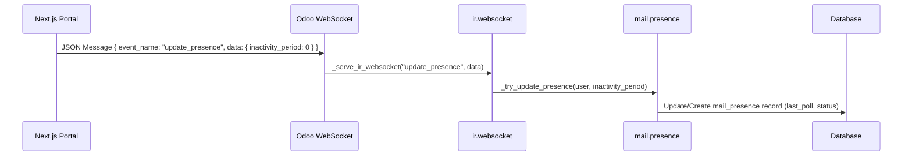

# Portal Online User Detection Technical Proposal

## 1. Overview
This document outlines the technical architecture and implementation details for detecting the online status of portal users (Next.js) within the Odoo backend. This allows Account Managers to see which clients are currently active on the portal.

## 2. Architecture

The solution leverages Odoo's native `bus` and `mail` modules, specifically the `mail.presence` mechanism.

### 2.1. Odoo Native Mechanism
Odoo tracks user presence via WebSocket connections.
1.  **Client** sends `update_presence` events via WebSocket.
2.  **Server** (`ir.websocket`) receives the event and updates `mail.presence`.
3.  **Model** (`res.users`) computes `im_status` based on `mail.presence` data.

### 2.2. Data Flow


## 3. Implementation Details

### 3.1. WebSocket Protocol (Client-Side)
The Next.js portal must establish a WebSocket connection to Odoo and send presence heartbeats.

*   **Endpoint**: `/websocket`
*   **Payload**:
    ```json
    {
        "event_name": "update_presence",
        "data": {
            "inactivity_period": 0
        }
    }
    ```
    *   `inactivity_period`: Integer (milliseconds). 0 indicates active usage.

*   **Frequency**: Odoo's web client sends this approximately every 60 seconds or on user interaction (focus/click). For the portal, a heartbeat every 30-60 seconds is recommended.

### 3.2. Server-Side Handling (Existing)
No custom server-side code is strictly required for *receiving* the presence, as Odoo 19's `mail` module already handles this in `addons/mail/models/ir_websocket.py`.

```python
# addons/mail/models/ir_websocket.py
def _serve_ir_websocket(self, event_name, data):
    super()._serve_ir_websocket(event_name, data)
    if event_name == "update_presence":
        self._update_mail_presence(**data)
```

### 3.3. Database Schema
*   **Model**: `mail.presence`
*   **Fields**:
    *   `user_id`: Many2one `res.users`
    *   `last_poll`: Datetime (Last heartbeat)
    *   `last_presence`: Datetime (Last active action)
    *   `status`: Selection ('online', 'away', 'offline')

### 3.4. Exposing Status to Account Managers
To allow Account Managers to see the status, we rely on the `im_status` field on `res.users` (or `res.partner`).

*   **Field**: `res.users.im_status`
*   **Computation**:
    ```python
    @api.depends("manual_im_status", "presence_ids.status")
    def _compute_im_status(self):
        # Returns 'online', 'away', or 'offline'
    ```

## 4. Proposed Implementation Plan

### 4.1. Next.js Integration
1.  **WebSocket Client**: Implement a WebSocket client in Next.js (e.g., using `socket.io-client` or native `WebSocket`).
2.  **Authentication**: Ensure the WebSocket connection is authenticated as the Portal User (session cookie).
3.  **Heartbeat Loop**:
    *   On component mount (Layout), start a timer.
    *   Send `update_presence` every 30 seconds.
    *   Send `update_presence` immediately on user interaction (click/keydown) if throttle allows.

### 4.2. Odoo API (for Account Manager Dashboard)
Create a controller or use standard RPC to fetch the `im_status` of portal users associated with the Account Manager.

```python
# Example Domain to find online portal users
domain = [
    ('share', '=', True), # Portal Users
    ('im_status', '=', 'online')
]
online_users = request.env['res.users'].search(domain)
```

## 5. Security Considerations
*   **Authentication**: The `_update_mail_presence` method checks for a current partner/guest. Unauthenticated socket messages will be ignored or rejected.
*   **CORS**: Ensure Odoo's `ir.websocket` configuration allows connections from the Next.js domain (see `_handle_public_configuration` in `websocket.py`).

## 6. Testing Strategy
1.  **Simulate Client**: Use a tool like Postman (WebSocket support) or a simple JS script to send the `update_presence` frame.
2.  **Verify DB**: Check `select * from mail_presence where user_id = <portal_user_id>` to see `last_poll` updating.
3.  **Verify UI**: Check the user's status dot in Odoo's chat/user list.
