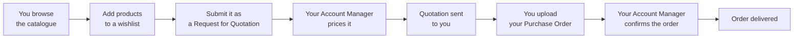

# SAMTIA B2B Platform — Client User Guide

Welcome. This guide explains how to use the SAMTIA B2B Client Portal day to day. It is written
for business users — no technical knowledge is needed.

**Who this guide is for:** Client Users · Company Administrators at customer companies using the
SAMTIA Client Portal.

---

## Index

| # | Document | Read it if you want to… |
|---|----------|------------------------|
| 001 | [Getting Started](001-Getting-Started.md) | Sign in, reset your password, find your way around |
| 002 | [User Roles and Permissions](002-User-Roles-and-Permissions.md) | Understand who at your company can do what |
| 003 | [Navigation](003-Client-Portal-Navigation.md) | Learn the website layout |
| 004 | [Browsing and Wishlists](004-Client-Portal-Browsing-and-Wishlists.md) | Find products and build a wishlist |
| 005 | [Orders](005-Client-Portal-Orders.md) | Submit RFQs, accept quotations, track orders |
| 006 | [Company Management](006-Client-Portal-Company-Management.md) | Manage your colleagues' access and tags |
| 007 | [Messages and Notifications](007-Messages-and-Notifications.md) | Chat with your Account Manager and follow alerts |
| 008 | [The Order Lifecycle](008-The-Order-Lifecycle.md) | Understand every status and what happens next |
| 009 | [Common Business Scenarios](009-Common-Business-Scenarios.md) | Follow step-by-step recipes for daily tasks |
| 010 | [Glossary](010-Glossary.md) | Look up a term |

---

## Suggested reading order

**New user** → 001 → 003 → 004 → 005 → 007

**New Company Administrator** → 001 → 002 → 006 → 005 → 009

---

## How the business works, in one picture

The key thing to understand: **you do not check out and pay at a published price.** You ask for
a price, your Account Manager quotes it, and only then does the order become real. Every screen
in the portal supports one step of that conversation.

---

## About screenshots

Screenshot placeholders appear throughout this guide in the form:

> 📷 **Screenshot Placeholder**
> File: `images/example.png`
> Description: what the screenshot should show.

Save captured screenshots into the `images/` folder next to this guide, using the file names
given in the placeholders.

---

## A note on what is documented

This guide covers only the **Client Portal** — the website you use to browse, order and manage
your company's access. It covers only what you can actually see and use as a customer. It does
not describe SAMTIA's own internal systems.
