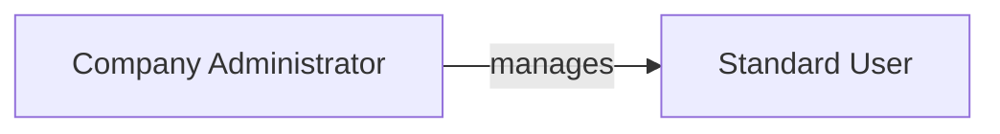
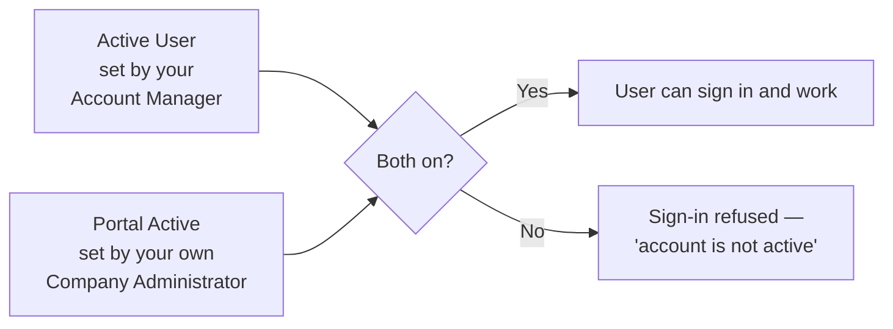

# 002 — User Roles and Permissions

## Two Roles at Your Company

---

## Standard User

The everyday buyer.

| Can do | Cannot do |
|--------|-----------|
| Browse the catalogue and search products | See or manage colleagues' accounts |
| Build and name wishlists | Create or deactivate users |
| Request products that are not in the catalogue | Manage user tags |
| Submit a wishlist as a Request for Quotation | See other companies' orders or prices |
| Review quotations and upload a Purchase Order | |
| Track orders through to delivery | |
| Chat with the Account Manager | |
| Comment and attach files on an order | |

If a Standard User opens the Users or User Tags area, they are redirected to Orders.

## Company Administrator

Everything a Standard User can do, **plus** managing their own company's people.

| Additional ability | Where |
|--------------------|-------|
| Create new portal users for the company | Company Profile → Users |
| Edit user details | Company Profile → Users |
| Activate and deactivate colleagues | Company Profile → Users |
| Delete a user account | Company Profile → Users |
| Create and manage user tags | Company Profile → User Tags |

---

## The Two Switches That Control Your Access

A user can only sign in when **both** switches are on.

| Switch | Controlled by | Business purpose |
|--------|---------------|------------------|
| **Active User** (shown as *Account Manager Approved*) | SAMTIA Account Manager | Lets SAMTIA suspend your access — for example during a commercial dispute. You cannot undo this. |
| **Portal Active** (shown as *Active / Inactive*) | Your own Company Administrator | Lets you manage your own team — a leaver is switched off without involving SAMTIA. |

**In practice:** if you switched a colleague back on but they still cannot sign in, SAMTIA may
have switched off the *Active User* flag — contact your Account Manager.

**Switching either flag off takes effect immediately** — even for someone already signed in and
working. It is not just a block on the next sign-in attempt; their current session is ended
straight away. The same is true of promoting or demoting someone to/from Company Administrator.

---

## Menu Visibility

Some organisations restrict which screens each person sees. When restrictions are in force, a
menu item you are not permitted to use simply does not appear — you will not see a greyed-out
option or an error message.

If a colleague describes a screen you cannot find, ask your Company Administrator whether your
role includes it. Menu differences between two people at the same company are normal and
intentional.

---

## What Nobody Can Do

These limits apply to every user and are enforced by the system, not by convention:

- **See another company's data.** Your information is separated from every other customer. There
  is no view that mixes two customers' orders, prices or users.
- **Delete an order that has left Draft.** Once a wishlist becomes a Request for Quotation it can
  be cancelled or archived, but not deleted.
- **Delete someone else's wishlist.** Only the person who created a wishlist can delete it.
- **Delete a file someone else uploaded.** Only the person who attached a file can remove it.
- **Deactivate or delete your own account.** You cannot lock yourself out.
