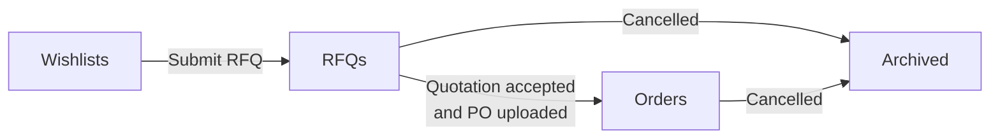
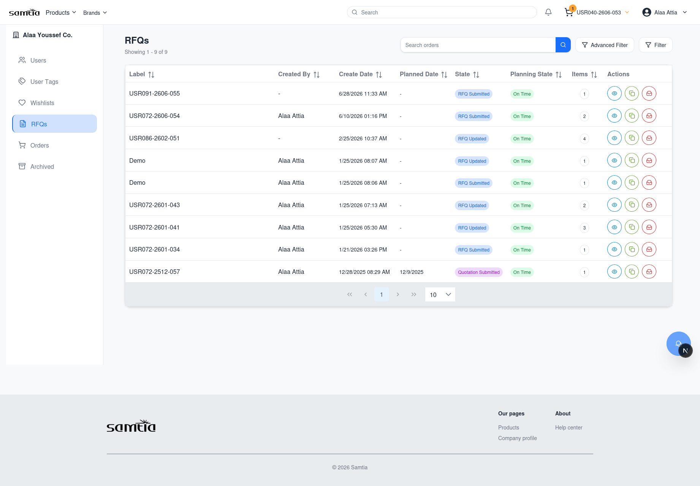
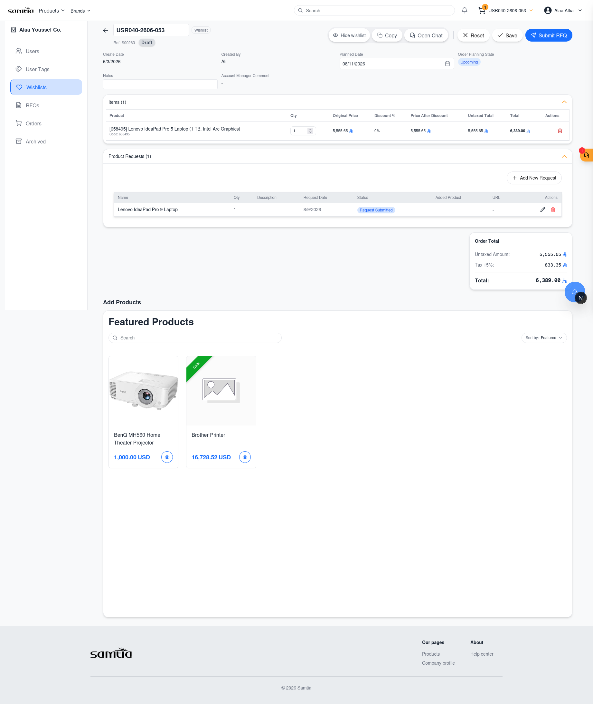
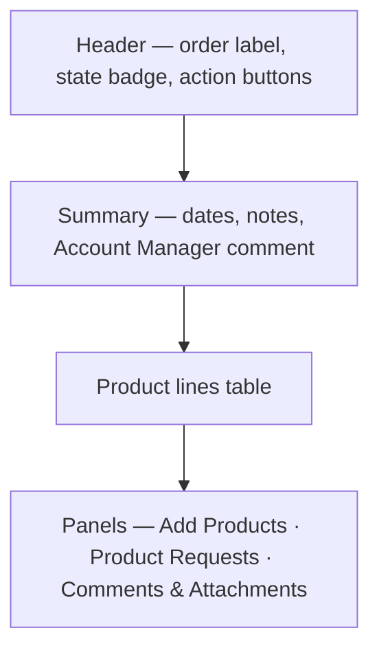
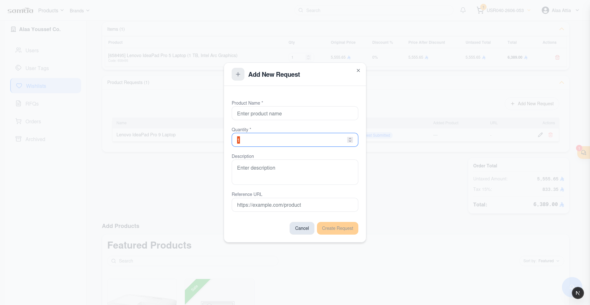
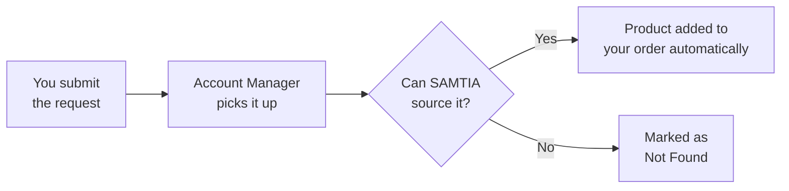

# 005 — Client Portal: Orders

All four order sections share the same screen design, so learning one teaches you all four. They
differ only in **which** orders they show.

---

## The Four Sections

| Section | Shows | You are waiting on |
|---------|-------|--------------------|
| **Wishlists** | Baskets you are still building | Yourself |
| **RFQs** | Requests sent to SAMTIA, and quotations received back | SAMTIA, then yourself |
| **Orders** | Confirmed business being fulfilled | SAMTIA |
| **Archived** | Cancelled requests, kept for reference | Nobody |

---

## The Orders List Screen

**Screen name:** Wishlists / RFQs / Orders / Archived
**Business purpose:** Find and act on a piece of business.
**Who uses it:** All Client Portal users.
**Navigation path:** Company Profile → choose the section on the left.

### Main information displayed

| Column | What it tells you |
|--------|-------------------|
| **Label** | The name given to the wishlist or order |
| **Created By** | Which colleague started it |
| **Create Date** | When it was started |
| **Planned Date** | When the goods are needed |
| **State** | Where it has reached — see [008](008-The-Order-Lifecycle.md) |
| **Planning State** | **Late**, **On Time** or **Upcoming**, based on the planned date |
| **Items** | How many product lines it contains |

### Search and filters

| Tool | What it does |
|------|--------------|
| **Search orders** | Finds by name or label |
| **Filters** | Narrows by **Created Date** range and **Planned Date** range (From / To) |
| **Column sorting** | Click a column heading to sort |
| **Paging** | Move through long lists |

**Planning State** is the fastest way to spot trouble: filter or sort on it to find everything
running late.

### Available actions per row

| Button | When it appears | What it does |
|--------|-----------------|--------------|
| 👁 **View Details** | Always | Opens the full order |
| 📋 **Copy** | Always | Creates a new wishlist containing the same products |
| 🗑 **Delete** | Only while the record is still a Wishlist (Draft) | Removes it permanently |
| 📥 **Archive** | Only on RFQs and quotations in progress | Moves it out of the active list |

### Business rules

- **Delete only works on wishlists.** Once submitted, business records are archived rather than
  deleted, so the history is preserved.
- **Only the creator can delete a wishlist.**
- Copy is available on any record, at any stage — including completed orders.

---

## The Order Detail Screen

This is where the real work happens. It is the same screen for a wishlist, an RFQ and a
confirmed order — the available buttons change with the stage.

**Screen name:** Order Details
**Business purpose:** Review and edit the contents, talk to your Account Manager, and move the
order to its next stage.
**Who uses it:** All Client Portal users.
**Navigation path:** Any orders list → 👁 **View Details**.

### Screen layout

### Summary information

| Field | Meaning |
|-------|---------|
| **Create Date** | When it was started |
| **Created By** | Which colleague started it |
| **Planned Date** | When you need the goods — you can edit this |
| **Order Planning State** | Late / On Time / Upcoming |
| **Notes** | Your own note about the purpose of this order |
| **Account Manager Comment** | A message from SAMTIA about this specific order |
| **Return Reason** | Shown when SAMTIA has returned the order to you, explaining why |

### The product lines table

| Column | Meaning | Can you edit it? |
|--------|---------|------------------|
| **Product** | What is being bought | Remove the line only |
| **Qty** | How many | Yes, while the order is editable |
| **Target Price** | The price you are hoping for | Yes, while the order is editable |
| **Original Price** | List price before discount | No |
| **Discount %** | Discount applied by SAMTIA | No |
| **Price After Discount** | Your unit price | No |
| **Untaxed Total** | Line total before tax | No |
| **Total** | Line total including tax | No |

The order total is shown beneath the table.

**Editing is allowed while the order is a Wishlist, or after a quotation has been received.** At
other stages the order is with SAMTIA and the lines are locked.

### Action buttons and when they appear

| Button | Appears when | What it does |
|--------|--------------|--------------|
| **Edit** | The order can be changed | Unlocks the label, dates and lines |
| **Save** | You are editing | Saves your changes |
| **Reset** | You are editing | Discards your changes |
| **Copy** | Always | Creates a new wishlist from these products |
| **Open Chat** | Always | Starts or opens a conversation with your Account Manager |
| **Share wishlist** / **Hide wishlist** | On a wishlist | Flags it for your Account Manager's attention, or removes the flag |
| **Submit RFQ** | On a wishlist with at least one product | Sends it to SAMTIA for pricing |
| **Update RFQ** | On a submitted request | Reopens it so you can change it |
| **Submit Updated RFQ** | After changing a submitted request | Sends the revision to SAMTIA |
| **Submit PO** | On a received quotation | Opens the Purchase Order upload |

### Uploading your Purchase Order

When you accept a quotation, use **Submit PO**.

| Step | What happens |
|------|--------------|
| 1 | The upload window opens — *Click to upload* |
| 2 | Choose your Purchase Order file. **It must be a PDF** — other file types are refused |
| 3 | Confirm. The order moves to *PO Submitted* and your Account Manager is notified |

### Comments and attachments

Each order carries its own discussion thread, separate from live chat.

| Action | Notes |
|--------|-------|
| Post a comment | Visible to your colleagues and to your Account Manager |
| Edit your comment | You can revise what you wrote |
| Upload a file | Specifications, drawings, approvals — anything relevant |
| Delete a file | **Only files you uploaded yourself** |

Use comments for anything that should stay attached to the record permanently. Use chat for quick
back-and-forth.

---

## Requesting a Product We Do Not Stock

If you cannot find something in the catalogue, ask for it directly on the order.

**Where:** Order Details → **Product Requests** panel.

| Field | What to enter |
|-------|---------------|
| Product name | What you are looking for |
| Description | Specification, part number, anything that helps identify it |
| Quantity | How many you need |
| Reference URL | A link to the product elsewhere, if you have one |

### What happens next

You can edit or delete your own requests while they are still open. When a request is fulfilled,
the product appears as a normal line on your order — you do not need to add it yourself.

### Business rules

- Requests belong to a specific order, so raise them on the wishlist or RFQ they relate to.
- A request cannot be changed once the order is finalised.
- The reference URL is optional but genuinely speeds up sourcing — include it when you have one.

---

## Tips

- **Watch for the Account Manager Comment.** It is the most common place a question or condition
  is recorded, and it is easy to scroll past.
- **A returned order is not a rejection.** Check the Return Reason, make the change, and submit
  again.
- **Set the Planned Date honestly.** It drives the Late / On Time / Upcoming flag your Account
  Manager uses to prioritise work.
- **Editing a received quotation** marks it as changed but not resubmitted. Remember to submit it
  again, or your Account Manager will not know to look.
