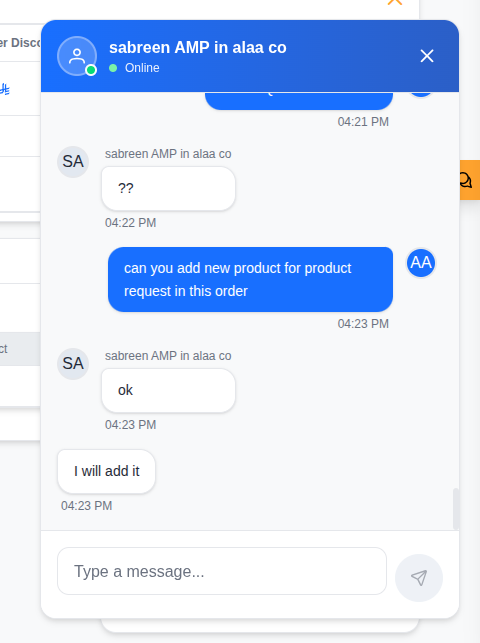
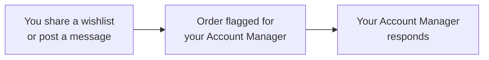
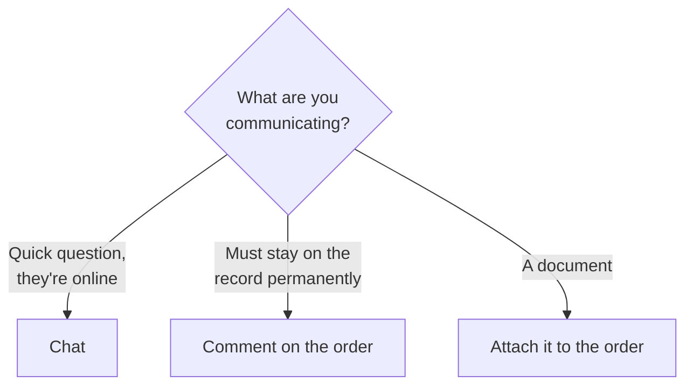

# 007 — Messages and Notifications

The platform gives you three separate ways to communicate. Choosing the right one saves time and
keeps records clean.

| Channel | Best for | Where it lives |
|---------|----------|----------------|
| **Chat** | Quick back-and-forth while both people are available | The Messages screen, or *Open Chat* on an order |
| **Comments** | Discussion that must stay attached to an order permanently | The order's Comments panel |
| **Account Manager Comment** | A standing statement about an order you must see | The order summary, written by your Account Manager |

---

## Live Chat

**Screen name:** Chat
**Business purpose:** Talk to your Account Manager directly.
**Who uses it:** All Client Portal users.
**Navigation path:** Any order → **Open Chat**.

Your company has **one shared conversation** with your Account Manager. Colleagues at your
company see the same history — chat is a company channel, not a private one.

### Business rules

- **Messages are delivered live.** Both sides see new messages without refreshing.
- Opening a conversation marks it as read and clears the unread count.

---

## Online Status

People appear as **online**, **away** or **offline** in the chat window — this tells you whether
your Account Manager is currently available.

Status updates automatically. Signing out marks you offline immediately.

**Practical use:** if your Account Manager is online, a chat message usually gets a fast answer.
If they are offline, a comment on the order or an e-mail is more likely to be seen.

---

## Notifications

**Where:** The 🔔 bell in the portal header.

### What triggers a notification for you

| Event |
|-------|
| An order changes stage |
| A new message arrives from your Account Manager |
| A colleague at your company signs in or is activated |

### Reading them

| Action | Result |
|--------|--------|
| Click a notification | Opens the record it refers to |
| **Mark all as seen** | Clears the unread indicator |

When there is nothing new, the panel reads **All caught up**.

### Business rules

- **You never receive a notification for your own action.** If you submit a request, you are not
  told about it — your colleagues are.
- Notifications are shared across your company. A colleague may have already acted on one.

---

## E-mail Alerts

Some events also send an e-mail, so nothing is missed when nobody is signed in.

You receive an e-mail when:

- A quotation is sent to you.
- You (or a colleague) are invited to the portal.
- You request a password reset code.

---

## Attention Flags on Orders

When you share a wishlist or post a message, the order is flagged for your Account Manager as
**needing attention**.

If you have not heard back on something you shared, a follow-up chat message is a good next
step.

---

## Choosing the Right Channel

| Situation | Best channel |
|-----------|--------------|
| "Is this in stock?" | Chat |
| "Approved by our finance team on 4 March" | Comment |
| Revised specification document | Attachment |
| "Why has the price changed since last quarter?" | Chat, then record the outcome as a Comment |

---

## Tips

- **Check whether your Account Manager is online before chasing by chat.** If they are offline,
  they will not reply immediately, however urgent the message.
- **Anything you will need to refer back to belongs in a Comment**, not chat. Chat is for the
  conversation; comments are the record.
- **Watch the Account Manager Comment on your orders.** It is the most common place a question or
  condition is recorded, and it is easy to scroll past.
