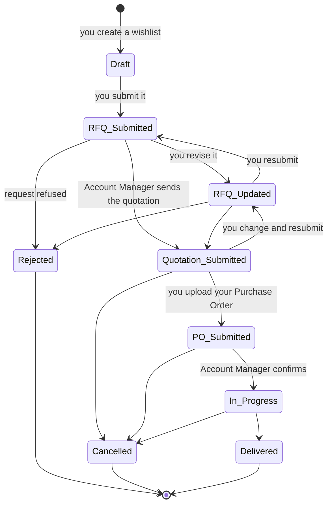
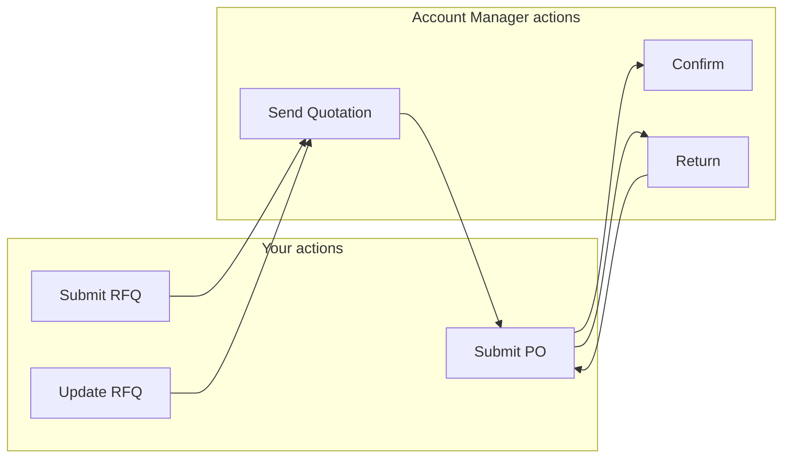

# 008 — The Order Lifecycle

Every piece of business moves through the same set of stages. Knowing which stage a record is in
tells you two things immediately: **who has to act next**, and **what can still be changed**.

---

## The Full Journey

---

## Stage Reference

| Stage | What it means in business terms | Who acts next | Where you find it |
|-------|--------------------------------|---------------|--------------------|
| **Draft** | A wishlist being built. Nothing has been asked of SAMTIA | You | Wishlists |
| **RFQ Submitted** | A formal request for a price | **Account Manager** | RFQs |
| **RFQ Updated** | You have changed your request | **Account Manager** | RFQs |
| **Quotation Submitted** | A price has been offered | **You** | RFQs |
| **PO Submitted** | You have accepted and sent your Purchase Order | **Account Manager** | RFQs |
| **In Progress** | Confirmed business being fulfilled | Account Manager | Orders |
| **Delivered** | Complete | Nobody | Orders |
| **Rejected** | The request was refused | Nobody | Archived |
| **Cancelled** | The business was stopped | Nobody | Archived |

---

## Who Moves It Forward

Each side has exactly three moves. Nothing advances on its own — the platform waits for a person
to act.

---

## What Can Be Changed at Each Stage

| Stage | Can you edit the lines? |
|-------|--------------------------|
| Draft | Yes |
| RFQ Submitted | No — reopen with **Update RFQ** first |
| RFQ Updated | No — same |
| Quotation Submitted | Yes, then resubmit |
| PO Submitted | No |
| In Progress | No |
| Delivered | No |

**The rule of thumb:** an order is editable while the commercial conversation is still open, and
locked once it has been agreed.

---

## What Happens Automatically

Some transitions do more than change a label.

| Transition | Also happens |
|------------|--------------|
| → **Quotation Submitted** | The quotation document is produced and e-mailed to you, and you are notified in the portal |
| → **In Progress** | The order is confirmed as real business in SAMTIA's system |
| Wishlist shared | Your Account Manager is notified and the order is flagged for their attention |

---

## Signals That Track Your Engagement With a Quotation

Once a quotation has been sent, the platform records when you opened it and when you printed or
downloaded it — useful context if your Account Manager follows up before you have responded.

| Signal | Meaning |
|--------|---------|
| **Reviewed Date** | When you opened the quotation |
| **Print Quotation Date** | When you printed or downloaded it |

---

## Planning State

Alongside the stage, every order carries a timing signal calculated from your **Planned Date**.

| Planning State | Meaning |
|----------------|---------|
| **Late** | The planned date has passed and the order is not complete |
| **On Time** | Progressing within the expected window |
| **Upcoming** | The planned date is still ahead |

Set this honestly — it is the fastest way to flag urgency to your Account Manager.

---

## Pending Submit — an easy one to miss

If you edit an order **after** receiving a quotation but do not resubmit it, the order is marked
as changed but not resubmitted. Your changes are saved but your Account Manager has not been
asked to look at them.

**Submit the updated request to restart pricing.**
